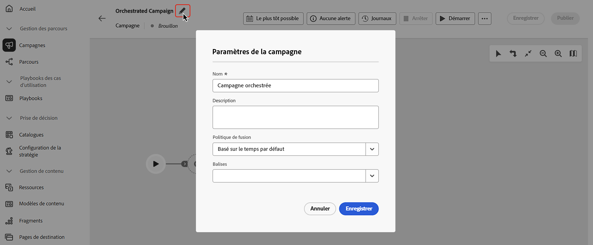
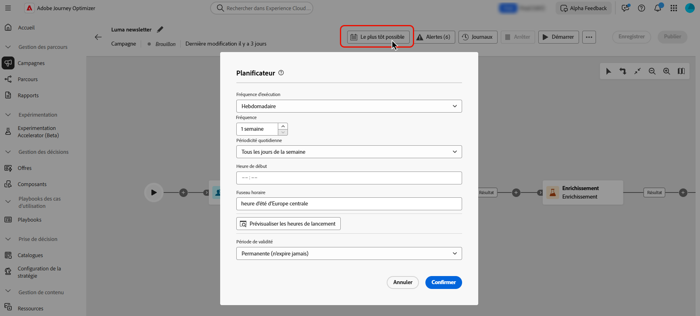

# Création et planification d’une campagne orchestrée {#create-first-campaign}

>[!CONTEXTUALHELP]
>id="ajo_campaign_creation_workflow"
>title="Liste de campagnes orchestrées"
>abstract="L’onglet **Orchestration** répertorie toutes les campagnes orchestrées. Cliquez sur le nom d’une campagne orchestrée pour la modifier. Cliquez sur le bouton **Créer une campagne orchestrée** pour ajouter une nouvelle campagne orchestrée."

+++ Table des matières

| Bienvenue dans les campagnes orchestrées | Lancement de votre première campagne orchestrée | Interrogation de la base de données | Activités de campagnes orchestrées |
|---|---|---|---|
| [Prise en main des campagnes orchestrées](gs-orchestrated-campaigns.md)  [Étapes de configuration](configuration-steps.md)  [Accédez aux campagnes orchestrées et gérez-les](access-manage-orchestrated-campaigns.md) | [Étapes clés de création de campagne orchestrée](gs-campaign-creation.md)  <b>[Créez et planifiez la campagne](create-orchestrated-campaign.md)</b>  [Orchestrez les activités](orchestrate-activities.md)  [Envoyez des messages avec des campagnes orchestrées](send-messages.md)  [Lancez et surveillez la campagne](start-monitor-campaigns.md)  [Reporting](reporting-campaigns.md) | [Utiliser le créateur de règles](orchestrated-rule-builder.md)  [Créer votre première requête](build-query.md)  [Modifier des expressions](edit-expressions.md) | [Prise en main des activités](activities/about-activities.md)  Activités: [Et-joindre](activities/and-join.md) - [Créer une audience](activities/build-audience.md) - [Modifier la dimension](activities/change-dimension.md) - [Combiner](activities/combine.md) - [Deduplication](activities/deduplication.md) - [Enrichissement](activities/enrichment.md) - [Fork](activities/fork.md) - [Reconciliation](activities/reconciliation.md) - [Split](activities/split.md) - [Wait](activities/wait.md) |

{style="table-layout:fixed"}

+++

 

>[!BEGINSHADEBOX]

Documentation en cours

>[!ENDSHADEBOX]

## Créer la campagne {#create}

Pour créer une campagne orchestrée, procédez comme suit :

1. Accédez au menu **[ !UICONTRO Campagnes]**, sélectionnez l’onglet **[!UICONTROL Orchestration]** et sélectionnez **[!UICONTROL Créer une campagne]**.

   

1. Saisissez le nom de la campagne orchestrée. En outre, nous vous recommandons vivement d’ajouter une description dans le champ dédié.

1. (facultatif) Utilisez le champ **Balises** pour affecter des balises unifiées Adobe Experience Platform à votre campagne orchestrée. Vous pouvez ainsi facilement les classer et améliorer la recherche à partir de la liste des campagnes. [Découvrez comment utiliser les balises](../start/search-filter-categorize.md#tags).

1. Cliquez sur le bouton **[!UICONTROL Créer]** pour confirmer.

Votre campagne orchestrée est maintenant créée et disponible dans la liste des campagnes. Vous pouvez modifier ces propriétés à tout moment en cliquant sur l’icône  dans la zone de travail de la campagne.

## Planifier la campagne {#schedule}

Par défaut, les campagnes orchestrées démarrent une fois qu’elles sont activées manuellement et se terminent dès que leurs activités ont été exécutées.

Si vous ne souhaitez pas exécuter une campagne orchestrée juste après son activation, vous pouvez spécifier la date et l’heure de son exécution. Vous pouvez également exécuter la campagne à des fréquences régulières en fonction de divers critères.

Pour configurer le planning de la campagne, ouvrez la campagne orchestrée, puis cliquez sur le bouton **[!UICONTROL Dès que possible]**.

<!--In the Execution frequency field, select 

time zone

daily, weekly, monthly
several times a day based on specific hours or periodically

recurring frequencies (all except as soon and once)
preview launch times
validity period

>[!NOTE]
>
>When scheduling campaigns in [!DNL Adobe Journey Optimizer], ensure your start date/time aligns with the desired first delivery. For recurring campaigns, if the initial scheduled time has already passed, the campaigns will roll over to the next available time slot according to their recurrence rules.

## Work with orchestrated campaign templates {#campaign-templates}

>[!CONTEXTUALHELP]
>id="ajo_workflow_template_for_campaign"
>title="Orchestrated campaign templates"
>abstract="Orchestrated campaign templates contain pre-configured settings and activities which can be reused for creating new orchestrated campaign."

>[!CONTEXTUALHELP]
>id="ajo_workflow_template_creation_properties"
>title="Orchestrated campaign properties"
>abstract="Orchestrated campaign templates contain pre-configured settings and activities which can be reused for creating new orchestrated campaigns. In this screen, enter the label of the orchestrated campaign template and configure its settings such as its internal name, folder and execution folders, timezone, and supervisor group."

Orchestrated campaign templates contain pre-configured settings and activities which can be reused for creating new orchestrated campaigns. You can select the template of your orchestrated campaign from the orchestrated campaign properties, when creating an orchestrated campaign. An empty template is provided by default.

You can create a template from an existing orchestrated campaign, or create a new template from scratch. Both methods are detailed below.

>[!BEGINTABS]

>[!TAB Create a template from an existing orchestrated campaign]

To create an orchestrated campaign template from an existing orchestrated campaign, follow these steps:

1. Open to the **Campaign** menu and browse to the orchestrated campaign to save as a template.
1. Click the three dots on the right of the name of the orchestrated campaign, and choose **Copy as template**.
1. In the popup window, confirm the template creation.
1. In the orchestrated campaign template canvas, check, add, and configure the activities as needed.
1. Browse to the settings, from the **Settings** button, to change the name of the orchestrated campaign template, and enter a description.
1. Select the **folder** and **execution folder** of the template. The folder is the location where the orchestrated campaign template is saved. The execution folder is the folder where orchestrated campaigns created based on this template are saved.
1. Save your changes. 

The orchestrated campaign template is now available in the template list. You can create an orchestrated campaign based on this template. This orchestrated campaign will be pre-configured with the settings and activities defined in the template.

>[!TAB Create a template from scratch]

To create an orchestrated campaign template from scratch, follow these steps:

1. Open to the **Campaign** menu and browse to the **Templates** tab. You can see the list of available orchestrated campaign templates.
1. Click the **[!UICONTROL Create template]** button in the upper-right corner of the screen.
1. Enter the label and open the additional options to enter a description of your orchestrated campaign template.
1. Select the folder and execution folder of the template. The folder is the location where the orchestrated campaign template is saved. The execution folder is the folder where orchestrated campaigns created based on this template are saved.
1. Click the **Create** button to confirm your settings.
1. In the orchestrated campaign template canvas, add and configure the activities as needed.

     {zoomable="yes"}

1. Save your changes. 

The orchestrated campaign template is now available in the template list. You can create an orchestrated campaign based on this template. This orchestrated campaign will be pre-configured with the settings and activities defined in the template.

>[!ENDTABS]

## Next steps {#next}

Once your campaign configuration and content are ready, you can review and activate it. [Learn more](review-activate-campaign.md)

-->