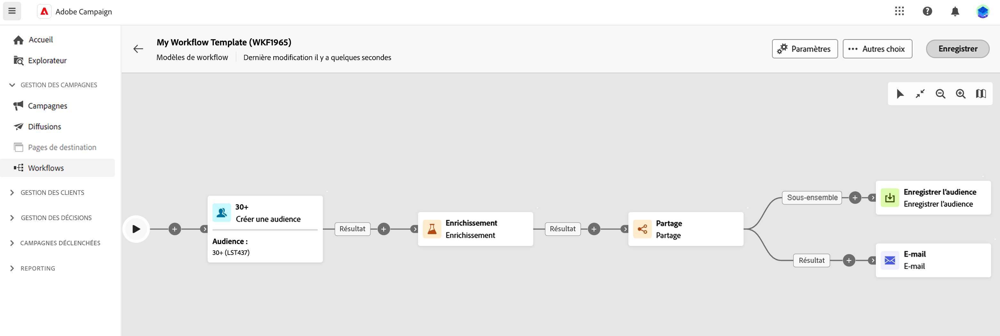

# Créer une campagne orchestrée {#create-first-campaign}

>[!CONTEXTUALHELP]
>id="ajo_campaign_creation_workflow"
>title="Liste de campagnes orchestrées"
>abstract="L’onglet **Étapes multiples** répertorie toutes les campagnes orchestrées. Cliquez sur le nom d’une campagne orchestrée pour la modifier. Cliquez sur le bouton **Créer une campagne orchestrée** pour ajouter une nouvelle campagne orchestrée."

+++ Table des matières

| Bienvenue dans les campagnes orchestrées | Lancement de votre première campagne orchestrée | Interrogation de la base de données | Activités de campagnes orchestrées |
|---|---|---|---|
| [Prise en main des campagnes orchestrées](gs-orchestrated-campaigns.md)  [Étapes de configuration](configuration-steps.md)  [Étapes clés de la création de campagnes orchestrées](gs-campaign-creation.md) | [Créer une campagne orchestrée](create-orchestrated-campaign.md)  [Orchestrer des activités](orchestrate-activities.md)  [Envoyer des messages avec des campagnes orchestrées](send-messages.md)  [Démarrer et surveiller la campagne](start-monitor-campaigns.md)  [Reporting](reporting-campaigns.md) | [Utiliser la requête Modeler](orchestrated-query-modeler.md)  [créer votre première requête](build-query.md)  [modifier des expressions](edit-expressions.md) | [Prise en main des activités](activities/about-activities.md)  Activités: [Et-joindre](activities/and-join.md) - [Créer une audience](activities/build-audience.md) - [Modifier la dimension](activities/change-dimension.md) - [Combiner](activities/combine.md) - [Deduplication](activities/deduplication.md) - [Enrichissement](activities/enrichment.md) - [Fork](activities/fork.md) - [Reconciliation](activities/reconciliation.md) - [Split](activities/split.md) - [Wait](activities/wait.md) |

{style="table-layout:fixed"}

+++

  

## Créer la campagne

Pour créer une campagne orchestrée, procédez comme suit :

1. Pour créer une **campagne orchestrée**, accédez au menu **Campagnes**.

1. Cliquez sur le bouton **[!UICONTROL Créer une campagne orchestrée]** dans le coin supérieur droit de l’écran.

1. Dans la boîte de dialogue Campagne orchestrée **Propriétés**, sélectionnez le modèle à utiliser pour créer la campagne orchestrée (vous pouvez également utiliser le modèle intégré par défaut). [En savoir plus sur les modèles de campagne orchestrés](#campaign-templates).

1. Saisissez un libellé pour la campagne orchestrée. En outre, nous vous recommandons vivement d’ajouter une description à votre campagne orchestrée, dans le champ dédié de la section **[!UICONTROL Options supplémentaires]** de l’écran.

1. Développez la section **[!UICONTROL Options supplémentaires]** pour configurer d’autres paramètres pour la campagne orchestrée.

1. Cliquez sur le bouton **[!UICONTROL Créer une campagne orchestrée]** pour confirmer la création de votre campagne orchestrée.

Votre campagne orchestrée est maintenant créée et disponible dans la liste des workflows. Vous pouvez maintenant accéder à sa zone de travail visuelle et commencer à ajouter, configurer et orchestrer les tâches qu’il exécutera. [Découvrez comment orchestrer des activités de campagne orchestrées](orchestrate-activities.md).

## Configurer les paramètres de la campagne

Présentation des nouveaux paramètres d’administration > schémas, champs d’exécution, politique de fusion. [En savoir plus](configuration-steps.md)

## Utiliser des modèles de campagnes orchestrées {#campaign-templates}

>[!CONTEXTUALHELP]
>id="ajo_workflow_template_for_campaign"
>title="Modèles de campagnes orchestrées"
>abstract="Les modèles de campagnes orchestrées contiennent des activités et des paramètres préconfigurés qui peuvent être réutilisés pour créer d’autres campagnes orchestrées."

>[!CONTEXTUALHELP]
>id="ajo_workflow_template_creation_properties"
>title="Propriétés des campagnes orchestrées"
>abstract="Les modèles de campagnes orchestrées contiennent des activités et des paramètres préconfigurés qui peuvent être réutilisés pour créer d’autres campagnes orchestrées. Dans cet écran, saisissez le libellé du modèle de campagne orchestrée et configurez ses paramètres, notamment avec son nom interne, son dossier et ses dossiers d’exécution, son fuseau horaire et son groupe de supervision."

Les modèles de campagnes orchestrées contiennent des activités et des paramètres préconfigurés qui peuvent être réutilisés pour créer d’autres campagnes orchestrées. Vous pouvez sélectionner le modèle de votre campagne orchestrée dans les propriétés de la campagne orchestrée lors de la création d’une campagne orchestrée. Un modèle vide est fourni par défaut.

Vous pouvez créer un modèle à partir d’une campagne orchestrée existante, ou créer un nouveau modèle à partir de zéro. Les deux méthodes sont présentées ci-dessous.

>[!BEGINTABS]

>[!TAB Créer un modèle à partir d’une campagne orchestrée existante]

Pour créer un modèle de campagne orchestrée à partir d’une campagne orchestrée existante, procédez comme suit :

1. Ouvrez le menu **Campagne** et accédez à la campagne orchestrée pour l’enregistrer en tant que modèle.
1. Cliquez sur les trois points situés à droite du nom de la campagne orchestrée, puis sélectionnez **Copier comme modèle**.
1. Dans la fenêtre contextuelle, confirmez la création du modèle.
1. Dans la zone de travail du modèle de campagne orchestrée, cochez, ajoutez et configurez les activités selon vos besoins.
1. Accédez aux paramètres à partir du bouton **Paramètres** pour modifier le nom du modèle de campagne orchestré, puis saisissez une description.
1. Sélectionnez le **dossier** et le **dossier d’exécution** du modèle. Le dossier correspond à l’emplacement d’enregistrement du modèle de campagne orchestré. Le dossier d’exécution est le dossier dans lequel les campagnes orchestrées créées à partir de ce modèle sont enregistrées.
1. Enregistrez vos modifications.

Le modèle de campagne orchestrée est désormais disponible dans la liste des modèles. Vous pouvez créer une campagne orchestrée basée sur ce modèle. Cette campagne orchestrée sera préconfigurée avec les paramètres et activités définis dans le modèle.

>[!TAB Créer un modèle à partir de zéro]

Pour créer entièrement un modèle de campagne orchestrée, procédez comme suit :

1. Ouvrez le menu **Campagne** et accédez à l’onglet **Modèles**. La liste des modèles de campagnes orchestrées disponibles s’affiche.
1. Cliquez sur le bouton **[!UICONTROL Créer un modèle]** dans le coin supérieur droit de l’écran.
1. Saisissez le libellé et ouvrez les options supplémentaires pour saisir une description du modèle de campagne orchestré.
1. Sélectionnez le dossier et le dossier d’exécution du modèle. Le dossier correspond à l’emplacement d’enregistrement du modèle de campagne orchestré. Le dossier d’exécution est le dossier dans lequel les campagnes orchestrées créées à partir de ce modèle sont enregistrées.
1. Cliquez sur le bouton **Créer** pour confirmer vos paramètres.
1. Dans la zone de travail du modèle de campagne orchestrée, ajoutez et configurez les activités selon vos besoins.

   {zoomable="yes"}

1. Enregistrez vos modifications.

Le modèle de campagne orchestrée est désormais disponible dans la liste des modèles. Vous pouvez créer une campagne orchestrée basée sur ce modèle. Cette campagne orchestrée sera préconfigurée avec les paramètres et activités définis dans le modèle.

>[!ENDTABS]
