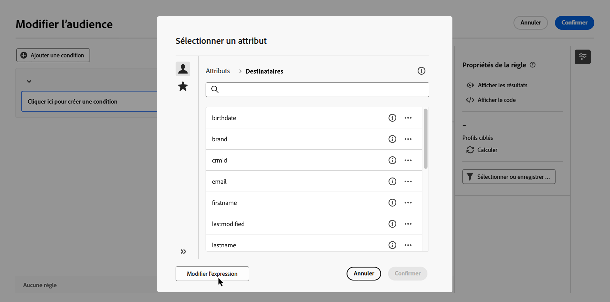
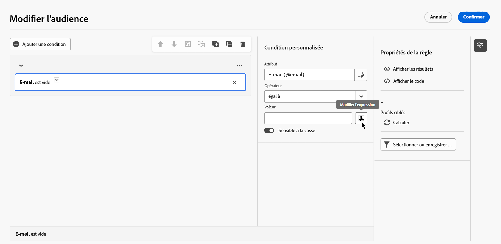
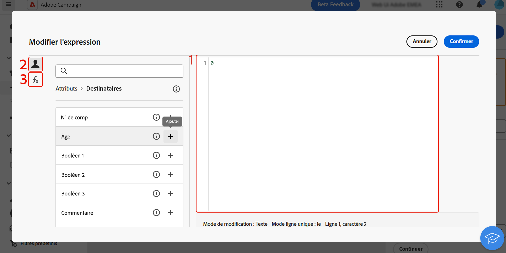

# Éditer les expressions {#edit-expressions}

+++ Table des matières

| Bienvenue dans les campagnes orchestrées | Lancement de votre première campagne orchestrée | Interrogation de la base de données | Activités de campagnes orchestrées |
|---|---|---|---|
| [Prise en main des campagnes orchestrées](gs-orchestrated-campaigns.md)  [Étapes de configuration](configuration-steps.md)  [Étapes clés de la création de campagnes orchestrées](gs-campaign-creation.md) | [Créer une campagne orchestrée](create-orchestrated-campaign.md)  [Paramètres des campagnes orchestrées](orchestrated-campaign-settings.md)  [Orchestrer des activités](orchestrate-activities.md)  [Envoyer des messages avec des campagnes orchestrées](send-messages.md)  [Démarrer et surveiller la campagne](start-monitor-campaigns.md)  [Reporting](reporting-campaigns.md) | [Utiliser le créateur de règles](orchestrated-rule-builder.md)  [Créer votre première requête](build-query.md)  <b>[Modifier des expressions](edit-expressions.md)</b> | [Prise en main des activités](activities/about-activities.md)  Activités: [Et-joindre](activities/and-join.md) - [Créer une audience](activities/build-audience.md) - [Modifier la dimension](activities/change-dimension.md) - [Combiner](activities/combine.md) - [Deduplication](activities/deduplication.md) - [Enrichissement](activities/enrichment.md) - [Fork](activities/fork.md) - [Reconciliation](activities/reconciliation.md) - [Split](activities/split.md) - [Wait](activities/wait.md) |

{style="table-layout:fixed"}

+++

 

&#x200B;# Éditer les expressions {#expression}

L’édition d’une expression consiste à saisir manuellement des conditions pour former une règle. Ce mode permet d’utiliser des fonctions avancées, vous permettant ainsi de manipuler les valeurs utilisées afin de réaliser des requêtes spécifiques comme la manipulation de dates, de chaînes, de champs numériques et le tri.

>[!NOTE]
>
>La section ci-dessous fournit des informations sur l’utilisation de l’éditeur d’expression pour créer des règles. Gardez à l’esprit que la syntaxe utilisée pour créer des règles diffère de celle utilisée pour ajouter de la personnalisation.

## Utiliser l’éditeur d’expression {#edit}

L’éditeur d’expression est disponible à partir du bouton **[!UICONTROL Modifier l’expression]** du créateur de règles, disponible pour les champs **[!UICONTROL Attribut]** et **[!UICONTROL Valeur]** lors de la configuration d’une condition personnalisée.

| Accéder depuis le champ **Attribut** | Accéder depuis le champ **Valeur** |
| --- | --- |
| {zoomable="yes"}{width="200" align="center" zoomable="yes"} | {zoomable="yes"}{width="200" align="center" zoomable="yes"} |

L’éditeur d’expression fournit :

* un **champ de saisie (1)**, dans lequel l’expression est définie ;
* la liste des **champs (2)** disponibles, utilisables dans l’expression et correspondant à la dimension de ciblage de la requête ;
* des **fonctions d’assistance (3)**, triées par catégorie.

Modifiez l’expression en saisissant une expression directement dans le champ de saisie. Pour ajouter un champ ou une fonction d’assistance, placez le curseur dans l’expression à l’endroit où vous souhaitez l’ajouter, puis cliquez sur le bouton +.

{zoomable="yes"}

Lorsque votre expression est prête, cliquez sur le bouton **[!UICONTROL Confirmer]**. L’expression s’affiche dans le champ sélectionné. Pour la modifier, ouvrez l’éditeur d’expression et apportez les modifications souhaitées.

## Fonctions d’assistance

L’outil d’édition de requêtes permet d’utiliser des fonctions avancées pour réaliser un filtrage complexe en fonction des résultats souhaités et des types de données manipulées. Les fonctions suivantes sont disponibles :

### Agrégat

Les fonctions d’agrégat effectuent des calculs sur un jeu de valeurs.

<table>
<tbody>
<tr>
<td><strong>Nom</strong></td>
<td><strong>Description</strong></td>
<td><strong>Syntaxe</strong></td>
</tr>
<tr>
<td><strong>Avg</strong></td>
<td>Renvoie la moyenne d'une colonne de type numérique</td>
<td>Avg(&lt;valeur&gt;)</td>
</tr>
<tr>
<td><strong>Nombre</strong></td>
<td>Compte les valeurs non nulles d'une colonne</td>
<td>Count(&lt;valeur&gt;)</td>
</tr>
<tr>
<td><strong>CountAll</strong></td>
<td>Compte les valeurs retournées (tous champs confondus)</td>
<td>CountAll()</td>
</tr>
<tr>
<td><strong>Countdistinct</strong></td>
<td>Compte les valeurs distinctes non nulles d'une colonne</td>
<td>Countdistinct(&lt;valeur&gt;)</td>
</tr>
<tr>
<td><strong>Max</strong></td>
<td>Renvoie la valeur maximum d'une colonne de type nombre, chaîne ou date</td>
<td>Max(&lt;valeur&gt;)</td>
</tr>
<tr>
<td><strong>Min</strong></td>
<td>Renvoie la valeur minimum d’une colonne de type nombre, chaîne ou date</td>
<td>Min(&lt;valeur&gt;)</td>
</tr>
<tr>
<td><strong>StdDev</strong></td>
<td>Renvoie l’écart type d’une colonne de type nombre, chaîne ou date</td>
<td>StdDev(&lt;valeur&gt;)</td>
</tr>
<tr>
<td><strong>StringAgg</strong></td>
<td>Renvoie la concaténation des valeurs d'une colonne de type chaîne, séparée par le caractère dans le deuxième argument</td>
<td>StringAgg(&lt;Value&gt;,&lt;String&gt;)</td>
</tr>
<tr>
<td><strong>Somme</strong></td>
<td>Renvoie la somme des valeurs d'une colonne de type nombre, chaîne ou date</td>
<td>Sum(&lt;valeur&gt;)</td>
</tr>
</tbody>
</table>

### Date

Les fonctions de date manipulent les valeurs de date ou d’heure.

<table>
<tbody>
<tr>
<td><strong>Nom</strong></td>
<td><strong>Description</strong></td>
<td><strong>Syntaxe</strong></td>
</tr>
<tr>
<td><strong>AddDays</strong></td>
<td>Ajoute un nombre de jours à une date</td>
<td>AddDays(&lt;date&gt;, &lt;number&gt;)</td>
</tr>
<tr>
<td><strong>AddHours</strong></td>
<td>Ajoute un nombre d'heures à une date</td>
<td>AddHours(&lt;date&gt;, &lt;number&gt;)</td>
</tr>
<tr>
<td><strong>AddMinutes</strong></td>
<td>Ajoute un nombre de minutes à une date</td>
<td>AddMinutes(&lt;date&gt;, &lt;number&gt;)</td>
</tr>
<tr>
<td><strong>AddMonths</strong></td>
<td>Ajoute un nombre de mois à une date</td>
<td>AddMonths(&lt;date&gt;, &lt;number&gt;)</td>
</tr>
<tr>
<td><strong>AddSeconds</strong></td>
<td>Ajoute un nombre de secondes à une date</td>
<td>AddSeconds(&lt;date&gt;, &lt;number&gt;)</td>
</tr>
<tr>
<td><strong>AddYears</strong></td>
<td>Ajoute un nombre d’années à une date</td>
<td>AddYears(&lt;date&gt;, &lt;number&gt;)</td>
</tr>
<tr>
<td><strong>ConvertNTZ</strong></td>
<td>Convertit l’horodatage NTZ (horodatage sans fuseau horaire) en TZ (horodatage avec fuseau horaire) en application de la valeur TZ de session définie.</td>
<td>ConvertNTZ(&lt;date+time&gt;)</td>
</tr>
<tr>
<td><strong>DateCmp</strong></td>
<td>Compare deux dates</td>
<td>DateCmp(&lt;date&gt;, &lt;date&gt;)</td>
</tr>
<tr>
<td><strong>DateOnly</strong></td>
<td>Renvoie la date uniquement (avec une heure à 00:00)</td>
<td>DateOnly(&lt;date&gt;)</td>
</tr>
<tr>
<td><strong>Jour</strong></td>
<td>Renvoie le nombre représentant le jour de la date</td>
<td>Day(&lt;date&gt;)</td>
</tr>
<tr>
<td><strong>DayOfYear</strong></td>
<td>Renvoie le numéro du jour dans l'année de la date</td>
<td>DayOfYear(&lt;date&gt;)</td>
</tr>
<tr>
<td><strong>DaysAgo</strong></td>
<td>Renvoie la date correspondant à la date courante moins n jours</td>
<td>DaysAgo(&lt;nombre&gt;)</td>
</tr>
<tr>
<td><strong>DaysAgoInt</strong></td>
<td>Renvoie la date (entier aaaammjj) correspondant à la date courante moins n jours</td>
<td>DaysAgoInt(&lt;nombre&gt;)</td>
</tr>
<tr>
<td><strong>DaysDiff</strong></td>
<td>Renvoie le nombre de jours entre deux dates.</td>
<td>DaysDiff(&lt;date de fin&gt;, &lt;date de début&gt;)</td>
</tr>
<tr>
<td><strong>DaysOld</strong></td>
<td>Renvoie l’âge en jours d’une date</td>
<td>DaysOld(&lt;date&gt;)</td>
</tr>
<tr>
<td><strong>GetDate</strong></td>
<td>Retourne la date courante du système du serveur</td>
<td>GetDate()</td>
</tr>
<tr>
<td><strong>Heure</strong></td>
<td>Renvoie l’heure de la date</td>
<td>Hour(&lt;date&gt;)</td>
</tr>
<tr>
<td><strong>HoursDiff</strong></td>
<td>Renvoie le nombre d’heures entre deux dates</td>
<td>HoursDiff(&lt;date de fin&gt;, &lt;date de début&gt;)</td>
</tr>
<tr>
<td><strong>Minute</strong></td>
<td>Renvoie les minutes de la date</td>
<td>Minute(&lt;date&gt;)</td>
</tr>
<tr>
<td><strong>MinutesDiff</strong></td>
<td>Renvoie le nombre de minutes entre deux dates</td>
<td>MinutesDiff(&lt;date de fin&gt;, &lt;date de début&gt;)</td>
</tr>
<tr>
<td><strong>Mois</strong></td>
<td>Renvoie le nombre représentant le mois de la date</td>
<td>Month(&lt;date&gt;)</td>
</tr>
<tr>
<td><strong>MonthsAgo</strong></td>
<td>Renvoie la date correspondant à la date actuelle moins n mois</td>
<td>MonthsAgo(&lt;number&gt;)</td>
</tr>
<tr>
<td><strong>MonthsDiff</strong></td>
<td>Renvoie le nombre de mois entre deux dates</td>
<td>MonthsDiff(&lt;date de fin&gt;, &lt;date de début&gt;)</td>
</tr>
<tr>
<td><strong>MonthsOld</strong></td>
<td>Renvoie l’âge en mois d’une date</td>
<td>MonthsOld(&lt;date&gt;)</td>
</tr>
<tr>
<td><strong>Oldest</strong></td>
<td>Renvoie la date la plus ancienne d’une plage.</td>
<td>Oldest(&lt;date, date&gt;)</td>
</tr>
<tr>
<td><strong>Second</strong></td>
<td>Renvoie les secondes de la date</td>
<td>Second(&lt;date&gt;)</td>
</tr>
<tr>
<td><strong>SecondsDiff</strong></td>
<td>Renvoie le nombre de secondes entre deux dates</td>
<td>SecondsDiff(&lt;date de fin&gt;, &lt;date de début&gt;)</td>
</tr>
<tr>
<td><strong>SubDays</strong></td>
<td>Soustrait un nombre de jours d'une date</td>
<td>SubDays(&lt;date&gt;, &lt;number&gt;)</td>
</tr>
<tr>
<td><strong>SubHours</strong></td>
<td>Soustrait un nombre d'heures d'une date</td>
<td>SubHours(&lt;date&gt;, &lt;number&gt;)</td>
</tr>
<tr>
<td><strong>SubMinutes</strong></td>
<td>Soustrait un nombre de minutes d’une date</td>
<td>SubMinutes(&lt;date&gt;, &lt;number&gt;)</td>
</tr>
<tr>
<td><strong>SubMonths</strong></td>
<td>Soustrait un nombre de mois d'une date</td>
<td>SubMonths(&lt;date&gt;, &lt;number&gt;)</td>
</tr>
<tr>
<td><strong>SubSeconds</strong></td>
<td>Soustrait un nombre de secondes d’une date</td>
<td>SubSeconds(&lt;date&gt;, &lt;number&gt;)</td>
</tr>
<tr>
<td><strong>SubYears</strong></td>
<td>Soustrait un nombre d'années d'une date</td>
<td>SubYears(&lt;date&gt;, &lt;number&gt;)</td>
</tr>
<tr>
<td><strong>ToDate</strong></td>
<td>Convertit une date + heure en date</td>
<td>ToDate(&lt;date + heure&gt;)</td>
</tr>
<tr>
<td><strong>ToDateTime</strong></td>
<td>Convertit une chaîne en date + heure</td>
<td>ToDateTime(&lt;chaîne&gt;)</td>
</tr>
<tr>
<td><strong>ToTimestamp</strong></td>
<td>Convertir une chaîne en date et heure.</td>
<td>ToTimestamp(&lt;string&gt;)</td>
</tr>
<tr>
<td><strong>ToTimeZone</strong></td>
<td>Convertit une date et une heure en fuseau horaire</td>
<td>ToTimeZone(&lt;date&gt;, &lt;time zone&gt;)</td>
</tr>
<tr>
<td><strong>TruncDate</strong></td>
<td>Arrondit une date et une heure à la seconde.</td>
<td>TruncDate(@lastModified, &lt;nombre de secondes&gt;)</td>
</tr>
<tr>
<td><strong>TruncDateTZ</strong></td>
<td>Arrondit une date + une heure à une précision donnée, exprimée en secondes</td>
<td>TruncDateTZ(&lt;date&gt;, &lt;nombre de secondes&gt;, &lt;fuseau horaire&gt;)</td>
</tr>
<tr>
<td><strong>TruncQuarter</strong></td>
<td>Arrondit une date au trimestre</td>
<td>TruncQuarter(&lt;date&gt;)</td>
</tr>
<tr>
<td><strong>TruncTime</strong></td>
<td>Arrondit la partie temporelle à la seconde la plus proche</td>
<td>TruncTime(&lt;date&gt;, &lt;nombre de secondes&gt;)</td>
</tr>
<tr>
<td><strong>TruncWeek</strong></td>
<td>Arrondit une date à la semaine</td>
<td>TruncWeek(&lt;date&gt;)</td>
</tr>
<tr>
<td><strong>TruncYear</strong></td>
<td>Arrondit une valeur date + heure au 1er janvier de l’année</td>
<td>TruncYear(&lt;date&gt;)</td>
</tr>
<tr>
<td><strong>WeekDay</strong></td>
<td>Renvoie le numéro du jour dans la semaine de la date (0=lundi, 6=dimanche)</td>
<td>WeekDay(&lt;date&gt;)</td>
</tr>
<tr>
<td><strong>Année</strong></td>
<td>Renvoie le nombre représentant l’année de la date</td>
<td>Year(&lt;date&gt;)</td>
</tr>
<tr>
<td><strong>YearAndMonth</strong></td>
<td>Renvoie le nombre représentant l’année et le mois de la date</td>
<td>YearAndMonth(&lt;date&gt;)</td>
</tr>
<tr>
<td><strong>YearsAgo</strong></td>
<td>Renvoie le nombre d’années entre une date donnée et la date actuelle.</td>
<td>YearsAgo(&lt;date&gt;)</td>
</tr>
<tr>
<td><strong>YearsDiff</strong></td>
<td>Renvoie le nombre d’années entre deux dates.</td>
<td>YearsDiff(&lt;date de fin&gt;, &lt;date de début&gt;)</td>
</tr>
<tr>
<td><strong>YearsOld</strong></td>
<td>Renvoie l’âge en années d’une date</td>
<td>YearsOld(&lt;date&gt;)</td>
</tr>
</tbody>
</table>

>[!NOTE]
>
>Notez que la fonction **DateOnly** prend uniquement en compte le fuseau horaire du serveur, et non celui de l’opérateur.

### Géomarketing

Les fonctions de géomarketing sont utilisées pour manipuler des valeurs géographiques.

<table> 
 <tbody> 
  <tr> 
   <td> <strong>Nom</strong>  </td> 
   <td> <strong>Description</strong>  </td> 
   <td> <strong>Syntaxe</strong>  </td> 
  </tr> 
  <tr> 
   <td> <strong>Distance</strong>  </td> 
   <td> Renvoie la distance entre deux points donnés par leur longitude et leur latitude, exprimées en degrés.  </td> 
   <td> Distance(&lt;Longitude A&gt;, &lt;Latitude A&gt;, &lt;Longitude B&gt;, &lt;Latitude B&gt;)  </td>  
  </tr> 
 </tbody> 
</table>

### Numérique

Les fonctions numériques sont utilisées pour convertir du texte en nombres.

<table> 
 <tbody> 
  <tr> 
   <td> <strong>Nom</strong>  </td> 
   <td> <strong>Description</strong>  </td> 
   <td> <strong>Syntaxe</strong>  </td> 
  </tr> 
  <tr> 
   <td> <strong>Abs</strong>  </td> 
   <td> Renvoie la valeur absolue d'un nombre  </td> 
   <td> Abs(&lt;nombre&gt;)  </td>  
  </tr> 
  <tr> 
   <td> <strong>Ceil</strong>  </td> 
   <td> Renvoie le plus petit entier supérieur ou égal à un nombre  </td> 
   <td> Ceil(&lt;nombre&gt;)  </td>  
  </tr> 
  <tr> 
   <td> <strong>Floor</strong>  </td> 
   <td> Renvoie le plus grand entier supérieur ou égal à un nombre  </td> 
   <td> Floor(&lt;nombre&gt;)  </td>  
  </tr> 
  <tr> 
   <td> <strong>Greatest</strong>  </td> 
   <td> Renvoie le plus grand de deux nombres  </td> 
   <td> Greatest(&lt;nombre 1&gt;, &lt;nombre 2&gt;)  </td>  
  </tr> 
  <tr> 
   <td> <strong>Least</strong>  </td> 
   <td> Renvoie le plus petit de deux nombres  </td> 
   <td> Least(&lt;nombre 1&gt;, &lt;nombre 2&gt;)  </td>  
  </tr> 
  <tr> 
   <td> <strong>Mod</strong>  </td> 
   <td> Renvoie le reste de la division entiers de n1 par n2  </td> 
   <td> Mod(&lt;nombre 1&gt;, &lt;nombre 2&gt;)  </td>  
  </tr> 
  <tr> 
   <td> <strong>Percent</strong>  </td> 
   <td> Renvoie la proportion en pourcentage entre deux nombres  </td> 
   <td> Percent(&lt;nombre 1&gt;, &lt;nombre 2&gt;)  </td>  
  </tr> 
  <tr> 
   <td> <strong>Random</strong>  </td> 
   <td> Renvoie une valeur aléatoire  </td> 
   <td> Random()  </td> 
  </tr> 
  <tr> 
   <td> <strong>Round</strong>  </td> 
   <td> Arrondit un nombre à n décimales près  </td> 
   <td> Round(&lt;nombre&gt;, &lt;nombre de décimales&gt;)  </td>  
  </tr> 
  <tr> 
   <td> <strong>Sign</strong>  </td> 
   <td> Renvoie le signe du nombre  </td> 
   <td> Sign(&lt;nombre&gt;)  </td>  
  </tr> 
  <tr> 
   <td> <strong>ToDouble</strong>  </td> 
   <td> Convertit un entier en réel  </td> 
   <td> ToDouble(&lt;nombre&gt;)  </td>  
  </tr> 
  <tr> 
   <td> <strong>ToInt64</strong>  </td> 
   <td> Convertit un réel en entier 64 bits  </td> 
   <td> ToInt64(&lt;nombre&gt;)  </td>  
  </tr> 
  <tr> 
   <td> <strong>ToInteger</strong>  </td> 
   <td> Convertit un réel en entier  </td> 
   <td> ToInteger(&lt;nombre&gt;)  </td>  
  </tr> 
  <tr> 
   <td> <strong>Trunc</strong>  </td> 
   <td> Tronque n1 à n2 décimales  </td> 
   <td> Trunc(&lt;n1&gt;, &lt;n2&gt;)  </td>  
  </tr> 
 </tbody> 
</table>

### Autres

Ce tableau contient les autres fonctions disponibles.

<table> 
 <tbody> 
  <tr> 
   <td> <strong>Nom</strong>  </td> 
   <td> <strong>Description</strong>  </td> 
   <td> <strong>Syntaxe</strong>  </td> 
  </tr> 
  <tr> 
   <td> <strong>AESEncrypt</strong>  </td> 
   <td> Chiffrer la chaîne fournie dans l’argument  </td> 
   <td> AESEncrypt(&lt;value&gt;)  </td> 
  </tr>
  <tr> 
   <td> <strong>Case</strong>  </td> 
   <td> Renvoie la valeur 1 si la condition est vérifiée. Sinon, renvoie la valeur 2.  </td> 
   <td> Case(When(&lt;condition&gt;, &lt;valeur 1&gt;), Else(&lt;valeur 2&gt;))  </td> 
  </tr> 
  <tr> 
   <td> <strong>ClearBit</strong>  </td> 
   <td> Efface le Flag dans la valeur  </td> 
   <td> ClearBit(&lt;identifiant&gt;, &lt;flag&gt;)  </td>  
  </tr> 
  <tr> 
   <td> <strong>Coalesce</strong>  </td> 
   <td> Renvoie la valeur 2 si la valeur 1 est nulle ou vide (null), sinon renvoie la valeur 1  </td> 
   <td> Coalesce(&lt;valeur 1&gt;, &lt;valeur 2&gt;)  </td>  
  </tr> 
  <tr> 
   <td> <strong>Decode</strong>  </td> 
   <td> Renvoie la valeur 3 si la valeur 1 = la valeur 2. Sinon, renvoie la valeur 4.  </td> 
   <td> Decode(&lt;valeur 1&gt;, &lt;valeur 2&gt;, &lt;valeur 3&gt;, &lt;valeur 4&gt;)  </td>  
  </tr>

<tr> 
   <td> <strong>Else</strong>  </td> 
   <td> Renvoie la valeur 1 (ne peut être utilisée qu'en paramètre de la fonction Case)  </td> 
   <td> Else(&lt;valeur 1&gt;, &lt;valeur 2&gt;)  </td>  
  </tr> 
  <tr> 
   <td> <strong>GetEmailDomain</strong>  </td> 
   <td> Extrait le domaine d'une adresse e-mail  </td> 
   <td> GetEmailDomain(&lt;valeur&gt;)  </td>  
  </tr> 
  <tr> 
   <td> <strong>GetMirrorURL</strong>  </td> 
   <td> Récupère l'URL du serveur de page miroir  </td> 
   <td> GetMirrorURL(&lt;valeur&gt;)  </td>  
  </tr> 
  <tr> 
   <td> <strong>Iif</strong>  </td> 
   <td> Renvoie la valeur 1 si l’expression est vraie. Sinon, renvoie la valeur 2.  </td> 
   <td> Iif(&lt;condition&gt;, &lt;valeur 1&gt;, &lt;valeur 2&gt;)  </td>  
  </tr> 
  <tr> 
   <td> <strong>IsBitSet</strong>  </td> 
   <td> Indique si le Flag est présent dans la valeur  </td> 
   <td> IsBitSet(&lt;identifiant&gt;, &lt;flag&gt;)  </td>  
  </tr> 
  <tr> 
   <td> <strong>IsEmptyString</strong>  </td> 
   <td> Renvoie la valeur 2 si la chaîne 1 est vide, sinon renvoie la valeur 3  </td> 
   <td> IsEmptyString(&lt;valeur 1&gt;, &lt;valeur 2&gt;, &lt;valeur 3&gt;)  </td>  
  </tr> 
  <tr> 
   <td> <strong>NewUUID</strong>  </td> 
   <td> Renvoie un ID unique  </td> 
   <td> NewUUID()  </td>  
  </tr> 
  <tr> 
   <td> <strong>NoNull</strong>  </td> 
   <td> Renvoie la chaîne vide si l'argument n'a pas de valeur (null)  </td> 
   <td> NoNull(&lt;valeur&gt;)  </td>   
  </tr> 
  <tr> 
   <td> <strong>RowId</strong>  </td> 
   <td> Renvoie le numéro de la ligne  </td> 
   <td> RowId  </td> 
  </tr> 
  <tr> 
   <td> <strong>SetBit</strong>  </td> 
   <td> Force le Flag dans la valeur  </td> 
   <td> SetBit(&lt;identifiant&gt;, &lt;flag&gt;)  </td>  
  </tr> 
  <tr> 
   <td> <strong>ToBoolean</strong>  </td> 
   <td> Convertit un nombre en booléen  </td> 
   <td> ToBoolean(&lt;nombre&gt;)  </td>   
  </tr> 
  <tr> 
   <td> <strong>When</strong>  </td> 
   <td> Renvoie la valeur 1 si l’expression est vraie. Sinon, renvoie la valeur 2 (ne peut être utilisée qu’en paramètre de la fonction Case).  </td> 
   <td> When(&lt;condition&gt;, &lt;valeur 1&gt;)  </td>  
  </tr> 
 </tbody> 
</table>

### Chaîne

Les fonctions de chaîne sont utilisées pour manipuler un ensemble de chaînes.

<table> 
 <tbody> 
  <tr> 
   <td> <strong>Nom</strong>  </td> 
   <td> <strong>Description</strong>  </td> 
   <td> <strong>Syntaxe</strong>  </td> 
  </tr> 
  <tr> 
   <td> <strong>AllNonNull2</strong>  </td> 
   <td> Indique si tous les paramètres sont non nuls et non vides  </td> 
   <td> AllNonNull2(&lt;chaîne&gt;, &lt;chaîne&gt;) </td> 
  </tr> 
  <tr> 
   <td> <strong>AllNonNull3</strong>  </td> 
   <td> Indique si tous les paramètres sont non nuls et non vides  </td> 
   <td> AllNonNull3(&lt;chaîne&gt;, &lt;chaîne&gt;, &lt;chaîne&gt;) </td> 
  </tr> 
  <tr> 
   <td> <strong>Ascii</strong>  </td> 
   <td> Renvoie la valeur ascii du premier caractère de la chaîne.  </td> 
   <td> Ascii(&lt;chaîne&gt;) </td> 
  </tr> 
  <tr> 
   <td> <strong>Char</strong>  </td> 
   <td> Renvoie le caractère de code ascii n  </td> 
   <td> Char(&lt;nombre&gt;) </td>  
  </tr> 
  <tr> 
   <td> <strong>Charindex</strong>  </td> 
   <td> Retourne la position de la chaîne 2 dans la chaîne 1.  </td> 
   <td> Charindex(&lt;chaîne&gt;, &lt;chaîne&gt;) </td> 
  </tr> 
  <tr> 
   <td> <strong>dataLength</strong>  </td> 
   <td> Renvoie la taille de la chaîne en octets   </td> 
   <td> dataLength(&lt;string&gt;) </td> 
  </tr> 
  <tr> 
   <td> <strong>GetLine</strong>  </td> 
   <td> Renvoie la nième (de 1 à n) ligne de la chaîne  </td> 
   <td> GetLine(&lt;chaîne&gt;) </td> 
  </tr> 
  <tr> 
   <td> <strong>IfEquals</strong>  </td> 
   <td> Renvoie le troisième paramètre si les deux premiers paramètres sont égaux. Sinon, renvoie le dernier paramètre.  </td> 
   <td> IfEquals(&lt;chaîne&gt;, &lt;chaîne&gt;, &lt;chaîne&gt;, &lt;chaîne&gt;) </td> 
  </tr> 
  <tr> 
   <td> <strong>IsMemoNull</strong>  </td> 
   <td> Indique si le memo passé en paramètre est nul  </td> 
   <td> IsMemoNull(&lt;memo&gt;) </td> 
  </tr> 
  <tr> 
   <td> <strong>JuxtWords</strong>  </td> 
   <td> Concatène les chaînes passées en paramètres. Ajoute des espaces entre les chaînes si nécessaire.  </td> 
   <td> JuxtWords(&lt;chaîne&gt;, &lt;chaîne&gt;) </td> 
  </tr> 
  <tr> 
   <td> <strong>JuxtWords3</strong>  </td> 
   <td> Concatène les chaînes passées en paramètres. Ajoute des espaces entre les chaînes si nécessaire.  </td> 
   <td> JuxtWords3(&lt;string&gt;, &lt;string&gt;, &lt;string&gt;) </td>  
  </tr> 
  <tr> 
   <td> <strong>Left</strong>  </td> 
   <td> Renvoie les n premiers caractères de la chaîne  </td> 
   <td> Left(&lt;chaîne&gt;, &lt;nombre&gt;) </td> 
  </tr> 
  <tr> 
   <td> <strong>Length</strong>  </td> 
   <td> Renvoie la longueur de la chaîne  </td> 
   <td> Length(&lt;chaîne&gt;) </td> 
  </tr> 
  <tr> 
   <td> <strong>Line</strong>  </td> 
   <td> Extraire la ligne n de la chaîne  </td> 
   <td> Line(&lt;string&gt;,&lt;number&gt;) </td> 
  </tr>
  <tr> 
   <td> <strong>Lower</strong>  </td> 
   <td> Renvoie la chaîne en minuscules  </td> 
   <td> Lower(&lt;chaîne&gt;) </td> 
  </tr> 
  <tr> 
   <td> <strong>LPad</strong>  </td> 
   <td> Renvoie la chaîne complétée à gauche  </td> 
   <td> LPad (&lt;String&gt;, &lt;Number&gt;, &lt;Char&gt;) </td> 
  </tr> 
  <tr> 
   <td> <strong>Ltrim</strong>  </td> 
   <td> Ote les espaces à gauche de la chaîne  </td> 
   <td> Ltrim(&lt;chaîne&gt;) </td> 
  </tr> 
  <tr> 
   <td> <strong>Md5Digest</strong>  </td> 
   <td> Renvoie une représentation hexadécimale de la clé MD5 d'une chaîne  </td> 
   <td> Md5Digest(&lt;chaîne&gt;) </td> 
  </tr> 
  <tr> 
   <td> <strong>MemoContains</strong>  </td> 
   <td> Indique si le mémo contient la chaîne passée en paramètre  </td> 
   <td> MemoContains(&lt;memo&gt;, &lt;chaîne&gt;) </td> 
  </tr> 
  <tr> 
   <td> <strong>NodeValue</strong>  </td> 
   <td> Extrait la valeur d’un champ XML de son XPath et des données de champ  </td> 
   <td> NodeValue (&lt;String&gt;, &lt;String&gt;) </td> 
  </tr> 
  <tr> 
   <td> <strong>Replace</strong>  </td> 
   <td> Remplace toutes les occurrences d’une valeur de chaîne spécifiée par une autre valeur de chaîne.  </td> 
   <td> Replace(&lt;String&gt;,&lt;String&gt;,&lt;String&gt;) </td> 
  </tr> 
  <tr> 
   <td> <strong>Right</strong>  </td> 
   <td> Renvoie les n derniers caractères de la chaîne  </td> 
   <td> Right(&lt;chaîne&gt;)  </td> 
  </tr> 
  <tr> 
   <td> <strong>RPad</strong>  </td> 
   <td> Renvoie la chaîne complétée à droite  </td> 
   <td> RPad(&lt;chaîne&gt;, &lt;nombre&gt;, &lt;caractère&gt;) </td> 
  </tr> 
  <tr> 
   <td> <strong>Rtrim</strong>  </td> 
   <td> Ote les espaces à droite de la chaîne  </td> 
   <td> Rtrim(&lt;chaîne&gt;)  </td> 
  </tr> 
  <tr> 
   <td> <strong>Sha256Digest</strong>  </td> 
   <td> Représentation hexadécimale de la clé SHA256 d’une chaîne.  </td> 
   <td> Sha256Digest (&lt;String&gt;)  </td> 
  </tr> 
  <tr> 
   <td> <strong>Sha512Digest</strong>  </td> 
   <td> Représentation hexadécimale de la clé SHA512 d’une chaîne.  </td> 
   <td> Sha512Digest (&lt;String&gt;)  </td> 
  </tr> 
  <tr> 
   <td> <strong>Smart</strong>  </td> 
   <td> Renvoie la chaîne avec la première lettre de chaque mot en majuscule  </td> 
   <td> Smart(&lt;chaîne&gt;)  </td> 
  </tr> 
  <tr> 
   <td> <strong>Substring</strong>  </td> 
   <td> Extrait la sous-chaîne débutant au caractère n1 de la chaîne et de longueur n2  </td> 
   <td> Substring(&lt;chaîne&gt;, &lt;départ&gt;, &lt;longueur&gt;)  </td>  
  </tr> 
  <tr> 
   <td> <strong>ToString</strong>  </td> 
   <td> Convertit le nombre en chaîne  </td> 
   <td> ToString(&lt;nombre&gt;, &lt;nombre&gt;)  </td>  
  </tr> 
  <tr> 
   <td> <strong>Upper</strong>  </td> 
   <td> Renvoie la chaîne en majuscules  </td> 
   <td> Upper(&lt;chaîne&gt;)  </td>  
  </tr> 
  <tr> 
   <td> <strong>VirtualLink</strong>  </td> 
   <td> Renvoie la clé étrangère d'un lien passée en premier paramètre, si les deux autres paramètres sont égaux  </td> 
   <td> VirtualLink(&lt;nombre&gt;, &lt;nombre&gt;, &lt;nombre&gt;)  </td>  
  </tr> 
  <tr> 
   <td> <strong>VirtualLinkStr</strong>  </td> 
   <td> Renvoie la clé étrangère (texte) d'un lien passée en premier paramètre, si les deux autres paramètres sont égaux  </td> 
   <td> VirtualLinkStr(&lt;chaîne&gt;, &lt;nombre&gt;, &lt;nombre&gt;)  </td>  
  </tr> 
 </tbody> 
</table>

### Période

<table> 
 <tbody> 
  <tr> 
   <td> <strong>Nom</strong>  </td> 
   <td> <strong>Description</strong>  </td> 
   <td> <strong>Syntaxe</strong>  </td> 
  </tr> 
  <tr> 
   <td> <strong>_Over__</strong>  </td> 
   <td> Exécutez l’appel de fonction SQL saisi en tant que 1er paramètre, sur Partition ou Trier selon les champs saisis en tant que 2e paramètre.  </td> 
   <td> _Over_ (&lt;Value&gt;, &lt;Value&gt;)  </td>  
  </tr> 
  <tr> 
   <td> <strong>Desc</strong>  </td> 
   <td> Applique un tri descendant  </td> 
   <td> Desc(&lt;valeur 1&gt;)  </td>  
  </tr> 
  <tr> 
   <td> <strong>OrderBy</strong>  </td> 
   <td> Trie le résultat au sein de la partition  </td> 
   <td> OrderBy(&lt;valeur 1&gt;)  </td>  
  </tr> 
  <tr> 
   <td> <strong>PartitionBy</strong>  </td> 
   <td> Partitionne le résultat d'une requête sur une table  </td> 
   <td> PartitionBy(&lt;valeur 1&gt;)  </td>  
  </tr> 
  <tr> 
   <td> <strong>RowNum</strong>  </td> 
   <td> Génère un numéro de ligne en fonction de la partition de la table et d'un ordre de tri.  </td> 
   <td> RowNum(PartitionBy(&lt;valeur 1&gt;), OrderBy(&lt;valeur 1&gt;))  </td> 
  </tr> 
 </tbody> 
</table>
