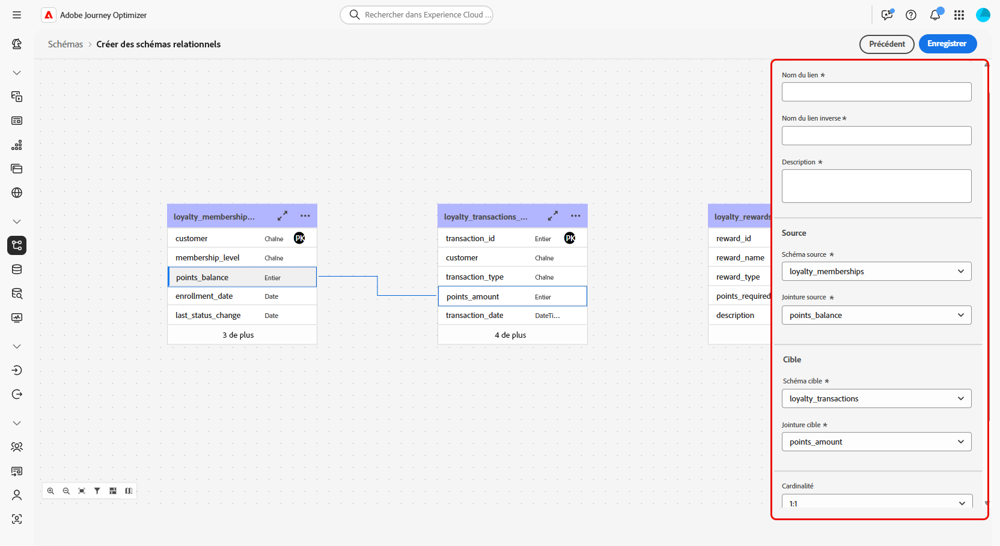

# Créer des schémas relationnels à l’aide d’un fichier DDL {#file-upload-schema}

Définissez le modèle de données relationnelles requis pour les campagnes orchestrées en créant des schémas tels que **Membres du programme de fidélité**, **Transactions de fidélité** et **Récompenses de fidélité**. Chaque schéma doit inclure une clé primaire, un attribut de contrôle de version et des relations appropriées pour référencer des entités telles que les **Destinataires** ou les **Marques**.

Les schémas peuvent être créés manuellement par le biais de l’interface ou importés en masse à l’aide d’un fichier DDL.

Cette section fournit des instructions détaillées sur la création d’un schéma relationnel dans Adobe Experience Platform en chargeant un fichier DDL (Data Definition Language). L’utilisation d’un fichier DDL permet de définir à l’avance la structure de votre modèle de données, y compris les tables, les attributs, les clés et les relations.

1. [Chargez un fichier DDL](#ddl-upload) pour créer des schémas relationnels et définir leur structure.

1. [Définissez des relations](#relationships) entre les tables de votre modèle de données.

1. [Liez des schémas](#link-schema) pour connecter vos données relationnelles à des entités de profil existantes telles que les Destinataires ou les Marques.

1. [Ingérez des données](ingest-data.md) dans votre jeu de données à partir de sources prises en charge.

➡️ [Pour en savoir plus sur les schémas relationnels, consultez la documentation d’Adobe Experience Platform.](https://experienceleague.adobe.com/fr/docs/experience-platform/xdm/schema/relational)

## Charger un fichier DDL{#ddl-upload}

En chargeant un fichier DDL, vous pouvez définir à l’avance la structure de votre modèle de données, y compris les tables, les attributs, les clés et les relations.

Les chargements de fichiers de schéma basés sur le format Excel sont pris en charge. Téléchargez le [modèle fourni](assets/template.zip) pour préparer facilement vos définitions de schéma.

+++Les fonctions suivantes sont prises en charge lors de la création de schémas relationnels dans Adobe Experience Platform.

* **ENUM**\
  Les champs ENUM sont pris en charge pour la création de schémas manuelle ou basée sur un fichier DDL, ce qui vous permet de définir des attributs avec un ensemble fixe de valeurs autorisées.
Voici un exemple :

  ```
  CREATE TABLE orders (
  order_id     INT NOT NULL,
  product_id   INT NOT NULL,
  order_date   DATE NOT NULL,
  customer_id  INT NOT NULL,
  quantity     INT NOT NULL,
  order_status enum ('PENDING', 'SHIPPED', 'DELIVERED', 'CANCELLED'),
  PRIMARY KEY (order_id, product_id)
  );
  ```

* **Libellé de schéma pour la gouvernance des données**\
  La création d’étiquettes est prise en charge au niveau du champ de schéma pour appliquer les politiques de gouvernance des données, telles que le contrôle d’accès et les restrictions d’utilisation. Pour plus d’informations, consultez la [documentation Adobe Experience Platform](https://experienceleague.adobe.com/docs/experience-platform/xdm/home.html?lang=fr).

+++

1. Connectez-vous à Adobe Experience Platform.

1. Accédez au menu **Gestion des données** > **Schéma**.

1. Cliquez sur **Créer un schéma**.

1. Sélectionnez **[!UICONTROL Relationnel]** comme **Type de schéma**.

   

1. Sélectionnez **[!UICONTROL Charger un fichier DDL]** pour définir un diagramme de relations d’entités et créer des schémas.

   La structure de la table doit contenir :
   * Au moins une clé primaire.
   * Un identifiant de version, tel qu’un champ `lastmodified` de type `datetime` ou `number`.
   * Pour l’ingestion Capture des données modifiées (CDC), une colonne spéciale nommée `_change_request_type` de type `String`, qui indique le type de modification des données (par exemple, insertion, mise à jour, suppression) et permet un traitement incrémentiel.
   * Le fichier DDL ne doit pas définir plus de 200 tables.


   >[!IMPORTANT]
   >
   > Tout schéma utilisé pour le ciblage doit inclure au moins un champ d’identité de type `String` avec un **espace de noms d’identité** associé.\
   >Cela garantit la compatibilité avec les fonctionnalités de ciblage et de résolution des identités d’Adobe Journey Optimizer.

1. Faites glisser et déposez votre fichier DDL, puis cliquez sur **[!UICONTROL Suivant]**.

   Notez que la taille maximale prise en charge pour un fichier DDL est de 10 Mo.

1. Saisissez le **[!UICONTROL nom de votre schéma]**.

1. Configurez chaque schéma et ses colonnes en veillant à spécifier une clé primaire et un descripteur de version.

   Un attribut, tel que `lastmodified`, doit être désigné comme descripteur de version (type `datetime`, `long` ou `int`) afin de garantir que les jeux de données sont mis à jour avec les données les plus récentes. Les utilisateurs et utilisatrices peuvent modifier le descripteur de version, qui devient obligatoire une fois défini. Un attribut ne peut pas être à la fois une clé primaire (PK) et un descripteur de version.

   

1. Marquez un attribut comme `identity` et mappez-le à un espace de noms d’identité défini.

1. Renommez, supprimez ou ajoutez une description à chaque table.

1. Cliquez sur **[!UICONTROL Terminé]** une fois l’opération terminée.

Vous pouvez maintenant vérifier les définitions de table et de champ dans la zone de travail. [En savoir plus dans la section ci-dessous](#entities)

## Définir des relations {#relationships}

Vous pouvez spécifier des relations directement dans le fichier DDL lors de la création d’un schéma. Si vous préférez définir des relations en dehors du fichier, vous pouvez le faire dans l’interface en suivant les étapes ci-dessous.

1. Accédez à la vue Zone de travail de votre modèle de données et sélectionnez les deux tables à lier.

1. Cliquez sur le bouton  en regard de la jointure Source, puis faites glisser la flèche vers la jointure cible pour établir la connexion.

   >[!NOTE]
   >
   >Les clés composites sont prises en charge si elles sont définies dans le fichier DDL.

   

1. Remplissez le formulaire donné pour définir le lien et cliquez sur **Appliquer** une fois configuré.

   

   **Cardinalité** :

   * **1-N** : à une occurrence du tableau source peuvent correspondre plusieurs occurrences du tableau cible, mais à une occurrence du tableau cible peut correspondre au plus une occurrence du tableau source.

   * **N-1** : à une occurrence du tableau cible peuvent correspondre plusieurs occurrences du tableau source, mais à une occurrence du tableau source peut correspondre au plus une occurrence du tableau cible.

   * **1-1** : à une occurrence du tableau source peut correspondre au plus une occurrence du tableau cible.

1. Tous les liens définis dans votre modèle de données sont représentés par des flèches dans la vue Zone de travail. Cliquez sur une flèche entre deux tableaux pour afficher les détails, apporter des modifications ou supprimer le lien selon les besoins.

   

1. Utilisez la barre d’outils pour personnaliser et ajuster la zone de travail.

   

   * **Zoom avant** : agrandissez la zone de travail pour afficher plus clairement les détails de votre modèle de données.

   * **Zoom arrière** : réduisez la taille de la zone de travail pour obtenir une vue plus large de votre modèle de données.

   * **Ajuster la vue** : ajustez le zoom pour qu’il s’adapte à l’ensemble des schémas dans la zone visible.

   * **Filtre** : choisissez le schéma à afficher dans la zone de travail.

   * **Forcer la disposition automatique** : organisez automatiquement les schémas pour une meilleure organisation.

   * **Afficher la carte** : activez une superposition de mini-carte pour parcourir plus facilement les dispositions de schémas volumineux ou complexes.

   * **Tout développer/tout réduire** : développez ou réduisez rapidement tous les nœuds de schéma pour afficher ou masquer leurs attributs.

   * **Télécharger** : téléchargez le diagramme ER sous la forme d’un fichier PNG.

1. Cliquez sur **Enregistrer** lorsque vous avez terminé. Cette action crée les schémas et les jeux de données associés et permet au jeu de données d’être utilisé dans des campagnes orchestrées.

1. Cliquez sur **[!UICONTROL Ouvrir les traitements]** pour surveiller la progression du traitement de création. Ce processus peut prendre quelques minutes, selon le nombre de tables définies dans le fichier DDL.

   Vous pouvez également accéder à vos traitements d’import de DDL en ouvrant la fenêtre **[!UICONTROL Charger un fichier DDL]** et en sélectionnant **[!UICONTROL Afficher tous les traitements d’import de DDL]**.

   

## Lier des schémas {#link-schema}

>[!IMPORTANT]
>
> Seules les relations explicitement définies dans le fichier DDL sont reconnues par le système. Toutes les relations d’entité qui existent en dehors du fichier DDL seront ignorées et ne seront pas traitées.

Établissez une relation entre le schéma **Transactions de fidélité** et le schéma **Destinataires** pour associer chaque transaction à l’enregistrement client correct.

1. Accédez à **[!UICONTROL Schémas]** et ouvrez vos **Transactions de fidélité** créées précédemment.

1. Cliquez sur **[!UICONTROL Ajouter une relation]** dans les **[!UICONTROL Propriétés du champ client]**.

   

1. Sélectionnez **[!UICONTROL Multiples-à-un]** comme **[!UICONTROL Type]** de relation.

1. Liez vers le schéma **Destinataires** existant.

   

1. Saisissez un **[!UICONTROL nom de relation à partir du schéma actuel]** et un **[!UICONTROL nom de relation à partir du schéma de référence]**.

1. Cliquez sur **[!UICONTROL Appliquer]** pour enregistrer vos modifications.

Continuez en créant une relation entre le schéma **Récompenses de fidélité** et le schéma **Marques** pour associer chaque entrée de récompense à la marque appropriée.


