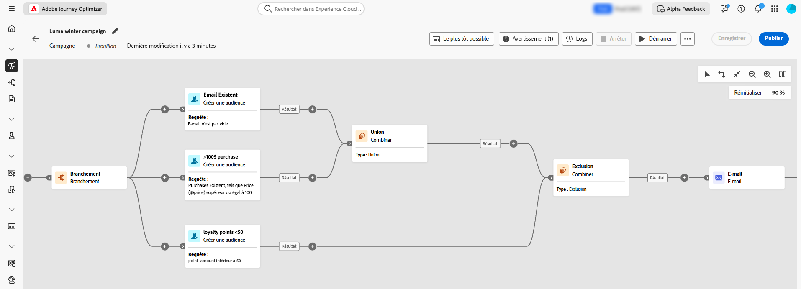

# Commencer avec les campagnes orchestrées {#orchestrated-camp}

>[!CONTEXTUALHELP]
>id="campaigns_overview_orchestrated"
>title="campaigns_overview_orchestrated"
>abstract="<b>Orchestration de campagne</b> Fractionner, combiner, enrichir et manipuler des jeux de données relationnelles pour définir votre audience   <b>Tirer parti des données multi-entités</b> Découvrir comment les campagnes orchestrées peuvent tirer parti des jeux de données relationnelles pour enrichir les données à des fins de segmentation et de personnalisation  <b>Segmentation ad hoc et nombres exacts</b> Créer un segment étape par étape avec des nombres exacts  <b>Canaux disponibles</b> E-mail, SMS, notifications push"

L’orchestration de campagne dans [!DNL Adobe Journey Optimizer] alimente des campagnes marketing sophistiquées et lancées par la marque sur l’ensemble des canaux, ce qui permet de renforcer l’engagement, le chiffre d’affaires et la fidélisation de la clientèle à grande échelle.

>[!IMPORTANT]
>
>Pour accéder à l’orchestration de campagne, votre licence doit inclure le package **Journey Optimizer - Campagnes et parcours** ou **Journey Optimizer - Campagnes**. Contactez votre représentant ou représentante Adobe pour confirmer votre licence et effectuer une mise à jour si nécessaire.

Bien que le marketing cross-canal soit essentiel, les campagnes orchestrées le rendent transparent. Grâce à une interface visuelle par glisser-déposer, vous pouvez concevoir et automatiser des workflows marketing complexes, depuis la segmentation jusqu’à la diffusion des messages, sur plusieurs canaux. Tout se passe dans un environnement intuitif, conçu pour assurer vitesse, contrôle et efficacité.

{zoomable="yes"}

➡️ [Découvrir les campagnes orchestrées dans une vidéo](#video-oc)

## Fonctionnalités principales

L’orchestration de campagne repose sur quatre piliers principaux :

<table style="table-layout:auto">
<tr style="border: 0;">
<td></a></td><td><b>Audiences à la demande</b> Interrogez instantanément les jeux de données pour créer des segments d’audience à l’aide de n’importe quelle combinaison de types et de dimensions de données.</td></tr>
<tr style="border: 0;">
<td></a></td><td><b>Segmentation et envoi de plusieurs entités</b> Poussez votre analyse au-delà des campagnes basées sur les personnes : utilisez des entités telles que des catalogues produit, des emplacements de magasin ou des données de service pour cibler avec précision.  
Prise en charge de l’envoi à plusieurs niveaux, qui permet d’envoyer un message par profil et par entité secondaire associée. Ces entités secondaires peuvent inclure des adresses de contact, des réservations, des abonnements, des contrats ou d’autres données connnexes. Il devient alors possible d’envoyer les campagnes à toutes les adresses connues d’un profil ou pour chaque réservation associée à ce profil.</td></tr>
<tr style="border: 0;">
<td></a></td><td><b>Visibilité et précision avant l’envoi</b> Obtenez un nombre exact de segmentations et une portée complète des campagnes avant leur lancement, afin de garantir la précision et la confiance.</td></tr>
<tr style="border: 0;">
<td></a></td><td><b>Workflows de campagne à plusieurs étapes</b> Concevez des campagnes à plusieurs étapes, des messages quotidiens aux campagnes complexes réalisées lors des promotions saisonnières ou des lancements de produits majeurs.</td></tr>
</table>

>[!NOTE]
>
>Pour plus d’informations sur les canaux pris en charge, reportez-vous au tableau de cette section : [Canaux dans les parcours et les campagnes](../channels/gs-channels.md#channels).
>
>Les canaux disponibles varient en fonction de votre modèle d’attribution de licence et de vos modules complémentaires.

## Campagnes orchestrées et parcours

Même si la visualisation des campagnes orchestrées présente des similitudes avec les parcours, elle poursuit différents objectifs et cas d’utilisation :

* **Parcours** : zone de travail individuelle où chaque profil parcourt les différentes étapes à son propre rythme. L’état de chaque client et cliente tient compte du contexte pour déclencher des actions en temps réel.

* **Campagnes orchestrées** : contrairement aux parcours, les campagnes orchestrées utilisent une zone de travail par lot qui calcule les segments. Tous les profils sont traités ensemble en même temps.

Les deux zones de travail sont optimisées pour leurs cas d’utilisation respectifs : la zone de travail des parcours publie les parcours généralement assortis d’une longévité plus étendue, tandis que la zone de travail des campagnes est conçue pour les exécutions itératives et incrémentielles d’une campagne par lot.

## Que contient une campagne orchestrée ? {#gs-ms-campaign-inside}

La zone de travail d’une campagne orchestrée est une représentation de ce qui est censé se produire. Elle décrit les différentes tâches à effectuer et la manière dont elles sont liées.

Chaque campagne orchestrée contient :

* Des **Activités** : une activité est une tâche à effectuer. Les [différentes activités](activities/about-activities.md) disponibles sont représentées sur la zone de travail par des icônes. Chaque activité possède des propriétés spécifiques et d’autres propriétés communes à toutes les activités.

  Dans une zone de travail de campagne orchestrée, une même activité peut engendrer plusieurs tâches, notamment en cas de boucle ou d’actions récurrentes.

* **Transitions** : les transitions relient une activité source à une activité de destination et définissent leur ordre.

* **Tables de travail** : la table de travail contient toutes les informations véhiculées par la transition. Chaque campagne orchestrée utilise plusieurs tables de travail. Les données transmises dans ces tableaux peuvent être utilisées tout au long du cycle de vie de la campagne orchestrée.

## Vidéo de présentation {#video-oc}

Découvrez les concepts et fonctionnalités clés disponibles dans les campagnes orchestrées.

>[!VIDEO](https://video.tv.adobe.com/v/3471538/?learn=on&enablevpops)

## Explorons plus en détail.

Maintenant que vous avez appris les principes de base des campagnes orchestrées, il est temps d’examiner plus en détail ces sections de documentation pour commencer à utiliser cette fonctionnalité.

<table><tr style="border: 0; text-align: center;">
<td>

<a href="gs-campaign-creation.md"><strong>Étapes de configuration</strong></a>

</td>
<td>

<a href="create-orchestrated-campaign.md"><strong>Créer une campagne orchestrée</strong>

</td>
<td>

<a href="activities/about-activities.md"><strong>Utiliser les activités</strong></a>

</td>
</tr></table>

## Ressources supplémentaires

* **[Créer votre première règle](build-query.md)** ; maîtrisez le créateur de règles pour créer des requêtes ciblées et segmenter les audiences avec précision à l’aide de données relationnelles.
* **[Créer des schémas relationnels](gs-schemas.md)** : découvrez comment configurer et paramétrer des schémas relationnels afin d’exploiter des données multi-entités dans les campagnes.
* **[Création de rapports pour les campagnes orchestrées](reporting-campaigns.md)** ; suivez et analysez les performances des campagnes à l’aide de mesures détaillées et d’informations pertinentes.
* **[Démarrer et surveiller les campagnes](start-monitor-campaigns.md)** : découvrez les bonnes pratiques pour lancer des campagnes et surveiller leur exécution en temps réel.
* **[Mécanismes de sécurisation et limitations](guardrails.md)** ; passez en revue les mécanismes de sécurisation, les limitations et les bonnes pratiques pour garantir des performances optimales des campagnes.
* **[Questions fréquentes](orchestrated-campaigns-faq.md)** ; trouvez des réponses aux questions fréquentes sur les fonctionnalités, les capacités et les cas d’usage des campagnes orchestrées.
* **[Tutoriels sur les campagnes orchestrées](https://experienceleague.adobe.com/fr/docs/journey-optimizer-learn/tutorials/create-campaigns/orchestrated-campaigns/introduction-to-orchestrated-campaigns){target="_blank"}** ; explorez des tutoriels vidéo détaillés présentant les fonctionnalités et les meilleures pratiques.
