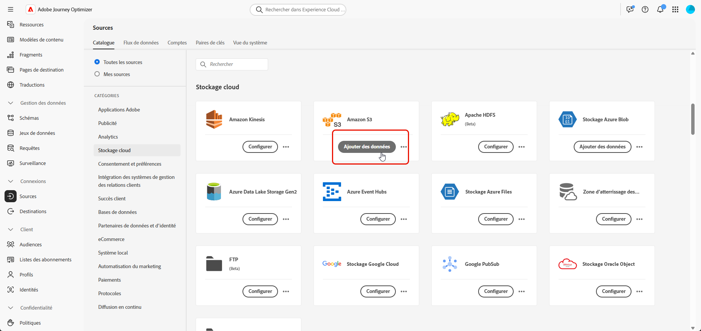
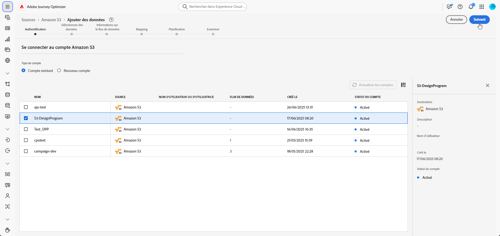
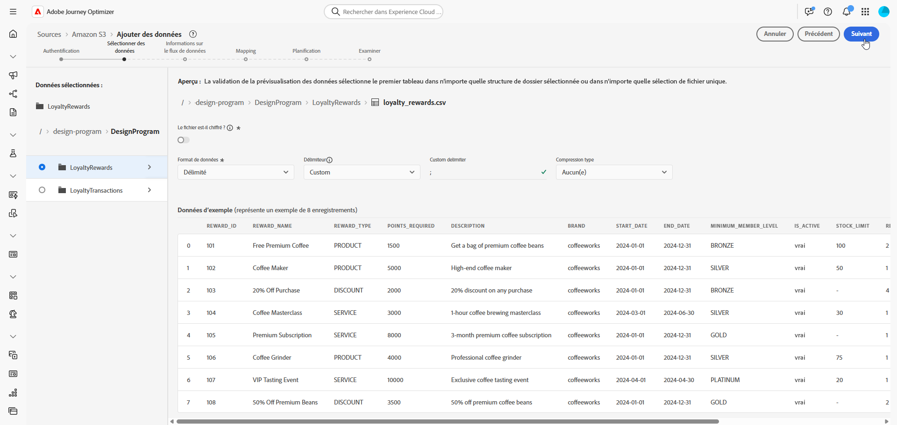
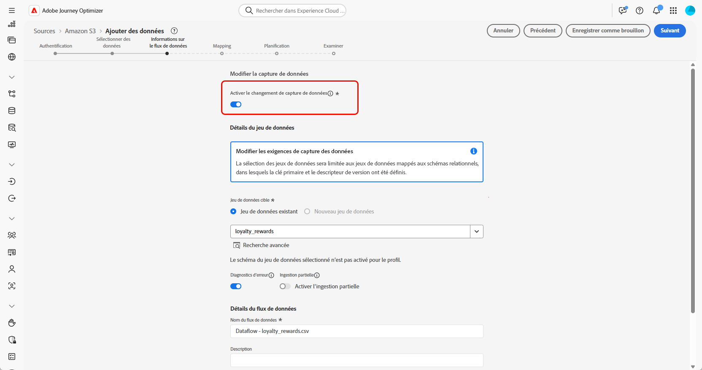
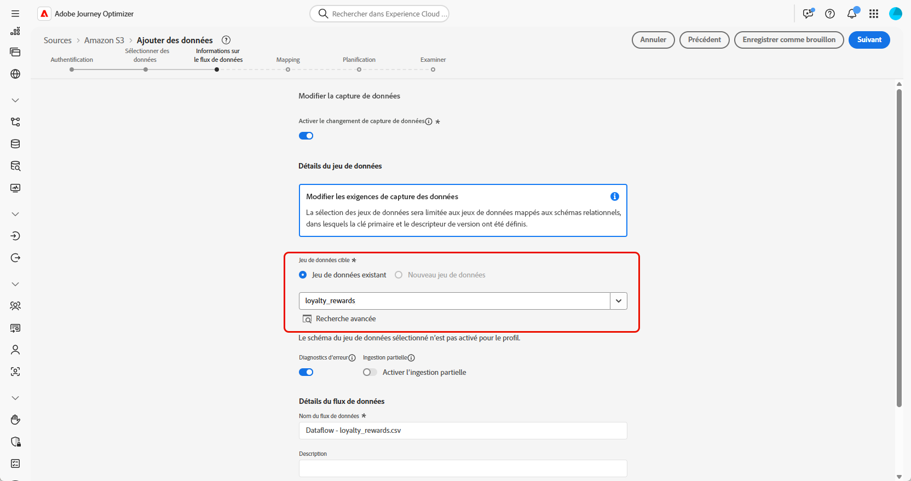
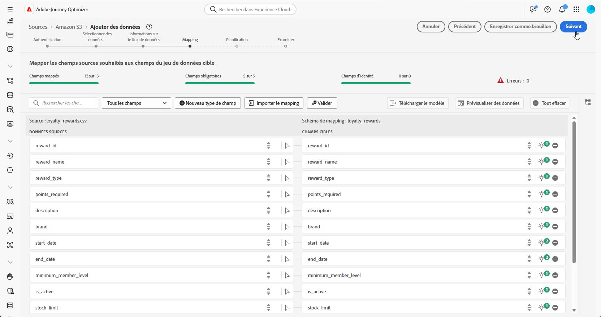
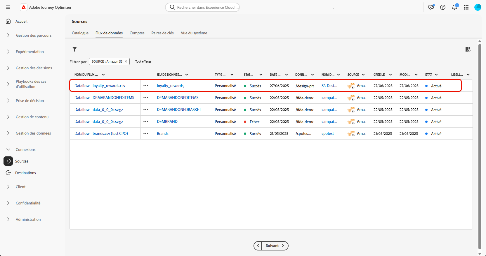

# Ingérer des données {#ingest-data}

>[!IMPORTANT]
>
>Pour modifier la source de données d’un jeu de données, vous devez d’abord supprimer le flux de données existant avant d’en créer un nouveau qui référence le même jeu de données et la nouvelle source.
>
>Adobe Experience Platform applique une relation stricte et individuelle entre les flux de données et les jeux de données. Cela vous permet de maintenir la synchronisation entre la source et le jeu de données pour une ingestion incrémentielle précise.

Adobe Experience Platform permet d’ingérer des données à partir de sources externes tout en vous offrant la possibilité de structurer, d’étiqueter et d’améliorer les données entrantes à l’aide des services d’Experience Platform. Vous pouvez ingérer des données provenant de diverses sources telles que les applications Adobe, les stockages dans le cloud, les bases de données, etc.

## Sources prises en charge pour les campagnes orchestrées {#supported}

Les sources suivantes sont prises en charge pour une utilisation avec des campagnes orchestrées :

<table>
  <thead>
    <tr>
      <th>Type</th>
      <th>Source</th>
    </tr>
  </thead>
  <tbody>
    <tr>
      <td rowspan="3">Stockage dans le cloud</td>
      <td><a href="https://experienceleague.adobe.com/en/docs/experience-platform/sources/ui-tutorials/create/cloud-storage/s3">Amazon S3</a></td>
    </tr>
    <tr>
      <td><a href="https://experienceleague.adobe.com/en/docs/experience-platform/sources/ui-tutorials/create/cloud-storage/google-cloud-storage">Google Cloud Storage</a></td>
    </tr>
    <tr>
      <td><a href="https://experienceleague.adobe.com/en/docs/experience-platform/sources/ui-tutorials/create/cloud-storage/sftp">SFTP</a></td>
    </tr>
      <td rowspan="4">Entrepôts de données cloud</td>
      <td><a href="https://experienceleague.adobe.com/en/docs/experience-platform/sources/ui-tutorials/create/databases/snowflake">Snowflake</a></td>
    </tr>
    <tr>
      <td><a href="https://experienceleague.adobe.com/en/docs/experience-platform/sources/ui-tutorials/create/databases/bigquery">Google BigQuery</a></td>
    </tr>
    <tr>
      <td><a href="https://experienceleague.adobe.com/en/docs/experience-platform/sources/ui-tutorials/create/cloud-storage/data-landing-zone">Zone d’atterrissage des données<a></td>
    </tr>
    <tr>
      <td><a href="https://experienceleague.adobe.com/en/docs/experience-platform/sources/ui-tutorials/create/databases/databricks">Azure Databricks</a></td>
    </tr>
    <tr>
      <td rowspan="3">Chargements Basés Sur Des Fichiers</td>
      <td><a href="https://experienceleague.adobe.com/en/docs/experience-platform/sources/ui-tutorials/create/local-system/local-file-upload">Chargement de fichier local<a></td>
    </tr>

</tbody>
</table>

## Instructions relatives à l’hygiène des données des schémas relationnels {#cdc}

Pour les jeux de données activés avec l’option **[!UICONTROL Modifier la capture de données]**, toutes les modifications de données, y compris les suppressions, sont automatiquement mises en miroir du système source vers Adobe Experience Platform.

Comme les campagnes Adobe Journey Optimizer nécessitent que tous les jeux de données intégrés soient activés avec l’option **[!UICONTROL Modifier la capture de données]**, il est de la responsabilité du client de gérer les suppressions à la source. Tout enregistrement supprimé du système source est automatiquement supprimé du jeu de données correspondant dans Adobe Experience Platform.

Pour supprimer des enregistrements par ingestion basée sur des fichiers, le fichier de données du client doit marquer l’enregistrement à l’aide d’une valeur `D` dans le champ `Change Request Type` . Cela indique que l’enregistrement doit être supprimé dans Adobe Experience Platform, en reflétant le système source.

Si le client ou la cliente souhaite supprimer uniquement des enregistrements de Adobe Experience Platform sans affecter les données source d’origine, les options suivantes sont disponibles :

* **Table proxy ou assainie pour la réplication de capture de données de modification**

  Le client peut créer une table source proxy ou assainie pour contrôler les enregistrements répliqués dans Adobe Experience Platform. Les suppressions peuvent ensuite être gérées de manière sélective à partir de cette table intermédiaire.

* **Suppression via Data Distiller**

  S’il dispose d’une licence, **Data Distiller** peut être utilisé pour prendre en charge les opérations de suppression directement dans Adobe Experience Platform, indépendamment du système source.

  [En savoir plus sur Data Distiller](https://experienceleague.adobe.com/fr/docs/experience-platform/query/data-distiller/overview)

## Configurer un flux de données

Cet exemple montre comment configurer un flux de données qui ingère des données structurées dans Adobe Experience Platform. Le flux de données configuré prend en charge l’ingestion automatisée et planifiée et permet des mises à jour en temps réel.

1. Dans le menu **[!UICONTROL Connexions]**, accédez au menu **[!UICONTROL Sources]**.

1. Choisissez votre source en fonction de la [Sources prises en charge pour les campagnes orchestrées](#supported).

   

1. Connectez votre compte d’espace de stockage ou d’espace de stockage Google si vous avez choisi des sources basées sur le cloud.

   

1. Sélectionnez les données que vous souhaitez ingérer dans Adobe Experience Platform.

   

1. Sur la page **[!UICONTROL Détails du jeu de données]**, cochez la case **[!UICONTROL Activer la capture de données Modifier]** pour afficher uniquement les jeux de données mappés à des schémas relationnels et incluant une clé primaire et un descripteur de version.

[En savoir plus sur les instructions d’hygiène des données des schémas relationnels](#cdc)

   >[!IMPORTANT]
   >
   > Pour les **sources basées sur des fichiers uniquement**, chaque ligne du fichier de données doit inclure une colonne `_change_request_type` avec des valeurs `U` (upsert) ou `D` (delete). Sans cette colonne, le système ne reconnaît pas les données comme prenant en charge le suivi des modifications et le bouton Campagne orchestrée n’apparaît pas, empêchant le jeu de données d’être sélectionné pour le ciblage.

   

1. Sélectionnez le jeu de données créé précédemment et cliquez sur **[!UICONTROL Suivant]**.

   

1. Si vous utilisez uniquement des sources basées sur des fichiers, dans la fenêtre **[!UICONTROL Sélectionner les données]**, chargez vos fichiers locaux et prévisualisez leur structure et leur contenu.

   Notez que la taille maximale prise en charge est de 100MB.

1. Dans la fenêtre **[!UICONTROL Mappage]**, vérifiez que chaque attribut de fichier source est correctement mappé avec les champs correspondants dans le schéma cible.

   Cliquez sur **[!UICONTROL Suivant]** une fois l’opération terminée.

   

1. Configurez le **[!UICONTROL Planning]** du flux de données en fonction de la fréquence souhaitée.

1. Cliquez sur **[!UICONTROL Terminer]** pour créer le flux de données. Il s’exécute automatiquement selon le planning défini.

1. Dans le menu **[!UICONTROL Connexions]**, sélectionnez **[!UICONTROL Sources]** et accédez à l’onglet **[!UICONTROL Flux de données]** pour suivre l’exécution du flux, vérifier les enregistrements ingérés et résoudre les erreurs.

   

