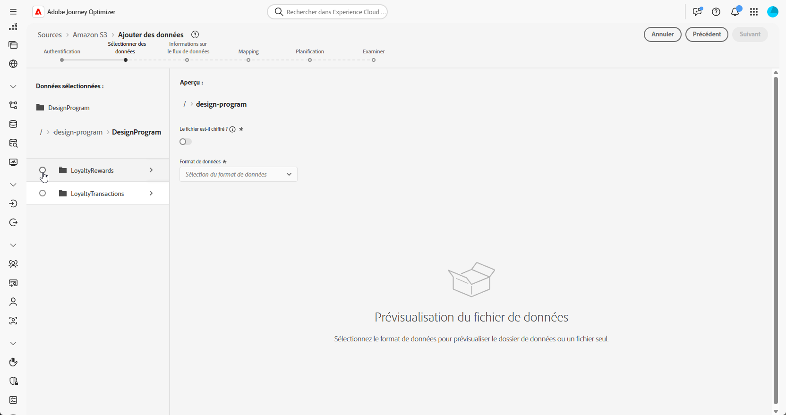

# Ingestion de données {#ingest-data}

+++ Table des matières

| Bienvenue dans les campagnes orchestrées | Lancer votre première campagne orchestrée | Interroger la base de données | Activités de campagnes orchestrées |
|---|---|---|---|
| [Prise en main des campagnes orchestrées](gs-orchestrated-campaigns.md)  Création et gestion de schémas et de jeux de données relationnels  <ul><li>[Prise en main des schémas et des jeux de données](gs-schemas.md)</li><li>[Schéma manuel](manual-schema.md)</li><li>[Schéma de chargement de fichier](file-upload-schema.md)</li><li>[ Ingérer des données ](ingest-data.md)</li></ul>[Accéder aux campagnes orchestrées et les gérer](access-manage-orchestrated-campaigns.md)  [Étapes clés pour créer une campagne orchestrée](gs-campaign-creation.md) | [Créer et planifier la campagne](create-orchestrated-campaign.md)  [Orchestrer les activités](orchestrate-activities.md)  [Démarrer et surveiller la campagne](start-monitor-campaigns.md)  [le reporting](reporting-campaigns.md) | [Utiliser le créateur de règles](orchestrated-rule-builder.md)  [Créer votre première requête](build-query.md)  [Modifier les expressions](edit-expressions.md)  [Reciblage](retarget.md) | [Prise en main des activités](activities/about-activities.md)  Activités: [Et-joindre](activities/and-join.md) - [Créer une audience](activities/build-audience.md) - [Modifier la dimension](activities/change-dimension.md) - [Activités de canal](activities/channels.md) - [Combine](activities/combine.md) - [Deduplication](activities/deduplication.md) - [Enrichissement](activities/enrichment.md) - [Fork](activities/fork.md) - [Reconciliation](activities/reconciliation.md) - [Enregistrer l’audience](activities/save-audience.md) - [Split](activities/split.md) - [Wait](activities/wait.md) |

{style="table-layout:fixed"}

+++

 

>[!BEGINSHADEBOX]

 

Le contenu de cette page n’est pas définitif et peut être modifié.

>[!ENDSHADEBOX]

Adobe Experience Platform permet d’ingérer des données à partir de sources externes tout en vous offrant la possibilité de structurer, d’étiqueter et d’améliorer les données entrantes à l’aide des services d’Experience Platform. Vous pouvez ingérer des données provenant de diverses sources telles que les applications Adobe, les stockages dans le cloud, des bases de données, etc.

<!--
## With Cloud storage {#ingest}

>[!IMPORTANT]
>
>Each dataset in Adobe Experience Platform supports only one active dataflow at a time. For detailed setup guidance on how to switch data sources, refer to this [section](#cdc-ingestion).

You can configure a data flow to ingest data from an Amazon S3 source into Adobe Experience Platform. Once configured, the data flow enables automated, scheduled ingestion of structured data and supports real-time updates.

1. From the **[!UICONTROL Connections]** menu, access the **[!UICONTROL Sources]** menu.

1. Select the **[!UICONTROL Cloud storage]** category then Amazon S3 and click **[!UICONTROL Add Data]**.

    

1. Connect your S3 Account:

    * With an existing account

    * With a new account

    [Learn more in Adobe Experience Platform documentation](https://experienceleague.adobe.com/fr/docs/experience-platform/destinations/catalog/cloud-storage/amazon-s3#connect)

    

1. Choose your folder **[!UICONTROL Data format]**, **[!UICONTROL Delimiter]** and **[!UICONTROL Compression type]**.

1. Navigate through the connected S3 source until you locate the two folders created earlier i.e. **loyalty rewards** and **loyalty transactions**.

1. Select the folder that contains your data.
    
    Selecting a folder ensures that all current and future files with the same structure are automatically processed. Selecting a single file, however, requires manually uploading each new data increment.

    

1. Choose your folder **[!UICONTROL Data format]**, **[!UICONTROL Delimiter]** and **[!UICONTROL Compression type]**. Review your sample data for accuracy, then click **[!UICONTROL Next]**.

    

1. Check **[!UICONTROL Enable Change data capture]** to select from datasets that are mapped to relational schemas and have both a primary key and a version descriptor defined.

1. Select your [previously created Dataset](#entities) and click **[!UICONTROL Next]**.

    

1. In the **[!UICONTROL Mapping]** window, verify that each source file attribute is correctly mapped with the corresponding fields in the target schema.

    Click **[!UICONTROL Next]** once done.

    

1. Configure the data flow **[!UICONTROL Schedule]** based on your desired frequency.

1. Click **[!UICONTROL Finish]** to create the data flow. It will execute automatically according to the defined schedule.

1. From the **[!UICONTROL Connections]** menu, select **[!UICONTROL Sources]** and access the **[!UICONTROL Data Flows]** tab to track flow execution, review ingested records, and troubleshoot any errors.

    

-->

<!--### Setting Up Change data capture ingestion {#cdc-ingestion}

If you need to change the data source, you must delete the existing dataflow and create a new one pointing to the same dataset with the new source.

When using Change Data Capture (CDC), it is essential that the source and dataset remain in sync to ensure accurate incremental updates. Follow the steps below:

1. **Schema Requirements**
   - Your schema must include:
     - A **primary key** (e.g., `transaction_id`)
     - A **versioning field** (e.g., `lastmodified` or an incrementing `version_id`)
   - Enable the dataset for **Orchestrated Campaigns** if needed.

2. **CDC Dataflow Setup**
   - During dataflow creation, after choosing your source and files:
     - **Enable the CDC option**
     - Select your CDC-ready dataset
     - Confirm field mappings (especially version field)

3. **Keep Source and Target in Sync**
   - The source system must consistently update the version field so the platform can detect changes accurately.

Once set up, the platform will automatically ingest **only changed or new records** each time the flow runs.
-->