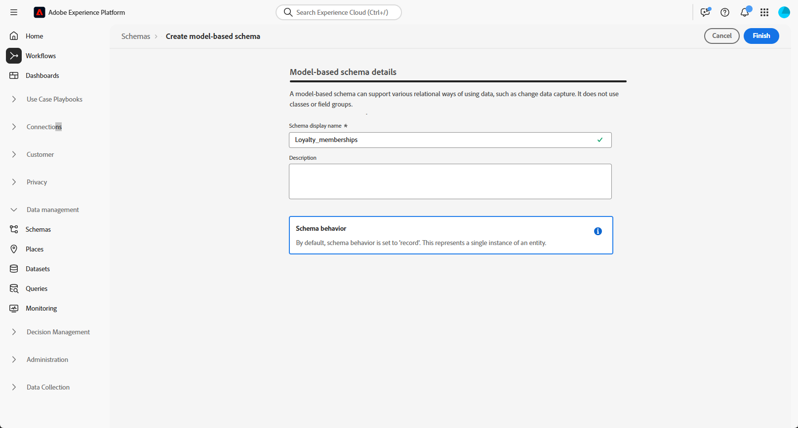

# Configurer un schéma relationnel manuel {#manual-schema}

Les schémas relationnels peuvent être créés directement via l’interface utilisateur, ce qui permet une configuration détaillée des attributs, des clés primaires, des champs de contrôle de version et des relations.

L’exemple suivant définit manuellement le schéma **Membres du programme de fidélité** pour illustrer la structure requise pour les campagnes orchestrées.

1. [Création manuelle d’un schéma relationnel](#schema) à l’aide de l’interface Adobe Experience Platform.

1. [Ajoutez des attributs](#schema-attributes) tels que l’ID du client, le niveau d’abonnement et les champs de statut.

1. [Liez votre schéma](#link-schema) à des schémas intégrés tels que les destinataires pour le ciblage de la campagne.

1. [Créez un jeu de données](#dataset) basé sur votre schéma et activez-le pour l’utiliser dans des campagnes orchestrées.

1. [Ingérez des données](ingest-data.md) dans votre jeu de données à partir de sources prises en charge.

➡️ [Pour en savoir plus sur les schémas relationnels, consultez la documentation d’Adobe Experience Platform.](https://experienceleague.adobe.com/en/docs/experience-platform/xdm/ui/resources/schemas#create-manually)

## Créer votre schéma {#schema}

Commencez par créer manuellement un nouveau schéma relationnel dans Adobe Experience Platform. Ce processus vous permet de définir la structure du schéma à partir de zéro, y compris son nom et son comportement.

1. Connectez-vous à Adobe Experience Platform.

1. Accédez au menu **[!UICONTROL Gestion des données]** > **[!UICONTROL Schéma]**.

1. Cliquez sur **[!UICONTROL Créer un schéma]**.

1. Sélectionnez **[!UICONTROL Relationnel]** pour votre **Type de schéma**.

   {zoomable="yes"}

1. Choisissez **[!UICONTROL Créer manuellement]** pour créer un schéma en ajoutant manuellement des champs.

1. Saisissez votre **[!UICONTROL nom d’affichage du schéma]**.

   {zoomable="yes"}

1. Cliquez sur **Terminer** pour procéder à la création de votre schéma.

Vous pouvez maintenant commencer à ajouter des attributs à votre schéma pour définir sa structure.

## Ajouter des attributs à votre schéma {#schema-attributes}

Ajoutez ensuite des attributs pour définir la structure de votre schéma. Ces champs représentent les points de données clés utilisés dans les campagnes orchestrées, tels que les identifiants des clientes et des clients, les détails d’abonnement et les dates d’activité. Leur définition précise garantit une personnalisation, une segmentation et un suivi fiables.

Tout schéma utilisé pour le ciblage doit inclure au moins un champ d’identité de type `String` avec un espace de noms d’identité associé. Cela garantit la compatibilité avec les fonctionnalités de ciblage et de résolution des identités d’Adobe Journey Optimizer.

+++Les fonctions suivantes sont prises en charge lors de la création de schémas relationnels dans Adobe Experience Platform.

* **ENUM**\
  Les champs ENUM sont pris en charge pour la création de schémas manuelle ou basée sur un fichier DDL, ce qui vous permet de définir des attributs avec un ensemble fixe de valeurs autorisées.

* **Libellé de schéma pour la gouvernance des données**\
  La création d’étiquettes est prise en charge au niveau du champ de schéma pour appliquer les politiques de gouvernance des données, telles que le contrôle d’accès et les restrictions d’utilisation. Pour plus d’informations, consultez la [documentation Adobe Experience Platform](https://experienceleague.adobe.com/docs/experience-platform/xdm/home.html?lang=fr).

* **Clé composite**\
  Les clés primaires composites sont prises en charge dans les définitions de schéma relationnel, ce qui permet d’utiliser plusieurs champs ensemble pour identifier des enregistrements de manière unique.

+++

1. Dans la zone de travail, cliquez sur  en regard du **nom de votre schéma** pour commencer à ajouter des attributs.

   {zoomable="yes"}

1. Saisissez votre attribut **[!UICONTROL Nom du champ]**, **[!UICONTROL Nom d’affichage]** et **[!UICONTROL Type]**.

   Dans cet exemple, nous avons ajouté les attributs présentés dans le tableau ci-dessous au schéma **Membres du programme de fidélité**.

   +++ Exemples d’attributs

   | Nom de l’attribut | Type de données | Attributs supplémentaires |
   |-|-|-|
   | client ou cliente | CHAÎNE | Clé primaire |
   | membership_level | CHAÎNE | Obligatoire |
   | points_balance | ENTIER | Obligatoire |
   | enrollment_date | DATE | Obligatoire |
   | last_status_change | DATE | Obligatoire |
   | expiration_date | DATE | - |
   | is_active | BOOLÉEN | Obligatoire |
   | lastmodified | DATEHEURE | Obligatoire |

   +++ 

1. Attribuez les champs appropriés comme **[!UICONTROL Clé primaire]** et **[!UICONTROL Descripteur de version]**.

   Lors de la création d’un schéma manuel, assurez-vous que les champs essentiels suivants sont inclus :

   * Au moins une clé primaire
   * Un identifiant de version, tel qu’un champ `lastmodified` de type `datetime` ou `number`.
   * Pour l’ingestion Capture des données modifiées (CDC), une colonne spéciale nommée `_change_request_type` de type `String`, qui indique le type de modification des données (par exemple, insertion, mise à jour, suppression) et permet un traitement incrémentiel. Notez que le `_change_request_type` ne doit pas faire partie du schéma de la table, il doit uniquement être ajouté au fichier de données lors de l’ingestion.

   {zoomable="yes"}

1. Cliquez sur **[!UICONTROL Enregistrer]**.

Après avoir créé et enregistré des attributs, vous pouvez lier le schéma à d’autres schémas relationnels en définissant des relations.

➡️ [Pour en savoir plus sur les schémas relationnels, consultez la documentation d’Adobe Experience Platform.](https://experienceleague.adobe.com/fr/docs/experience-platform/xdm/schema/relational#how-relational-schemas-differ-from-standard-xdm-schemas)

## Lier des schémas {#link-schema}

La création d’une relation entre deux schémas permet d’enrichir vos campagnes orchestrées avec des données stockées en dehors du schéma de profil principal.

1. Dans le schéma que vous venez de créer, sélectionnez l’attribut à utiliser comme lien et cliquez sur **[!UICONTROL Ajouter une relation]**.

   {zoomable="yes"}

1. Choisissez les champs **[!UICONTROL Schéma de référence]** et **[!UICONTROL Champ de référence]** avec lesquels établir la relation.

   Dans cet exemple, l’attribut `customer` est lié au schéma `recipients`.

   {zoomable="yes"}

1. Saisissez un nom de relation à partir du schéma actuel et un nom de relation à partir du schéma de référence.

1. Cliquez sur **[!UICONTROL Appliquer]** une fois la configuration terminée.

## Créer un jeu de données pour le schéma {#dataset}

Après avoir défini votre schéma, vous devez créer un jeu de données basé sur celui-ci. Le jeu de données stocke les données ingérées et doit être activé pour que les campagnes orchestrées soient accessibles.

1. Accédez au menu **[!UICONTROL Gestion des données]** > **[!UICONTROL Jeux de données]** et sélectionnez **[!UICONTROL Créer un jeu de données]**.

   {zoomable="yes"}

1. Sélectionnez **[!UICONTROL Créer un jeu de données à partir d&#39;un schéma]**.

1. Sélectionnez le schéma créé précédemment, ici **Membres du programme de fidélité**, puis cliquez sur **[!UICONTROL Suivant]**.

   {zoomable="yes"}

1. Saisissez le **[!UICONTROL Nom]** de votre **[!UICONTROL Jeu de données]**, puis cliquez sur **[!UICONTROL Terminer]**.

Vous devez maintenant activer votre jeu de données pour les campagnes orchestrées.

## Activer le jeu de données pour les campagnes orchestrées {#enable}

>[!CONTEXTUALHELP]
>id="ajo_oc_enable_dataset_for_oc"
>title="Campagnes orchestrées"
>abstract="Après avoir créé votre jeu de données, vous devez l’activer explicitement pour les campagnes orchestrées. Cette étape permet de s’assurer que votre jeu de données est disponible pour l’orchestration et la personnalisation en temps réel dans Adobe Journey Optimizer."

Après avoir créé votre jeu de données, vous devez l’activer explicitement pour les campagnes orchestrées. Cette étape permet de s’assurer que votre jeu de données est disponible pour l’orchestration et la personnalisation en temps réel dans Adobe Journey Optimizer.

Consultez la [documentation Adobe Developer](https://developer.adobe.com/journey-optimizer-apis/references/orchestrated-campaign-dataset/#tag/DatasetEnablement) pour valider ou activer l’extension Campagne orchestrée sur le jeu de données.

1. Recherchez votre jeu de données dans la liste **[!UICONTROL Jeux de données]**.

1. Dans les paramètres **[!UICONTROL Jeux de données]**, activez l’option **Campagnes orchestrées** pour pouvoir utiliser le jeu de données dans vos campagnes orchestrées.

   {zoomable="yes"}

1. Patientez quelques minutes pour que le processus d’activation se termine. Notez que l’ingestion de données et l’utilisation de campagnes ne seront possibles qu’une fois ce paramètre entièrement activé.

Vous pouvez maintenant commencer à ingérer des données dans votre schéma à l’aide de la source de votre choix.

➡️ [Découvrez comment ingérer des données](ingest-data.md)
