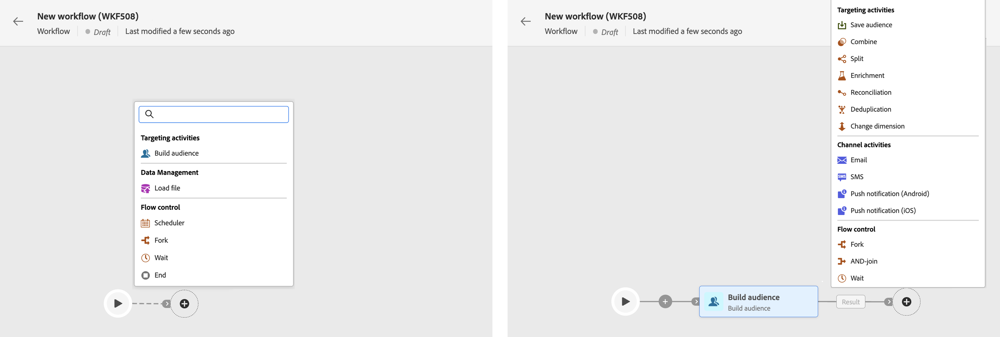
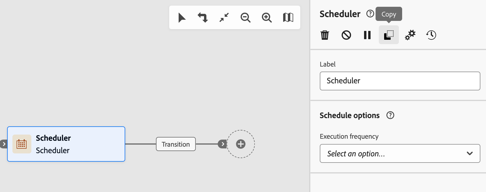

# Orchestrer des activités de campagne orchestrées {#orchestrate}

+++ Table des matières

| Bienvenue dans les campagnes orchestrées | Lancement de votre première campagne orchestrée | Interrogation de la base de données | Activités de campagnes orchestrées |
|---|---|---|---|
| [Prise en main des campagnes orchestrées](gs-orchestrated-campaigns.md)  [Étapes de configuration](configuration-steps.md)  [Étapes clés de la création de campagnes orchestrées](gs-campaign-creation.md) | [Créer une campagne orchestrée](create-orchestrated-campaign.md)  [Orchestrer des activités](orchestrate-activities.md)  [Envoyer des messages avec des campagnes orchestrées](send-messages.md)  [Démarrer et surveiller la campagne](start-monitor-campaigns.md)  [Reporting](reporting-campaigns.md) | [Utiliser la requête Modeler](orchestrated-query-modeler.md)  [créer votre première requête](build-query.md)  [modifier des expressions](edit-expressions.md) | [Prise en main des activités](activities/about-activities.md)  Activités: [Et-joindre](activities/and-join.md) - [Créer une audience](activities/build-audience.md) - [Modifier la dimension](activities/change-dimension.md) - [Combiner](activities/combine.md) - [Deduplication](activities/deduplication.md) - [Enrichissement](activities/enrichment.md) - [Fork](activities/fork.md) - [Reconciliation](activities/reconciliation.md) - [Split](activities/split.md) - [Wait](activities/wait.md) |

{style="table-layout:fixed"}

+++

Une fois que vous avez [créé une campagne orchestrée](gs-campaign-creation.md), à partir du menu de campagne orchestrée ou au sein d’une campagne, vous pouvez commencer à orchestrer les différentes tâches qu’elle exécutera. Pour ce faire, une zone de travail visuelle vous permet de créer un diagramme de campagne orchestré. Dans ce diagramme, vous pouvez ajouter différentes activités et les enchaîner dans un ordre séquentiel.

## Ajouter des activités {#add}

À ce stade de la configuration, le diagramme comporte une icône de démarrage, qui représente le début de votre campagne orchestrée. Pour ajouter votre première activité, cliquez sur le bouton **+** associé à l’icône de démarrage.

La liste des activités pouvant être ajoutées au diagramme s’affiche. Les activités disponibles dépendent de votre position dans le diagramme de campagne orchestré. Par exemple, lorsque vous ajoutez votre première activité, vous pouvez démarrer votre campagne orchestrée en ciblant une audience, en fractionnant le chemin de campagne orchestré ou en définissant une activité **Attente** pour retarder l’exécution de la campagne orchestrée. D’un autre côté, après une activité **Créer une audience**, vous pouvez affiner votre cible avec des activités de ciblage, envoyer une diffusion à votre audience avec des activités de canal ou organiser le processus de campagne orchestré avec des activités de contrôle de flux.

{zoomable="yes"}

Une fois qu’une activité a été ajoutée au diagramme, un volet s’affiche à droite. Il vous permet de définir des paramètres spécifiques pour l’activité. Des informations détaillées sur la configuration de chacune des activités sont disponibles dans [cette section](activities/about-activities.md).

{zoomable="yes"}

Répétez ce processus pour ajouter autant d’activités que vous le souhaitez en fonction des tâches que votre campagne orchestrée doit effectuer. Vous pouvez également insérer une nouvelle activité entre deux activités. Pour ce faire, cliquez sur le bouton **+** sur la transition entre les activités, puis sélectionnez l’activité souhaitée et configurez-la dans le volet de droite.

Pour supprimer une activité, sélectionnez-la dans la zone de travail et cliquez sur l’icône **Supprimer** dans les propriétés de l’activité.

>[!TIP]
>
>Vous pouvez personnaliser le nom des transitions entre chaque activité. Pour ce faire, sélectionnez la transition et modifiez son libellé dans le volet de droite.

## Barre d’outils {#toolbar}

La barre d’outils située dans le coin supérieur droit de la zone de travail fournit des options permettant de manipuler facilement les activités et de naviguer dans la zone de travail :

* **Mode de sélection multiple** : sélectionnez plusieurs activités pour les supprimer toutes en même temps ou pour les copier et les coller. Consultez [cette section](#copy).
* **Faire pivoter** : retournez la zone de travail verticalement.
* **Ajuster à l’écran** : adaptez le niveau de zoom de la zone de travail à votre écran.
* **Zoom arrière**/**Zoom avant** : effectuez un zoom arrière ou avant dans la zone de travail.
* **Afficher la carte** : ouvre un instantané de la zone de travail indiquant où vous vous trouvez.

{zoomable="yes"}{width="50%"}

## Gérer des activités {#manage}

Lors de l’ajout d’activités, des boutons d’action sont disponibles dans le panneau des propriétés, vous permettant d’effectuer plusieurs opérations.

{zoomable="yes"}

Vous pouvez effectuer les actions suivantes :

* **Supprimer** l’activité à partir de la zone de travail.
* **Désactivez/activez** l’activité. Lorsque la campagne orchestrée est exécutée, les activités désactivées et les activités suivantes sur le même chemin ne sont pas exécutées et la campagne orchestrée est arrêtée.
* **Mettez en pause/Reprenez** l’activité. Lorsque la campagne orchestrée est exécutée, elle se met en pause au niveau de l’activité en pause. La tâche correspondante, ainsi que toutes les suivantes dans le même chemin, ne sont pas exécutées.
* **Copiez** l’activité. Consultez [cette section](#copy).
* **Déplacez** une activité et tous ses nœuds enfant vers une autre transition. Consultez [cette section](#move)
* Accédez aux **Options d’exécution** de l’activité.
* Accédez aux **Journaux et tâches** de l’activité.

Plusieurs activités de **Ciblage**, telles que **Combiner** ou **Déduplication**, vous permettent de traiter la population restante et de l’inclure dans une transition de sortie supplémentaire. Par exemple, si vous utilisez une activité **Partage**, le complément est constitué de la population qui ne correspond à aucun des sous-ensembles définis précédemment. Pour utiliser cette fonctionnalité, activez l’option **Générer le complément**.

## Déplacer ou copier des activités {#move-copy}

### Activités de copier-coller {#copy}

Vous pouvez copier des activités de campagne orchestrées et les coller dans n’importe quel workflow. La campagne orchestrée de destination peut se trouver dans un autre onglet du navigateur.

Pour copier des activités, vous avez deux possibilités :

* Copier une activité à l’aide du bouton d’action.

  {zoomable="yes"}{width="70%"}

* Copier plusieurs activités à l’aide du bouton de la barre d’outils.

  {zoomable="yes"}{width="70%"}

Pour coller les activités copiées, cliquez sur le bouton **+** sur une transition et sélectionnez « Coller l’activité X ».

{zoomable="yes"}{width="50%"}

### Déplacer des activités et leurs nœuds enfant {#move}

Journey Optimizer vous permet de déplacer une activité, ainsi que l’ensemble du contenu de ses nœuds enfants (y compris toutes les transitions et activités qu’elle contient), vers la fin d’une autre transition au sein de la même campagne orchestrée.

Ce processus déconnecte l’activité et tout ce qui se trouve dans sa transition sortante de l’emplacement initial, en la déplaçant vers la nouvelle transition cible.

Pour déplacer une activité, procédez comme suit :

1. Sélectionnez l’activité que vous souhaitez déplacer.
1. Dans le volet des propriétés de l’activité, cliquez sur le bouton **Déplacer**.
1. Sélectionnez la transition où vous souhaitez placer l’activité et sa transition sortante, puis confirmez.

## Options d’exécution {#execution}

Toutes les activités permettent de gérer les options d’exécution. Sélectionnez une activité et cliquez sur le bouton **Options d’exécution**. Vous pouvez ainsi définir le mode d’exécution et le comportement de l’activité en cas d’erreur.

{zoomable="yes"}{width="70%"}

### Propriétés

Le champ **Exécution** vous permet de définir l’action à effectuer au moment du déclenchement de la tâche.

Le champ **Durée d’exécution maximum** vous permet d’indiquer une durée de type « 30 s » ou « 1 h ». Si l’activité n’est pas terminée une fois cette durée écoulée, une alerte est déclenchée, Cela n’a aucun impact sur le fonctionnement de la campagne orchestrée.

Le champ **Fuseau horaire** vous permet de sélectionner le fuseau horaire de l’activité. Adobe Journey Optimizer vous permet de gérer les décalages horaires entre plusieurs pays sur la même instance. La configuration appliquée est paramétrée lors de la création de l’instance.

Le champ **Affinité** vous permet de forcer l’exécution d’une campagne orchestrée ou d’une activité de campagne orchestrée sur une machine particulière. Pour ce faire, vous devez spécifier une ou plusieurs affinités pour la campagne orchestrée ou l’activité en question.

Le champ **Comportement** vous permet de définir la marche à suivre en cas de tâches asynchrones.

### Gestion des erreurs

Le champ **En cas d’erreur** vous permet de définir l’action à effectuer lorsque l’activité a rencontré une erreur.

### Script d’initialisation

Ce **script d’initialisation** vous permet d’initialiser des variables ou de modifier des propriétés d’activité. Cliquez sur le bouton **Modifier le code** et saisissez l’extrait de code à exécuter. Le script est appelé lors de l’exécution de l’activité.

## Exemple {#example}

Voici un exemple de campagne orchestrée conçue pour envoyer un e-mail à tous les clients (autres que les clients VIP) qui s’intéressent aux machines à café.

{zoomable="yes"}{zoomable="yes"}

Dans le cadre de ce workflow, les activités suivantes ont été ajoutées :

* une activité **[!UICONTROL Branchement]** qui divise la campagne orchestrée en trois chemins (un pour chaque ensemble de clients et clientes),
* des activités **[!UICONTROL Créer une audience]** destinées à cibler les trois ensembles de clients et clientes :

   * les clients et clientes disposant d’une adresse e-mail
   * les clients et clientes appartenant à l’audience préexistante « Intéressés par la ou les machines à café »
   * les clients et clientes appartenant à l’audience préexistante « VIP ou récompense »

* une activité **[!UICONTROL Combiner]** qui regroupe les clients et clientes disposant d’une adresse e-mail et ceux ou celles intéressés par les machines à café
* une activité **[!UICONTROL Combiner]** qui exclut les clients et clientes VIP
* une activité **[!UICONTROL Diffusion e-mail]** qui envoie un e-mail aux clients et clientes correspondants

Une fois la campagne orchestrée terminée, ajoutez l’activité en **[!UICONTROL Fin]** à la fin du diagramme. Cette activité permet d’illustrer la fin d’un workflow et n’a aucun impact sur celui-ci.

Une fois le diagramme de campagne orchestré conçu, vous pouvez l’exécuter et suivre l’avancement de ses différentes tâches. [Découvrez comment démarrer une campagne orchestrée et surveiller son exécution](start-monitor-campaigns.md)
