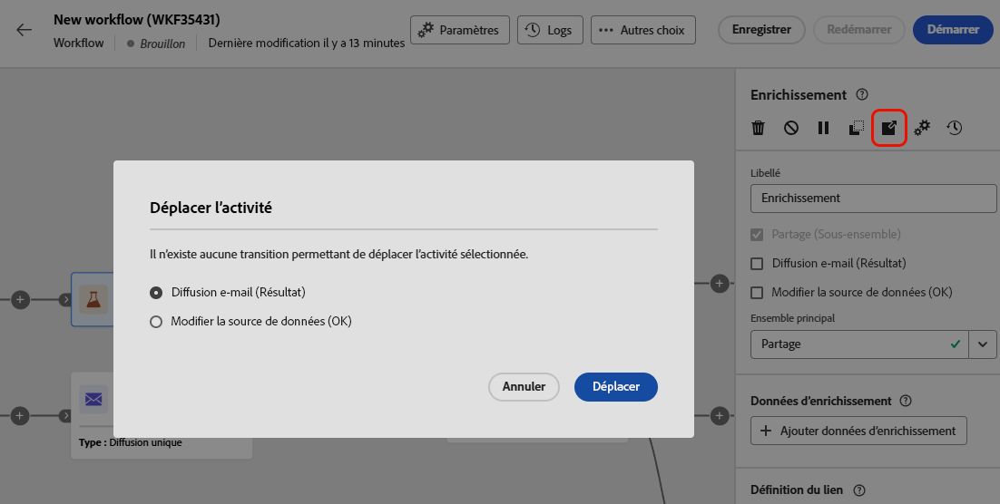
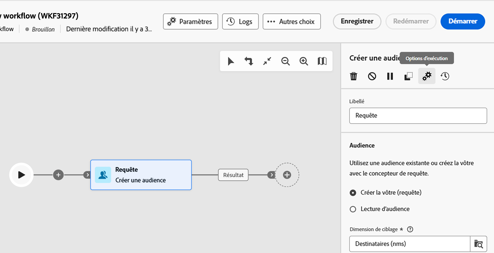

# Orchestrer des activités de campagne orchestrées {#orchestrate}

+++ Table des matières

| Bienvenue dans les campagnes orchestrées | Lancement de votre première campagne orchestrée | Interrogation de la base de données | Activités de campagnes orchestrées |
|---|---|---|---|
| [Prise en main des campagnes orchestrées](gs-orchestrated-campaigns.md)  [Étapes de configuration](configuration-steps.md)  [Étapes clés de la création de campagnes orchestrées](gs-campaign-creation.md) | [Créer une campagne orchestrée](create-orchestrated-campaign.md)  [Paramètres des campagnes orchestrées](orchestrated-campaign-settings.md)  <b>[Orchestrer des activités](orchestrate-activities.md)</b>  [Envoyer des messages avec des campagnes orchestrées](send-messages.md)  [Démarrer et surveiller la campagne](start-monitor-campaigns.md)  [Reporting](reporting-campaigns.md) | [Utiliser le créateur de règles](orchestrated-rule-builder.md)  [Créer votre première requête](build-query.md)  [Modifier des expressions](edit-expressions.md) | [Prise en main des activités](activities/about-activities.md)  Activités: [Et-joindre](activities/and-join.md) - [Créer une audience](activities/build-audience.md) - [Modifier la dimension](activities/change-dimension.md) - [Combiner](activities/combine.md) - [Deduplication](activities/deduplication.md) - [Enrichissement](activities/enrichment.md) - [Fork](activities/fork.md) - [Reconciliation](activities/reconciliation.md) - [Split](activities/split.md) - [Wait](activities/wait.md) |

{style="table-layout:fixed"}

+++

 

Une fois que vous avez [créé une campagne orchestrée](gs-campaign-creation.md), à partir du menu de campagne orchestrée ou au sein d’une campagne, vous pouvez commencer à orchestrer les différentes tâches qu’elle exécutera. Pour ce faire, une zone de travail visuelle vous permet de créer un diagramme de campagne orchestré. Dans ce diagramme, vous pouvez ajouter différentes activités et les enchaîner dans un ordre séquentiel.

## Ajouter des activités {#add}

À ce stade de la configuration, le diagramme comporte une icône de démarrage, qui représente le début de votre campagne orchestrée. Pour ajouter votre première activité, cliquez sur le bouton **+** associé à l’icône de démarrage.

La liste des activités pouvant être ajoutées au diagramme s’affiche. Les activités disponibles dépendent de votre position dans le diagramme de campagne orchestré. Par exemple, lorsque vous ajoutez votre première activité, vous pouvez démarrer votre campagne orchestrée en ciblant une audience, en fractionnant le chemin de campagne orchestré ou en définissant une activité **Attente** pour retarder l’exécution de la campagne orchestrée. D’un autre côté, après une activité **Créer une audience**, vous pouvez affiner votre cible avec des activités de ciblage, envoyer une diffusion à votre audience avec des activités de canal ou organiser le processus de campagne orchestré avec des activités de contrôle de flux.

{zoomable="yes"}

Une fois qu’une activité a été ajoutée au diagramme, un volet s’affiche à droite. Il vous permet de définir des paramètres spécifiques pour l’activité. Des informations détaillées sur la configuration de chacune des activités sont disponibles dans [cette section](activities/about-activities.md).

{zoomable="yes"}

Répétez ce processus pour ajouter autant d’activités que vous le souhaitez en fonction des tâches que votre campagne orchestrée doit effectuer. Vous pouvez également insérer une nouvelle activité entre deux activités. Pour ce faire, cliquez sur le bouton **+** sur la transition entre les activités, puis sélectionnez l’activité souhaitée et configurez-la dans le volet de droite.

Pour supprimer une activité, sélectionnez-la dans la zone de travail et cliquez sur l’icône **Supprimer** dans les propriétés de l’activité.

>[!TIP]
>
>Vous pouvez personnaliser le nom des transitions entre chaque activité. Pour ce faire, sélectionnez la transition et modifiez son libellé dans le volet de droite.

## Barre d’outils {#toolbar}

La barre d’outils située dans le coin supérieur droit de la zone de travail fournit des options permettant de manipuler facilement les activités et de naviguer dans la zone de travail :

* **Mode de sélection multiple** : sélectionnez plusieurs activités pour les supprimer toutes en même temps ou pour les copier et les coller. Consultez [cette section](#copy).
* **Faire pivoter** : retournez la zone de travail verticalement.
* **Ajuster à l’écran** : adaptez le niveau de zoom de la zone de travail à votre écran.
* **Zoom arrière**/**Zoom avant** : effectuez un zoom arrière ou avant dans la zone de travail.
* **Afficher la carte** : ouvre un instantané de la zone de travail indiquant où vous vous trouvez.

{zoomable="yes"}{width="50%"}

## Gérer des activités {#manage}

Lors de l’ajout d’activités, des boutons d’action sont disponibles dans le panneau des propriétés, vous permettant d’effectuer plusieurs opérations.

{zoomable="yes"}

Vous pouvez effectuer les actions suivantes :

* **Supprimer** l’activité à partir de la zone de travail.
* **Désactivez/activez** l’activité. Lorsque la campagne orchestrée est exécutée, les activités désactivées et les activités suivantes sur le même chemin ne sont pas exécutées et la campagne orchestrée est arrêtée.
* **Mettez en pause/Reprenez** l’activité. Lorsque la campagne orchestrée est exécutée, elle se met en pause au niveau de l’activité en pause. La tâche correspondante, ainsi que toutes les suivantes dans le même chemin, ne sont pas exécutées.
* **Copiez** l’activité. Consultez [cette section](#copy).
* Accédez aux **Journaux et tâches** de l’activité.

Plusieurs activités de **Ciblage**, telles que **Combiner** ou **Déduplication**, vous permettent de traiter la population restante et de l’inclure dans une transition de sortie supplémentaire. Par exemple, si vous utilisez une activité **Partage**, le complément est constitué de la population qui ne correspond à aucun des sous-ensembles définis précédemment. Pour utiliser cette fonctionnalité, activez l’option **Générer le complément**.

## Déplacer ou copier des activités {#move-copy}

### Activités de copier-coller {#copy}

Vous pouvez copier des activités de campagne orchestrées et les coller dans n’importe quel workflow. La campagne orchestrée de destination peut se trouver dans un autre onglet du navigateur.

Pour copier des activités, vous avez deux possibilités :

* Copier une activité à l’aide du bouton d’action.

  {zoomable="yes"}{width="70%"}

* Copier plusieurs activités à l’aide du bouton de la barre d’outils.

  {zoomable="yes"}{width="70%"}

Pour coller les activités copiées, cliquez sur le bouton **+** sur une transition et sélectionnez « Coller l’activité X ».

{zoomable="yes"}{width="50%"}

<!--
### Move activities and their child nodes {#move}

Journey Optimizer allows you to move an activity, along with the entire content of its child nodes (including all transitions and activities within it) to the end of another transition within the same orchestrated campaign.

This process disconnects the activity and everything in its outbound transition from the initial location, moving it to the new target transition.

To move an activity:

1. Select the activity you wish to move.
1. In the activity's properties pane, click the **Move** button.
1. Select the transition where you want to place the activity and its outbound transition, then confirm.

## Execution options {#execution}

All activities allow you to manage their execution options. Select an activity and click on the **Execution options** button. This lets you define the activity's execution mode and behavior in case of errors.

{zoomable="yes"}{width="70%"}

### Properties

The **Execution** field allows you to define the action to be carried out when the task is started.

The **Maximum execution duration** field allows you to specify a duration such as "30s" or "1h". If the activity is not finished after the duration specified has been elapsed, an alert is triggered. This has no impact on how the orchestrated campaign functions.

The **Time zone** field allows you to select the time zone of the activity. Adobe Journey Optimizer allows you to manage the time differences between multiple countries on the same instance. The setting applied is configured when the instance is created.

**The Affinity** field allows you to force an orchestrated campaign or an orchestrated campaign activity to execute on a particular machine. To do this, you must specify one or several affinities for the orchestrated campaign or activity in question.

The **Behavior** field allows you to define the procedure to follow if asynchronous tasks are used.

### Error management

The **In case of error** field allows you to specify the action to be carried out should the activity encounter an error.

### Initialization script

The **Initialization script** lets you initialize variables or modify activity properties. Click the **Edit code** button and type the snippet of code to execute. The script is called when the activity executes. 

## Example {#example}

Here is an orchestrated campaign example designed to send an email to all customers (other than VIP customers) with an email who are interested in coffee machines.

{zoomable="yes"}{zoomable="yes"}

To achieve this, activities below have been added:

* A **[!UICONTROL Fork]** activity that divides the orchestrated campaign into three paths (one for each set of customer),
* **[!UICONTROL Build audience]** activities to target the three sets of customers:

    * Customers with an email,
    * Customers belonging to the pre-existing "Interrested in Coffee Machine(s)" audience,
    * Customers belonging to the pre-existing "VIP ro reward" audience.

* A **[!UICONTROL Combine]** activity that groups together customers with an email and those interested in coffee machines,
* A **[!UICONTROL Combine]** activity that excludes VIP customers,
* An **[!UICONTROL Email delivery]** activity that sends an email to the resulting customers. 

Once you have completed the orchestrated campaign, add en **[!UICONTROL End]** activity at the end of the diagram. This activity allow you to visually mark the end of a workflow and has no functional impact.

After successfully designing the orchestrated campaign diagram, you can execute the orchestrated campaign and track the progress of its various tasks. [Learn how to start an orchestrated campaign and monitor its execution](start-monitor-campaigns.md)
-->