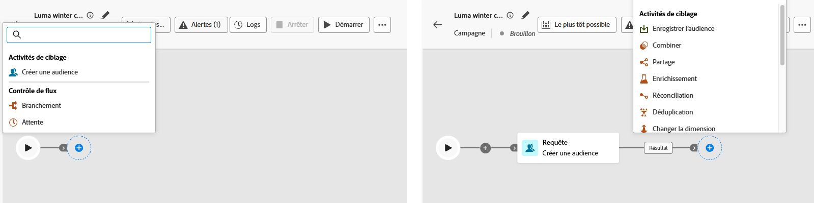
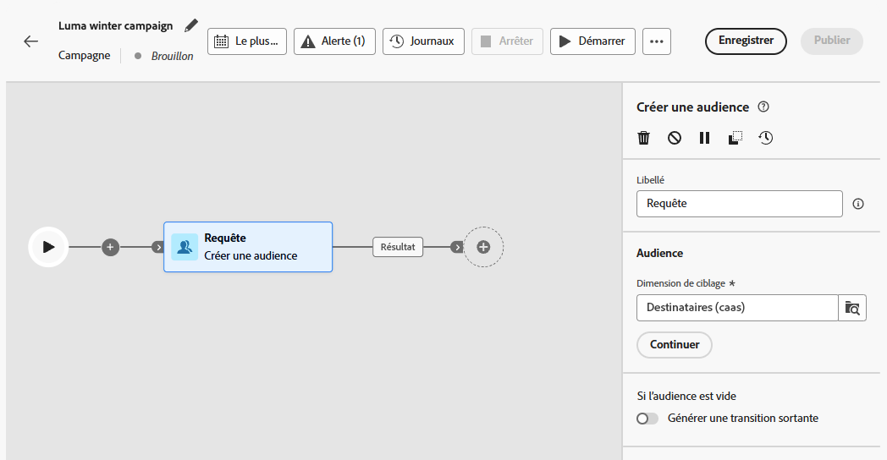
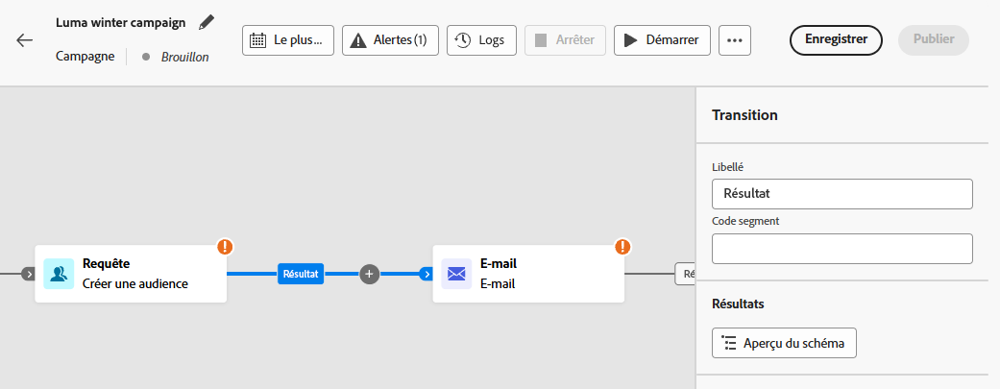
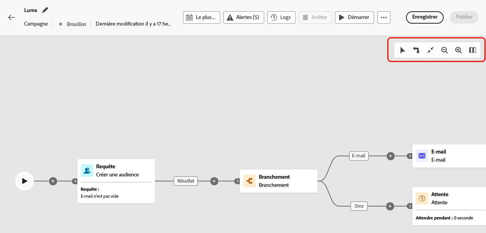
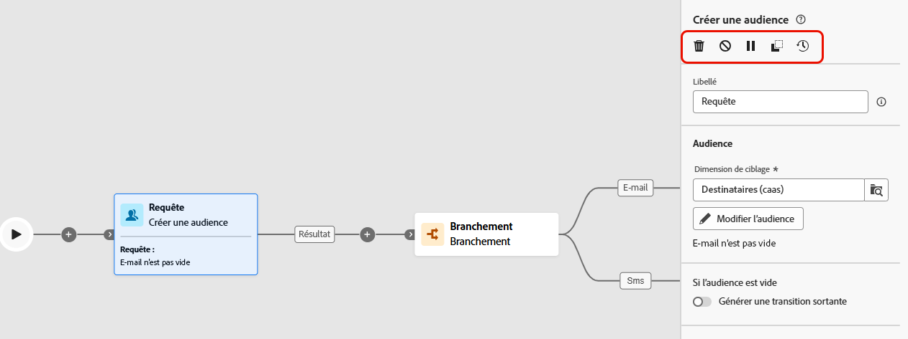
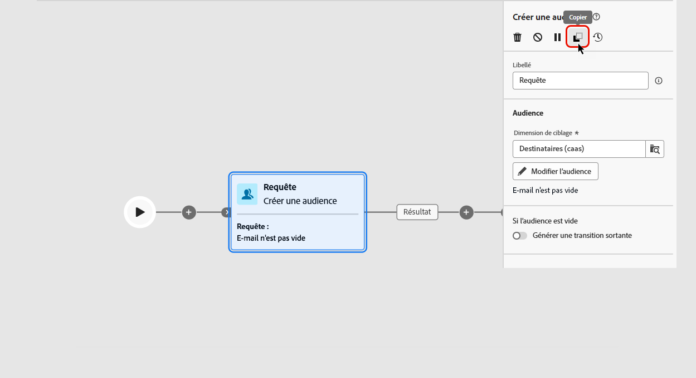
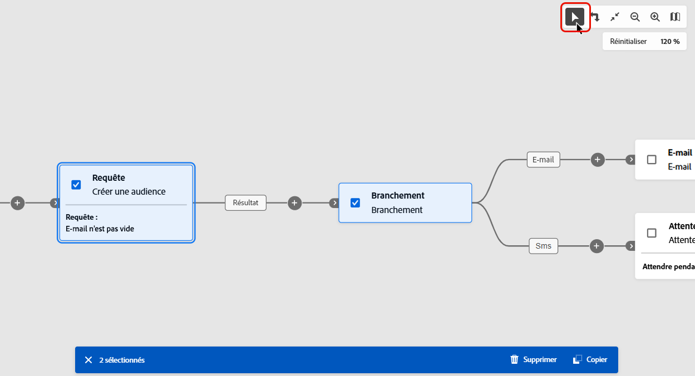
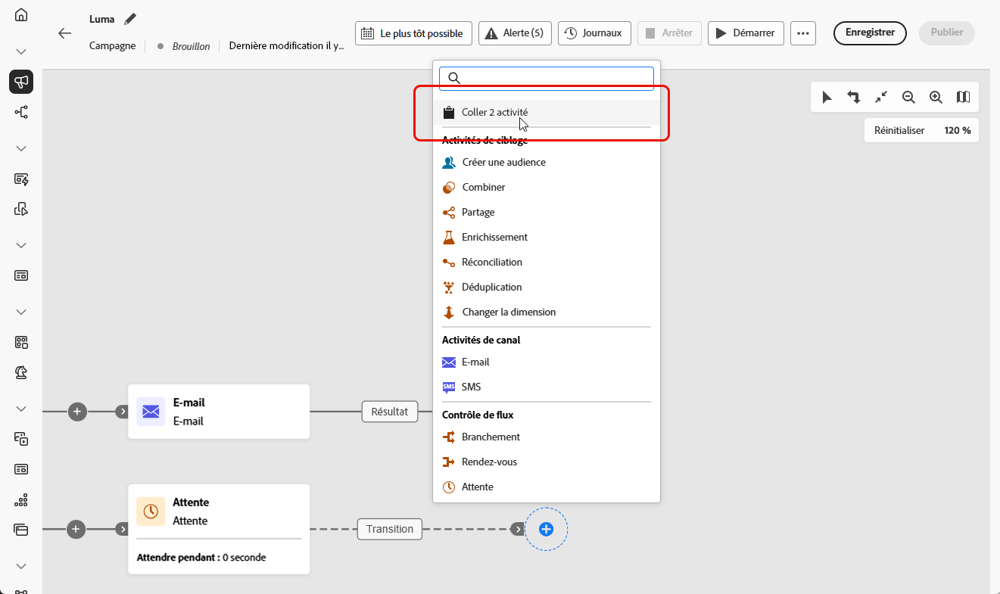
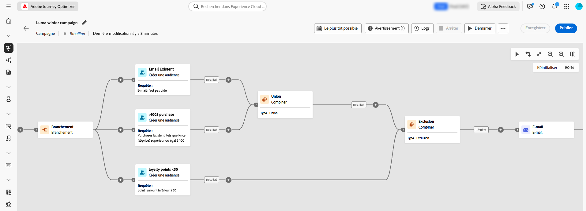

# Activités de campagne orchestrée {#orchestrate}

Une fois que vous avez [créé une campagne orchestrée](gs-campaign-creation.md), vous pouvez commencer à orchestrer les différentes tâches qu’elle exécutera. Pour ce faire, une zone de travail visuelle dédiée vous permet de créer une zone de travail de campagne orchestrée. Dans cette zone de travail, vous pouvez ajouter différentes activités et les relier dans un ordre séquentiel.

## Ajouter des activités {#add}

À ce stade de la configuration, la zone de travail de la campagne orchestrée comporte une icône de démarrage, qui représente le début de votre campagne orchestrée. Pour ajouter votre première activité, cliquez sur le bouton **+** associé à l’icône de démarrage.

La liste des activités pouvant être ajoutées à la zone de travail de la campagne orchestrée s’affiche. Les activités disponibles dépendent de votre position dans la zone de travail de la campagne orchestrée. Par exemple, lorsque vous ajoutez votre première activité pour démarrer votre campagne orchestrée en ciblant une audience, fractionner le chemin de campagne orchestrée ou définir une activité **Attente** pour retarder l’exécution de la campagne. D’autres choix s’offrent à vous après une activité **Créer une audience** : vous pouvez affiner votre cible avec des activités de ciblage, envoyer une diffusion à votre audience avec des activités de canal ou organiser le processus de la campagne orchestrée avec des activités de contrôle de flux.

{zoomable="yes"}

Une fois qu’une activité a été ajoutée à la zone de travail, un volet s’affiche à droite, permettant de définir des paramètres spécifiques. Des informations détaillées sur la configuration de chacune des activités sont disponibles dans [cette section](activities/about-activities.md).

{zoomable="yes"}

Répétez ce processus pour ajouter autant d’activités que vous le souhaitez en fonction des tâches que votre campagne orchestrée doit exécuter. Vous pouvez également insérer une nouvelle activité entre deux activités. Pour ce faire, cliquez sur le bouton **+** sur la transition entre les activités, puis sélectionnez l’activité souhaitée et configurez-la dans le volet de droite.

Vous pouvez personnaliser le nom des transitions entre chaque activité. Pour ce faire, sélectionnez la transition et modifiez son libellé dans le volet de droite.

### Barre d’outils de la zone de travail {#toolbar}

La barre d’outils de la zone de travail propose des options permettant de manipuler facilement les activités et de naviguer dans la zone de travail :

 : sélectionnez plusieurs activités pour les supprimer toutes en même temps ou pour les copier et les coller. [Découvrez comment copier et coller les activités.](#copy)

 : faites pivoter la zone de travail verticalement.

 : adaptez l’échelle de la zone de travail à votre écran.

/ : effectuez un zoom arrière ou avant dans la zone de travail.

 : ouvre un instantané de la zone de travail indiquant où vous vous trouvez.

### Gérer des activités {#manage}

Lors de l’ajout d’activités, des boutons d’action sont disponibles dans le panneau des propriétés, vous permettant d’effectuer plusieurs opérations.

 : supprimez l’activité à partir de la zone de travail.

  : désactivez/activez l’activité. Lorsque la campagne orchestrée est lancée, les activités désactivées ainsi que celles qui les suivent sur le même parcours ne sont pas exécutées, et l’orchestration de la campagne s’interrompt.

  : suspendez/reprenez l’activité. Lorsque la campagne orchestrée est exécutée, elle s’arrête quand l’activité est en pause. La tâche correspondante, ainsi que toutes les suivantes dans le même chemin, ne sont pas exécutées.

Vous pouvez utiliser n’importe quelle activité de la zone de travail comme point d’arrêt pour suspendre l’exécution de la campagne. Cela signifie que la campagne sera exécutée uniquement jusqu’à cette activité, puis que l’exécution sera suspendue. Pendant la suspension de l’exécution, le moteur de segmentation conserve les données temporaires, accessibles pour la prévisualisation. Vous pouvez sélectionner la transition entrante juste avant l’activité en pause pour afficher les données transportées. En savoir plus sur cette section : [Surveillance visuelle des flux](../orchestrated/start-monitor-campaigns.md#flow)

 : copiez l’activité. [Découvrez comment copier et coller les activités.](#copy)

 : accédez aux journaux et tâches de l’activité.

Plusieurs activités de **Ciblage**, telles que **Combiner** ou **Déduplication**, vous permettent de traiter la population restante et de l’inclure dans une transition de sortie supplémentaire. Par exemple, si vous utilisez une activité **Partage**, le complément est constitué de la population qui ne correspond à aucun des sous-ensembles définis précédemment. Pour utiliser cette fonctionnalité, activez l’option **[!UICONTROL Générer le complément]**.

### Activités de copier-coller {#copy}

Vous pouvez copier des activités et les coller dans n’importe quelle zone de travail de la campagne orchestrée. La campagne de destination peut se trouver dans un autre onglet du navigateur.

* Pour copier une activité, cliquez sur le bouton  dans le volet des propriétés de l’activité.
* Pour copier plusieurs activités, cliquez sur l’icône  dans la barre d’outils de la zone de travail.

| Copier une activité | Copier plusieurs activités |
|  ---  |  ---  |
| {width="200" align="center" zoomable="yes"} | {width="200" align="center" zoomable="yes"} |

Pour coller les activités, cliquez sur le bouton **+** sur une transition et sélectionnez « Coller l’activité X ».

{zoomable="yes"}{width="50%"}

## Exemple de zone de travail {#example}

Voici un exemple de campagne orchestrée conçue pour envoyer un e-mail aux clientes et aux clients qui ont effectué un achat d’au moins 100 $, tout en excluant celles et ceux qui ont moins de 50 points de fidélité.

{zoomable="yes"}

Dans le cadre de ce workflow, les activités suivantes ont été ajoutées :

* Une activité **[!UICONTROL Branchement]** divise la campagne orchestrée en trois chemins.
* Les activités **[!UICONTROL Créer une audience]** ciblent les trois ensembles de clientes et clients :

   * les clients et clientes disposant d’une adresse e-mail
   * Les clientes et clients qui ont effectué un achat d’au moins 100 $
   * Les clientes et clients qui ont moins de 50 points de fidélité

* Une activité **[!UICONTROL Combiner]** regroupe les clientes et clients disposant d’une adresse e-mail et celles et ceux qui ont effectué un achat d’au moins 100 $.
* Une activité **[!UICONTROL Combiner]** exclut les clientes et clients disposant de moins de 50 points de fidélité.
* Une activité **[!UICONTROL Diffusion e-mail]** envoie un e-mail aux clientes et clients correspondants.

## Étapes suivantes {#next}

Après la conception de la zone de travail de la campagne orchestrée, vous pouvez exécuter la campagne orchestrée et suivre la progression de ses différentes tâches. [Découvrez comment démarrer une campagne orchestrée et surveiller son exécution](start-monitor-campaigns.md).
