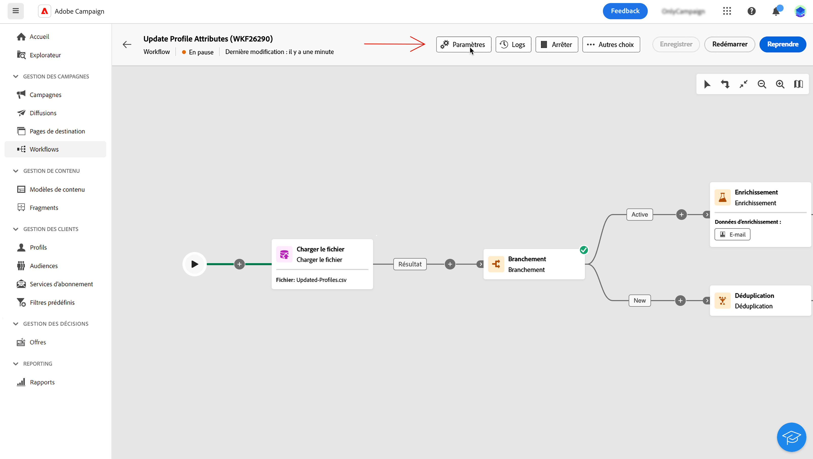
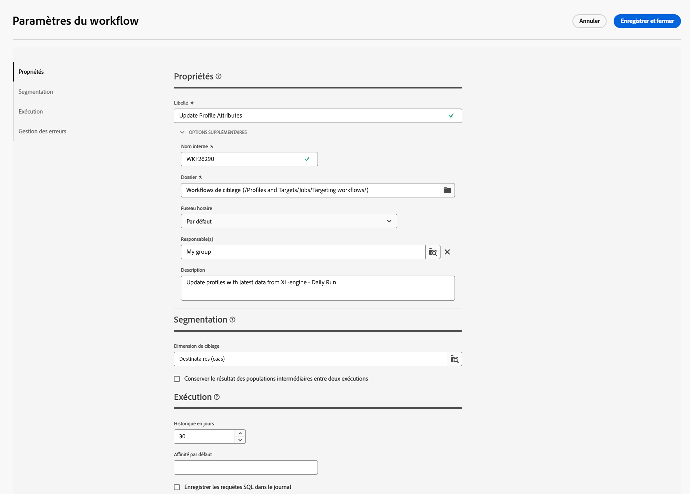

# Configurer des paramètres de campagne orchestrée {#workflow-settings}

>[!CONTEXTUALHELP]
>id="ajo_workflow_creation_properties"
>title="Propriétés des campagnes orchestrées"
>abstract="Dans cet écran, choisissez le modèle à utiliser pour créer la campagne orchestrée et indiquez un libellé. Développez la section **Options supplémentaires** pour configurer d’autres paramètres, tels que le nom interne de la campagne orchestrée, son dossier, son fuseau horaire et son groupe de supervision. Il est vivement recommandé de sélectionner un groupe de supervision afin d’alerter les opérateurs et opératrices en cas d’erreur."

+++ Table des matières

| Bienvenue dans les campagnes orchestrées | Lancement de votre première campagne orchestrée | Interrogation de la base de données | Activités de campagnes orchestrées |
|---|---|---|---|
| [Prise en main des campagnes orchestrées](gs-orchestrated-campaigns.md)  [Étapes de configuration](configuration-steps.md)  [Étapes clés de la création de campagnes orchestrées](gs-campaign-creation.md) | [Créer une campagne orchestrée](create-orchestrated-campaign.md)  [Orchestrer des activités](orchestrate-activities.md)  [Envoyer des messages avec des campagnes orchestrées](send-messages.md)  [Démarrer et surveiller la campagne](start-monitor-campaigns.md)  [Reporting](reporting-campaigns.md) | [Utiliser la requête Modeler](orchestrated-query-modeler.md)  [créer votre première requête](build-query.md)  [modifier des expressions](edit-expressions.md) | [Prise en main des activités](activities/about-activities.md)  Activités: [Et-joindre](activities/and-join.md) - [Créer une audience](activities/build-audience.md) - [Modifier la dimension](activities/change-dimension.md) - [Combiner](activities/combine.md) - [Deduplication](activities/deduplication.md) - [Enrichissement](activities/enrichment.md) - [Fork](activities/fork.md) - [Reconciliation](activities/reconciliation.md) - [Split](activities/split.md) - [Wait](activities/wait.md) |

{style="table-layout:fixed"}

+++

 

Lors de la création d’une campagne orchestrée ou de l’orchestration des activités de campagne dans la zone de travail, vous pouvez accéder aux paramètres avancés de la campagne orchestrée. Par exemple, vous pouvez définir un fuseau horaire spécifique pour la campagne orchestrée, gérer le comportement de la campagne orchestrée en cas d’erreur ou gérer le délai après lequel l’historique de la campagne orchestrée doit être purgé.

Ces paramètres sont préconfigurés dans le modèle sélectionné lors de la création de la campagne orchestrée, mais peuvent être modifiés selon les besoins pour cette campagne orchestrée spécifique.

{zoomable="yes"}{width="70%" align="left"}

## Propriétés des campagnes orchestrées {#properties}

>[!CONTEXTUALHELP]
>id="ajo_workflow_settings_properties"
>title="Propriétés des campagnes orchestrées"
>abstract="Cette section fournit des propriétés de campagnes orchestrées génériques, lesquelles sont également accessibles lors de la création de la campagne orchestrée. Vous pouvez choisir le modèle à utiliser pour créer la campagne orchestrée et indiquer un libellé. Développez la section Options supplémentaires pour configurer des paramètres spécifiques, tels que le dossier de stockage ou le fuseau horaire de la campagne orchestrée."

La section **[!UICONTROL Propriétés]** fournit des paramètres génériques qui peuvent être configurés lors de la création d’une campagne orchestrée. Pour accéder aux propriétés d’une campagne orchestrée existante, cliquez sur le bouton **[!UICONTROL Paramètres]** disponible dans la barre d’actions située au-dessus de la zone de travail de la campagne orchestrée.

{zoomable="yes"}{width="70%" align="left"}

Ces propriétés sont les suivantes :

* **[!UICONTROL Libellé]** de la campagne orchestrée qui s’affiche dans la liste.
* Le **[!UICONTROL Nom interne]** de la campagne orchestrée.
* Le **[!UICONTROL Dossier]** dans lequel la campagne orchestrée doit être enregistrée.
* La valeur par défaut **[!UICONTROL Fuseau horaire]** à utiliser dans toutes les activités de la campagne orchestrée. Par défaut, le fuseau horaire de la campagne orchestrée est celui défini pour l’opérateur Campaign actuel.
Les valeurs possibles sont les suivantes :
   * **Fuseau horaire du serveur** pour utiliser le fuseau horaire de votre organisation Adobe Experience Platform
   * **Fuseau horaire de l’opérateur** pour utiliser le fuseau horaire de l’opérateur qui exécute la campagne orchestrée
   * **Fuseau horaire de la base de données** pour utiliser le fuseau horaire du serveur de base de données.
   * Un fuseau horaire spécifique.
* Lorsqu’une campagne orchestrée échoue, les opérateurs et opératrices appartenant au groupe d’opérateurs sélectionné dans le champ **[!UICONTROL Superviseur(s)]** sont avertis par e-mail.
* Vous pouvez également saisir une **[!UICONTROL Description]** de votre campagne orchestrée.

## Paramètres de segmentation  {#segmentation-settings}

>[!CONTEXTUALHELP]
>id="ajo_workflow_settings_segmentation"
>title="Paramètres de segmentation"
>abstract="Cette section vous permet de sélectionner la dimension de ciblage pour cibler les profils dans la campagne orchestrée et de conserver ou non les résultats du workflow entre deux exécutions. Cette option ne doit être utilisée qu’à des fins de test. Elle ne doit en aucun cas être activée dans une campagne orchestrée de production."

* **[!UICONTROL Dimension de ciblage]** : sélectionnez la dimension de ciblage à utiliser pour cibler les profils (destinataires, bénéficiaires d’un contrat, opérateur ou opératrice, abonnées et abonnés, etc.).

* **[!UICONTROL Conserver le résultat des populations intermédiaires entre deux exécutions]** : par défaut, seules les tables de travail de la dernière exécution de la campagne orchestrée sont conservées. Les tables de travail des exécutions précédentes sont purgées par une campagne technique orchestrée, qui s’exécute quotidiennement.

  Si cette option est activée, les tables de travail sont conservées même après l’exécution de la campagne orchestrée. Vous pouvez l’utiliser à des fins de test. N’utilisez donc cette option **que** dans les environnements de développement ou d’évaluation. Elle ne doit jamais être vérifiée dans une campagne orchestrée en production.

## Paramètres d’exécution  {#exec-settings}

>[!CONTEXTUALHELP]
>id="ajo_workflow_settings_execution"
>title="Paramètres d’exécution"
>abstract="Dans cette section, vous pouvez définir les paramètres relatifs à l’exécution du workflow, comme le nombre de jours pendant lesquels l’historique de la campagne orchestrée est conservé."

* **[!UICONTROL Jours d’historique]** : indique le nombre de jours après lesquels l’historique doit être purgé. L’historique contient des éléments liés à la campagne orchestrée : logs, tâches, événements (objets techniques liés à l’opération de la campagne orchestrée). La valeur par défaut est de 30 jours pour les modèles de campagne orchestrés prêts à l’emploi. La purge de l’historique est effectuée par la campagne technique orchestrée de nettoyage de la base de données, qui est exécutée par défaut tous les jours

  >[!IMPORTANT]
  >
  >Si le champ **[!UICONTROL Jours d’historique]** n’est pas renseigné, la valeur prise en compte est « 1 », ce qui signifie que l’historique sera purgé après 1 jour.

* **[!UICONTROL Affinité par défaut]** : si votre installation comprend plusieurs serveurs de campagnes orchestrées, utilisez ce champ pour indiquer le serveur sur lequel la campagne orchestrée sera exécutée. Cela force l’exécution de cette campagne orchestrée sur un serveur particulier. Vous pouvez choisir n’importe quel nom d’affinité existant, mais veillez à ne pas utiliser d’espaces ni de signes de ponctuation. Si vous utilisez des serveurs différents, spécifiez aussi des noms différents, séparés par des virgules.

  >[!IMPORTANT]
  >
  >Si la valeur définie dans ce champ n’existe sur aucun serveur, la campagne orchestrée reste en attente.

* **[!UICONTROL Enregistrer les requêtes SQL dans le journal]** : cochez cette option pour enregistrer les requêtes SQL de la campagne à plusieurs étapes du workflow maintenant dans les journaux. Cette fonctionnalité est réservée aux utilisateurs et utilisatrices avancés. Elle s’applique aux campagnes orchestrées qui contiennent des activités de ciblage comme **[!UICONTROL Créer une audience]**. Lorsque cette option est activée, les requêtes SQL envoyées à la base de données lors de l’exécution de la campagne orchestrée sont affichées dans les journaux de la campagne orchestrée, ce qui vous permet de les analyser afin d’optimiser les requêtes ou de diagnostiquer les problèmes.

## Paramètres de gestion des erreurs  {#error-settings}

>[!CONTEXTUALHELP]
>id="ajo_workflow_settings_error"
>title="Paramètres de gestion des erreurs"
>abstract="Dans cette section, vous pouvez définir la façon dont la campagne orchestrée doit gérer les erreurs lors de son exécution. Vous pouvez choisir de suspendre le processus, d’ignorer un certain nombre d’erreurs ou d’arrêter l’exécution de la campagne orchestrée."

* **[!UICONTROL Gestion des erreurs]** : ce champ vous permet de définir les actions à effectuer si une tâche de campagne orchestrée est en erreur. Trois choix s’offrent à vous :

   * **[!UICONTROL Suspendre le processus]** : la campagne orchestrée est automatiquement mise en pause et adopte le statut **[!UICONTROL Échec]**. Une fois le problème résolu, reprenez l’opération orchestrée à l’aide des boutons **[!UICONTROL Reprendre]**.
   * **[!UICONTROL Ignorer]** : le statut de la tâche qui a déclenché l’erreur passe à **[!UICONTROL Échec]**, mais la campagne orchestrée conserve le statut **[!UICONTROL Démarré]**. <!-- TO ADD ONCE SCHEUDLER IS AVAILABLE This configuration is relevant for recurring tasks: if the branch includes a scheduler, it will start normally next time the workflow is executed.-->
   * **[!UICONTROL Abandonner le processus]** : la campagne orchestrée est automatiquement arrêtée et adopte le statut **[!UICONTROL Échec]**. Une fois le problème résolu, redémarrez la campagne orchestrée à l’aide des boutons **[!UICONTROL Démarrer]**.

* **[!UICONTROL Erreurs consécutives]** : ce champ est disponible lorsque la valeur **[!UICONTROL Ignorer]** est sélectionnée dans le champ **[!UICONTROL En cas d’erreur]**. Vous pouvez indiquer le nombre d’erreurs qui peuvent être ignorées avant l’arrêt du processus. Une fois ce nombre atteint, le statut de la campagne orchestrée passe à **[!UICONTROL Échec]**. Si la valeur de ce champ est 0, la campagne orchestrée ne sera jamais arrêtée, quel que soit le nombre d’erreurs.

