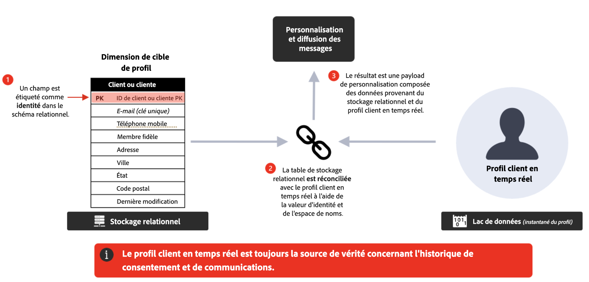

# Questions fréquentes {#faq-oc}

Vous trouverez ci-dessous les questions fréquentes sur les campagnes orchestrées Adobe Journey Optimizer.

Vous avez besoin de plus d’informations ? Utilisez les options de commentaires au bas de cette page pour poser votre question ou contacter la [communauté Adobe Journey Optimizer](https://experienceleaguecommunities.adobe.com/t5/adobe-journey-optimizer/ct-p/journey-optimizer?profile.language=fr){target="_blank"}.

+++ Qu’est-ce que l’orchestration de campagne ?

L’orchestration de campagne est une fonctionnalité de Journey Optimizer qui prend en charge les workflows en une ou plusieurs étapes qui utilisent le magasin de données relationnelles pour créer et segmenter les audiences à des fins d’engagement par lots.

Journey Optimizer intègre un nouveau type de campagnes : les **campagnes orchestrées**. Les campagnes orchestrées permettent aux marques d’exécuter des campagnes marketing complexes de type « un-à-plusieurs » à grande échelle. Elles sont conçues pour l’engagement initié par la marque, tel que les promotions, les campagnes saisonnières ou les communications basées sur un compte.

Par rapport aux campagnes à action/envoi unique, elles apportent l’**orchestration et le séquencement** au marketing sortant : les audiences suivent ensemble un workflow en plusieurs étapes, plutôt que de recevoir un message unique.

**En savoir plus**

* [Commencer avec les campagnes orchestrées](gs-orchestrated-campaigns.md)
* [Créer votre première campagne orchestrée](gs-campaign-creation.md)

+++

+++ Que puis-je faire avec une campagne orchestrée ?

Les fonctionnalités principales sont les suivantes :

* **Audiences à la demande** : créez et affinez instantanément des groupes cibles à l’aide de requêtes relationnelles.
* **Segmentation d’entités multiples** : créez des audiences précises en connectant les données client à des entités associées (par exemple, comptes, achats, réservations).
* **Visibilité avant l’envoi** : obtenez une évaluation précise de la taille des audiences avant le lancement pour optimiser le ciblage.
* **Workflows à plusieurs étapes** : exécutez des campagnes séquencées telles que des promotions saisonnières, des lancements de produits ou des offres de fidélité.

**Bonnes pratiques**

* Définissez un **objectif de campagne clair** avant de concevoir des workflows.
* Commencez avec une **audience pilote** pour valider les nombres et la logique avant la mise à l’échelle.
* Conservez des règles de segmentation **aussi simples que possible** pour optimiser les performances et la transparence.
* Utilisez des **conventions de nommage cohérentes** pour les audiences et les campagnes afin de faciliter la gestion.

**En savoir plus**

* [Créer une campagne orchestrée](create-orchestrated-campaign.md)
* [Utiliser les activités de campagnes](activities/about-activities.md)
* [Créer votre règle à l’aide du concepteur de requête](build-query.md)

+++

+++ Comment accéder à l’orchestration de campagne ?

Pour accéder à l’orchestration de campagne, votre licence doit inclure le package **Journey Optimizer - Campagnes et parcours** ou **Journey Optimizer - Campagnes**. Contactez votre représentant ou représentante Adobe pour confirmer votre licence et effectuer une mise à jour si nécessaire.

**En savoir plus**

* [Commencer avec les campagnes orchestrées](gs-orchestrated-campaigns.md)
* [Description du produit Adobe Journey Optimizer](https://helpx.adobe.com/fr/legal/product-descriptions/adobe-journey-optimizer.html){target="_blank"}

+++

+++ En quoi les campagnes orchestrées sont-elles différentes des parcours ?

* **Campagnes orchestrées** : idéales pour les campagnes **par lots, de type « un-à-plusieurs »**. Les audiences progressent en bloc, selon un planning.
* **Parcours** : parfaits pour l’engagement **en temps réel, de type « un-à-plusieurs »**. Chaque client ou cliente suit le parcours à son propre rythme, déclenché par un comportement ou des événements.

**Bonne pratique** : utilisez-les ensemble : les parcours pour les expériences déclenchées et réactives et les campagnes orchestrées pour les initiatives planifiées basées sur un calendrier.

**En savoir plus**

* [Commencer avec les campagnes orchestrées](gs-orchestrated-campaigns.md)
* [Créer votre premier parcours](../building-journeys/journey-gs.md)
* [Commencer avec les campagnes](../campaigns/get-started-with-campaigns.md)

+++

+++ Qu’est-ce que la segmentation multi-entités ?

L’orchestration de campagnes dans Adobe Journey Optimizer utilise une base de données relationnelle. Ce type de modèle de données comporte des schémas de données distincts, reliés par des relations 1:1 ou 1:many. Cela permet aux utilisateurs et aux utilisatrices de lancer une requête sur n’importe quel schéma, pas seulement au niveau du ou de la destinataire, puis de passer d’un schéma associé à un autre, comme les achats, les produits, les réservations ou les détails du ou de la destinataire, ce qui offre une grande flexibilité dans la création et l’affinement des segments et des audiences.

**Exemple** : cibler toutes les personnes destinataires dont les abonnements expirent dans les 30 prochains jours. Dans l’orchestration de campagne, la requête peut commencer par le schéma des abonnements, rechercher uniquement la colonne de date d’expiration de ce schéma et renvoyer tous les abonnements arrivant à expiration, puis remonter jusqu’aux données des destinataire associées à ces ID d’abonnement spécifiques, ce qui permet d’obtenir des résultats plus rapidement et efficacement que les modèles de données qui initient chaque requête au niveau des destinataires.

**En savoir plus**

* [Commencer à utiliser des schémas et des jeux de données](gs-schemas.md)
* [Configurer une dimension de ciblage](target-dimension.md)
* [Créer votre règle à l’aide du concepteur de requête](build-query.md)

+++

+++ Comment fonctionne le modèle de données ?

Les campagnes utilisent une **base de données relationnelle**. Vous pouvez ainsi interroger différents jeux de données (par exemple, clientes et clients, produits, abonnements) et les associer de manière flexible pour une segmentation plus avancée.

**Bonnes pratiques**

* Organisez les jeux de données de sorte que les **relations (jointures)** reflètent la logique commerciale.
* Évitez les jointures inutiles pour maintenir les performances des requêtes.
* Validez les exemples de résultats avant d’exécuter des extractions à grande échelle.

**En savoir plus**

* [Commencer à utiliser des schémas et des jeux de données](gs-schemas.md)
* [Créer un schéma manuellement](manual-schema.md)
* [Ingérer des données](ingest-data.md)

+++

+++ Puis-je personnaliser les messages avec des données relationnelles ?

Oui. Dans l’orchestration de campagne, un profil de destinataire appelé « Entité de personnes » peut être mis à jour et ces données sont utilisées pour la personnalisation. En outre, les données enrichies des entités liées dans la base de données relationnelle peuvent également être utilisées pour la personnalisation. Vous pouvez utiliser les profils clients ainsi que les données liées (comme les achats ou les abonnements) pour personnaliser le contenu sur tous les canaux pris en charge.

**Recommandations**

* Utilisez des **données transactionnelles et comportementales** pour rendre les offres pertinentes.
* Combinez des **attributs statiques** (par exemple, le niveau de fidélité) avec des **attributs dynamiques** (par exemple, la date de dernier achat).
* Gardez la personnalisation concise : surcharger les messages avec des données peut nuire à la lisibilité.

**En savoir plus**

* [Utiliser l’activité Enrichissement](activities/enrichment.md)
* [Ajouter une activité de canal dans une campagne orchestrée](activities/channels.md)

+++

<!--
## Do Orchestrated campaigns integrate with other Adobe solutions? {#integrations}

Yes. Campaign orchestration is natively integrated with:

* **Customer Journey Analytics**: Campaign orchestration reports are available.  
* **Real-Time CDP**: Audiences built in Campaigns can be read in Real-Time CDP.  
* **Federated Audience Composition (FAC)**: Available as an add-on.  -->

+++ Puis-je rétablir le brouillon d’une campagne orchestrée active ?

Oui, dans des situations particulières. L’option **[!UICONTROL Retour au brouillon]** est conçue comme un mécanisme de récupération permettant de dépublier et de rétablir un statut de brouillon pour une campagne.

Cette option est disponible pour les campagnes planifiées en attente d’exécution ou pour les campagnes actives contenant des erreurs d’exécution. [Découvrez comment rétablir le brouillon d’une campagne active](start-monitor-campaigns.md#back-to-draft)

+++

+++ Quels canaux sont pris en charge ?

Vous pouvez créer des campagnes orchestrées pour envoyer des **e-mails**, **SMS**, **notifications push** et **courriers**.

**En savoir plus**

* [Ajouter une activité de canal dans une campagne orchestrée](activities/channels.md)
* [Utiliser les activités de campagnes](activities/about-activities.md)

+++

+++ Est-il possible de lancer plusieurs communications et différents canaux au sein d’une même campagne orchestrée ?

Oui, les campagnes orchestrées prennent en charge l’orchestration cross-canal. Vous pouvez combiner des activités de notification push, e-mail et SMS dans une zone de travail de campagne à plusieurs étapes afin de créer des expériences client complètes.

**En savoir plus**

* [Ajouter une activité de canal dans une campagne orchestrée](activities/channels.md)
* [Utiliser les activités de campagnes](activities/about-activities.md)

+++

+++ Des modèles de campagne orchestrée sont-ils disponibles ?

Non, vous ne pouvez pas définir ni utiliser de modèles de campagne, mais vous pouvez utiliser des modèles de contenu pour vos communications.

**En savoir plus**

* [Ajouter une activité de canal dans une campagne orchestrée](activities/channels.md)
* [Créer une campagne orchestrée](create-orchestrated-campaign.md)

+++

+++ Le concepteur de contenu des messages est-il spécifique aux campagnes orchestrées ?

Non, le concepteur de contenu, y compris le Concepteur d’e-mail, est commun à toutes les fonctionnalités de Journey Optimizer.

**En savoir plus**

* [Ajouter une activité de canal dans une campagne orchestrée](activities/channels.md)
* [Utiliser l’activité Enrichissement](activities/enrichment.md)

+++

+++ Comment les différents canaux sont-ils connectés dans les campagnes orchestrées ?

Le composant de canal et l’exécution sont communs à toutes les campagnes Journey Optimizer, mais les canaux pris en charge diffèrent. Les campagnes orchestrées prennent en charge les e-mails, SMS et notifications push.

**En savoir plus**

* [Ajouter une activité de canal dans une campagne orchestrée](activities/channels.md)
* [Mécanismes de sécurisation et limitations](guardrails.md)

+++

+++ Les campagnes orchestrées peuvent-elles se connecter aux canaux sortants (web, inApp) ?

Non, les canaux entrants tels que web et in-app ne sont pas pris en charge dans les campagnes orchestrées. Seuls les canaux sortants (e-mail, SMS et notifications push) sont pris en charge.

**En savoir plus**

* [Mécanismes de sécurisation et limitations](guardrails.md)
* [Ajouter une activité de canal dans une campagne orchestrée](activities/channels.md)

+++

+++ Qu’en est-il des autorisations et du consentement ?

Les autorisations et le consentement pour les campagnes et les parcours orchestrés sont gérés de manière centralisée dans Adobe Experience Platform. Ces paramètres sont appliqués aux deux solutions pour chaque destinataire avant l’envoi.

**Bonnes pratiques**

* Appliquez une **gouvernance centralisée** : évitez de gérer le consentement séparément au niveau de la campagne.
* Contrôlez régulièrement les données de consentement pour détecter des incohérences.
* Respectez les **opt-out spécifiques à un canal** : ne supposez pas que le consentement global couvre tous les canaux.

**En savoir plus**

* [Commencer avec les campagnes orchestrées](gs-orchestrated-campaigns.md)
* [Mécanismes de sécurisation et limitations](guardrails.md)

+++

+++ Puis-je effectuer une segmentation ad hoc dans les campagnes orchestrées ?

Dans l’orchestration de campagne, nous appelons la segmentation ad hoc « segmentation en direct ». Elle vous permet d’accéder en temps réel à l’ensemble des données disponibles dans le stockage relationnel, de concevoir une requête complexe par-dessus et d’obtenir immédiatement un résultat prêt à être activé sur les canaux sortants (par exemple : e-mail et SMS).

**Conseils**

* Utilisez la segmentation ad hoc pour les **besoins urgents** (par exemple, les promotions Flash).
* Enregistrez et documentez les requêtes utiles afin qu’elles puissent être réutilisées dans les prochaines campagnes.
* Validez la taille d’audience avant l’activation pour éviter un envoi insuffisant ou excessif.

**En savoir plus**

* [Créer votre règle à l’aide du concepteur de requête](build-query.md)
* [Utiliser l’activité Créer une audience](activities/build-audience.md)
* [Configurer une dimension de ciblage](target-dimension.md)

+++

+++ L’orchestration de campagne accède-t-elle uniquement aux données chargées par lots ou interroge-t-elle aussi les tables mises à jour en temps réel (par exemple, les données Analytics) ?

L’orchestration de campagne dans Journey Optimizer peut d’abord créer des requêtes ad hoc sur les schémas relationnels. Les schémas relationnels prennent actuellement en charge uniquement les sources par lots. De plus, ils prennent en charge les activités de lecture d’audience de tout type d’audience d’Adobe Experience Platform.

**En savoir plus**

* [Commencer à utiliser des schémas et des jeux de données](gs-schemas.md)
* [Ingérer des données](ingest-data.md)
* [À propos de l’activité Lecture d’audience](activities/read-audience.md)

+++

+++ Les campagnes orchestrées prennent-elles en charge la prise de décision ?

Non, les campagnes orchestrées ne prennent pas en charge les fonctionnalités de prise de décision. Pour les fonctionnalités de prise de décision, utilisez plutôt des parcours Journey Optimizer ou des campagnes d’action standard.

**En savoir plus**

* [Commencer avec les décisions pour les expériences](../experience-decisioning/gs-experience-decisioning.md)
* [Créer votre premier parcours](../building-journeys/journey-gs.md)
* [Commencer avec les campagnes](../campaigns/get-started-with-campaigns.md)

+++

+++ Comment le déploiement fonctionne-t-il entre les différents environnements ?

Les objets créés dans les campagnes orchestrées (par exemple, audiences ou workflows) sont liés au sandbox dans lequel ils sont conçus. Les workflows standards de packaging et de déploiement entre environnements (dev, stage, prod) ne sont actuellement pas disponibles pour les campagnes orchestrées.

**Bonnes pratiques**

* Conservez des **sandbox distincts** pour l’expérimentation, l’assurance qualité et la production.
* Documentez minutieusement les configurations afin de permettre une réplication manuelle si nécessaire.
* Collaborez avec les équipes de gouvernance pour réduire les écarts de configuration entre environnements.

**En savoir plus**

* [Commencer avec les campagnes orchestrées](gs-orchestrated-campaigns.md)
* [Mécanismes de sécurisation et limitations](guardrails.md)

+++

<!--
## Are there recommended practices for running campaigns at scale? {#scale}

Yes, follow the best practices below:  

* **Plan campaigns around business calendars** (product launches, seasonal peaks) to align volume and resources.  
* Use **audience pre-views** before sending to confirm the expected size and avoid surprises.  
* Where possible, **stagger send times** to avoid overwhelming downstream systems (e.g., call centers, websites).  
* Establish a **monitoring routine**—track delivery logs, error rates, and opt-outs after each send.  
* Run **post-campaign analysis** in Customer Journey Analytics to refine targeting and orchestration for the next cycle.  
-->

+++ Quelle est la relation entre les entités Destinataire et Profil ?

La segmentation est effectuée sur les destinataires lors de l’envoi par rapport au profil Adobe Experience Platform. La dimension cible Destinataire étend le Profil unifié avec des données supplémentaires utilisées pour la segmentation dans les campagnes orchestrées, tandis que le Destinataire est réconcilié avec le Profil lors de l’exécution pour envoyer des messages et vérifier la politique de consentement et les règles métier. Cette réconciliation permet d’unifier les règles métier et l’application du consentement au niveau du profil.

**En savoir plus**

* [Configurer une dimension de ciblage](target-dimension.md)
* [Commencer à utiliser des schémas et des jeux de données](gs-schemas.md)
* [Créer votre règle à l’aide du concepteur de requête](build-query.md)

+++

+++ Dans quels cas est-il recommandé d’utiliser les entités Destinataire plutôt que Profil ?

Répondre « Oui » suggère la meilleure banque de données. Cependant, confirmez toujours la meilleure approche en fonction de votre cas d’utilisation et des contraintes avec votre représentant ou représentante Adobe.

| Stockage relationnel | Profil client en temps réel |
|---------|----------|
| La source des données est-elle déjà relationnelle ? | La source des données est-elle en streaming ? |
| Prévoyez-vous d’ingérer les données en l’état pour les cas d’utilisation marketing ? | La fraîcheur des données est-elle une exigence majeure ? |
| Existe-t-il un volume important de données historiques (`>` 2 mois) nécessaire pour des cas d’utilisation d’activation marketing ? | Existe-t-il des scénarios où une action ou une décision en temps réel nécessite des données ? |
| Existe-t-il des besoins ad hoc de création, d’évaluation et d’activation d’audiences ? | Les données comportementales peuvent-elles être limitées à `<` 90 jours à l’aide d’agrégats précalculés ? |
|  | Des données sont-elles nécessaires pour personnaliser les messages en temps réel ? |

**En savoir plus**

* [Configurer une dimension de ciblage](target-dimension.md)
* [Commencer à utiliser des schémas et des jeux de données](gs-schemas.md)
* [Créer votre règle à l’aide du concepteur de requête](build-query.md)

+++

+++ Quel est le nombre maximal d’activités par campagne orchestrée ?

Le nombre d’activités dans une campagne orchestrée est limité à 500.

**En savoir plus**

* [Mécanismes de sécurisation et limitations](guardrails.md)
* [Utiliser les activités de campagnes](activities/about-activities.md)

+++

+++ Est-il possible d’effectuer des enrichissements pour ajouter des données supplémentaires ?

Oui, il est possible d’enrichir les données à partir du stockage relationnel et des audiences d’Adobe Experience Platform. Utilisez l’activité Enrichissement pour améliorer les données de votre audience avec des attributs supplémentaires issus de schémas associés.

**En savoir plus**

* [Utiliser l’activité Enrichissement](activities/enrichment.md)
* [Utiliser l’activité Réconciliation](activities/reconciliation.md)

+++

+++ Tous les filtres doivent-ils être définis via des audiences ou est-il possible de configurer un autre type de filtre ?

Les campagnes orchestrées prennent en charge les filtres prédéfinis : vous pouvez définir et enregistrer une requête en tant que filtre, l’ajouter à vos favoris et la réutiliser dans d’autres tâches de segmentation. Les filtres prédéfinis peuvent inclure des paramètres afin que vous puissiez saisir des valeurs au moment de l’utilisation. [Découvrir comment utiliser des filtres prédéfinis](predefined-filters.md)

**En savoir plus**

* [Créer votre règle à l’aide du concepteur de requête](build-query.md)
* [Utiliser l’activité Créer une audience](activities/build-audience.md)
* [Utiliser des filtres prédéfinis](orchestrated-rule-builder.md)

+++

## Ressources supplémentaires

Pour des mises à jour et des formations supplémentaires, consultez les ressources suivantes :

* [Mécanismes de sécurisation et limitations des campagnes orchestrées](guardrails.md)
* [Commencer avec les schémas et les jeux de données dans les campagnes orchestrées](gs-schemas.md)
* [Créer votre première campagne orchestrée](gs-campaign-creation.md)
* [Description du produit Journey Optimizer](https://helpx.adobe.com/fr/legal/product-descriptions/adobe-journey-optimizer.html){target="_blank"}
