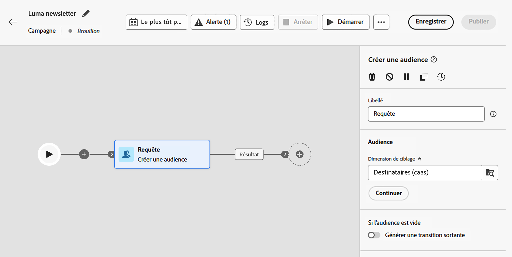
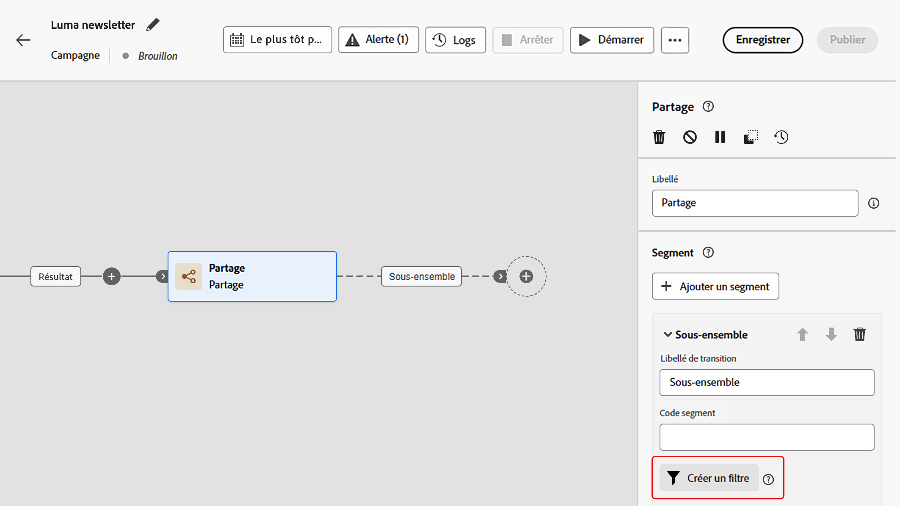
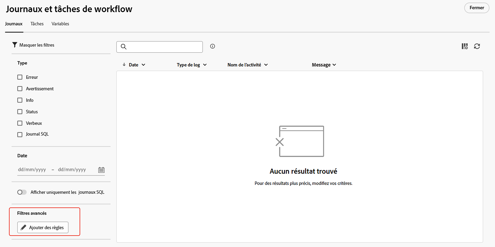
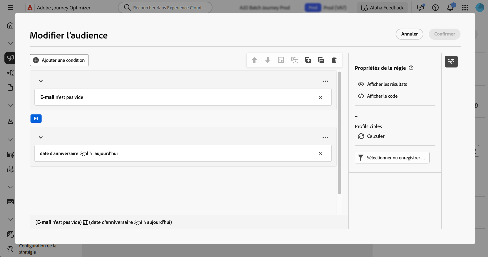

# Utiliser le créateur de règles {#orchestrated-rule-builder}

Les campagnes orchestrées s’accompagnent d’un créateur de règles qui simplifie le processus de filtrage de la base de données en fonction de divers critères. Le créateur de règles gère efficacement des requêtes très complexes et longues, offrant une flexibilité et une précision optimisées.

En outre, il prend en charge les filtres prédéfinis dans les conditions, ce qui vous permet d’affiner facilement vos requêtes tout en utilisant des expressions et des opérateurs avancés pour des stratégies complètes de segmentation et de ciblage d’audience.

## Accéder au créateur de règles {#access}

Le créateur de règles est disponible dans tout contexte où vous devez définir des règles pour filtrer les données.

| Utilisation | Exemple |
|  ---  |  ---  |
| **Créer des audiences** : indiquez la population à cibler dans vos campagnes orchestrées à l’aide de l’activité **[!UICONTROL Créer une audience]**, et créez facilement de nouvelles audiences adaptées à vos besoins. [Découvrir comment créer des audiences](../orchestrated/activities/build-audience.md) | {width="200" align="center" zoomable="yes"} |
| **Créer une condition dans la zone de travail de la campagne** : appliquez les règles de la zone de travail de la campagne à l’aide d’une activité **[!UICONTROL Partage]**, pour répondre à vos besoins spécifiques. [Découvrir comment utiliser l’activité Partage](../orchestrated/activities/split.md) | {width="200" align="center" zoomable="yes"} |
| **Créer des filtres avancés** : créez des règles pour filtrer les données affichées dans les listes, telles que les journaux de campagne ou les dimensions de ciblage. | {width="200" align="center" zoomable="yes"} |

## Interface du créateur de règles {#interface}

Le créateur de règles fournit une zone de travail centrale où vous pouvez créer votre requête, et un volet de propriétés fournissant des informations sur la règle.

* La **zone de travail centrale** est l’endroit où vous pouvez ajouter et combiner les différents composants pour créer votre règle. [Découvrir comment créer une règle](../orchestrated/build-query.md)

* Le volet **[!UICONTROL Propriétés de la règle]** fournit des informations sur votre règle. Il vous permet d’effectuer diverses opérations pour vérifier la règle et vous assurer qu’elle correspond à vos besoins.

  Ce volet s’affiche lors de la création d’une requête pour créer une audience. [Découvrir comment vérifier et valider votre requête](build-query.md#check-and-validate-your-query)

## Utiliser des filtres prédéfinis

Les filtres prédéfinis vous permettent de réutiliser des requêtes enregistrées dans le créateur de règles, y compris des versions avec des paramètres. Pour une présentation complète de l’enregistrement, de l’application et de la gestion des filtres prédéfinis, voir [&#x200B; Utilisation de filtres prédéfinis](predefined-filters.md).
