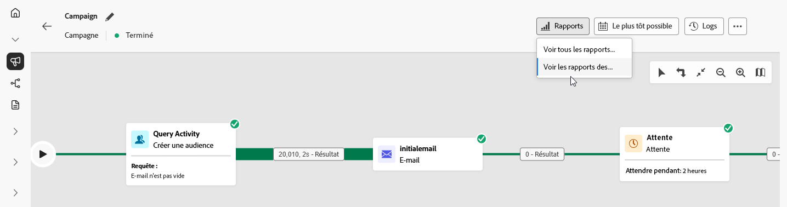
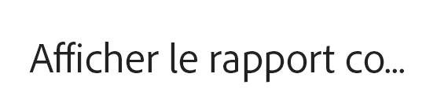

# Rapports de campagnes orchestrées {#report-campaigns}

Une campagne orchestrée vous fournit des informations exploitables grâce à ses puissantes fonctionnalités de reporting. Ces informations vous aident à mieux comprendre le comportement de l’audience, à mesurer les performances de chaque étape de votre parcours client et à prendre des décisions basées sur les données afin d’optimiser les campagnes futures. Grâce aux mesures et visualisations détaillées, vous pouvez suivre l’engagement et affiner vos stratégies de ciblage pour un impact maximal.

## Types de rapports {#reporting-types}

<table style="table-layout:auto; width: 100%; border-collapse: collapse;">
  <tbody>
    <tr>
      <td></td>
      <td>
        Utilisez le <b>rapport dynamique</b> pour mesurer et visualiser en temps réel l’impact et les performances de vos campagnes orchestrées dans un tableau de bord intégré. Les données sont disponibles dans le <b>rapport dynamique</b> dès que votre campagne orchestrée est exécutée dans le menu <b>Afficher le rapport des dernières 24 heures</b>. En savoir plus sur les rapports en temps réel dans <a href="../reports/live-report.md">cette section</a>.
      </td>
         
    </tr>
    <tr style="background-color: #FFFFFF;">
      <td></td>
      <td>
        Le <b>rapport complet</b> est entièrement intégré aux fonctionnalités de Customer Journey Analytics, permettant ainsi de normaliser le reporting sur les deux plateformes et d’améliorer la cohérence et la fiabilité des données. Découvrez les rapports complets dans <a href="../reports/report-gs-cja.md">cette section</a>.
      </td>
    </tr>
  </tbody>
</table>

## Découvrir les rapports de canal

<table style="table-layout:fixed"><tr style="border: 0; text-align: center;" >
<td> <a href="../reports/campaign-global-report-cja-email.md"><strong>Rapport sur les e-mails</strong></a></td>
<td> <a href="../reports/campaign-global-report-cja-sms.md"><strong>Rapport sur les SMS</strong></a></td>
<td><a href="../reports/campaign-global-report-cja-push.md"><strong>Rapport sur les notifications push</strong></a></td><td><a href="../reports/campaign-global-report-cja-direct.md"><strong>Rapport Courrier</strong></a></td>
</tr></table>

