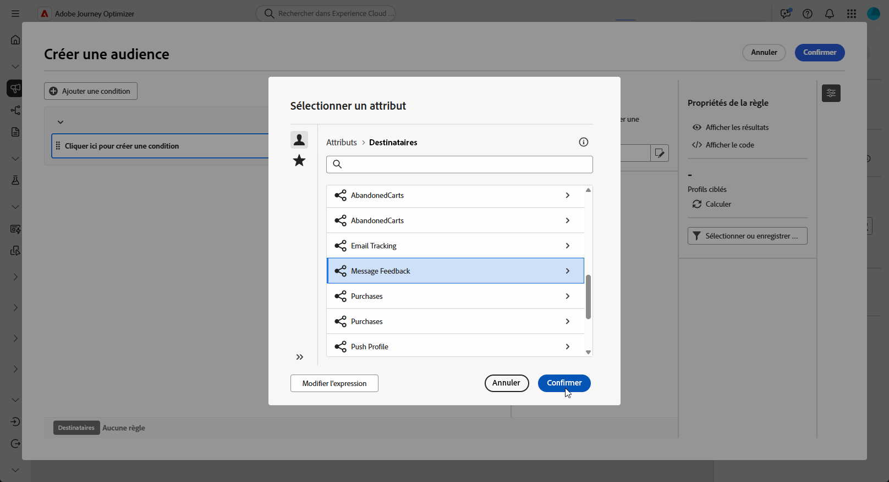
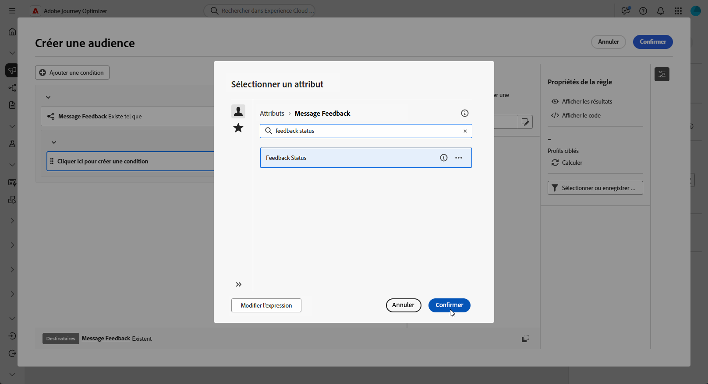
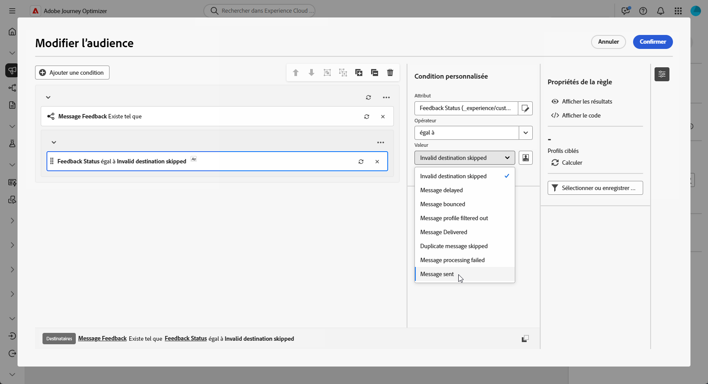
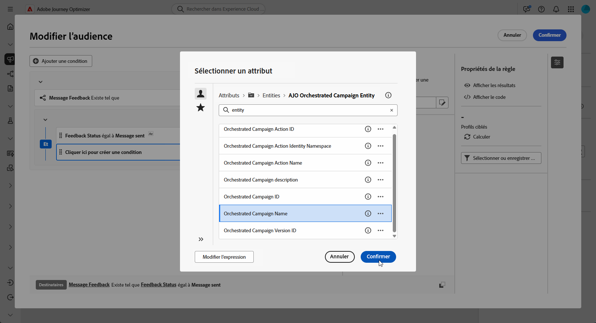
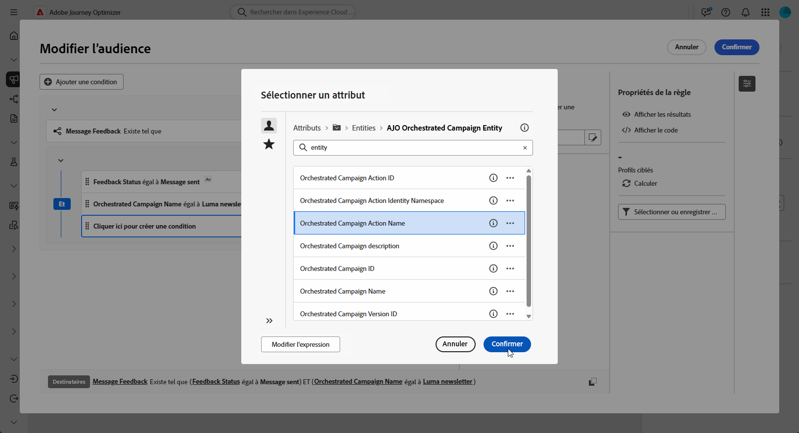
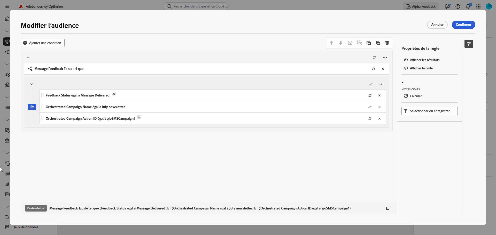
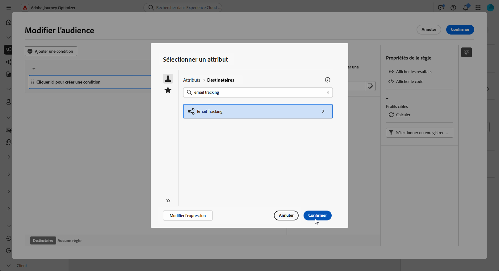
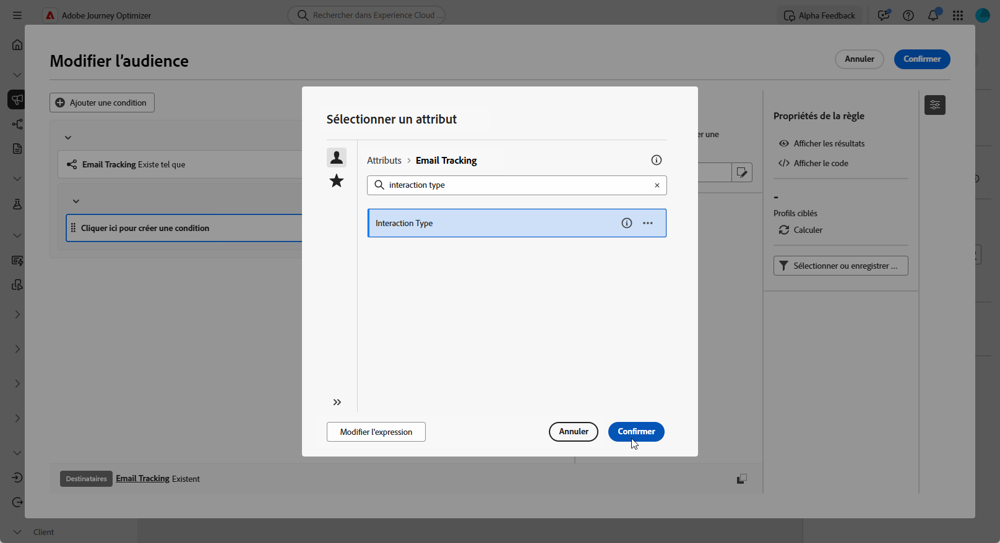
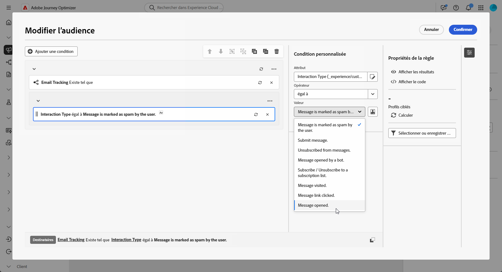
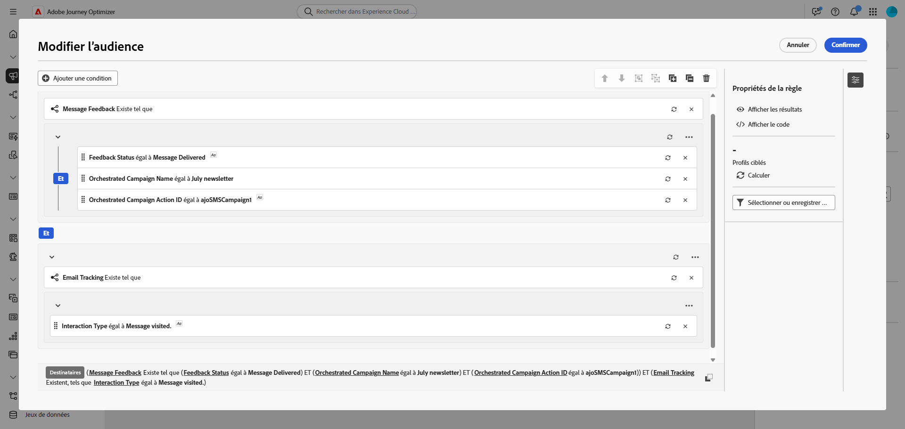

# Créer des requêtes de reciblage {#retarget}

Le reciblage permet de relancer les destinataires en fonction de leur réaction à une campagne orchestrée précédente. Par exemple, il est possible d’envoyer un deuxième e-mail aux destinataires qui ont reçu, mais n’ont pas cliqué sur le premier.

**[!UICONTROL Campagne orchestrée]** fournit deux schémas principaux pour cela :

* **[!UICONTROL Retour sur les messages]** : capture les événements liés à la diffusion, par exemple message envoyé, ouvert, rejeté, etc.
* **[!UICONTROL Suivi des e-mails]** : capture les actions de l’utilisateur ou de l’utilisatrice, par exemple clics et ouvertures.

{zoomable="yes"}

## Créer une règle de reciblage basée sur le retour {#feedback-retarget}

La règle de reciblage basée sur les retours permet de recibler les destinataires en fonction des événements de diffusion des messages capturés dans le schéma **[!UICONTROL Retours de message]**. Ces événements incluent des résultats tels que l’envoi, l’ouverture, le rejet ou le marquage des messages comme indésirables.

À l’aide de ces données, il est possible de définir des règles pour identifier les destinataires ayant reçu un message précédent, ce qui permet d’assurer une communication de suivi fondée sur des statuts de diffusion spécifiques.

1. Créer une nouvelle **[!UICONTROL campagne orchestrée]**.

1. Ajoutez une activité **[!UICONTROL Créer une audience]** et définissez la dimension de ciblage sur **[!UICONTROL Destinataire (caas)]**. Cliquez sur **[!UICONTROL Continuer]**.

1. Pour commencer rapidement, vous pouvez utiliser un filtre intégré **[!UICONTROL Commentaires sur la campagne]** pour cibler les destinataires en fonction des événements de diffusion des messages.

   +++ Guide détaillé

   1. Dans le **[!UICONTROL Créateur de règles]**, cliquez sur **[!UICONTROL Sélectionner ou enregistrer un filtre]** et choisissez **[!UICONTROL Commentaires sur la campagne]** dans la liste.

   1. Sélectionnez la règle de filtrage et choisissez le **[!UICONTROL Comportement]** que vous souhaitez cibler, tel que **[!UICONTROL Message envoyé]**.

   1. Cliquez sur  pour sélectionner la campagne spécifique à recibler. Vous disposez de deux options :

      * **[!UICONTROL Sélectionner une campagne spécifique]** : sélectionnez une campagne spécifique dans votre liste pour recibler les destinataires qui ont interagi avec cette campagne.

      * **[!UICONTROL Campagne à partir de la transition]** : référencez une campagne à partir d’une activité précédente dans votre campagne orchestrée.

   +++

1. Vous pouvez également créer manuellement des règles personnalisées. Dans le **[!UICONTROL Créateur de règles]**, cliquez sur **[!UICONTROL Ajouter une condition]** et sélectionnez **[!UICONTROL Retour sur les messages]** dans le **[!UICONTROL Sélecteur d’attributs]**. Cliquez sur **[!UICONTROL Confirmer]** pour créer une condition **Retour sur les messages existants**.

   {zoomable="yes"}

1. Choisissez l’attribut **[!UICONTROL Statut du retour]** pour cibler les événements de diffusion des messages.

   +++ Guide détaillé

   1. Ajoutez une autre condition liée à l’attribut **[!UICONTROL Retour sur les messages]**.

   1. Recherchez l’attribut **[!UICONTROL Statut du retour]** et cliquez sur **[!UICONTROL Confirmer]**.

      {zoomable="yes"}

   1. Dans le menu **[!UICONTROL Condition personnalisée]**, choisissez le statut de diffusion à suivre dans la liste déroulante **[!UICONTROL Valeur]**.

      {zoomable="yes"}

   +++

1. Choisissez l’attribut **[!UICONTROL Nom de la campagne orchestrée]** pour cibler une campagne orchestrée spécifique.

   +++ Guide détaillé

   1. Ajoutez une autre condition liée à l’attribut **[!UICONTROL Retour sur les messages]**, recherchez **[!UICONTROL Entité]** et accédez à :

      `_experience > CustomerJourneyManagement > Entities > AJO Orchestrated Campaign entity`.

   1. Sélectionnez **[!UICONTROL Nom de la campagne orchestrée]**.

      {zoomable="yes"}

   1. Dans le menu **[!UICONTROL Condition personnalisée]**, indiquez le nom de la campagne dans le champ **[!UICONTROL Valeur]**.

   +++

1. Sélectionnez l’attribut **[!UICONTROL Nom de l’action de campagne orchestrée]** pour cibler un message ou une activité spécifique dans une campagne orchestrée.

   +++ Guide détaillé

   1. Ajoutez une autre condition liée à l’attribut **[!UICONTROL Retour sur les messages]**, recherchez **[!UICONTROL Entité]** et accédez à :

      `_experience > CustomerJourneyManagement > Entities > AJO Orchestrated Campaign entity`.

   1. Sélectionnez **[!UICONTROL Nom de l’action de campagne orchestrée]**.

      {zoomable="yes"}

   1. Dans le menu **[!UICONTROL Condition personnalisée]**, indiquez le nom de l’action de campagne dans le champ **[!UICONTROL Valeur]**.

      Les noms d’action peuvent être consultés en cliquant sur  située à côté du champ Libellé de votre activité.

   +++

1. Vous pouvez également filtrer par l’**[!UICONTROL identifiant de campagne]** (UUID), que vous trouverez dans les propriétés de la campagne.

Vous avez maintenant configuré une règle de reciblage basée sur le retour afin d’identifier les destinataires en fonction du statut de diffusion d’un message précédent, tel qu’envoyé, ouvert, rejeté ou marqué comme indésirable. Avec cette audience définie, vous pouvez soit ajouter un e-mail de suivi, soit affiner davantage le ciblage en [configurant une règle de reciblage basée sur le suivi](#tracking-based), qui exploite les données d’interaction des utilisateurs ou des utilisatrices.

{zoomable="yes"}

## Créer une règle de reciblage basée sur le suivi {#tracking-based}

La règle de reciblage basé sur le tracking cible les destinataires en fonction de leurs interactions avec un message, à l&#39;aide des données du schéma **[!UICONTROL Suivi des emails]**. Elle capture les actions de l’utilisateur ou de l’utilisatrice, telles que les ouvertures d’e-mails et les clics sur les liens.

Pour recibler les destinataires en fonction des interactions sur les messages (par exemple ouverture ou clic), utilisez l’entité **[!UICONTROL Suivi des e-mails]** comme suit :

1. Créer une nouvelle **[!UICONTROL campagne orchestrée]**.

1. Ajoutez une activité **[!UICONTROL Créer une audience]** et définissez la dimension de ciblage sur **[!UICONTROL Destinataire]** afin de vous concentrer sur les destinataires des campagnes orchestrées précédentes.

1. Pour commencer rapidement, vous pouvez utiliser un filtre intégré **[!UICONTROL Commentaires sur la campagne]** pour cibler les destinataires en fonction des événements de diffusion des messages.

   +++ Guide détaillé

   1. Dans le **[!UICONTROL Créateur de règles]**, cliquez sur **[!UICONTROL Sélectionner ou enregistrer un filtre]** et choisissez **[!UICONTROL Commentaires sur la campagne]** dans la liste.

      {zoomable="yes"}

   1. Sélectionnez la règle de filtrage et choisissez le **[!UICONTROL Comportement]** à cibler, par exemple **[!UICONTROL Message ouvert]** ou **[!UICONTROL Message sur lequel l’utilisateur a cliqué]**.

      {zoomable="yes"}

   1. Cliquez sur  pour sélectionner la campagne spécifique à recibler. Vous disposez de deux options :

      * **[!UICONTROL Sélectionner une campagne spécifique]** : sélectionnez une campagne spécifique dans votre liste pour recibler les destinataires qui ont interagi avec cette campagne.

      * **[!UICONTROL Campagne à partir de la transition]** : référencez une campagne à partir d’une activité précédente dans votre campagne orchestrée.

   +++

1. Vous pouvez également créer manuellement des règles personnalisées. Dans le **[!UICONTROL créateur de règles]**, cliquez sur **[!UICONTROL Ajouter une condition]** et sélectionnez **[!UICONTROL Suivi des e-mails]** dans le **[!UICONTROL sélecteur d’attributs]**.

   Cliquez sur **[!UICONTROL Confirmer]** pour créer une condition **Suivi des e-mails existant**.

   {zoomable="yes"}

1. Pour cibler les interactions des destinataires avec un message, ajoutez une autre condition liée à l’attribut **[!UICONTROL Suivi des e-mails]** et recherchez l’attribut **[!UICONTROL Type d’interaction]**.

   {zoomable="yes"}

1. Dans les options de condition personnalisée, utilisez **[!UICONTROL Inclus dans]** comme opérateur et sélectionnez une ou plusieurs valeurs selon le cas d’utilisation, par exemple **[!UICONTROL Message ouvert]** ou **[!UICONTROL Message avec lien ayant fait l’objet d’un clic]**.

   {zoomable="yes"}

Vous avez maintenant configuré une règle de reciblage basée sur le suivi afin de cibler les destinataires en fonction de leurs interactions avec un message précédent, telles que les ouvertures d’e-mails ou les clics sur les liens, en utilisant les données de l’attribut **[!UICONTROL Suivi des e-mails]**. Une fois cette audience définie, vous pouvez soit ajouter une action de suivi, soit affiner davantage le ciblage en la combinant avec une [règle de reciblage basée sur le retour](#feedback-retarget) afin d’inclure des résultats de messages tels qu’envoyé, rejeté ou marqué comme indésirable.

{zoomable="yes"}
