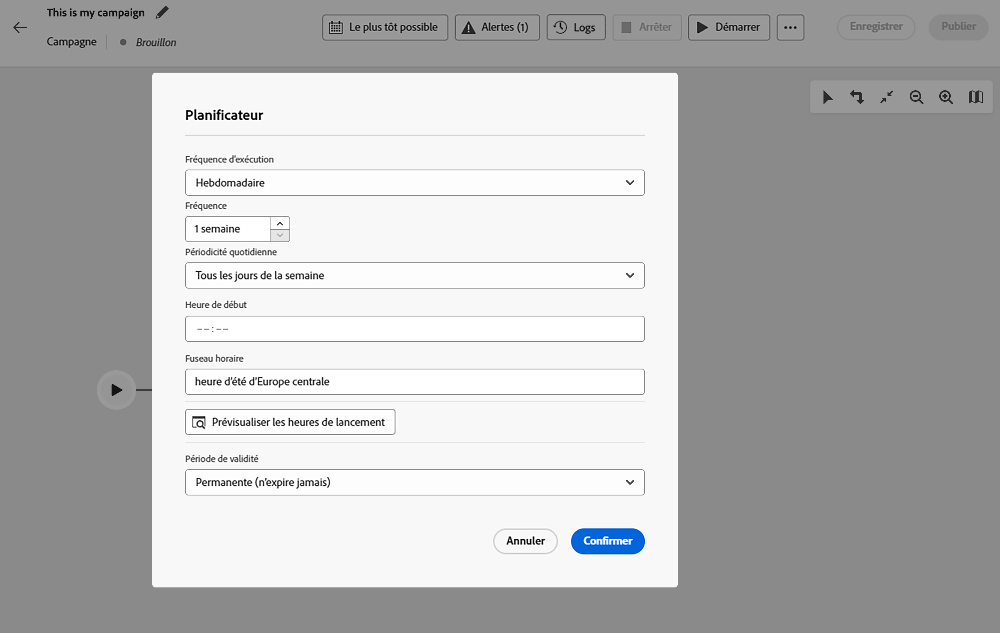
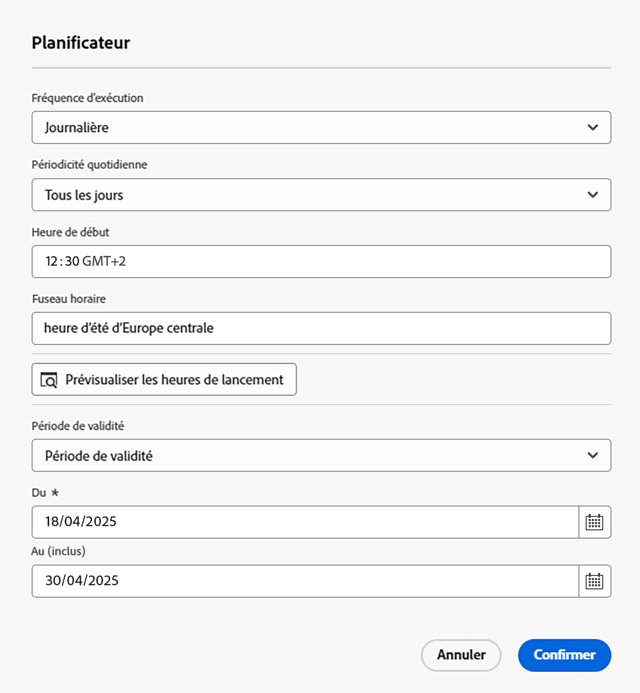
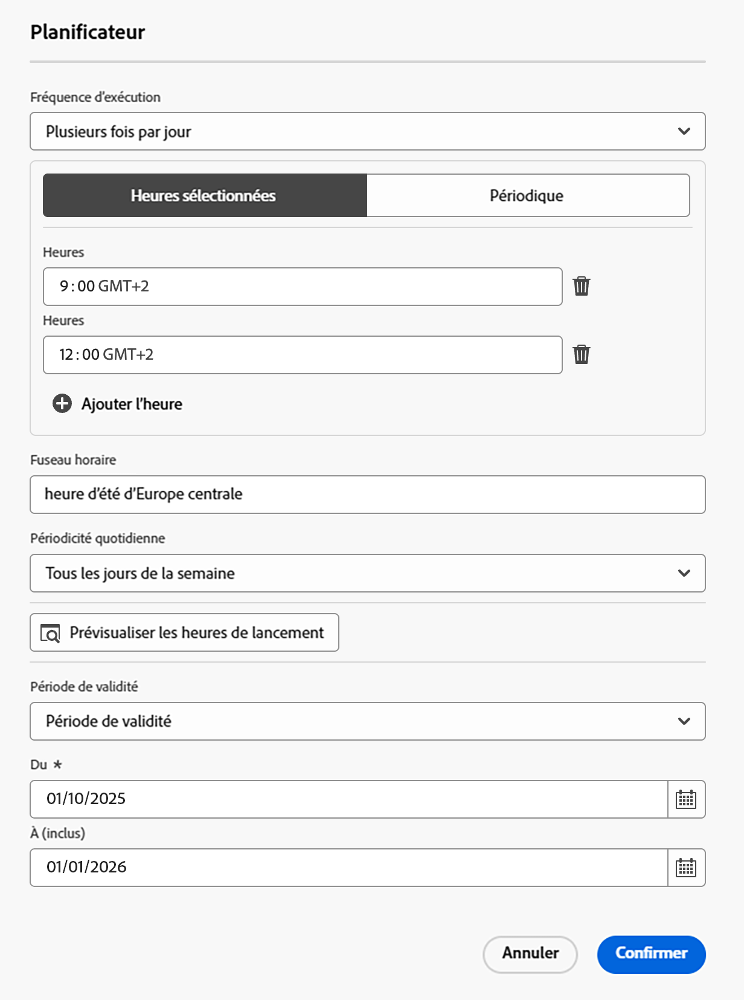

# Planifier et démarrer vos campagnes orchestrées {#start-monitor}

>[!CONTEXTUALHELP]
>id="ajo_campaign_publication"
>title="Publier une campagne orchestrée"
>abstract="Pour lancer votre campagne, vous devez la publier. Assurez-vous que tous les avertissements sont effacés avant la publication."

+++ Table des matières

| Bienvenue dans les campagnes orchestrées | Lancement de votre première campagne orchestrée | Interrogation de la base de données | Activités de campagnes orchestrées |
|---|---|---|---|
| [Prise en main des campagnes orchestrées](gs-orchestrated-campaigns.md)  [Étapes de configuration](configuration-steps.md)  [Étapes clés de la création de campagnes orchestrées](gs-campaign-creation.md) | [Créer une campagne orchestrée](create-orchestrated-campaign.md)  [Orchestrer des activités](orchestrate-activities.md)  [Envoyer des messages avec des campagnes orchestrées](send-messages.md)  <b>[Démarrer et surveiller la campagne](start-monitor-campaigns.md)</b>  [Reporting](reporting-campaigns.md) | [Utiliser le créateur de règles](orchestrated-rule-builder.md)  [Créer votre première requête](build-query.md)  [Modifier des expressions](edit-expressions.md) | [Prise en main des activités](activities/about-activities.md)  Activités: [Et-joindre](activities/and-join.md) - [Créer une audience](activities/build-audience.md) - [Modifier la dimension](activities/change-dimension.md) - [Combiner](activities/combine.md) - [Deduplication](activities/deduplication.md) - [Enrichissement](activities/enrichment.md) - [Fork](activities/fork.md) - [Reconciliation](activities/reconciliation.md) - [Split](activities/split.md) - [Wait](activities/wait.md) |

{style="table-layout:fixed"}

+++

 

Une fois que vous avez créé et conçu les tâches à effectuer dans la zone de travail, vous pouvez les publier et contrôler leur exécution.

## Planification de campagnes orchestrées {#schedule}

>[!CONTEXTUALHELP]
>id="ajo_orchestration_scheduler"
>title="Activité Planificateur"
>abstract="L’activité **Planificateur** vous permet de planifier le moment du démarrage de la campagne orchestrée. Cette activité est à considérer comme un démarrage planifié. Elle ne peut être utilisée que comme première activité de la campagne orchestrée."

En tant que responsable de campagne, vous pouvez planifier des campagnes pour les lancer automatiquement à des heures spécifiques, ce qui permet d’obtenir un timing précis et des données de ciblage précises pour les communications marketing.

### Bonnes pratiques {#scheduler-best-practices}

* Ne planifiez pas l’exécution d’une campagne orchestrée à une fréquence supérieure à toutes les 15 minutes, car cela peut nuire aux performances générales du système et créer des blocs dans la base de données.
* Si vous souhaitez envoyer un message ponctuel dans votre campagne orchestrée, vous pouvez le définir pour qu’il s’exécute **Une fois**.
* Si vous souhaitez envoyer un message récurrent dans votre campagne orchestrée, vous devez utiliser une option **Planification** et définir la fréquence d&#39;exécution. L’activité de diffusion récurrente ne permet pas de définir de planning.

### Configurer le planning de la campagne {#scheduler-configuration}

>[!CONTEXTUALHELP]
>id="ajo_orchestration_schedule_validity"
>title="Validité du planificateur"
>abstract="Vous pouvez définir une période de validité pour le planificateur. Elle peut être permanente (par défaut) ou valide jusqu’à une date spécifique."

>[!CONTEXTUALHELP]
>id="ajo_orchestration_schedule_options"
>title="Options du planificateur"
>abstract="Définissez la fréquence du planificateur. Il peut être exécuté à un moment précis, ou encore une ou plusieurs fois par jour, semaine ou mois."

Pour configurer le planning de la campagne **orchestrée**, procédez comme suit :

1. Sélectionnez le bouton **Dès que possible** en haut de la zone de travail de votre campagne orchestrée.

1. Configurez la **Fréquence d’exécution** :

   * **Une fois** : la campagne orchestrée est exécutée une seule fois.

   * **Quotidien** : la campagne orchestrée est exécutée à une heure spécifique, une fois par jour.

   * **Plusieurs fois par jour :** la campagne orchestrée est régulièrement exécutée plusieurs fois par jour. Vous pouvez configurer des exécutions à des heures et dates spécifiques ou périodiquement.

   * **Hebdomadaire** : la campagne orchestrée est exécutée à un moment précis, une ou plusieurs fois par semaine.

   * **Mensuel** : la campagne orchestrée est exécutée à un moment précis, une ou plusieurs fois par mois. Vous pouvez sélectionner les mois pendant lesquels la campagne orchestrée doit être exécutée. Vous pouvez également configurer des exécutions un jour de semaine spécifié du mois, comme le deuxième mardi du mois.

     {width="50%" align="left"}

1. Définissez les détails de l’exécution en fonction de la fréquence sélectionnée. Les champs de détail varient selon la fréquence utilisée (temps, fréquence de répétition, jours spécifiés, etc.).

1. Cliquez sur **Prévisualiser les heures de lancement** pour vérifier le planning des dix prochaines exécutions de votre campagne orchestrée.

1. Définissez la période de validité du planificateur :

   * **Permanent (n’expire jamais)** : la campagne orchestrée est exécutée, selon la fréquence spécifiée, sans limite de durée ni de nombre d’itérations.

   * **Période de validité** : la campagne orchestrée est exécutée selon la fréquence spécifiée, jusqu&#39;à une date spécifique. Vous devez spécifier les dates de début et de fin.

1. Sélectionnez **Confirmer** pour enregistrer vos paramètres. La fréquence d’exécution s’affiche au-dessus de la zone de travail de campagne orchestrée.

>[!TIP]
>
>Si vous souhaitez démarrer immédiatement la campagne orchestrée, conservez la valeur par défaut **Dès que possible**.

### Exemple {#scheduler-example}

Dans l’exemple suivant, l’activité est configurée de sorte que la campagne orchestrée s’exécute deux fois par jour à 9 h et à 12 h, tous les jours de la semaine du 1er octobre 2025 au 1er janvier 2026.

{width="50%" align="left"}

## Démarrer une campagne orchestrée {#start}

Pour démarrer une campagne orchestrée, accédez à l’onglet **[!UICONTROL Orchestration]** du menu **[!UICONTROL Campagnes]** et sélectionnez la campagne à démarrer, puis cliquez sur le bouton **[!UICONTROL Lecture]** dans le coin supérieur droit de la zone de travail.

Une fois la campagne orchestrée en cours d’exécution, chaque activité de la zone de travail est exécutée dans un ordre séquentiel, jusqu’à ce que la fin de la campagne orchestrée soit atteinte.

Vous pouvez suivre la progression des profils ciblés en temps réel à l’aide du flux visuel. Vous pouvez ainsi identifier rapidement le statut de chaque activité et le nombre de profils qu’elle contient.

{zoomable="yes"}

Dans les campagnes orchestrées, les données transportées d’une activité à une autre via des transitions sont stockées dans une table de travail temporaire. Ces données peuvent être affichées pour chaque transition. Pour cela, sélectionnez une transition pour ouvrir ses propriétés dans la partie droite de l’écran.

* Cliquez sur **[!UICONTROL Aperçu du schéma]** pour afficher le schéma de la table de travail.
* Cliquez sur **[!UICONTROL Aperçu des résultats]** pour visualiser les données véhiculées dans la transition sélectionnée.

{zoomable="yes"}

## Surveiller l’exécution de la campagne

### Surveiller l’exécution des activités {#activities}

Les indicateurs visuels situés dans le coin supérieur droit de chaque activité vous permettent de vérifier leur exécution :

| Indicateur visuel | Description |
|-----|------------|
| {zoomable="yes"}{width="70%"} | L’activité est en cours d’exécution. |
| {zoomable="yes"}{width="70%"} | L’activité nécessite votre attention. Vous devez, par exemple, confirmer l’envoi d’une diffusion ou prendre une mesure nécessaire. |
| {zoomable="yes"}{width="70%"} | L’activité a rencontré une erreur. Pour résoudre ce problème, ouvrez les journaux de campagne orchestrés pour plus d’informations. |
| {zoomable="yes"}{width="70%"} | L’activité a été exécutée correctement. |

### Surveiller les logs et les tâches {#logs-tasks}

>[!CONTEXTUALHELP]
>id="ajo_campaign_logs"
>title="Logs et tâches"
>abstract="L’écran **Logs et tâches** fournit un historique de l’exécution de la campagne orchestrée : il consigne toutes les actions de l’utilisateur ou de l’utilisatrice, ainsi que les erreurs rencontrées."

La surveillance des logs et des tâches est une étape essentielle pour analyser vos campagnes orchestrées et vérifier qu’elles s’exécutent correctement. Les logs sont accessibles à partir de l’icône **[!UICONTROL Logs]**, située dans la barre d’outils d’actions et dans le volet des propriétés de chaque activité.

Le menu **[!UICONTROL Logs et tâches]** fournit un historique de l’exécution de la campagne orchestrée, enregistrant toutes les actions des utilisateurs et utilisatrices ainsi que les erreurs rencontrées.

{zoomable="yes"}

Deux types d’informations sont disponibles :

* L’onglet **[!UICONTROL Log]** contient l’historique de l’exécution de toutes les activités de la campagne orchestrée. Il répertorie par ordre chronologique les opérations réalisées et les erreurs d’exécution.
* L’onglet **[!UICONTROL Tâches]** permet de voir le séquencement de l’exécution des activités.

Sous les deux onglets, vous pouvez choisir les colonnes à afficher et leur ordre, appliquer des filtres et trouver rapidement des informations à l’aide du champ de recherche.

## Commandes d’exécution de campagne orchestrées {#execution-commands}

La barre d’actions située dans le coin supérieur droit propose des commandes qui vous permettent de gérer l’exécution orchestrée de la campagne. Vous pouvez effectuer les actions suivantes :

* **[!UICONTROL Démarrer]** / **[!UICONTROL Reprendre]** l&#39;exécution de la   campagne orchestrée, qui adopte alors le statut En cours . Si la campagne orchestrée a été suspendue, elle est reprise, sinon elle est lancée et les activités initiales sont alors activées.

* **[!UICONTROL Pause]** l’exécution de la campagne orchestrée, qui adopte alors le statut En pause. Aucune nouvelle activité ne sera activée jusqu’à la prochaine reprise, mais les opérations en cours ne sont pas suspendues.

* **[!UICONTROL Arrêter]** une campagne orchestrée en cours d’exécution, qui adopte alors le statut Terminé. Les opérations en cours sont interrompues si possible. Vous ne pouvez pas reprendre à partir de la campagne orchestrée à l’endroit où elle a été arrêtée.
