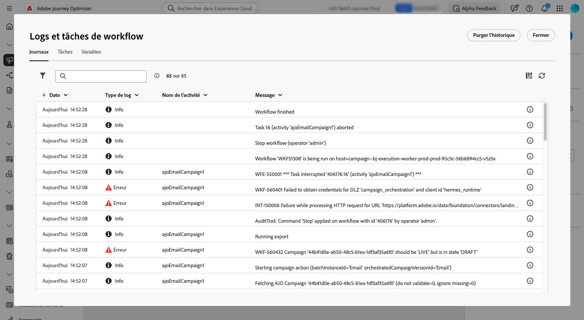

# Démarrer et surveiller vos campagnes orchestrées {#start-monitor}

>[!CONTEXTUALHELP]
>id="ajo_campaign_publication"
>title="Publier une campagne orchestrée"
>abstract="Pour lancer votre campagne, vous devez la publier. Assurez-vous que toutes les erreurs sont effacées avant la publication."

Une fois que vous avez créé votre campagne orchestrée et conçu les tâches à effectuer dans la zone de travail, vous pouvez la publier et surveiller son exécution. Vous pouvez également exécuter la campagne en mode test pour vérifier son exécution et le résultat des différentes activités.

## Tester votre campagne avant la publication {#test}

[!DNL Journey Optimizer] vous permet de tester les campagnes orchestrées avant leur mise en ligne. Lorsqu’une campagne est créée, elle passe par défaut à l’état **Brouillon**. Dans cet état, vous pouvez exécuter la campagne manuellement pour tester le flux.

>[!IMPORTANT]
>
>Toutes les activités de la zone de travail sont exécutées, à l’exception des activités **[!UICONTROL Enregistrer l’audience]** et des activités de canal. L’opération n’a aucun impact fonctionnel sur vos données ou votre audience.

Pour tester une campagne orchestrée, ouvrez la campagne et sélectionnez **[!UICONTROL Démarrer]**.

{zoomable="yes"}

Chaque activité de la campagne est exécutée de manière séquentielle jusqu’à la fin de la zone de travail. Lors du test, vous pouvez contrôler l’exécution de la campagne à l’aide de la barre d’actions de la zone de travail. Plusieurs possibilités sʼoffrent alors à vous :

* **Arrêtez** l’exécution à tout moment.
* **Démarrez** l’exécution à nouveau.
* **Redémarrer** l’exécution pour réinitialiser et réexécuter le workflow en une seule action. Cela s’avère particulièrement utile lorsque vous souhaitez tester à nouveau rapidement le flux de campagne après avoir apporté des modifications.
* **Reprenez** l’exécution si elle a été précédemment mise en pause.

L’icône **[!UICONTROL Alertes]** / **[!UICONTROL Avertissement]** de la barre d’outils de la zone de travail vous informe des problèmes, notamment des avertissements qui peuvent apparaître de manière proactive avant l’exécution et des erreurs qui se produisent pendant ou après l’exécution.

{zoomable="yes"}

Vous pouvez également identifier rapidement les activités ayant échoué à l’aide des [indicateurs visuels de statut](#activities) affichés directement sur chaque activité. Pour une résolution détaillée des problèmes, ouvrez les [journaux de la campagne](#logs-tasks) qui fournissent des informations détaillées sur l’erreur et son contexte.

Si vous avez ajouté des activités de canal dans la zone de travail, vous pouvez prévisualiser et tester le contenu de vos messages à l’aide du bouton **[!UICONTROL Simuler le contenu]**. [Découvrez comment utiliser les activités de canal](activities/channels.md)

Une fois validée, la campagne peut être publiée.

## Publier la campagne {#publish}

Une fois votre campagne testée et prête, cliquez sur **[!UICONTROL Publier]** pour la mettre en ligne.

{zoomable="yes"}

>[!NOTE]
>
>Si le bouton **[!UICONTROL Publier]** est désactivé (grisé), accédez aux journaux à partir de la barre d’actions et vérifiez les messages d’erreur. Toutes les erreurs doivent être corrigées avant de pouvoir publier une campagne.

Le flux visuel redémarre et les profils réels commencent à circuler dans le parcours en temps réel.

Si l’action de publication échoue (en raison d’un contenu de message manquant, par exemple), vous recevez un avertissement et vous devez résoudre le problème avant de réessayer. Une fois la publication réussie, la campagne commence à s’exécuter (immédiatement ou selon le planning), passe du statut **Brouillon** au statut **Actif** et devient « Lecture seule ».

## Confirmer l’envoi du message {#confirm-sending}

Par défaut, pour les campagnes orchestrées non récurrentes, la diffusion des messages est suspendue jusqu&#39;à ce que vous approuviez explicitement l&#39;envoi. Après avoir publié la campagne, confirmez la demande d’envoi à partir du volet des propriétés de l’activité de canal. Tant qu’elle n’est pas confirmée, l’activité du canal reste en attente et aucun message n’est envoyé.

Avant la publication, vous pouvez désactiver l’envoi de confirmation dans le volet des propriétés de l’activité de canal. Pour plus d’informations, voir [Confirmer l’envoi du message](activities/channels.md#confirm-message-sending).

## Surveiller l’exécution de la campagne {#monitor}

### Surveillance du flux visuel {#flow}

Lors de l’exécution (en mode test ou actif), le flux visuel montre comment les profils se déplacent dans le parcours en temps réel. Le nombre de profils qui passent d’une tâche à l’autre est affiché.

{zoomable="yes"}

Les données transportées d’une activité à l’autre via les transitions sont stockées dans une table de travail temporaire. Ces données peuvent être affichées pour chaque transition. Pour examiner les données transmises entre les activités :

1. Sélectionnez une transition.
1. Dans le volet des propriétés, cliquez sur **[!UICONTROL Prévisualiser le schéma]** pour afficher le schéma de la table de travail. Sélectionnez **[!UICONTROL Prévisualiser les résultats]** pour afficher les données transportées.

   {zoomable="yes"}

### Indicateurs d’exécution d’une activité {#activities}

Les indicateurs visuels de statut vous aident à déterminer les performances de chaque activité :

| Indicateur visuel | Description |
|-----|------------|
| {zoomable="yes"}{width="70%"} | L’activité est en cours d’exécution. |
| {zoomable="yes"}{width="70%"} | L’activité nécessite votre attention. Vous devez, par exemple, confirmer l’envoi d’une diffusion ou prendre une mesure nécessaire. |
| {zoomable="yes"}{width="70%"} | L’activité a rencontré une erreur. Pour résoudre ce problème, ouvrez les journaux de campagne orchestrés pour plus d’informations. |
| {zoomable="yes"}{width="70%"} | L’activité a été exécutée correctement. |

### Logs et tâches {#logs-tasks}

>[!CONTEXTUALHELP]
>id="ajo_campaign_logs"
>title="Logs et tâches"
>abstract="L’écran **Logs et tâches** fournit un historique de l’exécution de la campagne orchestrée, enregistrant toutes les actions des utilisateurs et utilisatrices ainsi que les erreurs rencontrées."

La surveillance des journaux et des tâches est une étape essentielle pour analyser vos campagnes orchestrées et vérifier qu’elles s’exécutent correctement. Les journaux et les tâches sont accessibles à partir du bouton **[!UICONTROL Journaux]**, disponible dans les modes Test et Active, dans la barre d’outils de la zone de travail.

{zoomable="yes"}

L’écran **[!UICONTROL Journaux et tâches]** fournit un historique complet de l’exécution de votre campagne : il consigne toutes les actions de l’utilisateur ou de l’utilisatrice, ainsi que les erreurs rencontrées.

{zoomable="yes"}

Deux types d’informations sont disponibles :

* L’onglet **[!UICONTROL Journal]** contient l’historique chronologique de toutes les opérations et erreurs.
* L’onglet **[!UICONTROL Tâches]** détaille la séquence d’exécution des activités, étape par étape.

Sous les deux onglets, vous pouvez choisir les colonnes à afficher et leur ordre, appliquer des filtres et trouver rapidement des informations à l’aide du champ de recherche.

## Étapes suivantes {#next}

Après avoir démarré la zone de travail de la campagne orchestrée, vous pouvez utiliser les fonctionnalités de création de rapports de Journey Optimizer pour obtenir des informations, telles que le comportement de l’audience et la mesure des performances de chaque étape de votre parcours client. [En savoir plus sur la création de rapports sur les campagnes orchestrées](../orchestrated/reporting-campaigns.md)
