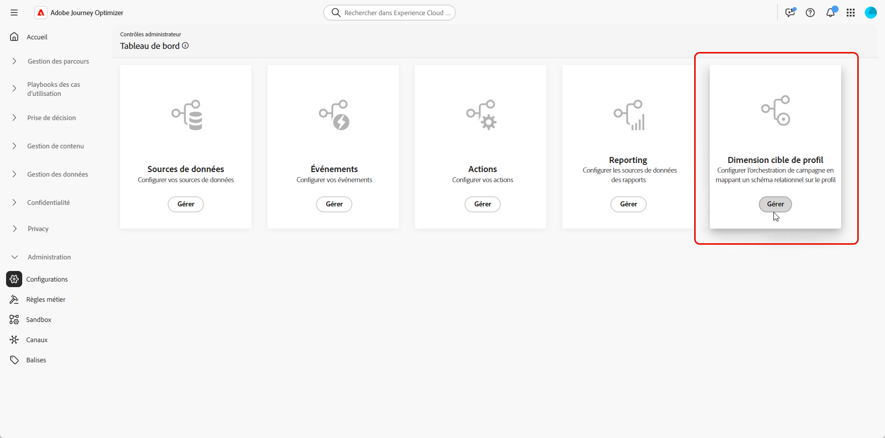
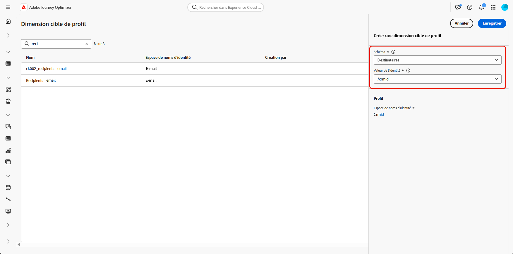

# Configurer une dimension de ciblage {#configuration}

Avec les **[!UICONTROL campagnes orchestrées]**, vous pouvez concevoir et diffuser des communications ciblées au niveau de l’entité, en tirant parti des fonctionnalités de schéma relationnel d’Adobe Experience Platform. Experience Platform utilise des schémas pour décrire la structure des données de manière cohérente et réutilisable. Lorsque des données sont ingérées dans Experience Platform, elles sont structurées en fonction d’un schéma XDM.

Bien que la segmentation pour les **[!UICONTROL campagnes orchestrées]** repose principalement sur des schémas relationnels, la diffusion réelle des messages s’effectue toujours au niveau du **Profil**.

Lors de la configuration du ciblage, vous devez définir deux aspects essentiels :

* **Schémas éligibles au ciblage**

  Vous spécifiez les schémas relationnels éligibles au ciblage. Par défaut, le schéma nommé `Recipient` est utilisé, mais vous pouvez configurer d’autres schémas tels que `Visitors`, `Customers`, etc.

  >[!IMPORTANT]
  >
  > Les campagnes orchestrées permettent le ciblage sur tout schéma ayant une relation directe ou connexe avec le schéma **Profil**. Bien que leur utilisation soit principalement destinée aux relations 1:1, elles prennent également en charge les relations 1:N, telles que Compte `>` Destinataires, tant que le chemin de la relation est correctement modélisé dans le modèle de données. Cela permet un ciblage basé sur les données au niveau du compte tout en résolvant l’identité de profil correcte pour la diffusion des messages.

* **Lien de profil**

  Le système doit comprendre comment le schéma cible est mappé au schéma `Profile`. Pour ce faire, un champ d’identité partagé, qui existe à la fois dans le schéma cible et dans le schéma `Profile`, est configuré comme un espace de noms d’identité.

➡️ [Pour en savoir plus sur les schémas relationnels, consultez la documentation d’Adobe Experience Platform](https://experienceleague.adobe.com/fr/docs/experience-platform/xdm/schema/relational#how-relational-schemas-differ-from-standard-xdm-schemas).

## Créer une dimension de ciblage {#targeting-dimension}

Commencez par configurer l’orchestration de campagne en mappant un schéma relationnel sur le profil client.

1. Dans **[!UICONTROL Administration]**, accédez au menu **[!UICONTROL Configurations]** et sélectionnez **[!UICONTROL Dimension de ciblage de campagne]**.

   

1. Cliquez sur **[!UICONTROL Créer]** pour commencer à créer la **[!UICONTROL dimension de ciblage]**.

1. Sélectionnez le [schéma précédemment configuré](gs-schemas.md) dans la liste déroulante.

   Bien que tous les schémas relationnels soient affichés, seuls ceux ayant une relation d’identité directe avec le **profil** sont éligibles à la sélection. Évitez de choisir des schémas qui ne concernent pas des personnes, par exemple des achats, et sélectionnez un schéma directement associé à un profil.

1. Sélectionnez la **[!UICONTROL valeur d’identité]** qui représente l’entité à cibler.

   Dans cet exemple, le profil client est lié à plusieurs abonnements, chacun étant représenté par un `crmID` unique dans le schéma `Recipient`. En définissant la **[!UICONTROL Dimension cible]** pour utiliser le schéma `Recipient` et son identité `crmID`, vous pouvez envoyer des messages au niveau de l’abonnement, plutôt qu’au niveau du profil client principal, en vous assurant que chaque contrat ou ligne reçoit son propre message personnalisé.

   [En savoir plus dans la documentation d’Adobe Experience Platform](https://experienceleague.adobe.com/fr/docs/experience-platform/xdm/schema/composition#identity)

   

1. Cliquez sur **[!UICONTROL Enregistrer]** pour terminer la configuration. Notez qu’une fois créée, une **[!UICONTROL dimension cible]** ne peut pas être supprimée ni modifiée.

Après avoir configuré la **[!UICONTROL Dimension cible]**, procédez à la création et à la configuration de votre **[!UICONTROL Configuration de canal]** et définissez les **[!UICONTROL Détails d’exécution]** correspondants.