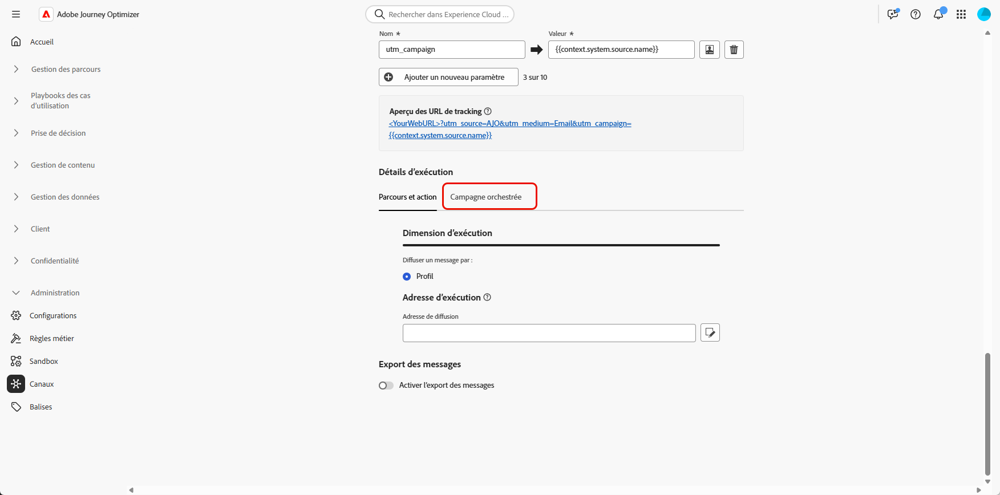
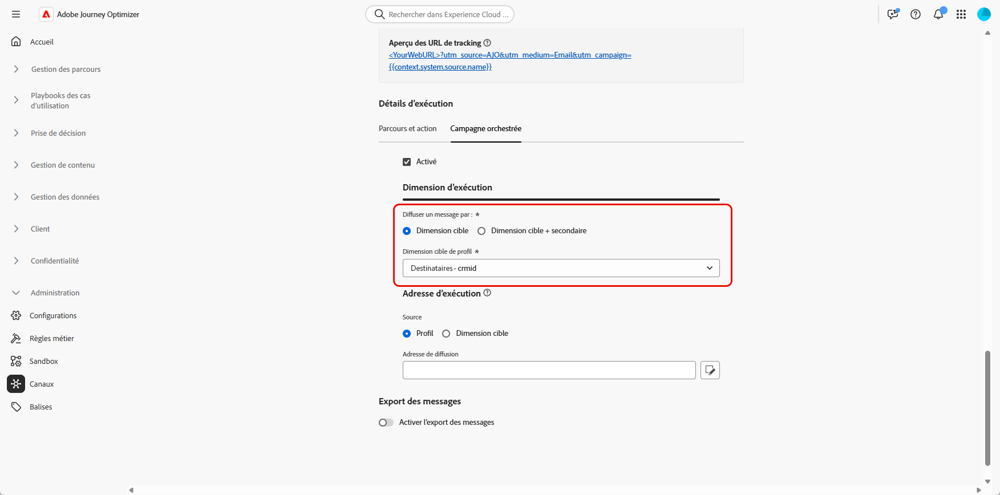

# Configurer une dimension de ciblage {#configuration}

Avec les **[!UICONTROL campagnes orchestrées]**, vous pouvez concevoir et diffuser des communications ciblées au niveau de l’entité, en tirant parti des fonctionnalités de schéma relationnel d’Adobe Experience Platform. Experience Platform utilise des schémas pour décrire la structure des données de manière cohérente et réutilisable. Lorsque des données sont ingérées dans Experience Platform, elles sont structurées en fonction d’un schéma XDM.

Bien que la segmentation pour les **[!UICONTROL campagnes orchestrées]** repose principalement sur des schémas relationnels, la diffusion réelle des messages s’effectue toujours au niveau du **Profil**.

Lors de la configuration du ciblage, vous devez définir deux aspects essentiels :

* **Schémas éligibles au ciblage**

  Vous spécifiez les schémas relationnels éligibles au ciblage. Par défaut, le schéma nommé `Recipient` est utilisé, mais vous pouvez configurer d’autres schémas tels que `Visitors`, `Customers`, etc.

  >[!IMPORTANT]
  >
  > Le schéma cible doit avoir une relation 1:1 avec le schéma `Profile`. Par exemple, il n’est pas possible d’utiliser `Purchases` comme schéma cible, car il représente généralement une relation un-à-multiple.

* **Lien de profil**

  Le système doit comprendre comment le schéma cible est mappé au schéma `Profile`. Pour ce faire, un champ d’identité partagé, qui existe à la fois dans le schéma cible et dans le schéma `Profile`, est configuré comme un espace de noms d’identité.

## Créer une dimension de ciblage {#targeting-dimension}

Commencez par configurer l’orchestration de campagne en mappant un schéma relationnel sur le profil client.

1. Dans **[!UICONTROL Administration]**, accédez au menu **[!UICONTROL Configurations]** et sélectionnez **[!UICONTROL Dimension de ciblage de campagne]**.

   

1. Cliquez sur **[!UICONTROL Créer]** pour commencer à créer la **[!UICONTROL dimension de ciblage]**.

1. Sélectionnez le [schéma précédemment configuré](gs-schemas.md) dans la liste déroulante.

   Bien que tous les schémas relationnels soient visibles, seuls les schémas ayant une relation d’identité directe avec le **Profil** sont éligibles à la sélection.

1. Sélectionnez la **[!UICONTROL valeur d’identité]** qui représente l’entité à cibler.

   Dans cet exemple, le profil client est lié à plusieurs abonnements, chacun étant représenté par un `crmID` unique dans le schéma `Recipient`. En définissant la **[!UICONTROL Dimension cible]** pour utiliser le schéma `Recipient` et son identité `crmID`, vous pouvez envoyer des messages au niveau de l’abonnement, plutôt qu’au niveau du profil client principal, en vous assurant que chaque contrat ou ligne reçoit son propre message personnalisé.

   [En savoir plus dans la documentation d’Adobe Experience Platform](https://experienceleague.adobe.com/fr/docs/experience-platform/xdm/schema/composition#identity)

   

1. Cliquez sur **[!UICONTROL Enregistrer]** pour terminer la configuration. Notez qu’une fois créée, une **[!UICONTROL dimension cible]** ne peut pas être supprimée ni modifiée.

Après avoir configuré la **[!UICONTROL Dimension cible]**, procédez à la création et à la configuration de votre **[!UICONTROL Configuration de canal]** et définissez les **[!UICONTROL Détails d’exécution]** correspondants.

## Configurer votre configuration de canal {#channel-configuration}

Après avoir configuré votre **[!UICONTROL Dimension Target]**, vous devez configurer votre **[!UICONTROL Configuration du canal]** et définir les **[!UICONTROL Détails d’exécution]** appropriés. Vous pouvez ainsi définir :

* **Le niveau de diffusion des messages** : par exemple, l’envoi d’un message par destinataire, comme un e-mail unique par personne.

* **L’adresse d’exécution** : le champ de contact spécifique à utiliser pour l’envoi, comme une adresse e-mail ou un numéro de téléphone.

Pour configurer la configuration de canal :

1. Commencez par créer et configurer la **[!UICONTROL configuration de canal]**.

   Il est également possible de mettre à jour une **[!UICONTROL configuration de canal]** existante.

   ➡️[Suivez les étapes décrites dans cette page](../email/surface-personalization.md)

1. Dans la section **[!UICONTROL Détails d’exécution]** de la **[!UICONTROL configuration de canal]**, accédez à l’onglet **[!UICONTROL Campagnes orchestrées]**.

   

1. Cliquez sur **[!UICONTROL Activé]** pour le rendre compatible avec les campagnes orchestrées.

1. Choisissez votre méthode de diffusion :

   * **[!UICONTROL Dimension cible]** : envoi à l’entité principale, par ex. destinataire.

   * **[!UICONTROL Dimension cible + dimension secondaire]** : envoi en utilisant l’entité principale et l’entité secondaire, par ex. destinataire + contrat.

1. Dans la liste déroulante, sélectionnez votre [dimension cible précédemment créée](#targeting-dimension).

   

1. Si vous avez sélectionné **[!UICONTROL Dimension cible + dimension secondaire]** comme méthode de diffusion, choisissez une **[!UICONTROL Dimension secondaire]** pour définir le contexte de diffusion des messages.

1. Dans la section **[!UICONTROL Adresse d’exécution]**, choisissez quelle **[!UICONTROL source]** doit être utilisée pour récupérer l’adresse de diffusion, comme l’adresse e-mail ou le numéro de téléphone.

   * **[!UICONTROL Profil]** : sélectionnez cette option si l’adresse de diffusion, par exemple l’adresse e-mail, est stockée directement dans le profil client principal.

     Utile lors de l’envoi de messages au client ou à la cliente principal(e), et non à une entité associée spécifique.

   * **[!UICONTROL Dimension cible]** : choisissez cette option si l’adresse de diffusion est stockée dans l’entité principale, par exemple un destinataire.

     Utile lorsque chaque destinataire possède sa propre adresse de diffusion, comme une adresse e-mail ou un numéro de téléphone différent.

   * **[!UICONTROL Dimension secondaire]** : lorsque vous utilisez **[!UICONTROL Dimension cible + dimension secondaire]** comme méthode de diffusion, sélectionnez la **[!UICONTROL dimension secondaire]** correspondante déjà configurée.

     Par exemple, si la dimension secondaire représente une réservation ou un abonnement, l’adresse d’exécution, telle qu’une adresse e-mail, peut être récupérée à partir de ce niveau. Cela s’avère utile lorsque les profils utilisent des coordonnées différentes lors de la réservation ou de l’abonnement à un service.

1. Dans le champ **[!UICONTROL Adresse de diffusion]**, cliquez sur  pour choisir le champ spécifique à utiliser pour votre diffusion de messages.

   

1. Une fois la configuration effectuée, cliquez sur **[!UICONTROL Envoyer]**.

Votre canal est maintenant prêt à être utilisé avec les **campagnes orchestrées**, et les messages seront diffusés en fonction de la dimension cible sélectionnée.
