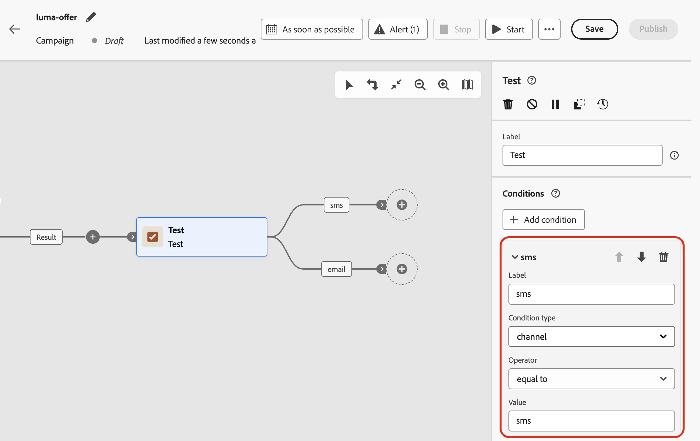

# Utilisation de variables dans des campagnes orchestrées {#variables-oc}

## Définition de variables {#set}

Dans une campagne orchestrée, vous pouvez utiliser des variables, c’est-à-dire des valeurs qui pilotent le ciblage, les conditions **[!UICONTROL Test]** et d’autres logiques de zone de travail. Ces valeurs peuvent provenir de deux endroits :

* **Un signal** — Si le planning de la campagne est **[!UICONTROL Déclenché par un signal]**, vous pouvez transmettre des paramètres lorsque vous déclenchez la campagne. Ces paramètres sont disponibles en tant que variables dans la campagne orchestrée déclenchée pour cette exécution. [Découvrez comment déclencher une campagne orchestrée à l’aide d’un signal](trigger-orchestrated-campaign.md)

* **Variables globales** — Vous pouvez définir des paires nom-valeur directement dans la campagne à l&#39;aide du menu **[!UICONTROL Modifier les variables]**, sans API ni signal requis. [Découvrez comment définir des variables globales dans des campagnes orchestrées](global-variables.md)

>[!NOTE]
>
>Pour l’instant, les variables ne prennent en charge que les valeurs **texte**.
>
>Les variables pilotent **logique de zone de travail** (règles, conditions) et ne peuvent pas être utilisées pour la personnalisation des messages.

## Utilisation de variables dans la zone de travail {#use}

Les variables sont disponibles aux emplacements suivants sur la zone de travail :

* **Créateur de règles** — Ouvrez l’éditeur d’expression d’une règle et utilisez le sélecteur **variables d’événement** pour sélectionner une variable et insérer sa référence dans votre expression. [Découvrir comment modifier des expressions](edit-expressions.md)

  Dans l’exemple ci-dessous, une variable nommée `brand` a été transmise et la règle l’utilise comme condition de filtre.

  {zoomable="yes"}

* **[!UICONTROL Test] activité** — Lorsque vous définissez une condition, la liste déroulante **[!UICONTROL Type de condition]** répertorie toutes les variables de la portée avec **[!UICONTROL Nombre de populations]**. Sélectionnez une variable pour l’utiliser comme base pour une branche de test. [Découvrez comment configurer l’activité **[!UICONTROL Test]**](activities/test.md)

  Dans l’exemple ci-dessous, la variable `channel` est utilisée pour acheminer le flux vers différentes transitions en fonction de sa valeur.

  {zoomable="yes"}
