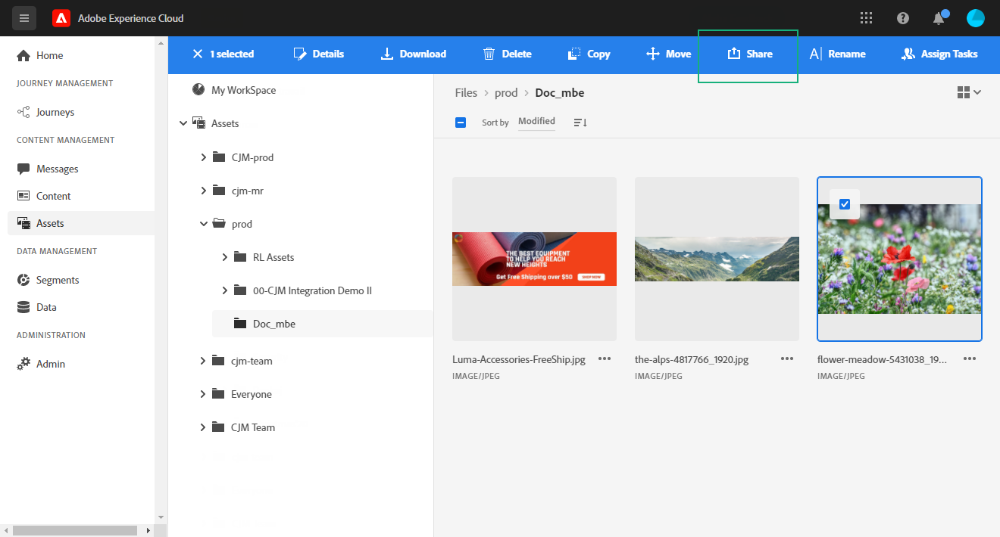

# Gestion des autorisations {#manage-permissions}

## Accès à Journey Optimizer {#access-CJM}

[!DNL Journey Optimizer] permet d’affecter un ensemble d’autorisations aux utilisateurs afin de définir la partie de l’interface à laquelle ils ont accès.

Les autorisations peuvent être gérées par des administrateurs qui ont accès à Admin Console. [En savoir plus sur Adobe Admin Console](https://helpx.adobe.com/fr/enterprise/managing/user-guide.html).

Pour pouvoir accéder à [!DNL Journey Optimizer], un utilisateur doit :

* faire partie d’un **[!UICONTROL profil de produit]** [!DNL Journey Optimizer] associé aux autorisations de [!DNL Journey Optimizer] ;

* faire partie d’un [!DNL Adobe Experience Platform] **[!UICONTROL profil de produit]**. Aucune autorisation n’est demandée. L’utilisateur doit disposer de l’autorisation de **[!UICONTROL gestion des profils]** pour pouvoir créer et modifier des segments de plateforme à partir de l’interface de [!DNL Journey Optimizer]. [En savoir plus sur le contrôle d’accès](https://experienceleague.adobe.com/docs/experience-platform/access-control/home.html?lang=fr#adobe-admin-console).

Admin Console permet d’attribuer aux utilisateurs l’un des profils de produit par défaut suivants :

* **[!UICONTROL Utilisateur à accès limité]** : utilisateur disposant d’un accès en lecture seule aux parcours et aux rapports. Ce profil de produit comprend les autorisations suivantes :
   * Lire les parcours
   * Lire les rapports

* **[!UICONTROL Administrateur]** : utilisateur ayant accès aux menus d’administration avec la possibilité de gérer les parcours, les événements et les rapports. Ce profil de produit comprend les autorisations suivantes :
   * Gérer les parcours
   * Publier les parcours
   * Gérer les événements, les sources de données et les actions
   * Gérer les rapports

* **[!UICONTROL Utilisateur standard]** : utilisateur disposant d’un accès de base, tel que la gestion des parcours. Ce profil de produit comprend les autorisations suivantes :
   * Gérer les parcours
   * Publier les parcours
   * Gérer les rapports
   * Lire les événements, les sources de données et les actions

Vous pouvez également créer vos propres profils de produit si les profils par défaut ne suffisent pas pour gérer vos utilisateurs.
Les utilisateurs doivent toujours être liés à un profil de produit, ce qui vous permet de leur attribuer des autorisations intégrées spécifiques, telles que :

* **[!UICONTROL Lire les parcours]**
* **[!UICONTROL Lire les rapports]**
* **[!UICONTROL Gérer les événements, les sources de données et les actions]**
* **[!UICONTROL Lire les événements, les sources de données et les actions]**
* **[!UICONTROL Gérer les parcours]**
* **[!UICONTROL Publier les parcours]**
* **[!UICONTROL Gérer les rapports]**

>[!NOTE]
>
> La gestion des autorisations n’inclut pas les messages : chaque utilisateur peut créer ou modifier des messages.

### Création d’un profil de produit {#create-product-profile}

[!DNL Journey Optimizer] vous permet de créer vos propres profils de produit et d’attribuer un ensemble de droits et d’environnements Sandbox à vos utilisateurs. Avec les profils de produit, vous pouvez autoriser ou refuser l’accès à certaines fonctionnalités ou à certains objets de l’interface.

Pour plus d’informations sur la création et la gestion des environnements Sandbox, consultez la [documentation d’Adobe Experience Platform](https://experienceleague.adobe.com/docs/experience-platform/sandbox/ui/user-guide.html?lang=fr).

Pour créer un profil de produit et attribuer un ensemble d’autorisations et d’environnements Sandbox :

1. Sélectionnez **[!UICONTROL Journey Orchestration]** dans Admin console. Dans l’onglet **[!UICONTROL Profil produit]**, cliquez sur **[!UICONTROL Nouveau profil]**.

   

1. Ajoutez un **[!UICONTROL nom de profil]** et une **[!UICONTROL description]** à votre nouveau profil de produit. Si vous souhaitez que le **[!UICONTROL nom d’affichage]** du profil soit différent, désélectionnez **[!UICONTROL Identique au nom de profil]** et saisissez le **[!UICONTROL nom voulu]**.

1. Dans la catégorie **[!UICONTROL Notifications utilisateur]**, indiquez si les utilisateurs seront avertis par e-mail lorsqu’ils seront ajoutés ou supprimés de ce profil de produit.

1. Lorsque vous avez terminé, cliquez sur **[!UICONTROL Terminé]**. Votre nouveau profil de produit est maintenant créé.

   

1. Sélectionnez votre nouveau profil de produit pour commencer à gérer les autorisations. Dans l’onglet **[!UICONTROL Utilisateurs]**, ajoutez des utilisateurs à votre profil de produit. [Découvrez comment attribuer un profil de produit](permissions.md#assigning-product-profile).

1. Procédez comme décrit ci-dessus pour ajouter la catégorie **[!UICONTROL Administrateur]** à votre profil de produit.

1. Dans l’onglet **[!UICONTROL Autorisations]**, sélectionnez l’une des deux catégories **[!UICONTROL Sandbox]** ou **[!UICONTROL Création]** pour ouvrir la page **[!UICONTROL Modifier les autorisations]** et ajouter ou supprimer des autorisations pour votre profil de produit.

   

1. Dans la catégorie d’autorisation **[!UICONTROL Sandbox]**, sélectionnez un ou plusieurs environnements Sandbox à affecter à votre profil de produit. Dans **[!UICONTROL Éléments d’autorisations disponibles]**, cliquez sur l’icône plus (+) pour affecter des environnements Sandbox à votre profil. [En savoir plus sur les environnements Sandbox](https://experienceleague.adobe.com/docs/experience-platform/sandbox/home.html?lang=fr).

   

1. Si nécessaire, dans **[!UICONTROL Éléments d’autorisations disponibles]**, cliquez sur l’icône X la plus proche pour supprimer les autorisations de votre profil de produit.

   

1. Dans la catégorie d’autorisation **[!UICONTROL Création]**, procédez comme indiqué ci-dessus pour ajouter des droits à votre profil de produit.

   

1. Lorsque vous avez terminé, cliquez sur **[!UICONTROL Enregistrer]**.

Votre profil de produit est maintenant créé et configuré. Les utilisateurs liés à ce profil peuvent désormais se connecter à [!DNL Journey Optimizer].

### Attribution d’un profil de produit {#assigning-product-profile}

Les profils de produit sont attribués à un ensemble d’utilisateurs qui partagent les mêmes autorisations au sein de votre entreprise.
Vous trouverez dans cette section la liste de tous les profils de produit par défaut auxquels des autorisations sont associées.

Pour attribuer un profil de produit à un utilisateur afin qu’il puisse accéder aux parcours :

1. Sélectionnez **[!UICONTROL Journey Orchestration]** dans Admin console.

   

1. Sélectionnez le profil de produit auquel votre nouvel utilisateur sera associé.

   

1. Cliquez sur **[!UICONTROL Ajouter un utilisateur]**.

   Vous pouvez également ajouter votre nouvel utilisateur à un groupe d’utilisateurs pour parfaire l’ensemble d’autorisations partagé. [En savoir plus sur les groupes d’utilisateurs](https://helpx.adobe.com/fr/enterprise/using/user-groups.html).

   

1. Saisissez l’adresse email du nouvel utilisateur, puis cliquez sur **[!UICONTROL Enregistrer]**.

   

L’utilisateur doit alors recevoir un email le redirigeant vers votre instance.

## Utilisation des environnements Sandbox {#sandboxes}

[!DNL Journey Optimizer] vous permet de partitionner votre instance en environnements virtuels séparés appelés Sandbox.
Les environnements Sandbox sont affectés par le biais des profils de produit dans Admin console. [Découvrez comment affecter des environnements Sandbox](permissions.md#create-product-profile).

[!DNL Journey Optimizer] reflète les environnements Sandbox Adobe Experience Platform qui ont été créés pour une organisation donnée.
Vous pouvez créer ou réinitialiser des environnements Sandbox Adobe Experience Platform à partir de votre instance Adobe Experience Platform. [Pour en savoir plus, consultez le guide d’utilisation des environnements Sandbox](https://experienceleague.adobe.com/docs/experience-platform/sandbox/ui/user-guide.html?lang=fr).

La commande de sélecteur des environnements Sandbox se trouve dans la partie supérieure gauche de votre écran. Pour passer d’un environnement Sandbox à un autre, cliquez sur l’environnement Sandbox actif dans le sélecteur et sélectionnez-en un autre dans la liste déroulante.

## Accès au contenu {#content-access}

Pour configurer l’accessibilité de votre contenu, vous devez affecter un dossier de contenu partagé à chacun de vos environnements Sandbox. Vous pouvez créer et configurer votre dossier partagé dans l’onglet **[!UICONTROL Stockage]** affiché dans [!DNL Admin Console] pour les administrateurs. Si vous avez accès à [!DNL Admin Console] en tant qu’administrateur système, vous pouvez créer des dossiers partagés et ajouter des délégués ayant un niveau d’accès différent à ceux-ci.

Notez que pour que votre contenu soit synchronisé avec l’environnement Sandbox correct, vous devez suivre la même syntaxe que cet environnement. Par exemple, si votre environnement Sandbox est appelé développement, votre dossier partagé doit porter le même nom.

[Découvrez comment gérer les dossiers partagés](https://helpx.adobe.com/fr/enterprise/admin-guide.html/enterprise/using/manage-adobe-storage.ug.html) .

## Autorisations Assets Essentials {#assets-permissions}

Adobe Experience Manager Assets Essentials fournit un référentiel de ressources unique et centralisé que vous pouvez utiliser pour renseigner vos messages.
Chaque ressource est enregistrée dans des dossiers ou des sous-dossiers. Vous pouvez choisir de partager vos dossiers et le niveau d’accès à affecter.

1. Dans l’onglet **[!UICONTROL Ressources]**, parcourez vos dossiers pour trouver celui que vous devez partager.

1. Sélectionnez votre dossier ou votre ressource et cliquez sur **[!UICONTROL Partager]**.

   

1. Saisissez l’adresse email de la personne avec laquelle vous souhaitez partager l’accès à votre dossier.

1. Choisissez entre les différents niveaux d’accès :

   * **[!UICONTROL Peut afficher]**
   * **[!UICONTROL Peut modifier]**
   * **[!UICONTROL Est propriétaire (peut partager, modifier et supprimer)]**

   

1. Si nécessaire, ajoutez un message à votre invitation.

1. Cliquez sur **[!UICONTROL Inviter]**.

   
