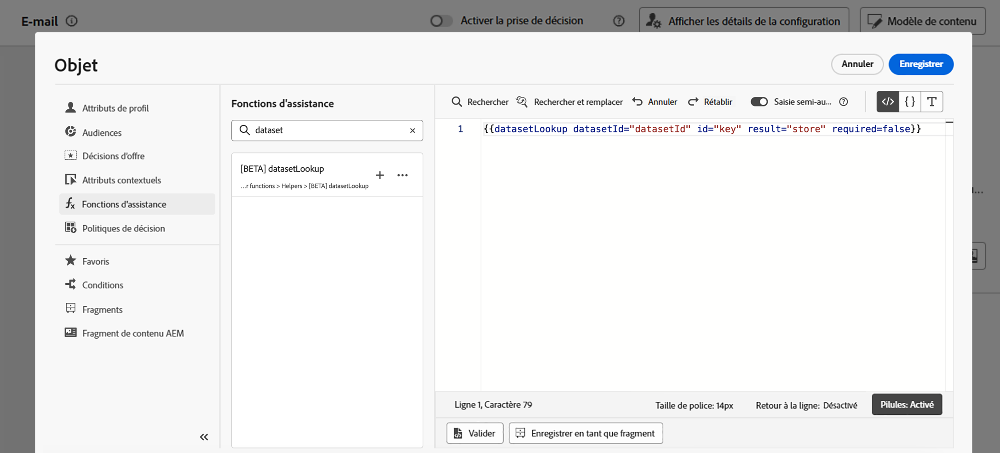
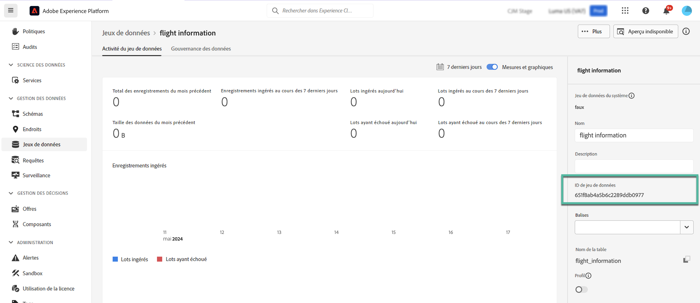
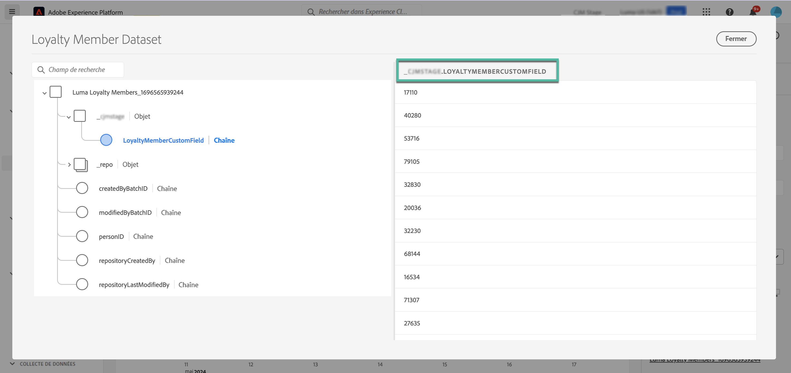
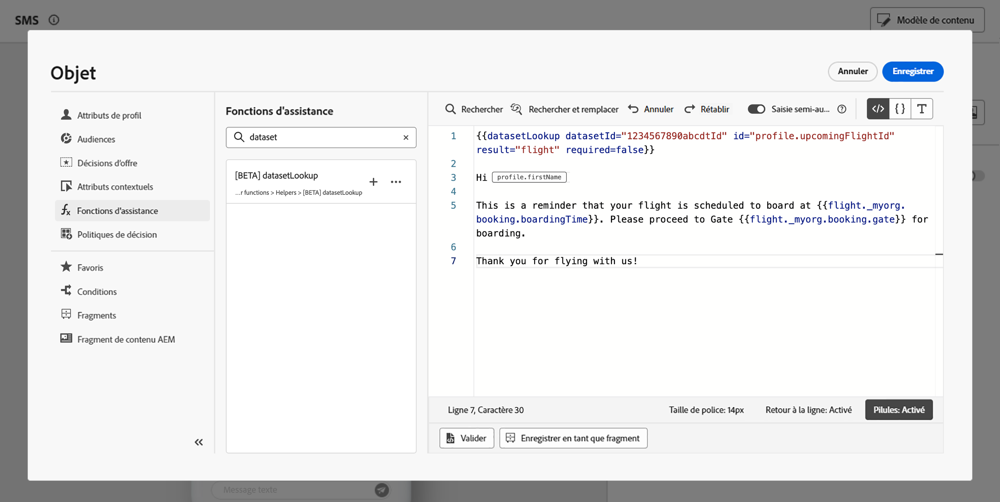

# Utiliser des données Adobe Experience Platform à des fins de personnalisation {#aep-data}

>[!AVAILABILITY]
>
>Cette fonctionnalité est actuellement en disponibilité limitée pour l’ensemble des clients et clientes.
>
>Pour l’instant, la fonction d’assistance « datasetLookup » peut être utilisée dans les fragments d’expression pour un ensemble limité de clientes et clients. Pour en bénéficier, contactez votre représentant ou représentante Adobe.

Journey Optimizer vous permet d’utiliser les données de jeux de données d’enregistrement Adobe Experience Platform dans l’éditeur de personnalisation pour [personnaliser votre contenu](../personalization/personalize.md). Avant de commencer, les jeux de données nécessaires à la personnalisation de la recherche doivent être activés pour la recherche. Vous trouverez des informations détaillées dans cette section : [Utiliser les données d’Adobe Experience Platform](../data/lookup-aep-data.md).

Une fois qu’un jeu de données a été activé pour la personnalisation de la recherche, vous pouvez utiliser ses données pour personnaliser votre contenu dans [!DNL Journey Optimizer].

1. Ouvrez l’éditeur de personnalisation, disponible dans tout contexte où vous pouvez définir une personnalisation, tel que les messages. [Découvrir comment utiliser l’éditeur de personnalisation](../personalization/personalization-build-expressions.md)

1. Accédez à la liste des fonctions d’assistance et ajoutez la fonction d’assistance **datasetLookup** au volet de code.

   

1. Cette fonction fournit une syntaxe prédéfinie pour vous permettre d’appeler des champs à partir de vos jeux de données Adobe Experience Platform. La syntaxe se présente comme suit :

   ```
   {{datasetLookup datasetId="datasetId" id="key" result="store" required=false}}
   ```

   * **datasetId** est l’identifiant du jeu de données que vous utilisez.
   * **id** est l’identifiant de la colonne source qui doit être associée à l’identité principale du jeu de données de recherche.

     >[!NOTE]
     >
     >La valeur saisie pour ce champ peut être un identifiant de champ (`profile.packages.packageSKU`), un champ transmis dans un événement de parcours (`context.journey.events.event_ID.productSKU`) ou une valeur statique (`sku007653`). Dans tous les cas, le système utilisera la valeur et la recherche du jeu de données pour vérifier si celui-ci correspond à une clé.
     >
     >Si vous utilisez une valeur de chaîne littérale pour la clé, conservez le texte entre guillemets. Par exemple : `{{datasetLookup datasetId="datasetId" id="SKU1234" result="store" required=false}}`. Si vous utilisez une valeur d’attribut comme clé dynamique, supprimez les guillemets. Par exemple : `{{datasetLookup datasetId="datasetId" id=category.product.SKU result="SKU" required=false}}`

   * **result** est un nom arbitraire que vous devez fournir pour référencer toutes les valeurs de champ que vous allez récupérer du jeu de données. Cette valeur sera utilisée dans votre code pour appeler chaque champ.

   * **required=false** : si la valeur required est définie sur TRUE, le message n’est diffusé que si une clé correspondante est trouvée. Si la valeur required est définie sur FALSE, une clé correspondante n’est pas requise et le message peut toujours être diffusé. Notez que si la valeur required est définie sur FALSE, il est recommandé de tenir compte des valeurs de secours ou des valeurs par défaut dans le contenu de votre message.

   +++Où récupérer l’ID d’un jeu de données ?

   Les ID de jeu de données peuvent être récupérés dans l’interface d’utilisation d’Adobe Experience Platform. Découvrez comment utiliser des jeux de données dans la [documentation d’Adobe Experience Platform](https://experienceleague.adobe.com/fr/docs/experience-platform/catalog/datasets/user-guide#view-datasets){target="_blank"}.

   

   +++

1. Adaptez la syntaxe à vos besoins. Dans cet exemple, nous allons récupérer les données relatives aux vols des passagères et passagers. La syntaxe se présente comme suit :

   ```
   {{datasetLookup datasetId="1234567890abcdtId" id=profile.upcomingFlightId result="flight"}}
   ```

   * Nous travaillons dans le jeu de données dont l’identifiant est « 1234567890abcdtId »,
   * Le champ que nous voulons utiliser pour la liaison avec le jeu de données de recherche est *profile.upcomingFlightId*,
   * Nous souhaitons inclure toutes les valeurs de champ sous la référence « vol ».

1. Une fois que la syntaxe à appeler dans le jeu de données Adobe Experience Platform a été configurée, vous pouvez spécifier les champs à récupérer. La syntaxe se présente comme suit :

   ```
   {{result.fieldId}}
   ```

   >[!NOTE]
   >
   >Lors du référencement d’un champ de jeu de données, assurez-vous de bien respecter le chemin d’accès complet du champ tel qu’il est défini dans le schéma.
   >
   >Il n’existe aucune limite stricte du nombre de champs pouvant être extraits à l’aide de la fonction d’assistance. Toutefois, pour de meilleures performances, il est recommandé de limiter le nombre de champs à 50 afin d’éviter toute incidence sur le débit.

   * **result** est la valeur que vous avez attribuée au paramètre **result** dans la fonction d’assistance **datasetLookup**. Dans cet exemple, « vol ».
   * **fieldID** est l’identifiant du champ à récupérer. Cet identifiant est visible dans l’interface d’utilisation d’[!DNL Adobe Experience Platform] lors de la navigation dans le schéma d’enregistrement associé à votre jeu de données :

     +++Où récupérer l’ID d’un champ ?

     Les ID de champ peuvent être récupérés lors de la prévisualisation d’un jeu de données dans l’interface d’utilisation d’Adobe Experience Platform. Découvrez comment prévisualiser des jeux de données dans la [documentation d’Adobe Experience Platform](https://experienceleague.adobe.com/fr/docs/experience-platform/catalog/datasets/user-guide#preview){target="_blank"}.

     

     +++

   Dans cet exemple, nous allons utiliser des informations relatives à l’heure et à la porte d’embarquement des passagères et passagers. Nous ajoutons donc ces deux lignes :

   * `{{flight._myorg.booking.boardingTime}}`
   * `{{flight._myorg.booking.gate}}`

1. Maintenant que votre code est prêt, vous pouvez compléter votre contenu comme vous le faites habituellement et le tester à l’aide du bouton **Simuler le contenu** pour vérifier la personnalisation. [Découvrir comment prévisualiser et tester votre contenu](../content-management/preview-test.md)


   
