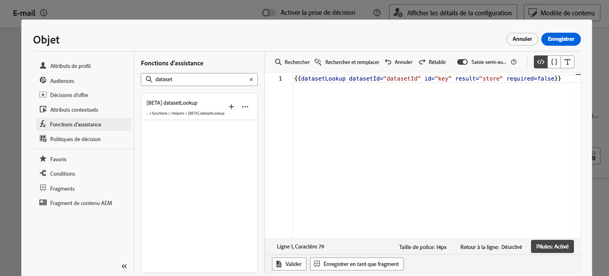
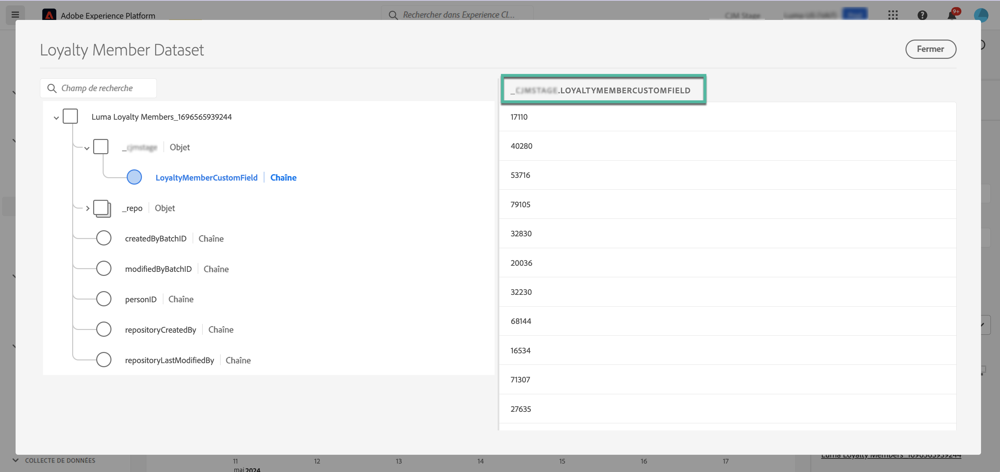

# Utiliser des données Adobe Experience Platform à des fins de personnalisation {#aep-data}

>[!BEGINSHADEBOX]

**Sur cette page :** Découvrez comment utiliser la fonction d’assistance datasetLookup dans l’éditeur de personnalisation pour récupérer des champs des jeux de données d’enregistrement Adobe Experience Platform et personnaliser votre contenu.

>[!ENDSHADEBOX]

>[!AVAILABILITY]
>
>Cette fonctionnalité est actuellement en disponibilité limitée pour l’ensemble des clients et clientes.
>
>Pour l’instant, la fonction d’assistance « datasetLookup » peut être utilisée dans les fragments d’expression pour un ensemble limité de clientes et clients. Pour en bénéficier, contactez votre représentant ou représentante Adobe.

Journey Optimizer vous permet d’utiliser les données de jeux de données d’enregistrement Adobe Experience Platform dans l’éditeur de personnalisation pour [personnaliser votre contenu](../personalization/personalize.md). Avant de commencer, les jeux de données nécessaires à la personnalisation de la recherche doivent être activés pour la recherche. Vous trouverez des informations détaillées dans cette section : [Utiliser les données d’Adobe Experience Platform](../data/lookup-aep-data.md).

Une fois qu’un jeu de données a été activé pour la personnalisation de la recherche, vous pouvez utiliser ses données pour personnaliser votre contenu dans [!DNL Journey Optimizer].

1. Ouvrez l’éditeur de personnalisation, disponible dans tout contexte où vous pouvez définir une personnalisation, tel que les messages. [Découvrir comment utiliser l’éditeur de personnalisation](../personalization/personalization-build-expressions.md)

1. Accédez à la liste des fonctions d’assistance et ajoutez la fonction d’assistance **datasetLookup** au volet de code.

   

1. Cette fonction fournit une syntaxe prédéfinie pour vous permettre d’appeler des champs à partir de vos jeux de données Adobe Experience Platform. La syntaxe se présente comme suit :

   ```
   {{datasetLookup datasetId="datasetId" id="key" result="store" required=false}}
   ```

   * **datasetId** est l’identifiant du jeu de données que vous utilisez.
   * **id** est l’identifiant de la colonne source qui doit être associée à l’identité principale du jeu de données de recherche.

     >[!NOTE]
     >
     >La valeur saisie pour ce champ peut être un identifiant de champ (`profile.packages.packageSKU`), un champ transmis dans un événement de parcours (`context.journey.events.event_ID.productSKU`) ou une valeur statique (`sku007653`). Dans tous les cas, le système utilisera la valeur et la recherche du jeu de données pour vérifier si celui-ci correspond à une clé.
     >
     >Si vous utilisez une valeur de chaîne littérale pour la clé, conservez le texte entre guillemets. Par exemple : `{{datasetLookup datasetId="datasetId" id="SKU1234" result="store" required=false}}`. Si vous utilisez une valeur d’attribut comme clé dynamique, supprimez les guillemets. Par exemple : `{{datasetLookup datasetId="datasetId" id=category.product.SKU result="SKU" required=false}}`

   * **result** est un nom arbitraire que vous devez fournir pour référencer toutes les valeurs de champ que vous allez récupérer du jeu de données. Cette valeur sera utilisée dans votre code pour appeler chaque champ.

   * **required=false** : si la valeur required est définie sur TRUE, le message n’est diffusé que si une clé correspondante est trouvée. Si la valeur required est définie sur FALSE, une clé correspondante n’est pas requise et le message peut toujours être diffusé. Notez que si la valeur required est définie sur FALSE, il est recommandé de tenir compte des valeurs de secours ou des valeurs par défaut dans le contenu de votre message.

   +++Où récupérer l’ID d’un jeu de données ?

   Les ID de jeu de données peuvent être récupérés dans l’interface d’utilisation d’Adobe Experience Platform. Découvrez comment utiliser des jeux de données dans la [documentation d’Adobe Experience Platform](https://experienceleague.adobe.com/fr/docs/experience-platform/catalog/datasets/user-guide#view-datasets){target="_blank"}.

   

   +++

1. Adaptez la syntaxe à vos besoins. Dans cet exemple, nous allons récupérer les données relatives aux vols des passagères et passagers. La syntaxe se présente comme suit :

   ```
   {{datasetLookup datasetId="1234567890abcdtId" id=profile.upcomingFlightId result="flight"}}
   ```

   * Nous travaillons dans le jeu de données dont l’identifiant est « 1234567890abcdtId »,
   * Le champ que nous voulons utiliser pour la liaison avec le jeu de données de recherche est *profile.upcomingFlightId*,
   * Nous souhaitons inclure toutes les valeurs de champ sous la référence « vol ».

1. Une fois que la syntaxe à appeler dans le jeu de données Adobe Experience Platform a été configurée, vous pouvez spécifier les champs à récupérer. La syntaxe se présente comme suit :

   ```
   {{result.fieldId}}
   ```

   >[!NOTE]
   >
   >Lors du référencement d’un champ de jeu de données, assurez-vous de bien respecter le chemin d’accès complet du champ tel qu’il est défini dans le schéma.
   >
   >Il n’existe aucune limite stricte du nombre de champs pouvant être extraits à l’aide de la fonction d’assistance. Toutefois, pour de meilleures performances, il est recommandé de limiter le nombre de champs à 50 afin d’éviter toute incidence sur le débit.

   * **result** est la valeur que vous avez attribuée au paramètre **result** dans la fonction d’assistance **datasetLookup**. Dans cet exemple, « vol ».
   * **fieldID** est l’identifiant du champ à récupérer. Cet identifiant est visible dans l’interface d’utilisation d’[!DNL Adobe Experience Platform] lors de la navigation dans le schéma d’enregistrement associé à votre jeu de données :

     +++Où récupérer l’ID d’un champ ?

     Les ID de champ peuvent être récupérés lors de la prévisualisation d’un jeu de données dans l’interface d’utilisation d’Adobe Experience Platform. Découvrez comment prévisualiser des jeux de données dans la [documentation d’Adobe Experience Platform](https://experienceleague.adobe.com/fr/docs/experience-platform/catalog/datasets/user-guide#preview){target="_blank"}.

     

     +++

   Dans cet exemple, nous allons utiliser des informations relatives à l’heure et à la porte d’embarquement des passagères et passagers. Nous ajoutons donc ces deux lignes :

   * `{{flight._myorg.booking.boardingTime}}`
   * `{{flight._myorg.booking.gate}}`

1. Maintenant que votre code est prêt, vous pouvez terminer votre contenu comme vous le faites habituellement et le tester à l’aide de l’une des méthodes de simulation suivantes : cliquez sur **[!UICONTROL Simuler du contenu]** pour tester les variations de contenu avec des exemples de données d’entrée ou la génération automatique de l’IA, ou cliquez sur **[!UICONTROL Simuler du contenu]**, puis sélectionnez **[!UICONTROL Simuler du contenu (profils AEP)]** dans la liste déroulante pour obtenir un aperçu avec des profils de test. [Découvrir comment prévisualiser et tester votre contenu](../content-management/preview-test.md)


   

## Référence rapide {#quick-reference}

Cette section contient des connaissances structurées destinées à soutenir l’interprétation, la récupération et la réponse aux questions liées à ce sujet.

Pour une compréhension totale, ces informations doivent être combinées avec la documentation de cette page. Aucune des sources n’est conçue pour être autonome. La page décrit la fonctionnalité, tandis que cette section fournit un contexte supplémentaire qui permet de clarifier la terminologie, l’intention, l’applicabilité et les contraintes.

>[!BEGINTABS]

>[!TAB Vue d’ensemble]

**TL;DR**

Cette page explique comment utiliser la fonction d’assistance `datasetLookup` dans l’éditeur de personnalisation de Journey Optimizer pour récupérer des champs des jeux de données d’enregistrement Adobe Experience Platform et les incorporer dans la personnalisation des messages.

**Intentions**

* Activer un jeu de données d’enregistrement AEP pour la personnalisation de la recherche
* Ajoutez la fonction d’assistance `datasetLookup` à une expression de personnalisation
* Configurez la fonction avec un identifiant de jeu de données, une clé de jointure, un alias de résultat et un indicateur obligatoire.
* Référencer les champs de jeux de données récupérés dans les expressions de personnalisation à l’aide de l’alias de résultat
* Tester du contenu personnalisé à l’aide du flux de contenu Simuler

>[!TAB Glossaire]

* **datasetLookup** : fonction d’assistance dans l’éditeur de personnalisation qui récupère les valeurs de champ d’un jeu de données d’enregistrement AEP en se connectant sur une clé spécifiée. *(spécifique au produit)*
* **Jeu de données d’enregistrement** : type de jeu de données Adobe Experience Platform contenant des données au niveau de l’enregistrement qui peuvent être activées pour la personnalisation de la recherche. *(spécifique au produit)*
* **Personnalisation de la recherche** : processus de récupération de champs d’un jeu de données d’enregistrement AEP au moment de l’envoi pour personnaliser le contenu du message. *(spécifique au produit)*
* **paramètre result** : alias arbitraire attribué dans l’appel `datasetLookup` ; utilisé pour référencer toutes les valeurs de champ récupérées dans les expressions suivantes (par exemple, `{{result.fieldId}}`).
* **paramètre obligatoire** : indicateur booléen dans `datasetLookup` qui contrôle si la diffusion du message nécessite qu’une clé correspondante soit trouvée dans le jeu de données.

>[!TAB  Terminologie ]

* **Nom canonique :** datasetLookup — variantes : recherche de jeu de données, assistant de recherche de jeu de données, fonction d’assistance à la recherche de jeu de données
* **Synonymes:** « datasetLookup » = « fonction d’assistance de recherche de jeu de données »
* **Ne le confondez pas :** « datasetId » (identifiant du jeu de données AEP) ≠ « id » (la colonne source utilisée pour se joindre à l’identité principale du jeu de données) ≠ « result » (alias permettant de référencer les valeurs de champ récupérées)

>[!TAB Mécanismes de sécurisation et limitations]

* La fonctionnalité est en disponibilité limitée ; elle n’est pas encore disponible pour tous les clients.
* La fonction d’assistance `datasetLookup` dans les fragments d’expression est disponible uniquement pour un nombre limité de clientes et clients. Contactez votre représentant Adobe pour obtenir l’accès.
* Les jeux de données doivent être explicitement activés pour la personnalisation de la recherche avant de pouvoir être utilisés avec `datasetLookup`.
* Conservez un nombre de champs récupérés par appel de `datasetLookup` inférieur à 50 pour éviter tout impact sur le débit (limite recommandée : aucune limite stricte n’est indiquée sur la page).

>[!TAB FAQ]

**Q : Quelle est la fonction d’assistance `datasetLookup` ?**

Il s’agit d’une fonction d’assistance dans l’éditeur de personnalisation qui récupère les valeurs de champ des jeux de données d’enregistrement Adobe Experience Platform, ce qui vous permet d’incorporer ces données dans la personnalisation des messages.

**Q : Que se passe-t-il si `required=false` et aucune clé correspondante n’est trouvée dans le jeu de données ?**

Le message peut toujours être diffusé. Il est recommandé de tenir compte des valeurs de secours ou par défaut dans le contenu de votre message lors de l’utilisation de `required=false`.

**Q : Que se passe-t-il si `required=true` et aucune clé correspondante n’est trouvée ?**

Le message ne sera diffusé que si une clé correspondante est trouvée dans le jeu de données.

**Q : Où puis-je trouver l’identifiant du jeu de données et les identifiants de champ nécessaires à la syntaxe ?**

Les identifiants des jeux de données peuvent être récupérés dans l’interface utilisateur de Adobe Experience Platform sous Jeux de données. Les identifiants de champ sont visibles lors de la prévisualisation d’un jeu de données et de la navigation dans le schéma d’enregistrement dans l’interface utilisateur d’AEP.

**Q : Comment tester le contenu qui utilise `datasetLookup` ?**

Utilisez le bouton **Simuler du contenu** pour tester avec des exemples de données d’entrée ou la génération automatique de l’IA, ou sélectionnez **Simuler du contenu (profils AEP)** dans la liste déroulante pour prévisualiser avec des profils de test.

>[!ENDTABS]

<!-- ai-section-version: 1 | source-hash: 89d99e47 -->
