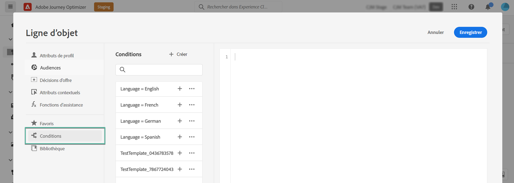
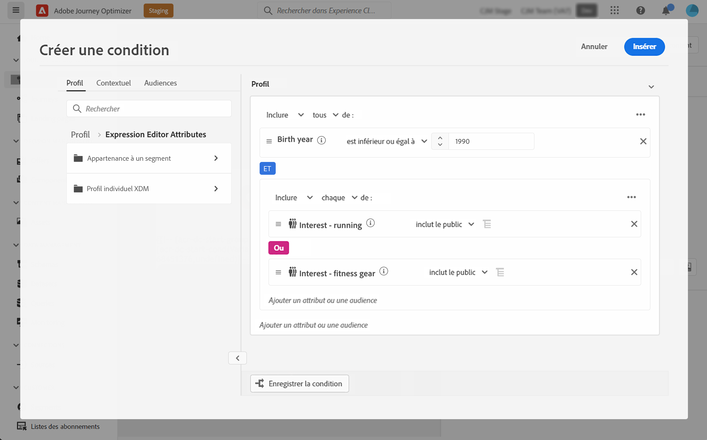
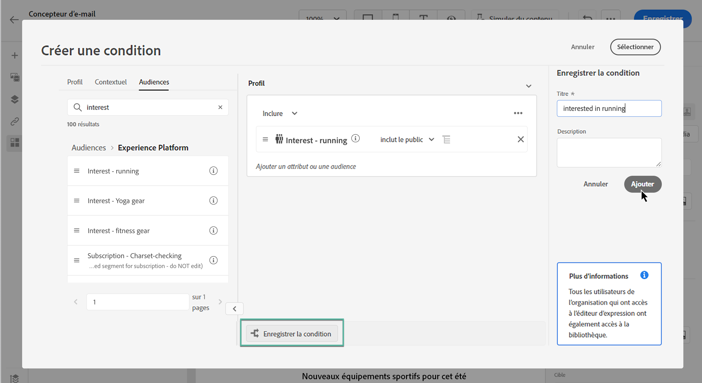
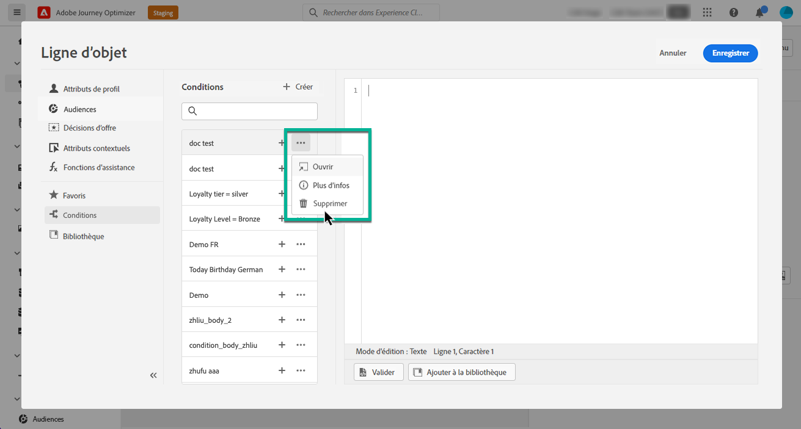

# Utiliser des règles conditionnelles {#conditions}

>[!BEGINSHADEBOX]

**Sur cette page :** découvrez comment créer des règles conditionnelles à partir d’attributs de profil, d’événements contextuels et d’audiences dans l’éditeur de personnalisation, et les enregistrer dans la bibliothèque pour les réutiliser dans votre contenu.

>[!ENDSHADEBOX]

Les règles conditionnelles sont des ensembles de règles qui définissent le contenu à afficher dans vos messages, suivant différents critères tels que les attributs des profils, l’appartenance à une audience ou les événements contextuels.

Les règles conditionnelles sont créées à l’aide de l’éditeur de personnalisation et peuvent être stockées si vous souhaitez les réutiliser dans vos contenus. [Découvrez comment enregistrer une règle conditionnelle dans la bibliothèque](#save)

>[!NOTE]
>
>Les particuliers auront besoin de l’autorisation de [Gestion des éléments de bibliothèque](../administration/ootb-product-profiles.md) pour enregistrer ou supprimer des règles conditionnelles. Les conditions enregistrées sont disponibles pour tous les utilisateurs d’une organisation.

## Accéder au créateur de règles conditionnelles {#access}

Les règles conditionnelles sont créées à partir du menu **[!UICONTROL Conditions]** dans l’éditeur de personnalisation, accessible dans l’un des emplacements suivants :

* dans le concepteur d’e-mail, lors de l’activation d’un contenu dynamique pour un composant présent dans le corps du message. [Découvrez comment ajouter du contenu dynamique dans les e-mails](dynamic-content.md#emails)

  

* Dans tout champ que vous pouvez personnaliser à l’aide de l’[éditeur de personnalisation](personalization-build-expressions.md).

  

## Créer une règle conditionnelle {#create-condition}

>[!CONTEXTUALHELP]
>id="ajo_expression_editor_conditions_create"
>title="Créer une condition"
>abstract="Combinez des attributs de profil, des événements contextuels ou des audiences pour créer des règles qui définissent le contenu à afficher dans vos messages."

>[!CONTEXTUALHELP]
>id="ajo_expression_editor_conditions"
>title="Créer une condition"
>abstract="Combinez des attributs de profil, des événements contextuels ou des audiences pour créer des règles qui définissent le contenu à afficher dans vos messages."

Les principales étapes de création d’une règle conditionnelle sont les suivantes :

1. Accédez au menu **[!UICONTROL Conditions]** dans l’éditeur de personnalisation ou dans le concepteur d’e-mail, puis cliquez sur **[!UICONTROL Créer]**.

1. Créez la règle conditionnelle selon vos besoins. Pour ce faire, glissez et déposez les attributs de votre choix depuis le menu de gauche vers la zone de travail, puis organisez-les.

   Les étapes de combinaison des attributs dans la zone de travail sont similaires à l’expérience de création de segments. Pour plus d’informations sur l’utilisation de la zone de travail du créateur de règles, reportez-vous à [cette documentation](https://experienceleague.adobe.com/docs/experience-platform/segmentation/ui/segment-builder.html?lang=fr#rule-builder-canvas).

   

   Les attributs sont organisés en trois onglets :

   * **[!UICONTROL Profile]** :
      * **[!UICONTROL Audiences]** répertorie tous les attributs d’audience (par exemple, statut, version, etc.) pour [Adobe Experience Platform Segmentation Service](https://experienceleague.adobe.com/docs/experience-platform/segmentation/home.html?lang=fr){target="_blank"},
      * **[!UICONTROL Profils individuels XDM]** répertorie tous les attributs de profil associés au [Schéma du modèle de données d’expérience (XDM)](https://experienceleague.adobe.com/docs/experience-platform/xdm/home.html?lang=fr){target="_blank"} défini dans Adobe Experience Platform.
   * **[!UICONTROL Contextuel]** : lorsque le message est utilisé dans un parcours, les champs de parcours contextuels sont disponibles dans cet onglet.
   * **[!UICONTROL Audiences]** : répertorie toutes les audiences générées à partir des segments créés dans le [service de segmentation Adobe Experience Platform](https://experienceleague.adobe.com/docs/experience-platform/segmentation/home.html?lang=fr){target="_blank"}.

1. Une fois votre règle conditionnelle prête, vous pouvez l’ajouter à votre message pour créer du contenu dynamique. [Découvrez comment ajouter du contenu dynamique](dynamic-content.md)

   Vous pouvez également enregistrer la règle pour permettre une réutilisation ultérieure. [Découvrez comment enregistrer une condition](#save)

## Enregistrer une règle conditionnelle {#save}

Si vous réutilisez fréquemment des règles de condition, vous pouvez les enregistrer dans la bibliothèque de conditions. Toutes les règles enregistrées sont partagées et peuvent être consultées et utilisées par des personnes de votre entreprise.

>[!NOTE]
>
>Les règles conditionnelles qui utilisent des attributs contextuels de parcours ne peuvent pas être enregistrées dans la bibliothèque.

1. Dans l’écran d’édition des conditions, cliquez sur le bouton **[!UICONTROL Enregistrer la condition]**.

1. Attribuez un nom et une description (facultatif) à la règle, puis cliquez sur **[!UICONTROL Ajouter]**.

   

1. La règle conditionnelle est enregistrée dans la bibliothèque. Vous pouvez à présent l’utiliser pour créer du contenu dynamique dans vos messages. [Découvrez comment ajouter du contenu dynamique](dynamic-content.md)

>[!CAUTION]
>
>Lorsque vous nommez des variantes de contenu conditionnel, utilisez uniquement des caractères alphanumériques (A-Z, a-z, 0-9). L’utilisation de caractères spéciaux (tels que `<`, `>`, `=`, `{`, `}`, etc.) dans les variantes, les noms peuvent entraîner une interruption ou un masquage des composants par l’éditeur de modèles.

## Modifier et supprimer des règles conditionnelles enregistrées {#edit-delete}

Vous pouvez supprimer une règle conditionnelle à tout moment à l’aide du bouton représentant les points de suspension.

Les règles conditionnelles enregistrées dans la bibliothèque ne peuvent pas être modifiées. Cependant, vous pouvez toujours les utiliser pour créer de nouvelles règles. Pour ce faire, ouvrez la règle conditionnelle, apportez les modifications souhaitées, puis enregistrez-la dans la bibliothèque. [Découvrez comment enregistrer une condition dans la bibliothèque.](#save)

## Référence rapide {#quick-reference}

Cette section contient des connaissances structurées destinées à soutenir l’interprétation, la récupération et la réponse aux questions liées à ce sujet.

Pour une compréhension totale, ces informations doivent être combinées avec la documentation de cette page. Aucune des sources n’est conçue pour être autonome. La page décrit la fonctionnalité, tandis que cette section fournit un contexte supplémentaire qui permet de clarifier la terminologie, l’intention, l’applicabilité et les contraintes.

>[!BEGINTABS]

>[!TAB Vue d’ensemble]

**TL;DR**

Cette page explique comment créer des règles conditionnelles à partir d’attributs de profil, d’événements contextuels et d’audiences dans l’éditeur de personnalisation, et comment les enregistrer dans la bibliothèque pour les réutiliser dans le contenu du message.

**Intentions**

* Accédez au créateur de règles conditionnelles à partir de l’éditeur de personnalisation ou du Designer d’e-mail
* Créez une règle conditionnelle en combinant les attributs de profil, l’appartenance à l’audience et les champs de parcours contextuels
* Ajouter une règle conditionnelle à un message pour créer du contenu dynamique
* Enregistrer une règle conditionnelle dans la bibliothèque de conditions pour la réutiliser dans l’ensemble de l’organisation
* Modifier ou supprimer une règle conditionnelle enregistrée

>[!TAB Glossaire]

* **Règle conditionnelle** : ensemble de règles qui définit le contenu à afficher dans les messages, en fonction de critères tels que les attributs de profil, l’appartenance à une audience ou les événements contextuels. *(spécifique au produit)*
* **Bibliothèque de conditions** : référentiel partagé au sein d’une organisation où les règles conditionnelles enregistrées sont stockées et accessibles à tous les utilisateurs. *(spécifique au produit)*
* **Contenu dynamique** : contenu du message dont l’affichage est régi par des règles conditionnelles. *(spécifique au produit)*
* **Champs contextuels** : champs spécifiques au Parcours disponibles dans le créateur de règles lorsqu’un message est utilisé dans un parcours ; les règles utilisant ces champs ne peuvent pas être enregistrées dans la bibliothèque.
* **Profils individuels XDM** : attributs de profil associés au schéma du modèle de données d’expérience (XDM) défini dans Adobe Experience Platform, disponibles en tant que critères de règle.

>[!TAB  Terminologie ]

* **Nom canonique : règle conditionnelle** — variantes : condition, conditions, règle de contenu conditionnelle
* **Synonymes :** « règle conditionnelle » = « condition » (comme indiqué dans l’interface utilisateur)
* **À ne pas confondre :** onglet « Profil » (contient à la fois les attributs Audiences et les sous-sections Profils individuels XDM) ≠ onglet « Audiences » (répertorie toutes les audiences générées à partir des définitions de segment dans le service AEP Segmentation)
* **Ne pas confondre :** « enregistrer une condition » (stocker une règle dans la bibliothèque partagée) ≠ « créer une condition » (créer une règle dans l’éditeur)

>[!TAB Mécanismes de sécurisation et limitations]

* Les règles conditionnelles qui utilisent des attributs contextuels de parcours ne peuvent pas être enregistrées dans la bibliothèque de conditions.
* Seuls les utilisateurs disposant de l’autorisation **Gérer les éléments de bibliothèque** peuvent enregistrer ou supprimer des règles conditionnelles de la bibliothèque.
* Les conditions enregistrées sont partagées et accessibles à tous les utilisateurs et utilisatrices de l’organisation.
* Les règles conditionnelles enregistrées dans la bibliothèque ne peuvent pas être modifiées directement. Ouvrez la règle, apportez les modifications souhaitées et enregistrez-la dans la bibliothèque.
* Les noms de variantes ne doivent utiliser que des caractères alphanumériques (A-Z, a-z, 0-9) ; des caractères spéciaux tels que `<`, `>`, `=`, `{`, `}` peuvent entraîner l’interruption ou le masquage de composants par l’éditeur de modèles.

>[!TAB FAQ]

**Q : Quels critères puis-je utiliser pour créer une règle conditionnelle ?**

Attributs de profil, appartenance à l’audience et champs de parcours contextuels (lorsque le message est utilisé dans un parcours).

**Q : Puis-je enregistrer une règle conditionnelle qui utilise des attributs contextuels de parcours ?**

Non. Les règles conditionnelles qui utilisent des attributs contextuels de parcours ne peuvent pas être enregistrées dans la bibliothèque de conditions.

**Q : Qui peut enregistrer ou supprimer des règles conditionnelles dans la bibliothèque ?**

Seuls les utilisateurs disposant de l’autorisation **Gérer les éléments de bibliothèque** peuvent enregistrer ou supprimer des règles conditionnelles.

**Q : Puis-je modifier une règle conditionnelle déjà enregistrée dans la bibliothèque ?**

Les règles conditionnelles enregistrées dans la bibliothèque ne peuvent pas être modifiées directement. Vous pouvez ouvrir une règle enregistrée, apporter les modifications souhaitées et l’enregistrer dans la bibliothèque.

**Q : Existe-t-il des restrictions sur le nommage des variantes de contenu conditionnel ?**

Oui. Les noms de variantes ne doivent contenir que des caractères alphanumériques (A-Z, a-z, 0-9). Les caractères spéciaux tels que `<`, `>`, `=`, `{` `}` peuvent entraîner l’interruption ou le masquage des composants par l’éditeur de modèles.

>[!ENDTABS]

<!-- ai-section-version: 1 | source-hash: f375658d -->
