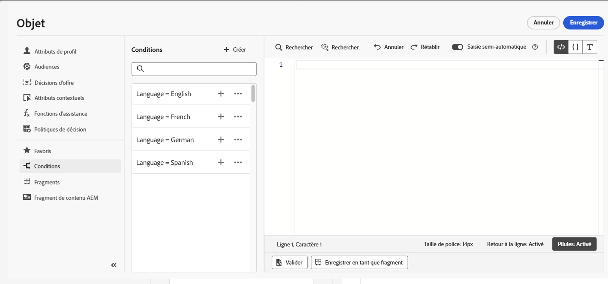

# Utilisation de règles conditionnelles {#conditions}

Les règles conditionnelles sont des ensembles de règles qui définissent le contenu à afficher dans vos messages, selon divers critères tels que les attributs des profils, l’appartenance à un segment ou les événements contextuels.

Les règles conditionnelles sont créées à l’aide de l’éditeur d’expression et peuvent être stockées si vous souhaitez les réutiliser dans vos contenus. [Découvrez comment enregistrer une règle conditionnelle dans la bibliothèque](#save)

>[!NOTE]
>
>Les personnes auront besoin de la variable [Gestion des éléments de bibliothèque](../administration/ootb-product-profiles.md) autorisation d’enregistrer ou de supprimer des règles conditionnelles. Les conditions enregistrées sont disponibles pour tous les utilisateurs d’une organisation.

## Accès au créateur de règles conditionnel {#access}

Les règles conditionnelles sont créées à partir de la variable **[!UICONTROL Conditions]** dans l’éditeur d’expression, accessible soit :

* Dans le Concepteur d’email, lors de l’activation du contenu dynamique pour un composant dans le corps de l’email. [Découvrez comment ajouter du contenu dynamique aux emails](dynamic-content.md#emails)

   

* Dans n’importe quel champ où vous pouvez ajouter de la personnalisation à l’aide de la fonction [Éditeur d’expression](personalization-build-expressions.md).

   

## Création d’une règle conditionnelle {#create-condition}

>[!CONTEXTUALHELP]
>id="ajo_expression_editor_conditions_create"
>title="Création d’une condition"
>abstract="Combinez des attributs de profil, des événements contextuels ou des audiences pour créer des règles qui définissent le contenu à afficher dans vos messages."

>[!CONTEXTUALHELP]
>id="ajo_expression_editor_conditions"
>title="Création d’une condition"
>abstract="Combinez des attributs de profil, des événements contextuels ou des audiences pour créer des règles qui définissent le contenu à afficher dans vos messages."

Les étapes de création d’une règle conditionnelle sont les suivantes :

1. Accédez au **[!UICONTROL Conditions]** dans l’éditeur d’expression ou le Concepteur d’email, puis cliquez sur **[!UICONTROL Créer]**.

1. Créez la règle conditionnelle en fonction de vos besoins. Pour ce faire, faites glisser et organisez les attributs de votre choix depuis le menu de gauche vers la zone de travail.

   Les étapes de combinaison des attributs dans la zone de travail sont similaires à l’expérience de création de segments. Pour plus d’informations sur l’utilisation du canevas du créateur de règles, reportez-vous à la section [cette documentation](https://experienceleague.adobe.com/docs/experience-platform/segmentation/ui/segment-builder.html?lang=en#rule-builder-canvas).

   

   Les attributs sont organisés en trois onglets :

   * **[!UICONTROL Profile]**:
      * **[!UICONTROL Adhésion au segment]** répertorie tous les attributs de segment (par exemple, état, version, etc.) ; pour [Service de segmentation Adobe Experience Platform](https://experienceleague.adobe.com/docs/experience-platform/segmentation/home.html?lang=fr),
      * **[!UICONTROL Profils individuels XDM]** répertorie tous les attributs de profil associés à la variable [Schéma du modèle de données d’expérience (XDM)](https://experienceleague.adobe.com/docs/experience-platform/xdm/home.html?lang=fr) défini dans Adobe Experience Platform.
   * **[!UICONTROL Contextuel]**: lorsque votre message est utilisé dans un parcours, les champs de parcours contextuels sont disponibles via cet onglet.
   * **[!UICONTROL Audiences]**: répertorie toutes les audiences générées à partir des segments créés dans [Service de segmentation Adobe Experience Platform](https://experienceleague.adobe.com/docs/experience-platform/segmentation/home.html).

1. Une fois votre règle conditionnelle prête, vous pouvez l’ajouter à votre message pour créer du contenu dynamique. [Découvrez comment ajouter du contenu dynamique](dynamic-content.md)

   Vous pouvez également enregistrer la règle pour permettre une réutilisation ultérieure. [Découvrez comment enregistrer une condition](#save)

## Enregistrer une règle conditionnelle {#save}

Si vous réutilisez fréquemment des règles de condition, vous pouvez les enregistrer dans la bibliothèque de conditions. Toutes les règles enregistrées sont partagées et peuvent être consultées et utilisées par des personnes de votre entreprise.

>[!NOTE]
>
>Les règles conditionnelles qui utilisent des attributs contextuels de parcours ne peuvent pas être enregistrées dans la bibliothèque.

1. Dans l’écran d’édition des conditions, cliquez sur le bouton **[!UICONTROL Condition d’enregistrement]** bouton .

1. Attribuez un nom et une description (facultatif) à la règle, puis cliquez sur **[!UICONTROL Ajouter]**.

   

1. La règle conditionnelle est enregistrée dans la bibliothèque. Vous pouvez désormais l’utiliser pour créer du contenu dynamique dans vos messages. [Découvrez comment ajouter du contenu dynamique](dynamic-content.md)

## Modification et suppression de règles conditionnelles enregistrées {#edit-delete}

Vous pouvez supprimer une règle conditionnelle à tout moment à l’aide du bouton représentant des ellipses.

Les règles conditionnelles enregistrées dans la bibliothèque ne peuvent pas être modifiées. Cependant, vous pouvez toujours les utiliser pour créer de nouvelles règles. Pour ce faire, ouvrez la règle conditionnelle, apportez les modifications souhaitées, puis enregistrez-la dans la bibliothèque. [Découvrez comment enregistrer une condition dans la bibliothèque](#save)
