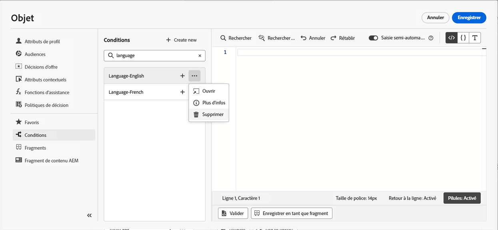

# Utiliser des règles conditionnelles {#conditions}

Les règles conditionnelles sont des ensembles de règles qui définissent le contenu à afficher dans vos messages, suivant différents critères tels que les attributs des profils, l’appartenance à une audience ou les événements contextuels.

Les règles conditionnelles sont créées à l’aide de l’éditeur de personnalisation et peuvent être stockées si vous souhaitez les réutiliser dans vos contenus. [Découvrez comment enregistrer une règle conditionnelle dans la bibliothèque](#save)

>[!NOTE]
>
>Les particuliers auront besoin de l’autorisation de [Gestion des éléments de bibliothèque](../administration/ootb-product-profiles.md) pour enregistrer ou supprimer des règles conditionnelles. Les conditions enregistrées sont disponibles pour tous les utilisateurs d’une organisation.

## Accéder au créateur de règles conditionnelles {#access}

Les règles conditionnelles sont créées à partir du menu **[!UICONTROL Conditions]** dans l’éditeur de personnalisation, accessible dans l’un des emplacements suivants :

* dans le concepteur d’e-mail, lors de l’activation d’un contenu dynamique pour un composant présent dans le corps du message. [Découvrez comment ajouter du contenu dynamique dans les e-mails](dynamic-content.md#emails)

  

* Dans tout champ que vous pouvez personnaliser à l’aide de l’[éditeur de personnalisation](personalization-build-expressions.md).

  

## Créer une règle conditionnelle {#create-condition}

>[!CONTEXTUALHELP]
>id="ajo_expression_editor_conditions_create"
>title="Créer une condition"
>abstract="Combinez des attributs de profil, des événements contextuels ou des audiences pour créer des règles qui définissent le contenu à afficher dans vos messages."

>[!CONTEXTUALHELP]
>id="ajo_expression_editor_conditions"
>title="Créer une condition"
>abstract="Combinez des attributs de profil, des événements contextuels ou des audiences pour créer des règles qui définissent le contenu à afficher dans vos messages."

Les principales étapes de création d’une règle conditionnelle sont les suivantes :

1. Accédez au menu **[!UICONTROL Conditions]** dans l’éditeur de personnalisation ou dans le concepteur d’e-mail, puis cliquez sur **[!UICONTROL Créer]**.

1. Créez la règle conditionnelle selon vos besoins. Pour ce faire, glissez et déposez les attributs de votre choix depuis le menu de gauche vers la zone de travail, puis organisez-les.

   Les étapes de combinaison des attributs dans la zone de travail sont similaires à l’expérience de création de segments. Pour plus d’informations sur l’utilisation de la zone de travail du créateur de règles, reportez-vous à [cette documentation](https://experienceleague.adobe.com/docs/experience-platform/segmentation/ui/segment-builder.html?lang=fr#rule-builder-canvas).

   

   Les attributs sont organisés en trois onglets :

   * **[!UICONTROL Profile]** :
      * **[!UICONTROL Audiences]** répertorie tous les attributs d’audience (c’est-à-dire le statut, la version, etc.) pour le [service de segmentation Adobe Experience Platform](https://experienceleague.adobe.com/docs/experience-platform/segmentation/home.html?lang=fr){target="_blank"}.
      * **[!UICONTROL Profils individuels XDM]** répertorie tous les attributs de profil associés au [Schéma du modèle de données d’expérience (XDM)](https://experienceleague.adobe.com/fr/docs/experience-platform/xdm/home){target="_blank"} défini dans Adobe Experience Platform.
   * **[!UICONTROL Contextuel]** : lorsque le message est utilisé dans un parcours, les champs de parcours contextuels sont disponibles dans cet onglet.
   * **[!UICONTROL Audiences]** : répertorie toutes les audiences générées à partir des segments créés dans le [service de segmentation Adobe Experience Platform](https://experienceleague.adobe.com/docs/experience-platform/segmentation/home.html?lang=fr){target="_blank"}.

1. Une fois votre règle conditionnelle prête, vous pouvez l’ajouter à votre message pour créer du contenu dynamique. [Découvrez comment ajouter du contenu dynamique](dynamic-content.md)

   Vous pouvez également enregistrer la règle pour permettre une réutilisation ultérieure. [Découvrez comment enregistrer une condition](#save)

## Enregistrer une règle conditionnelle {#save}

Si vous réutilisez fréquemment des règles de condition, vous pouvez les enregistrer dans la bibliothèque de conditions. Toutes les règles enregistrées sont partagées et peuvent être consultées et utilisées par des personnes de votre entreprise.

>[!NOTE]
>
>Les règles conditionnelles qui utilisent des attributs contextuels de parcours ne peuvent pas être enregistrées dans la bibliothèque.

1. Dans l’écran d’édition des conditions, cliquez sur le bouton **[!UICONTROL Enregistrer la condition]**.

1. Attribuez un nom et une description (facultatif) à la règle, puis cliquez sur **[!UICONTROL Ajouter]**.

   

1. La règle conditionnelle est enregistrée dans la bibliothèque. Vous pouvez à présent l’utiliser pour créer du contenu dynamique dans vos messages. [Découvrez comment ajouter du contenu dynamique](dynamic-content.md)

>[!CAUTION]
>
>Lorsque vous nommez des variantes de contenu conditionnel, utilisez uniquement des caractères alphanumériques (A-Z, a-z, 0-9). L’utilisation de caractères spéciaux (tels que `<`, `>`, `=`, `{`, `}`, etc.) dans les noms des variantes peut causer un dysfonctionnement de l’éditeur de modèle ou le masquage des composants dans celui-ci.

## Modifier et supprimer des règles conditionnelles enregistrées {#edit-delete}

Vous pouvez supprimer une règle conditionnelle à tout moment à l’aide du bouton représentant les points de suspension.

Les règles conditionnelles enregistrées dans la bibliothèque ne peuvent pas être modifiées. Cependant, vous pouvez toujours les utiliser pour créer de nouvelles règles. Pour ce faire, ouvrez la règle conditionnelle, apportez les modifications souhaitées, puis enregistrez-la dans la bibliothèque. [Découvrez comment enregistrer une condition dans la bibliothèque.](#save)
