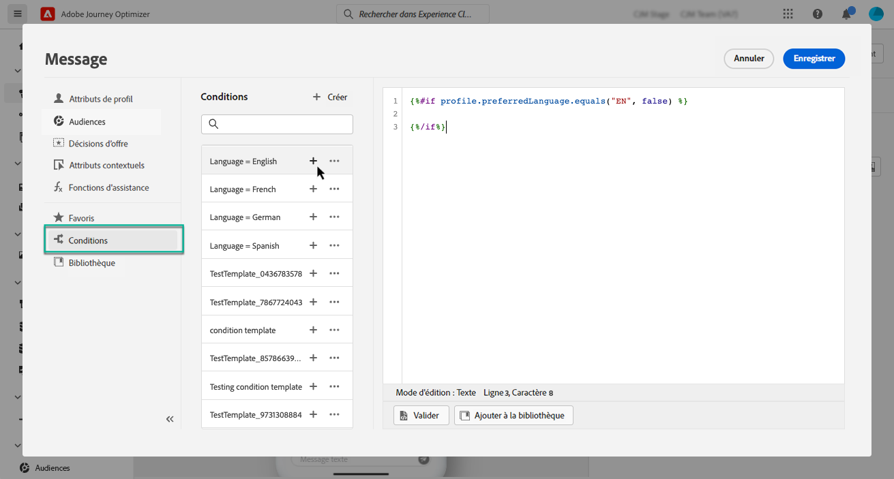
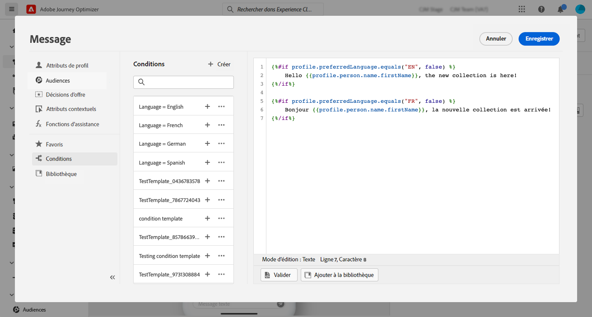
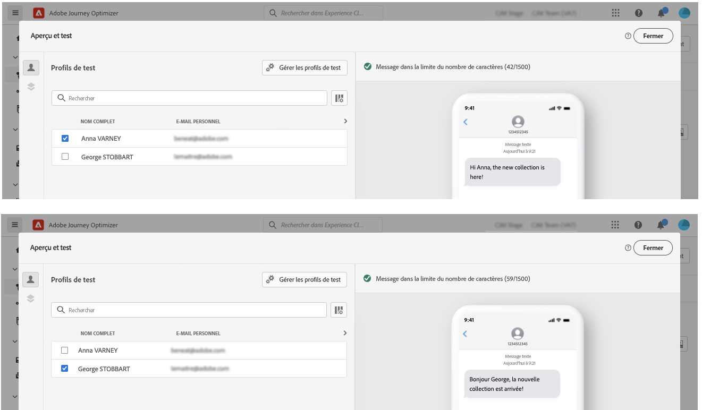
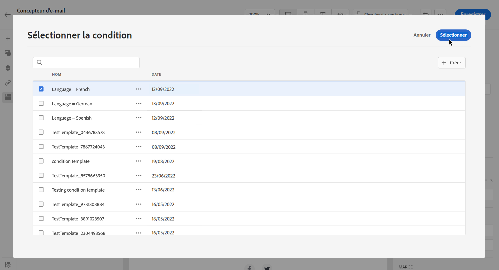

# Créer du contenu dynamique {#dynamic-content}

Adobe Journey Optimizer vous permet d’utiliser des règles conditionnelles créées dans la bibliothèque pour ajouter du contenu dynamique à vos messages.

Du contenu dynamique peut être créé dans n’importe quel champ que vous pouvez personnaliser à l’aide de l’éditeur de personnalisation. Cela inclut l’objet, les liens, le contenu des notifications push ou les représentations des offres de type texte. [En savoir plus sur la personnalisation](personalize.md)

De plus, vous pouvez utiliser des règles conditionnelles dans le Concepteur d’e-mail pour créer plusieurs variantes d’un composant de contenu.

## Ajouter du contenu dynamique aux expressions {#perso-expressions}

Les étapes suivantes permettent d’ajouter du contenu dynamique aux expressions :

1. Accédez au champ dans lequel vous souhaitez ajouter du contenu dynamique, puis ouvrez l’éditeur de personnalisation.

1. Sélectionnez le menu **[!UICONTROL Conditions]** pour afficher la liste des règles conditionnelles disponibles. Cliquez sur le bouton + à côté d’une règle pour l’ajouter à l’expression actuelle.

   Vous pouvez également créer une règle en sélectionnant **[!UICONTROL Créer]**. [Découvrez comment créer des conditions.](create-conditions.md)

   

1. Entre les balises `{%if}` et `{%/if}`, ajoutez le contenu que vous souhaitez afficher si la règle conditionnelle est respectée. Vous pouvez ajouter autant de règles que nécessaire pour créer plusieurs variantes d’une expression.

   Dans l’exemple ci-dessous, deux variantes ont été créées pour un contenu SMS, selon la préférence linguistique du destinataire.

   

1. Une fois que votre contenu est prêt, vous pouvez prévisualiser les différentes variantes à l’aide du bouton **[!UICONTROL Simuler un contenu]**. [Découvrez comment tester et prévisualiser des messages](../content-management/preview-test.md).

   

>[!CAUTION]
>
>Si le rendu du concepteur d’e-mail échoue après l’ajout de blocs conditionnels, vérifiez que la syntaxe de chaque nouvelle condition est correcte et qu’il n’existe aucune instruction en double ou conflictuelle. Si les problèmes persistent,envisagez de recréer les sections problématiques dans un nouveau modèle et de tester chaque bloc conditionnel progressivement.

## Ajouter du contenu dynamique dans les e-mails {#emails}

>[!CONTEXTUALHELP]
>id="ac_conditional_content"
>title="Contenu conditionnel"
>abstract="Utilisez des règles conditionnelles pour créer plusieurs variantes d’un composant de contenu. Si aucune des conditions n’est remplie lors de l’envoi du message, le contenu de la variante Par défaut s’affiche."

>[!CONTEXTUALHELP]
>id="ac_conditional_content_select"
>title="Contenu conditionnel"
>abstract="Utilisez une règle conditionnelle enregistrée dans la bibliothèque ou créez-en une."

Les étapes de création de variantes d’un composant de contenu dans le concepteur d’e-mails sont les suivantes :

1. Dans le [concepteur d’e-mail](../email/content-from-scratch.md), sélectionnez un composant de contenu, puis cliquez sur **[!UICONTROL Activer le contenu conditionnel]**.

   

1. Le volet **[!UICONTROL Contenu conditionnel]** s’affiche à gauche. Dans ce volet, vous pouvez créer plusieurs variantes du composant de contenu sélectionné à l’aide de conditions.

   Configurez votre première variante en sélectionnant le bouton **[!UICONTROL Sélectionner la condition]**.

   

1. La bibliothèque de conditions s’affiche. Sélectionnez la règle conditionnelle à associer à la variante, puis cliquez sur **[!UICONTROL Sélectionner]**. Dans cet exemple, nous allons adapter le texte du composant en fonction de la langue préférée du destinataire.

   

   Vous pouvez également créer une règle en cliquant sur **[!UICONTROL Créer]**. [Découvrez comment créer des conditions.](create-conditions.md)

1. La règle conditionnelle est associée à la variante. Pour une meilleure lisibilité, renommez la variante en sélectionnant l’action **[!UICONTROL Renommer]** à partir de l’icône Plus d’actions.

   

1. Configurez la manière dont le composant doit s’afficher si la règle est respectée lors de l’envoi du message. Dans cet exemple, nous allons afficher le texte en français s’il s’agit de la langue préférée du destinataire.

   

1. Ajoutez autant de variantes que nécessaire pour le composant de contenu. Vous pouvez basculer à tout moment entre les différentes variantes pour vérifier comment le composant de contenu s’affichera en fonction des règles conditionnelles.

   >[!NOTE]
   >
   >* Si aucune des règles définies dans les variantes n’est respectée lors de l’envoi du message, le composant de contenu affiche le contenu défini dans la variable **[!UICONTROL Variante par défaut]**.
   >
   >* Le contenu conditionnel sera évalué par rapport aux règles associées dans l’ordre d’affichage des variantes. La variante par défaut est toujours affichée si aucune autre condition n’est remplie.
   >
   >* Lors de la simulation ou du rendu de BAT pour les e-mails contenant plusieurs variantes conditionnelles, Journey Optimizer peut nécessiter davantage de temps de traitement. Si vous rencontrez des délais d’expiration ou des messages d’erreur, pensez à réduire le nombre total de variantes ou à simplifier les règles conditionnelles. En savoir plus sur le test de votre contenu sur [cette page](../content-management/preview-test.md).

1. Pour supprimer une variante, cliquez sur l’icône Plus d’actions située en regard de la variante souhaitée et sélectionnez **[!UICONTROL Supprimer]**.

   
