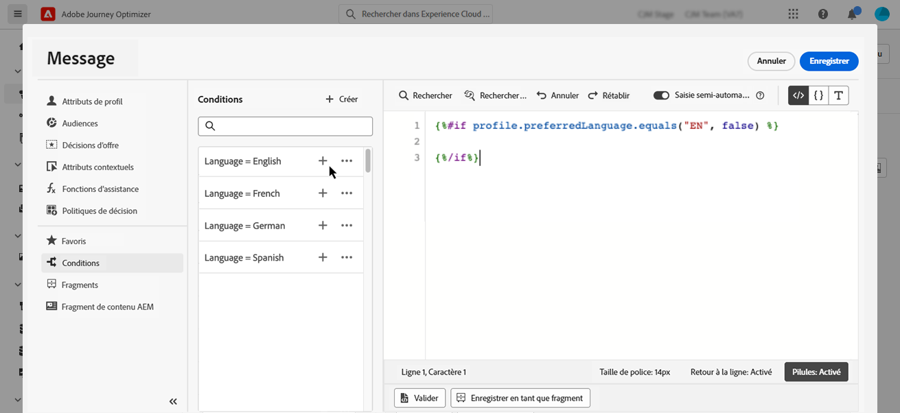
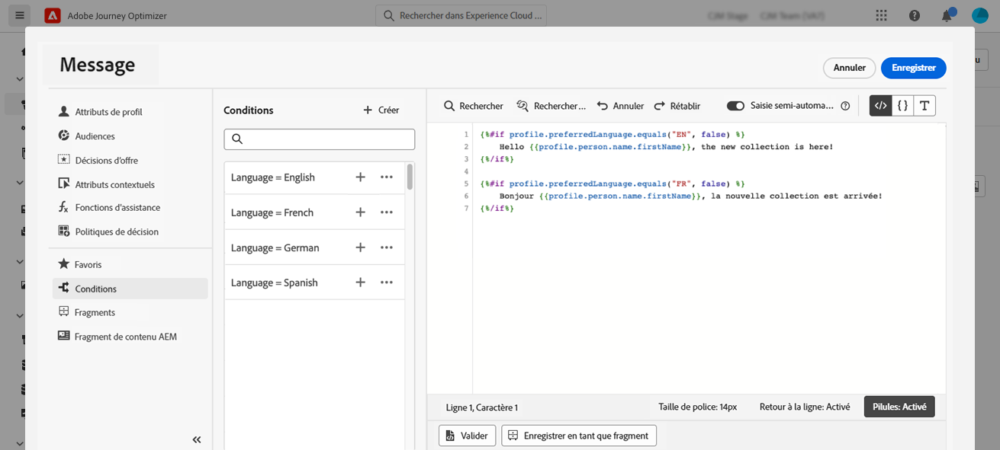
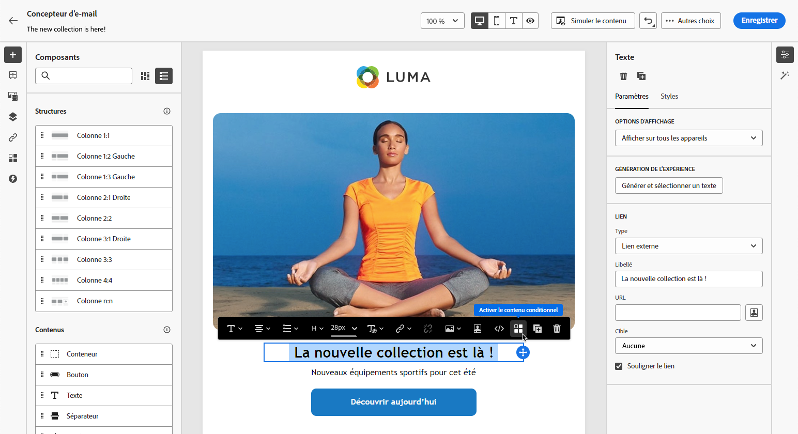

# Créer du contenu dynamique {#dynamic-content}

Adobe Journey Optimizer vous permet d’utiliser des règles conditionnelles créées dans la bibliothèque pour ajouter du contenu dynamique à vos messages.

Le contenu dynamique peut être créé dans n&#39;importe quel champ où vous pouvez ajouter une personnalisation à l&#39;aide de l&#39;éditeur d&#39;expression. Cela inclut l’objet, les liens, le contenu des notifications push ou les représentations des offres de type texte. [En savoir plus sur les contextes de personnalisation](personalization-contexts.md)

De plus, vous pouvez utiliser des règles conditionnelles dans le Concepteur d’email pour créer plusieurs variantes d’un composant de contenu.

## Ajout de contenu dynamique aux expressions {#perso-expressions}

Les étapes pour ajouter du contenu dynamique dans les expressions sont les suivantes :

1. Accédez au champ où vous souhaitez ajouter du contenu dynamique, puis ouvrez l’éditeur d’expression.

1. Sélectionnez la **[!UICONTROL Conditions]** pour afficher la liste des règles conditionnelles disponibles. Cliquez sur le bouton + en regard d’une règle pour l’ajouter à l’expression active.

   Vous pouvez également créer une règle en sélectionnant **[!UICONTROL Créer]**. [Découvrez comment créer des conditions.](create-conditions.md)

   

1. Ajoutez entre les `{%if}` et `{%/if}` balise le contenu que vous souhaitez afficher si la règle conditionnelle est respectée. Vous pouvez ajouter autant de règles que nécessaire pour créer plusieurs variantes d&#39;une expression.

   Dans l&#39;exemple ci-dessous, deux variantes ont été créées pour un contenu SMS, selon la préférence linguistique du destinataire.

   

1. Une fois que votre contenu est prêt, vous pouvez prévisualiser les différentes variantes à l’aide du **[!UICONTROL Simulation du contenu]** bouton . [Découvrez comment tester et prévisualiser des messages](../design/preview.md)

   

## Ajout de contenu dynamique dans les emails {#emails}

>[!CONTEXTUALHELP]
>id="ac_conditional_content"
>title="Contenu conditionnel"
>abstract="Utilisez des règles conditionnelles pour créer plusieurs variantes d’un composant de contenu. Si aucune des conditions n’est remplie lors de l’envoi du message, le contenu de la variante Par défaut s’affiche."

>[!CONTEXTUALHELP]
>id="ac_conditional_content_select"
>title="Contenu conditionnel"
>abstract="Utilisez une règle conditionnelle enregistrée dans la bibliothèque ou créez-en une."

Les étapes de création de variantes d&#39;un composant de contenu dans le Concepteur d&#39;email sont les suivantes :

1. Dans le Concepteur d’email, sélectionnez un composant de contenu, puis cliquez sur **[!UICONTROL Activation du contenu conditionnel]**.

   

1. Le **[!UICONTROL Contenu conditionnel]** s’affiche à gauche. Dans ce volet, vous pouvez créer plusieurs variantes du composant de contenu sélectionné à l’aide de conditions.

   Configurez votre première variante en sélectionnant **[!UICONTROL Condition d’application]** bouton .

   

1. La bibliothèque de conditions s’affiche. Sélectionnez la règle conditionnelle à associer à la variante, puis cliquez sur **[!UICONTROL Sélectionner]**. Dans cet exemple, nous allons adapter le texte du composant en fonction de la langue préférée du destinataire.

   

   Vous pouvez également créer une règle en cliquant sur **[!UICONTROL Créer]**. [Découvrez comment créer des conditions.](create-conditions.md)

1. La règle conditionnelle est associée à la variante. Pour une meilleure lisibilité, il est recommandé de renommer la variante en cliquant sur le menu ellipse .

   Maintenant, configurez l’affichage du composant si la règle est respectée lors de l’envoi du message. Dans cet exemple, nous allons afficher le texte en français s&#39;il s&#39;agit de la langue préférée du destinataire.

   

1. Ajoutez autant de variantes que nécessaire pour le composant de contenu. Vous pouvez basculer à tout moment entre les différentes variantes pour vérifier comment le composant de contenu s’affichera en fonction des règles conditionnelles.

   >[!NOTE]
   >Si aucune des règles définies dans les variantes n’est respectée lors de l’envoi du message, le composant de contenu affiche le contenu défini dans la variable **[!UICONTROL Variante par défaut]**.
   >
   >Le contenu conditionnel sera évalué par rapport aux règles associées dans l&#39;ordre d&#39;affichage des variantes. La variante par défaut est toujours affichée si aucune autre condition n&#39;est remplie.
