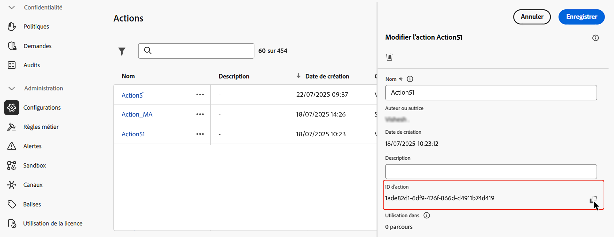
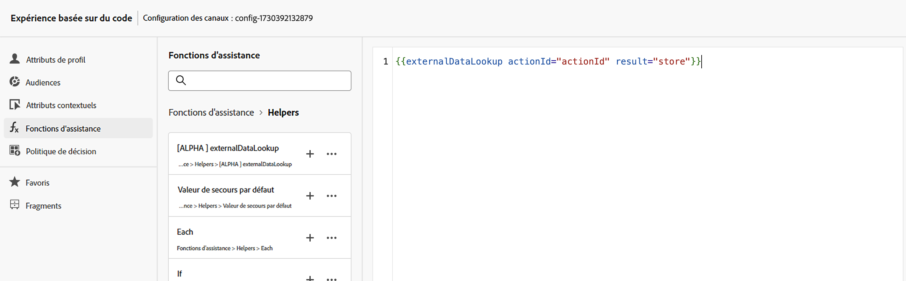
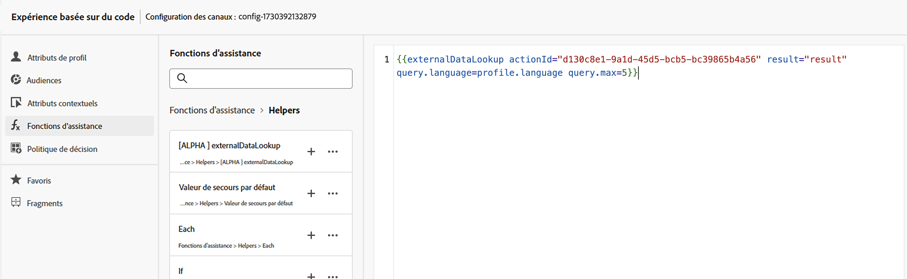
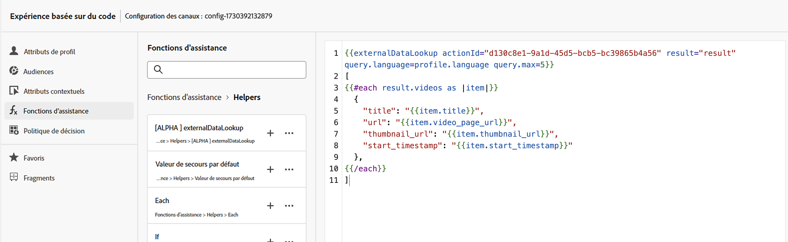
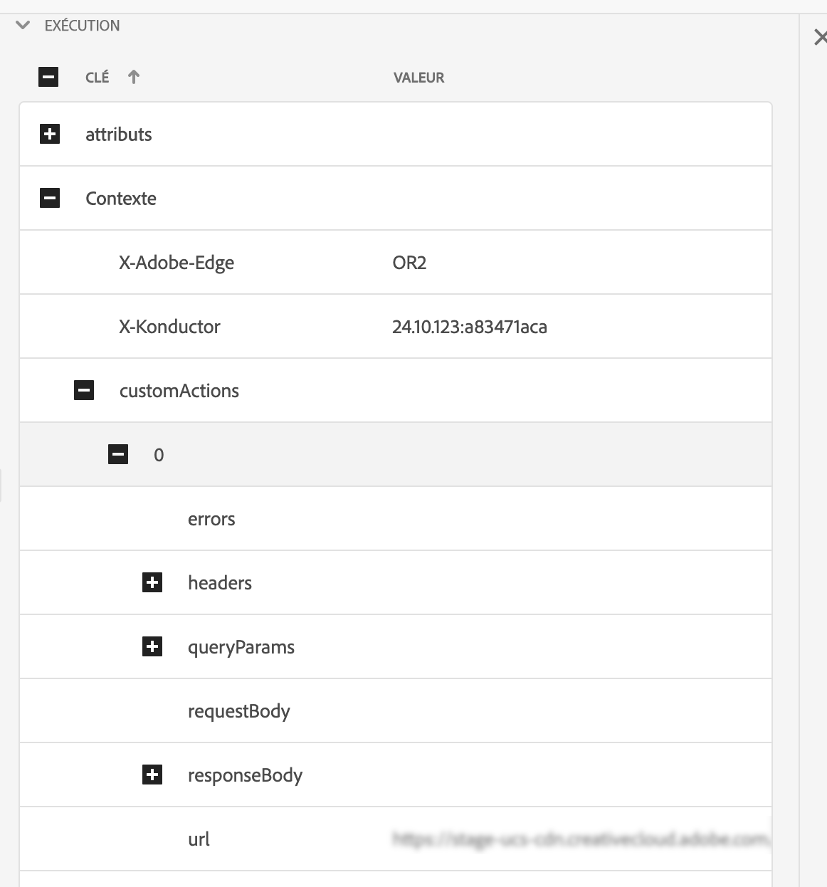

# Assistant de recherche de données externes

L’assistant `externalDataLookup` de l’éditeur de personnalisation [!DNL Journey Optimizer] peut être utilisé pour récupérer dynamiquement des données à partir d’un point d’entrée externe afin de les utiliser pour générer du contenu pour des canaux entrants, comme les canaux Expérience basée sur du code, Web et Message in-app.

>[!AVAILABILITY]
>
>Cette fonctionnalité est disponible uniquement pour un nombre limité d’organisations (disponibilité limitée).

Pour utiliser l’assistant, vous devez d’abord définir une action dans le menu **[!UICONTROL Administration]** > **[!UICONTROL Configurations]**. Une action vous permet de configurer les détails d’un point d’entrée externe, tels que l’URL, la méthode GET ou POST, les paramètres d’en-tête, les paramètres de requête, le schéma JSON du corps POST et le schéma JSON de la réponse.

Une fois l’action définie, elle peut être utilisée à la fois :

* Dans les parcours, dans une activité Action personnalisée pour récupérer du contenu.
* Dans les parcours et les campagnes entrantes, dans un assistant externalDataLookup pour récupérer des données dans une action entrante.

## Mécanismes de sécurisation et limitations

Reportez-vous également à la section Actions personnalisées dans Canaux, campagnes et parcours entrants[!DNL Journey Optimizer]#Mécanismes de sécurisation et directives.

* **Temporisation par défaut** : par défaut, [!DNL Journey Optimizer] utilise une temporisation de 300 ms lors de l’appel d’un point d’entrée externe. Contactez votre représentant ou représentante Adobe pour augmenter cette temporisation pour un point d’entrée.
* **Exploration du schéma de réponse et validation des expressions** : dans l’éditeur de personnalisation, vous ne pouvez pas parcourir le schéma de la réponse du point d’entrée lors de l’insertion d’expressions. [!DNL Journey Optimizer] ne valide pas les références aux attributs JSON de la réponse utilisée dans les expressions.
* **Types de données pris en charge pour les paramètres** : les types de données pris en charge pour les paramètres de variable de payload à remplacer via l’assistant externalDataLookup sont `String`, `Integer`, `Decimal`, `Boolean`, `listString`, `listInt`, `listInteger` et `listDecimal`.
* **Actualisation automatique des actions mises à jour** : les modifications apportées à une configuration d’action ne sont pas prises en compte dans les appels externalDataLookup correspondants dans les campagnes et les parcours actifs. Pour qu’une modification soit prise en compte, vous devez copier ou modifier les campagnes ou parcours actifs qui utilisent l’action dans un assistant externalDataLookup.
* **Remplacement des variables** : pour l’instant, l’utilisation des variables n’est pas prise en charge dans les paramètres de l’assistant externalDataLookup.
* **Chemin dynamique** : pour l’instant, le chemin d’URL dynamique n’est pas pris en charge.
* **Rendu à plusieurs passes** : le rendu à plusieurs passes est pris en charge.
* **Authentification** : pour l’instant, les options d’authentification dans la configuration d’action ne sont pas prises en charge par l’assistant externalDataLookup. En attendant, pour une authentification basée sur une clé API, ou d’autres clés d’autorisation en texte brut, vous pouvez les spécifier comme champs d’en-tête dans la configuration de l’action.

## Configurer une action et utiliser l’assistant

Pour définir une action et utiliser l’assistant de personnalisation, procédez comme suit :

1. Créez une action afin de configurer le point d’entrée pour la recherche. Cette opération ne doit être effectuée qu’une seule fois pour chaque point d’entrée et doit être effectuée par un utilisateur ou une utilisatrice technique. [Découvrez comment configurer une action personnalisée](../action/about-custom-action-configuration.md).

   Notez l’identifiant de l’action et copiez-le.

   

1. Créez une campagne entrante ou une action de parcours. Dans cet exemple, nous montrons comment utiliser l’assistant externalDataLookup dans une action JSON d’expérience basée sur du code, mais il peut être utilisé dans un champ de personnalisation de n’importe quel canal entrant.

1. Modifiez le contenu de l’action, accédez aux fonctions d’assistance dans l’éditeur de personnalisation, puis accédez à **[!UICONTROL Fonctions d’assistance]** > **[!UICONTROL Assistants]**.

1. Cliquez sur le bouton `+` pour insérer l’assistant externalDataLookup. L’expression de l’assistant est insérée dans l’éditeur, avec des valeurs d’espace réservé pour `actionId` et `result`.

   

   Remplacez les valeurs des espaces réservés comme suit :

   * `actionId` : collez l’identifiant d’action copié précédemment.
   * `result` : définissez le nom de votre choix. Vous utiliserez cette variable de résultat pour accéder au contenu récupéré.

1. Ajoutez toute valeur de paramètre de variable à transmettre dans l’appel du point d’entrée. Par exemple, voici comment transmettre un paramètre de langue et un paramètre de nombre maximum d’éléments.

   

1. Utilisez la variable de résultat pour accéder aux données récupérées et les insérer dans le contenu de l’action entrante. Par exemple, voici comment renvoyer un tableau JSON des éléments récupérés à partir du point d’entrée.

   

## Fonctionnement

### Exécution

Lorsqu’une action entrante inclut un assistant externalDataLookup, le point d’entrée est appelé dynamiquement au moment où la requête de personnalisation [!DNL Journey Optimizer] est reçue et traitée par AEP Edge Network.

Cela signifie que le point d’entrée externe doit être en mesure de gérer au moins autant de charge et de débit simultanés que ce que le client envoie à AEP Edge Network pour la surface donnée.

### Syntaxe

`{{externalDataLookup actionId="d130c8e2-9a2d-45d5-bcb6-bc39865b4a56" result="result" optional-parameters...}}`

### Transmettre des paramètres

Lorsque le point d’entrée externe est appelé, toutes les valeurs d’en-tête, les paramètres de requête et la valeur de payload de requête constants définis dans l’action sont envoyés avec les valeurs spécifiées dans la configuration de l’action.

Pour toutes les valeurs d’en-tête variables, les paramètres de requête/chemin ou les valeurs de payload de requête, vous pouvez transmettre des valeurs à l’assistant externalDataLookup de manière dynamique à l’aide de paramètres.

Noms des paramètres :

* Paramètres d’en-tête : `header.<parameter-name>`
* Paramètres de requête : `query.<parameter-name>`
* Paramètres de payload : `payload.<parameter-name>`
* Paramètres de chemin : `dynamic_path.<parameter-name>`

Par exemple :

```
{{externalDataLookup actionId="..." result="result" header.myHeaderParameter="value1" query.myQueryParameter="value2" payload.myPayloadParameter="value3"}}`
```

Les valeurs des paramètres peuvent être des valeurs fixes ou être personnalisées en référençant des champs de profil ou d’autres attributs contextuels, par exemple :

```
{{externalDataLookup actionId="..." result="result" query.myQueryParameter=profile.myProfileValue}}
```

Les paramètres de payload peuvent être fournis à l’aide de la notation par points pour référencer des attributs JSON imbriqués, par exemple :

```
{{externalDataLookup actionId="..." result="result" payload.context.channel="web"}}
```

### Accéder au résultat

Pour accéder aux données récupérées à partir d’un appel de recherche de point d’entrée externe, vous pouvez référencer les champs définis dans la payload de réponse dans la définition d’action à l’aide d’expressions de personnalisation et de fonctions d’assistance.

Par exemple, si la payload de réponse dans l’action ressemble à ceci :

```
{
    "videos": [
        {
            "id": "integer",
            "title": "string",
            "description": "string",
            "thumbnail_url": "string",
            "video_page_url": "string",
            "url": "string",
            "video_type": "string",
            "start_timestamp": "dateOnly",
            "created_on": "dateOnly",
            ...
        }
    ]
}
```

Ensuite, par exemple, vous pouvez récupérer la description de la première vidéo et y accéder dans une action HTML d’expérience basée sur du code, comme suit :

```
{{externalDataLookup actionId="d130c8e2-9a2d-45d5-bcb6-bc39865b4a56" result="result"}}
 
First video description: <b>result.videos[0].description</b>
```

Ou bien, vous pouvez, par exemple, récupérer les éléments et utiliser une boucle afin de renvoyer un tableau d’éléments dans une action JSON d’expérience basée sur du code, comme suit :

```
{{externalDataLookup actionId="d130c8e2-9a2d-45d5-bcb6-bc39865b4a56" result="result"}}
 
[
{{#each result.videos as |item|}}
    {                                                  
        "title": "{{item.title}}",
        "url": "{{item.video_page_url}}",
        "thumbnail_url": "{{item.thumbnail_url}}",
        "start_timestamp": "{{item.start_timestamp}}"
    },
{{/each}}
]
```

## Résolution des problèmes

### Délais d’expiration et gestion des erreurs

[!DNL Journey Optimizer] utilise un délai d’expiration strict lors de l’appel du point d’entrée externe afin de conserver des caractéristiques de performances avec une faible latence et un débit élevé pour Adobe Experience Platform Edge Network.

Si le point d’entrée expire ou que toute autre erreur atteint le point d’entrée, la variable de résultat sera vide. Dans ce cas, toutes les références aux attributs dans la variable de résultat seront également vides. Si vous affichez simplement l’attribut dans le contenu, il s’affichera comme étant vide. Si vous tentez d’utiliser une boucle pour parcourir un attribut de tableau dans le résultat, aucun élément ne sera renvoyé.

Si vous souhaitez gérer de manière plus élégante les délais d’expiration ou les erreurs en affichant du contenu de secours, vous pouvez vérifier si le résultat de la recherche est vide et afficher du contenu de secours dans ce cas.

Par exemple, vous pouvez afficher une valeur de secours pour un seul attribut comme ceci :

```
First video description: 
```

Ou vous pouvez effectuer le rendu conditionnel d’un bloc de contenu entier, comme ceci :

```
{{externalDataLookup actionId="d130c8e2-9a2d-45d5-bcb6-bc39865b4a56" result="result"}}
 

   ... do something with result ...

    ... return fallback content ...

```

### Débogage

Pour faciliter le débogage, les détails des délais d’expiration et des erreurs des recherches de données externes sont inclus dans la vue Edge Delivery d’Adobe Experience Platform Assurance. Si vous ne voyez pas les résultats attendus pour un assistant externalDataLookup dans une action entrante, vous pouvez démarrer une session Assurance, lancer un appel [!DNL Journey Optimizer] à partir d’une implémentation web ou mobile et utiliser la vue Edge Delivery pour vérifier les détails des délais d’expiration ou des erreurs.

Par exemple :

Dans la section Edge Delivery de la trace Assurance, dans les détails d’exécution, un nouveau bloc customActions a été ajouté avec les détails de requête et de réponse, similaire à celui présenté ci-dessous. La section Erreurs peut faciliter votre débogage en cas de problèmes lors de l’exécution d’une action personnalisée.



## Questions fréquentes {#faq-external-data}

Vous trouverez ci-dessous les questions fréquentes sur l’Assistant de recherche de données externes.

Vous avez besoin de plus d’informations ? Utilisez les options de commentaires au bas de cette page pour poser votre question ou contacter la [communauté Adobe Journey Optimizer](https://experienceleaguecommunities.adobe.com/t5/adobe-journey-optimizer/ct-p/journey-optimizer?profile.language=fr){target="_blank"}.

+++ Comment transmettre un attribut contextuel de la requête en tant que paramètre à une recherche de données externe ?

Utilisez le menu Attributs contextuels > Train de données > Événement pour parcourir le schéma d’événement d’expérience que vous utilisez et insérer l’attribut approprié en tant que valeur de paramètre, comme suit :

```
{{externalDataLookup actionId="..." result="result" query.myQueryParameter=context.datastream.event.<schemaId>.my.xdm.attribute}}
```

+++

+++ Est-ce que [!DNL Journey Optimizer] met en cache les réponses des points d’entrée externes ?

Actuellement, non. Cette fonctionnalité sera prise en charge à l’avenir.

+++
