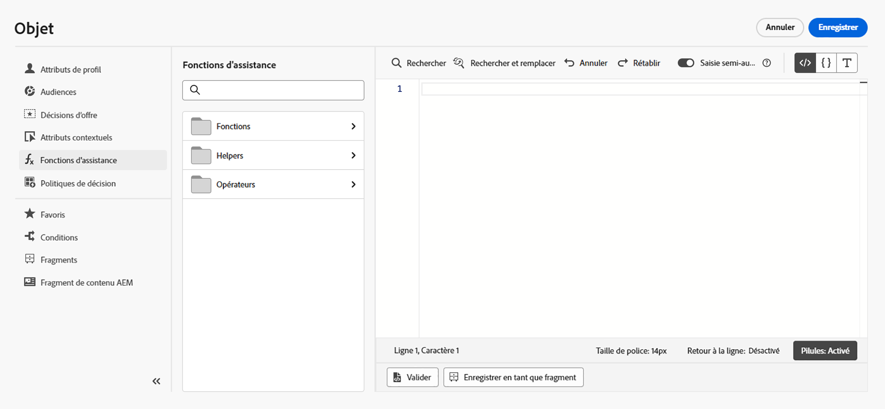

# Prise en main des fonctions d’assistance{#functions}

Utilisez le langage de modèle [!DNL Journey Optimizer] pour effectuer des opérations sur les données, comme des calculs, une mise en forme ou des conversions des données, des conditions, et les manipuler dans le contexte de la personnalisation. Découvrez les instructions de syntaxe de personnalisation sur [cette page](../personalization-syntax.md).

➡️ [Découvrez comment utiliser les fonctions d’assistance dans cette vidéo](#video).

Le langage de modèle est utilisé dans les fonctions d’assistance disponibles dans la liste déroulante de personnalisation de l’éditeur de personnalisation, comme indiqué ci-dessous :

>[!NOTE]
>
>Les fonctions et les fonctionnalités disponibles dans l’éditeur de personnalisation diffèrent de celles disponibles dans l’[éditeur d’expression avancé de Journey](../../building-journeys/expression/expressionadvanced.md).

Dans l’éditeur de personnalisation de [!DNL Journey Optimizer], les fonctions d’assistance sont regroupées en trois catégories : [Fonctions](#functions-helper), [Assistants](#helper-helper) et [Opérateurs](#operators-helper).

Sélectionnez une catégorie pour accéder aux sous-catégories et fonctions.

Accédez aux sous-catégories en cliquant sur l’icône `>`. Sélectionnez une fonction en cliquant sur l’icône `+` : la fonction est automatiquement ajoutée à l’écran de personnalisation.

Cliquez sur l’icône `...` pour afficher la description de la fonction et l’ajouter à vos favoris. [En savoir plus](../personalize.md#fav)

## Fonctions{#functions-helper}

### Fonctions d’agrégation et de tableau

<table>
    <tr>
        <td><a href="aggregation.md#average">Moyenne</a></td><td>Cette fonction renvoie la moyenne arithmétique de toutes les valeurs sélectionnées dans le tableau.</td>
    </tr>
    <tr>
        <td><a href="aggregation.md#count">Nombre</a></td><td>La fonction  renvoie le nombre d'éléments dans le tableau donné</td>
    </tr>
    <tr>
        <td><a href="aggregation.md#count-only-null">Nombre uniquement nul</a></td><td>Cette fonction compte le nombre de valeurs nulles dans la liste.</td>
    </tr>
    <tr>
        <td><a href="aggregation.md#count-with-null">Nombre avec nul</a></td><td>Cette fonction compte tous les éléments de la liste, y compris les valeurs nulles.</td>
    </tr>
    <tr>
        <td><a href="arrays-list.md#distinct">Distinct</a></td><td>Cette fonction récupère les valeurs d'un tableau ou d'une liste dont les valeurs en double sont supprimées.</td>
    </tr>
    <tr>
        <td><a href="arrays-list.md#distinct-count-with-null">Nombre distinct avec nul</a></td><td>Cette fonction compte le nombre de valeurs différentes, y compris les valeurs nulles.</td>
    </tr>
    <tr>
        <td><a href="arrays-list.md#head">Premier élément</a></td><td>Cette fonction renvoie le premier élément d'un tableau ou d'une liste.</td>
    </tr>
    <tr>
        <td><a href="arrays-list.md#first-n">n premiers dans la matrice</a></td><td>Cette fonction renvoie les premiers éléments "N" d'un tableau, lorsqu'ils sont triés dans l'ordre croissant en fonction de l'expression numérique donnée.</td>
    </tr>
    <tr>
        <td><a href="arrays-list.md#in">Dans</a></td><td>Cette fonction permet de déterminer si un élément est un membre d'un tableau ou d'une liste.</td>
    </tr>
    <tr>
        <td><a href="arrays-list.md#includes">Inclut</a></td><td>Cette fonction détermine si un tableau ou une liste contient un élément donné.</td>
    </tr>
    <tr>
        <td><a href="arrays-list.md#intersects">Intersections</a></td><td>Cette fonction détermine si deux tableaux ou deux listes ont au moins un membre commun.</td>
    </tr>
    <tr>
        <td><a href="arrays-list.md#last-n">n derniers dans le tableau</a></td><td>Cette fonction renvoie les derniers éléments "N" d'un tableau, lorsqu'ils sont triés dans l'ordre croissant en fonction de l'expression numérique donnée.</td>
    </tr>
    <tr>
        <td><a href="aggregation.md#max">Maximum</a></td><td>Cette fonction renvoie la plus grande de toutes les valeurs sélectionnées dans un tableau.</td>
    </tr>
    <tr>
        <td><a href="aggregation.md#min">Minimum</a></td><td>Cette fonction renvoie la plus petite de toutes les valeurs sélectionnées dans le tableau.</td>
    </tr>
    <tr>
        <td><a href="arrays-list.md#notin">Pas dans</a></td><td>Cette fonction détermine si un élément n'est pas membre d'un tableau ou d'une liste.</td>
    </tr>
    <tr>
        <td><a href="arrays-list.md#subset">Sous-ensemble de</a></td><td>Cette fonction détermine si un tableau spécifique (tableau A) est un sous-ensemble d'un autre tableau (tableau B), c'est-à-dire si tous les éléments du tableau A sont des éléments du tableau B.</td>
    </tr>
    <tr>
        <td><a href="aggregation.md#sum">Somme</a></td><td>La fonction  renvoie la somme de toutes les valeurs sélectionnées dans le tableau</td>
    </tr>
    <tr>
    <td><a href="arrays-list.md#superset">Sur-ensemble de</a></td><td>Cette fonction détermine si un tableau spécifique (tableau A) est un sur-ensemble d'un autre tableau (tableau B), c'est-à-dire si tous les éléments du tableau A sont des éléments du tableau B.</td>
    </tr>
</table>

### Fonctions date/heure{#date-functions}

<table>
    <tr>
        <td><a href="dates.md#add-days">Ajouter des jours</a></td><td>Cette fonction ajuste une date donnée d’un nombre de jours spécifié, en utilisant des valeurs positives pour incrémenter et des valeurs négatives pour diminuer.</td>
    </tr>
    <tr>
        <td><a href="dates.md#add-hours">Ajouter des heures</a></td><td>Cette fonction ajuste une date donnée d’un nombre d’heures spécifié, en utilisant des valeurs positives pour incrémenter et des valeurs négatives pour diminuer.</td>
    </tr>
    <tr>
        <td><a href="dates.md#add-minutes">Ajouter des minutes</a></td><td>Cette fonction ajuste une date donnée d’un nombre de minutes spécifié, en utilisant des valeurs positives pour incrémenter et des valeurs négatives pour diminuer.</td>
    </tr>
    <tr>
        <td><a href="dates.md#add-months">Ajouter des mois</a></td><td>Cette fonction ajuste une date donnée d’un nombre de mois spécifié, en utilisant des valeurs positives pour incrémenter et des valeurs négatives pour diminuer.</td>
    </tr>
    <tr>
        <td><a href="dates.md#add-seconds">Ajouter des secondes</a></td><td>Cette fonction ajuste une date donnée d’un nombre de secondes spécifié, en utilisant des valeurs positives pour incrémenter et des valeurs négatives pour diminuer.</td>
    </tr>
    <tr>
        <td><a href="dates.md#add-years">Ajouter des années</a></td><td>Cette fonction ajuste une date donnée d’un nombre d’années spécifié, en utilisant des valeurs positives pour incrémenter et des valeurs négatives pour diminuer.</td>
    </tr>
    <tr>
        <td><a href="dates.md#age">Ancienneté</a></td><td>Cette fonction récupère l’ancienneté à partir d’une date donnée.</td>
    </tr>
    <tr>
        <td><a href="dates.md#age-days">Ancienneté en jours</a></td><td>Cette fonction calcule l’ancienneté d’une date donnée en jours, c’est-à-dire le nombre de jours écoulés entre la date donnée et la date actuelle, négatif pour les dates futures et positif pour les dates passées.</td>
    </tr>
    <tr>
        <td><a href="dates.md#age-months">Ancienneté en mois</a></td><td>Cette fonction calcule l’ancienneté d’une date donnée en mois, c’est-à-dire le nombre de mois écoulés entre la date donnée et la date actuelle, négatif pour les dates futures et positif pour les dates passées.</td>
    </tr>
    <tr>
        <td><a href="dates.md#compare-dates">Comparer les dates</a></td><td>Cette fonction compare la première date d’entrée à l’autre. Renvoie 0 si la valeur date1 est égale à date2, -1 si la valeur date1 est antérieure à date2 et 1 si la valeur date1 est postérieure à date2.</td>
    </tr>
    <tr>
        <td><a href="dates.md#convert-zoned-date-time">Convertir ZonedDateTime</a></td><td>Cette fonction convertit une date-heure en un fuseau horaire donné.</td>
    </tr>
    <tr>
        <td><a href="dates.md#current">Heure actuelle en millisecondes</a></td><td>Cette fonction récupère l’heure actuelle en millisecondes d’époque.</td>
    </tr>
    <tr>
        <td><a href="dates.md#date-diff">Différence de date</a></td><td>Cette fonction récupère la différence entre deux dates en nombre de jours</td>
    </tr>
    <tr>
        <td><a href="dates.md#day-month">Jour du mois</a></td><td>Cette fonction renvoie le nombre représentant le jour du mois.</td>
    </tr>
    <tr>
        <td><a href="dates.md#day-week">Jour de la semaine</a></td><td>Cette fonction récupère le jour de la semaine.</td>
    </tr>
    <tr>
        <td><a href="dates.md#day-year">Jour de l’année</a></td><td>Cette fonction récupère le jour de l’année.</td>
    </tr>
    <tr>
        <td><a href="dates.md#diff-seconds">Différence en secondes</a></td><td>Cette fonction renvoie la différence entre deux dates en nombre de secondes.</td>
    </tr>
    <tr>
        <td><a href="dates.md#extract-hours">Extraire les heures</a></td><td>Cette fonction extrait le composant des heures d’un horodatage donné.</td>
    </tr>
    <tr>
        <td><a href="dates.md#extract-minutes">Extraire les minutes</a></td><td>Cette fonction extrait le composant des minutes d’un horodatage donné.</td>
    </tr>
    <tr>
        <td><a href="dates.md#extract-months">Extraire les mois</a></td><td>Cette fonction extrait le composant des mois d’un horodatage donné.</td>
    </tr>
    <tr>
        <td><a href="dates.md#extract-seconds">Extraire les secondes</a></td><td>Cette fonction extrait le composant des secondes d’un horodatage donné.</td>
    </tr>
    <tr>
        <td><a href="dates.md#format-date">Mettre en forme la date</a></td><td>Cette fonction permet de mettre en forme une valeur de date et d’heure.</td>
    </tr>
    <tr>
        <td><a href="dates.md#format-date-locale">Formater la date avec la prise en charge des paramètres régionaux</a></td><td>Cette fonction permet de formater une valeur d’heure et de date au format de la langue correspondante, c’est-à-dire dans les paramètres régionaux souhaités.</td>
    </tr>
    <tr>
        <td><a href="dates.md#get-current-zoned-date-time">Obtenir la CurrentZonedDateTime</a></td><td>Cette fonction renvoie la date et l’heure actuelles avec les informations de fuseau horaire.</td>
    </tr>
    <tr>
        <td><a href="dates.md#hours-difference">Différence en heures</a></td><td>Cette fonction renvoie la différence entre deux dates en nombre d’heures.</td>
    </tr>
    <tr>
        <td><a href="dates.md#diff-minutes">Différence en minutes</a></td><td>Cette fonction renvoie la différence entre deux dates en nombre de minutes.</td>
    </tr>
    <tr>
        <td><a href="dates.md#months-difference">Différence en mois</a></td><td>Cette fonction renvoie la différence entre deux dates en nombre de mois.</td>
    </tr>
    <tr>
        <td><a href="dates.md#set-days">Définir les jours</a></td><td>Cette fonction définit le jour du mois pour la date-heure donnée.</td>
    </tr>
    <tr>
        <td><a href="dates.md#set-hours">Définir les heures</a></td><td>Cette fonction définit l’heure de la date-heure.</td>
    </tr>
    <tr>
        <td><a href="dates.md#to-date-time">En date/heure</a></td><td>Cette fonction convertit une chaîne en date. Elle renvoie la date de l’époque comme sortie pour une entrée non valide.</td>
    </tr>
    <tr>
        <td><a href="dates.md#to-utc">En UTC</a></td><td>Cette fonction convertit une date-heure en UTC.</td>
    </tr>
    <tr>
        <td><a href="dates.md#truncate-day">Tronquer au début de la journée</a></td><td>Cette fonction modifie une date-heure donnée en la définissant sur le début de la journée et sur 00:00.</td>
    </tr>
    <tr>
        <td><a href="dates.md#truncate-quarter">truncateToStartOfQuarter</a></td><td>Cette fonction tronque une date-heure au premier jour de son trimestre (par exemple, 1er janvier, 1er avril, 1er juillet, 1er octobre) à 00:00.
</td>
    </tr>
    <tr>
        <td><a href="dates.md#truncate-week">truncateToStartOfWeek</a></td><td>Cette fonction modifie une date-heure donnée en la définissant sur le début de la semaine (lundi à 00:00).</td>
    </tr>
    <tr>
        <td><a href="dates.md#truncate-year">truncateToStartOfYear</a></td><td>Cette fonction modifie une date-heure donnée en la tronquant au premier jour de l’année (1er janvier) à 00:00.</td>
    </tr>
    <tr>
        <td><a href="dates.md#week-of-year">Semaine de l’année</a></td><td>Cette fonction renvoie la semaine de l’année.</td>
    </tr>
    <tr>
        <td><a href="dates.md#diff-years">Différence en années</a></td><td>Cette fonction renvoie la différence entre deux dates en nombre d’années.</td>
    </tr>
</table>

### Fonctions de mappage {#map-functions}

<table>
    <tr>
        <td><a href="maps.md#get">Obtenir</a></td><td>Cette fonction est utilisée pour récupérer la valeur d'un mappage pour une clé donnée.</td>
    </tr>
    <tr>
        <td><a href="maps.md#keys">Clés</a></td><td>Cette fonction est utilisée pour récupérer toutes les clés d'un mappage donné.</td>
    </tr>
    <tr>
        <td><a href="maps.md#values">Valeurs</a></td><td>Cette fonction récupère toutes les valeurs d'un mappage donné.</td>
    </tr>
</table>

### Fonctions mathématiques {#math-functions}

<table>
    <tr>
        <td><a href="math.md#absolute">Absolu</a></td><td>Cette fonction formate n’importe quel nombre dans sa représentation sensible à la langue.</td>
    </tr>
    <tr>
        <td><a href="math.md#format-number">Formater le nombre</a></td><td>Cette fonction formate n’importe quel nombre dans sa représentation sensible à la langue.</td>
    </tr>
    <tr>
        <td><a href="math.md#random">Aléatoire</a></td><td>Cette fonction renvoie une valeur aléatoire comprise entre 0 et 1.</td>
    </tr>
    <tr>
        <td><a href="math.md#round-down">Arrondir à l’unité inférieure</a></td><td>Cette fonction arrondit un nombre à l’unité inférieure.</td>
    </tr>
    <tr>
        <td><a href="math.md#round-up">Arrondir à l’unité supérieure</a></td><td>Cette fonction arrondit un nombre à l’unité supérieure.</td>
    </tr>
    <tr>
    <td><a href="math.md#to-hex-string">To hex string</a></td><td>Cette fonction convertit n’importe quel nombre en sa chaîne hexadécimale.</td>
    </tr>
    <tr>
    <td><a href="math.md#to-int">ToInt</a></td><td>Convertit tous ces types (nombre, double, entier, long, flottant, court, octet, booléen, chaîne) en entier.</td>
    </tr>
    <tr>
        <td><a href="math.md#to-percentage">En pourcentage</a></td><td>Cette fonction convertit un nombre en pourcentage.</td>
    </tr>
    <tr>
        <td><a href="math.md#to-precision">En précision</a></td><td>Cette fonction convertit un nombre dans la précision requise.</td>
    </tr>
    <tr>
        <td><a href="math.md#to-string">To string</a></td><td>Cette fonction convertit n’importe quel nombre en sa représentation sous forme de chaîne. </td>
    </tr>
</table>

### Fonctions d&#39;objet {#object-functions}

<table>
    <tr>
        <td><a href="objects.md#isNotNull">N’est pas nul</a></td><td>Cette fonction permet de déterminer s'il existe une référence d'objet.</td>
    </tr>
    <tr>
        <td><a href="objects.md#isNull">Est nul</a></td><td>Cette fonction permet de déterminer si une référence d'objet n'existe pas.</td>
    </tr>
</table>

### Fonctions de chaîne {#string-functions}

<table>
    <tr>
        <td><a href="string.md#camelCase">Casse mixte</a></td><td>Cette fonction permet de mettre en majuscule la première lettre de chaque mot d'une chaîne.</td>
    </tr>
    <tr>
        <td><a href="string.md#char-code-at">Char code at</a></td><td>Cette fonction renvoie la valeur ASCII d’un caractère, comme la fonction charCodeAt dans JavaScript.</td>
    </tr>
    <tr>
        <td><a href="string.md#concat">Concat</a></td><td>Cette fonction permet de combiner deux chaînes en une seule.</td>
    </tr>
    <tr>
        <td><a href="string.md#contains">Contient</a></td><td>Cette fonction permet de déterminer si une chaîne contient une sous-chaîne donnée.</td>
    </tr>
    <tr>
        <td><a href="string.md#doesNotContain">Ne contient pas</a></td><td>Cette fonction permet de déterminer si une chaîne ne contient pas une sous-chaîne donnée.</td>
    </tr>
    <tr>
        <td><a href="string.md#doesNotEndWith">Ne se termine pas par</a></td><td>Cette fonction permet de déterminer si une chaîne ne se termine pas par une sous-chaîne donnée.</td>
    </tr>
    <tr>
        <td><a href="string.md#doesNotStartWith">Ne commence pas par</a></td><td>Cette fonction permet de déterminer si une chaîne ne commence pas par une sous-chaîne donnée.</td>
    </tr>
    <tr>
        <td><a href="string.md#encode64">Encode 64</a></td><td>Cette fonction sert à encoder une chaîne.</td>
    </tr>
    <tr>
        <td><a href="string.md#endsWith">Se termine par</a></td><td>Cette fonction permet de déterminer si une chaîne se termine par une sous-chaîne donnée.</td>
    </tr>
        </tr>
    <tr>
        <td><a href="string.md#equals">Égal à</a></td><td>Cette fonction permet de déterminer si une chaîne ne commence pas par une sous-chaîne donnée, avec respect de la casse.</td>
    </tr>
    <tr>
        <td><a href="string.md#equalsIgnoreCase">Égal à ignorer la casse</a></td><td>Cette fonction permet de déterminer si une chaîne ne commence pas par une sous-chaîne donnée, sans respect de la casse.</td>
    </tr>
    <tr>
        <td><a href="string.md#extractEmailDomain">Extraire le domaine e-mail</a></td><td>Cette fonction est utilisée pour extraire le domaine d'une adresse e-mail.</td>
    </tr>
    <tr>
        <td><a href="string.md#format-currency">Formater la devise</a></td><td>Cette fonction convertit n’importe quel nombre en sa représentation monétaire sensible à la langue correspondante en fonction des paramètres régionaux transmis sous forme de chaîne dans le deuxième argument.</td>
    </tr>
    <tr>
        <td><a href="string.md#get-url-host">Obtenir l’hôte d’URL</a></td><td>Cette fonction est utilisée pour obtenir l’hôte d’URL.</td>
    </tr>
    <tr>
        <td><a href="string.md#get-url-path">Obtenir le chemin d’accès à l’URL</a></td><td>Cette fonction est utilisée pour obtenir le chemin de l’URL.</td>
    </tr>
    <tr>
        <td><a href="string.md#get-url-protocol">Obtenir le protocole d’URL</a></td><td>Cette fonction est utilisée pour obtenir le protocole d’URL</td>
    </tr>
    <tr>
        <td><a href="string.md#index-of">Index de</a></td><td>Cette fonction renvoie la position (dans le premier argument) de la première occurrence du deuxième paramètre. Renvoie -1 s’il n’existe aucune correspondance</td>
    </tr>
    <tr>
        <td><a href="string.md#isEmpty">isEmpty</a></td><td>Cette fonction permet de vérifier si une chaîne ou une expression est vide.</td>
    </tr>
    <tr>
        <td><a href="string.md#is-not-empty">N’est pas vide</a></td><td>Cette fonction renvoie la valeur true si la chaîne du paramètre n’est pas vide.</td>
    </tr>
    <tr>
        <td><a href="string.md#last-index-of">Dernier index de</a></td><td>Cette fonction renvoie la position (dans le premier argument) de la dernière occurrence du deuxième paramètre. Renvoie -1 s’il n’existe aucune correspondance.</td>
    </tr>
    <tr>
        <td><a href="string.md#leftTrim">Supprimer à gauche</a></td><td>Cette fonction supprime les espaces blancs au début d'une chaîne.</td>
    </tr>
    <tr>
        <td><a href="string.md#length">Longueur</a></td><td>Cette fonction est utilisée pour obtenir le nombre de caractères d'une chaîne ou d'une expression.</td>
    </tr>
    <tr>
        <td><a href="string.md#like">Comme</a></td><td>Cette fonction permet de déterminer si une chaîne correspond à un modèle donné.</td>
    </tr>
    <tr>
        <td><a href="string.md#lower">Minuscules</a></td><td>Cette fonction convertit une chaîne en minuscules.</td>
    </tr>
    <tr>
        <td><a href="string.md#mask">Masque</a></td><td>Cette fonction est utilisée pour remplacer une partie d’une chaîne par des caractères « X ».</td>
    </tr>
    <tr>
        <td><a href="string.md#matches">Correspond à</a></td><td>Cette fonction permet de déterminer si une chaîne correspond à une expression régulière donnée.</td>
    </tr>
    <tr>
        <td><a href="string.md#md5">MD5</a></td><td>Cette fonction renvoie le hachage md5 de la chaîne d’entrée.</td>
    </tr>
    <tr>
        <td><a href="string.md#notEqualTo">Différent de</a></td><td>Cette fonction permet de déterminer si une chaîne est différente d'une chaîne donnée.</td>
    </tr>
    <tr>
        <td><a href="string.md#not-equal-with-ignore-case">Différent de Ignorer la casse</a></td><td>Cette fonction compare deux chaînes en ignorant la casse.</td>
    </tr>
    <tr>
        <td><a href="string.md#regexGroup">Groupe d’expressions régulières</a></td><td>Cette fonction est utilisée pour extraire des informations spécifiques en fonction de l'expression régulière fournie.</td>
    </tr>
    <tr>
        <td><a href="string.md#replace">Remplacer</a></td><td>Cette fonction remplace une sous-chaîne donnée dans une chaîne par une autre sous-chaîne.</td>
    </tr>
    <tr>
        <td><a href="string.md#replaceAll">Tout remplacer</a></td><td>Cette fonction remplace toutes les sous-chaînes d'un texte correspondant à la "cible" par la chaîne de "remplacement" littérale spécifiée.</td>
    </tr>
    <tr>
        <td><a href="string.md#rightTrim">Supprimer à droite</a></td><td>Cette fonction supprime les espaces blancs à la fin d'une chaîne. </td>
    </tr>
    <tr>
        <td><a href="string.md#sha256">SHA256</a></td><td>Cette fonction calcule et renvoie le hachage sha256 d’une chaîne.</td>
    </tr>
    <tr>
        <td><a href="string.md#split">Fractionner</a></td><td>Cette fonction est utilisée pour fractionner une chaîne selon un caractère donné.</td>
    </tr>
    <tr>
        <td><a href="string.md#startsWith">Commence par</a></td><td>Cette fonction permet de déterminer si une chaîne commence par une sous-chaîne donnée.</td>
    </tr>
    <tr>
        <td><a href="string.md#string-to-date">Chaîne à date</a></td><td>Cette fonction convertit une valeur de chaîne en valeur date / heure.</td>
    </tr>
    <tr>
        <td><a href="string.md#string-to-integer">Chaîne en entier</a></td><td>Cette fonction convertit une valeur de chaîne en valeur entière.</td>
    </tr>
    <tr>
        <td><a href="string.md#string-to-number">Chaîne en nombre</a></td><td>Cette fonction est utilisée pour convertir une chaîne en nombre. Elle renvoie la même chaîne que la sortie pour une entrée non valide.</td>
    </tr>
    <tr>
        <td><a href="string.md#sub-string">Sous-chaîne</a></td><td>Cette fonction renvoie la sous-chaîne de l’expression de chaîne entre l’index de début et l’index de fin.</td>
    </tr>
    <tr>
        <td><a href="string.md#titleCase">Casse du titre</a></td><td>Cette fonction permet de mettre en majuscules les premières lettres de chaque mot d’une chaîne.</td>
    </tr>
    <tr>
        <td><a href="string.md#to-bool">En valeur booléenne</a></td><td>Cette fonction convertit une valeur d’argument en valeur booléenne, selon son type.</td>
    </tr>
    <tr>
        <td><a href="string.md#to-date-time">En date/heure</a></td><td>Cette fonction est utilisée pour convertir une chaîne en date. Elle renvoie la date de l’époque comme sortie pour une entrée non valide.</td>
    </tr>
    <tr>
        <td><a href="string.md#to-date-time-only">En date/heure uniquement</a></td><td>Cette fonction convertit une valeur d’argument en une valeur date / heure uniquement. Elle renvoie la date de l’époque comme sortie pour une entrée non valide.</td>
    </tr>
    <tr>
        <td><a href="string.md#trim">Supprimer</a></td><td>Cette fonction supprime les espaces blancs du début et de la fin d'une chaîne.</td>
    </tr>
    <tr>
        <td><a href="string.md#upper">Majuscules</a></td><td>Cette fonction convertit une chaîne en majuscules.</td>
    </tr>
    <tr>
        <td><a href="string.md#url-decode">Décodage de l’URL</a></td><td>Cette fonction est utilisée pour décoder une chaîne codée en URL.</td>
    </tr>
    <tr>
        <td><a href="string.md#url-encode">Encodage de l’URL</a></td><td>Cette fonction est utilisée pour encoder une chaîne en URL.</td>
    </tr>
</table>

## Assistants{#helper-helper}

Les assistants sont détaillés sur [cette page](helpers.md).

<table>
    <tr>
        <td><a href="helpers.md#default">Valeur de secours par défaut</a></td><td>Cette fonction permet d’effectuer le rendu d’une variable avec la valeur par défaut.</td>
    </tr>
    <tr>
        <td><a href="helpers.md#each">Each</a></td><td>Cette fonction est utilisée pour effectuer une itération sur un tableau</td>
    </tr>
    <tr>
        <td><a href="helpers.md#execution-metadata">Métadonnées d’exécution</a></td><td>Cet assistant capture les métadonnées clé-valeur personnalisées pendant le rendu du message afin qu’elles puissent être stockées dans l’objet de métadonnées d’exécution.</td>
    </tr>
    <tr>
        <td><a href="helpers.md#if-function">Si</a></td><td>Cette fonction est utilisée pour définir un bloc conditionnel. Si l'évaluation de l'expression renvoie 'true', le bloc est rendu.</td>
    </tr>
    <tr>
        <td><a href="helpers.md#let">Let</a></td><td>Cette fonction permet à une expression d'être stockée en tant que variable et d'être utilisée ultérieurement dans une requête.</td>
    </tr>
   <tr>
        <td><a href="helpers.md#unless">Unless</a></td><td>Cette fonction est utilisée pour définir un bloc conditionnel. Si l'évaluation de l'expression renvoie 'false', le bloc est rendu.</td>
    </tr>
    <tr>
        <td><a href="helpers.md#with">Avec</a></td><td>Cette fonction est utilisée pour modifier le jeton d'évaluation d'une partie de modèle.</td>
    </tr>
</table>

## Opérateurs{#operators-helper}

### Fonctions arithmétiques {#arithmetic-helper}

Les fonctions arithmétiques sont utilisées pour effectuer des calculs de base sur des valeurs.

<table>
    <tr>
        <td><a href="arithmetic-functions.md#add">Addition</a></td><td>Cet opérateur est utilisé pour trouver la somme de deux expressions d'argument.</td>
    </tr>
    <tr>
        <td><a href="arithmetic-functions.md#divide">Division</a></td><td>Cet opérateur est utilisé pour trouver le quotient de deux expressions d'argument.</td>
    </tr>
    <tr>
        <td><a href="arithmetic-functions.md#multiply">Multiplication</a></td><td>Cet opérateur est utilisé pour trouver le produit de deux expressions d'argument.</td>
    </tr>
    <tr>
        <td><a href="arithmetic-functions.md#remainder">Reste</a> </td><td>Cet opérateur est utilisé pour trouver le reste après la division des deux expressions d'argument.</td>
    </tr>
    <tr>
        <td><a href="arithmetic-functions.md#substract">Soustraction</a> </td><td>Cet opérateur détecte la différence entre deux expressions.</td>
    </tr>
</table>

### Fonctions booléennes {#boolean-functions}

Les fonctions booléennes sont utilisées pour exécuter une logique booléenne sur différents éléments.

<table>
    <tr>
        <td><a href="operators.md#and">Et</a></td><td>Cet opérateur crée une conjonction logique.</td>
    </tr>
    <tr>
        <td><a href="operators.md#or">Ou</a></td><td>Cet opérateur crée une disjonction logique.</td>
    </tr>
</table>

### Fonctions de comparaison {#comparison-functions}

Les fonctions de comparaison sont utilisées pour comparer les différentes expressions et valeurs, renvoyant &#39;true&#39; ou &#39;false&#39; en conséquence.

<table>
    <tr>
        <td><a href="operators.md#equals">Égal à</a></td><td>Cette opération vérifie si les valeurs sont égales.</td>
    </tr>
    <tr>
        <td><a href="operators.md#greaterthan">Supérieur à</a></td><td>Cet opérateur vérifie si la première valeur est supérieure à la seconde valeur.</td>
    </tr>
    <tr>
        <td><a href="operators.md#greaterthanorequal">Est supérieur ou égal à</a></td><td>Cet opérateur vérifie si la première valeur est supérieure ou égale à la seconde valeur</td>
    </tr>
    <tr>
        <td><a href="operators.md#lessthanorequal">Est inférieur ou égal à</a> </td><td>Cet opérateur vérifie si la première valeur est inférieure ou égale à la deuxième valeur.</td>
    </tr>
    <tr>
        <td><a href="operators.md#notequal">Différent de</a></td><td>Cet opérateur vérifie si l'expression donnée n'est pas égale à la valeur donnée.</td>
    </tr>
</table>

## Vidéo pratique{#video}

Découvrez comment transformer des valeurs de personnalisation à l&#39;aide de fonctions d&#39;assistance à la personnalisation et comprendre différents cas d&#39;utilisation des fonctions d&#39;assistance.

>[!VIDEO](https://video.tv.adobe.com/v/334244?quality=12)
