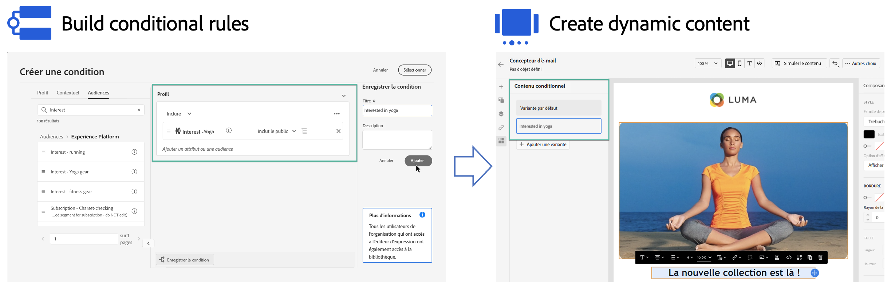

# Commencer avec le contenu dynamique {#start-dynamic-content}

>[!CONTEXTUALHELP]
>id="ajo_conditions_list"
>title="Conditions"
>abstract="Les règles conditionnelles vous permettent d’afficher plusieurs variantes de contenu dans vos messages en fonction des attributs de profil, des événements contextuels ou des audiences."

Le contenu dynamique permet d’adapter le contenu de vos messages en fonction des **règles conditionnelles** qui peuvent être constituées d’attributs de profil, d’événements contextuels ou d’audiences. Les règles conditionnelles sont créées à l’aide d’un créateur de règles visuel dans l’éditeur de personnalisation, où vous pouvez les stocker pour les réutiliser ultérieurement dans vos parcours et vos campagnes.

Les règles conditionnelles peuvent être utilisées dans le concepteur d’e-mails et dans l’éditeur de personnalisation pour **créer du contenu dynamique** qui s’adapte aux profils ciblés dans vos messages.

* [Découvrez comment utiliser les règles conditionnelles](create-conditions.md)
* [Découvrez comment créer du contenu dynamique](dynamic-content.md)

## Vidéo pratique {#video}

Découvrez comment créer du contenu dynamique à l’aide du créateur de règles de condition.

>[!VIDEO](https://video.tv.adobe.com/v/3409815?quality=12)
