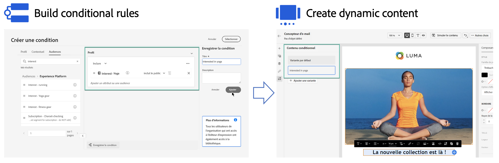

# Commencer avec le contenu dynamique {#start-dynamic-content}

>[!BEGINSHADEBOX]

**Sur cette page :** Découvrez comment le contenu dynamique utilise des règles conditionnelles créées à partir d’attributs de profil, d’événements contextuels et d’audiences pour adapter vos messages aux profils ciblés.

>[!ENDSHADEBOX]

>[!CONTEXTUALHELP]
>id="ajo_conditions_list"
>title="Conditions"
>abstract="Les règles conditionnelles vous permettent d’afficher plusieurs variantes de contenu dans vos messages en fonction des attributs de profil, des événements contextuels ou des audiences."

Le contenu dynamique permet d’adapter le contenu de vos messages en fonction des **règles conditionnelles** qui peuvent être constituées d’attributs de profil, d’événements contextuels ou d’audiences. Les règles conditionnelles sont créées à l’aide d’un créateur de règles visuel dans l’éditeur de personnalisation, où vous pouvez les stocker pour les réutiliser ultérieurement dans vos parcours et vos campagnes.

Les règles conditionnelles peuvent être utilisées dans le concepteur d’e-mails et dans l’éditeur de personnalisation pour **créer du contenu dynamique** qui s’adapte aux profils ciblés dans vos messages.

* [Découvrez comment utiliser les règles conditionnelles](create-conditions.md)
* [Découvrez comment créer du contenu dynamique](dynamic-content.md)

## Vidéo pratique {#video}

Découvrez comment créer du contenu dynamique à l’aide du créateur de règles de condition.

>[!VIDEO](https://video.tv.adobe.com/v/3409815?quality=12)

## Référence rapide {#quick-reference}

Cette section contient des connaissances structurées destinées à soutenir l’interprétation, la récupération et la réponse aux questions liées à ce sujet.

Pour une compréhension totale, ces informations doivent être combinées avec la documentation de cette page. Aucune des sources n’est conçue pour être autonome. La page décrit la fonctionnalité, tandis que cette section fournit un contexte supplémentaire qui permet de clarifier la terminologie, l’intention, l’applicabilité et les contraintes.

>[!BEGINTABS]

>[!TAB Vue d’ensemble]

**TL;DR**

Cette page présente le contenu dynamique dans Journey Optimizer : comment les règles conditionnelles créées à partir des attributs de profil, des événements contextuels et des audiences permettent aux messages de s’adapter aux profils qu’ils ciblent.

**Intentions**

* Comprendre ce qu’est le contenu dynamique et en quoi il diffère du contenu du message statique
* Identifiez les deux points d’entrée du contenu dynamique : le Designer Email et l’éditeur de personnalisation
* Accédez au guide approprié pour créer des règles conditionnelles ou créer du contenu dynamique

>[!TAB Glossaire]

* **Contenu dynamique** : contenu du message qui s’adapte en fonction de règles conditionnelles. Un contenu différent est présenté à différents profils selon que les conditions définies sont remplies ou non. *(spécifique au produit)*
* **Règle conditionnelle** : ensemble de critères (basés sur des attributs de profil, des événements contextuels ou des audiences) qui détermine la variante de contenu reçue par un profil. *(spécifique au produit)*
* **Créateur visuel de règles** : zone de travail interactive dans l’éditeur de personnalisation utilisé pour créer et stocker des règles conditionnelles. *(spécifique au produit)*

>[!TAB  Terminologie ]

* **Nom canonique :** contenu dynamique — variantes : contenu conditionnel, contenu personnalisé
* **Synonymes :** « règles conditionnelles » = « conditions » (comme indiqué dans l’interface utilisateur)
* **Ne pas confondre :** contenu dynamique (contenu qui s’adapte par profil en fonction de règles conditionnelles) ≠ contenu statique (le même contenu affiché pour tous les destinataires, quelles que soient les conditions)

>[!TAB FAQ]

**Q : Quels types de critères les règles conditionnelles peuvent-elles utiliser ?**

Les règles conditionnelles peuvent être créées à partir des attributs de profil, des événements contextuels et de l’appartenance à une audience.

**Q : Où les règles conditionnelles peuvent-elles être utilisées pour créer du contenu dynamique ?**

Dans le Designer d’e-mail (pour créer des variantes de composant) et dans l’éditeur de personnalisation (pour encapsuler des blocs d’expression avec des conditions). Les deux points d’entrée sont abordés dans des pages liées.

**Q : Les règles conditionnelles peuvent-elles être réutilisées dans les parcours et les campagnes ?**

Oui. Les règles conditionnelles peuvent être stockées pour une réutilisation ultérieure dans les parcours et les campagnes.

>[!ENDTABS]

<!-- ai-section-version: 1 | source-hash: 0f90f9b5 -->
