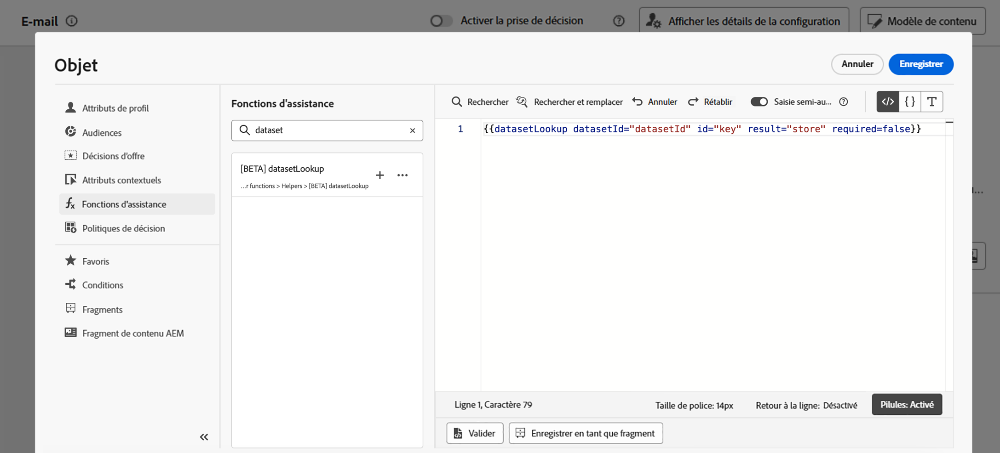
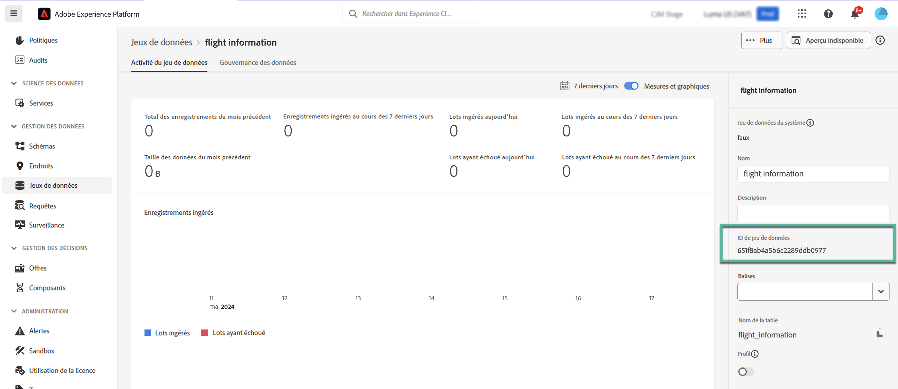

# Utilisation des données Adobe Experience Platform pour la personnalisation (version bêta) {#aep-data}

>[!AVAILABILITY]
>
>Cette fonctionnalité est actuellement disponible uniquement en version bêta privée.
>
>Pour l’instant, elle n’est disponible qu’à des fins de test dans l’environnement de test hors production que vous avez fourni à Adobe et pour les jeux de données demandés pour la version bêta.

Journey Optimizer vous permet d’exploiter les données de Adobe Experience Platform dans l’éditeur d’expression pour [personnaliser votre contenu ;](../personalization/personalize.md). Les étapes sont les suivantes :

1. Ouvrez l’éditeur d’expression, disponible dans chaque contexte où vous pouvez définir la personnalisation, par exemple les messages. [Découvrez comment travailler avec l’éditeur d’expression](../personalization/personalization-build-expressions.md).

1. Accédez à la liste des fonctions d’assistance et ajoutez le **MultiEntity** fonction d’assistance au volet de code.

   

1. Cette fonction fournit une syntaxe prédéfinie pour vous permettre d’appeler des champs à partir de vos jeux de données Adobe Experience Platform. La syntaxe se présente comme suit :

   ```
   {{entity.datasetId="datasetId" id="key" result="store"}}
   ```

   * **entity.datasetId** est l’identifiant du jeu de données que vous utilisez,
   * **id** est le champ utilisé comme identité principale dans le jeu de données,
   * **result** est un nom arbitraire que vous devez fournir pour référencer toutes les valeurs de champ que vous allez récupérer du jeu de données. Cette valeur sera utilisée dans votre code pour appeler chaque champ.

   +++Où récupérer un identifiant de jeu de données ?

   Les identifiants de jeu de données peuvent être récupérés dans l’interface utilisateur de Adobe Experience Platform. Découvrez comment utiliser des jeux de données dans le [Documentation Adobe Experience Platform](https://experienceleague.adobe.com/en/docs/experience-platform/catalog/datasets/user-guide#view-datasets){target="_blank"}.

   

+++

   +++Comment identifier un champ d’identité principal dans un jeu de données ?

   Le champ qui a été défini comme identité principale d’un jeu de données donné se trouve dans le schéma lié au jeu de données. Découvrez comment utiliser les champs d’identité dans le [Documentation Adobe Experience Platform](https://experienceleague.adobe.com/en/docs/experience-platform/xdm/ui/fields/identity){target="_blank"}.

   

+++

1. Adaptez la syntaxe à vos besoins. Dans cet exemple, nous allons récupérer les données relatives aux vols des passagers. La syntaxe se présente comme suit :

   ```
   {{entity.datasetId="1234567890abcdtId" id="profile.personalEmail.address" result="flight"}}
   ```

   * Nous travaillons dans le jeu de données dont l’identifiant est &quot;1234567890abcdtId&quot;,
   * Le champ utilisé comme clé primaire dans ce jeu de données est l’adresse électronique,
   * Nous souhaitons inclure toutes les valeurs de champ sous la référence &quot;vol&quot;.

1. Une fois que la syntaxe à appeler dans le jeu de données Adobe Experience Platform a été configurée, vous pouvez spécifier les champs que vous souhaitez récupérer. La syntaxe se présente comme suit :

   ```
   {{result.fieldId}}
   ```

   * **result** est la valeur que vous avez attribuée à la variable **result** du paramètre **MultiEntity** fonction d’assistance. Dans cet exemple, &quot;flight&quot;.
   * **fieldID** est l’identifiant du champ que vous souhaitez récupérer. Cet identifiant est visible dans l’interface utilisateur de Adobe Experience Platform lors de la navigation dans votre jeu de données. Développez la section ci-dessous pour afficher un exemple :

     +++Où récupérer un identifiant de champ ?

     Les ID de champs peuvent être récupérés lors de la prévisualisation d’un jeu de données dans l’interface utilisateur de Adobe Experience Platform. Découvrez comment prévisualiser des jeux de données dans le [Documentation Adobe Experience Platform](https://experienceleague.adobe.com/en/docs/experience-platform/catalog/datasets/user-guide#preview){target="_blank"}.

     

+++

   Dans cet exemple, nous allons utiliser des informations relatives à l&#39;heure d&#39;embarquement et à la porte des passagers. Nous ajoutons donc ces deux lignes :

   * `{{flight._myorg.booking.boardingTime}}`
   * `{{flight._myorg.booking.gate}}`

1. Maintenant que votre code est prêt, vous pouvez compléter votre contenu comme vous le faites habituellement et le tester à l’aide de la fonction **Simulation du contenu** pour vérifier la personnalisation. [Découvrez comment prévisualiser et tester le contenu](../content-management/preview-test.md)


   
