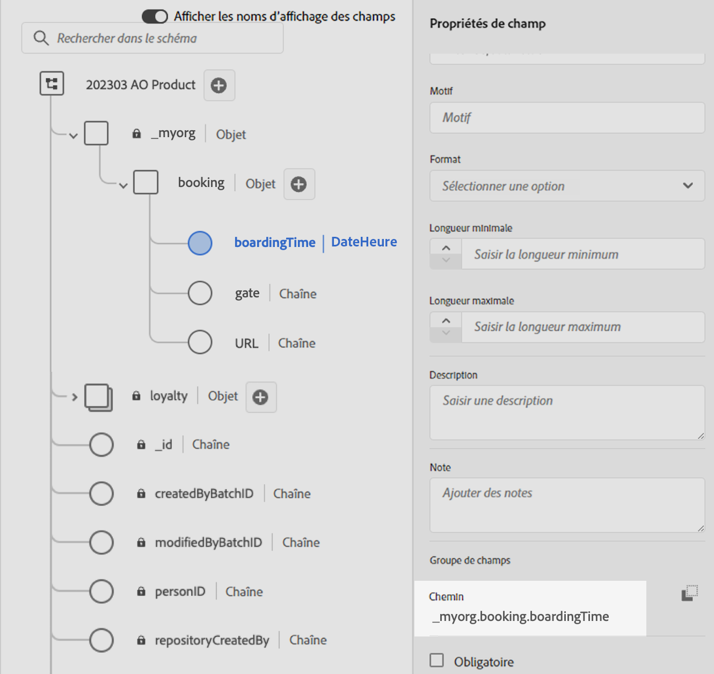

# Utiliser des données Adobe Experience Platform à des fins de personnalisation{#aep-data}

>[!AVAILABILITY]
>
>Cette fonctionnalité est actuellement disponible en version bêta publique pour l’ensemble des clientes et des clients.
>
>Pour utiliser cette fonctionnalité, vous devez d’abord accepter les termes de la version bêta pour votre entreprise qui s’affichent lors de l’ajout des nouvelles fonctions d’assistance « datasetLookup » dans l’éditeur de personnalisation.

Journey Optimizer vous permet d’utiliser les données d’Adobe Experience Platform dans l’éditeur de personnalisation pour [personnaliser votre contenu](../personalization/personalize.md). Pour ce faire, les jeux de données nécessaires à la personnalisation de la recherche doivent d’abord être activés par le biais d’un appel API, comme décrit ci-dessous. Une fois que vous avez terminé, vous pouvez utiliser leurs données pour personnaliser votre contenu dans [!DNL Journey Optimizer].

## Restrictions et directives de la version bêta {#guidelines}

Avant de commencer, consultez les restrictions et les directives suivantes :

### Activation des jeux de données {#enablement}

* **La taille d’un jeu de données** est limitée à 5 Go pour les jeux de données de production et à 1 Go pour les jeux de données de sandbox de développement.
* **Un maximum de 50 jeux de données peuvent être activés** en même temps pour la recherche, pour une organisation donnée.
* **Le nombre d’enregistrements** est limité à 5M dans les jeux de données de production et à 1M dans les jeux de données de sandbox de développement.
* **L’étiquetage et l’application de l’utilisation des données** n’est pas appliquée pour l’instant pour les jeux de données activés pour la recherche.
* **Les jeux de données activés pour la recherche et utilisés dans la personnalisation ne sont pas protégés contre la suppression**. Il vous appartient de noter les jeux de données utilisés pour la personnalisation afin de vous assurer qu’ils ne seront pas supprimés ou retirés.

### Personnalisation utilisant des données [!DNL Adobe Experience Platform] {#perso}

* **Canaux pris en charge** : pour l’instant, cette fonctionnalité n’est disponible que pour une utilisation dans les canaux e-mail, SMS et courrier.
* **L’étiquetage et l’application de l’utilisation des données** n’est pas appliquée pour l’instant pour les jeux de données activés pour la recherche.
* **Fragments** : pour le moment, la personnalisation de la recherche de jeux de données ne peut pas être placée dans des fragments d’expression ou visuels.

## Activer un jeu de données pour la recherche de données {#enable}

Afin d’exploiter les données de votre jeu de données pour la personnalisation, vous devez utiliser un appel API pour récupérer son statut et activer le service de recherche.

### Conditions préalables {#prerequisites-enable}

* Suivez les instructions détaillées dans [cette documentation](https://developer.adobe.com/journey-optimizer-apis/references/authentication/) pour configurer votre environnement afin d’envoyer des commandes d’API.
* Les API Adobe Journey Optimizer et Adobe Experience Platform doivent être ajoutées au projet de développement.

  

* Vous devez disposer de l’autorisation « Gérer des jeux de données » dans le cadre de votre rôle.
* Le schéma sur lequel le jeu de données est basé doit contenir une **identité principale** pouvant servir de clé de recherche.

### Structure de l’appel API {#call}

```
curl -s -XPATCH "https://platform.adobe.io/data/core/entity/lookup/dataSets/${DATASET_ID}/${ACTION}" \ -H "Authorization: Bearer ${ACCESS_TOKEN}" \ -H "x-api-key: ${API_KEY}" \ -H "x-gw-ims-org-id: ${IMS_ORG}" \ -H "x-sandbox-name: ${SANDBOX_NAME}"
```

Où ce qui suit est vrai :

* **L’URL** est `https://platform.adobe.io/data/core/entity/lookup/dataSets/${DATASET_ID}/${ACTION}`.
* **L’identifiant du jeu de données** est le jeu de données que vous souhaitez activer.
* **L’action** est Activer OU Désactiver.
* **Le jeton d’accès** peut être récupéré à partir de Developer Console.
* **La clé d’API** peut être récupérée à partir de Developer Console.
* L’**identifiant d’organisation IMS** est votre organisation Adobe.
* Le **nom du sandbox** est le nom du sandbox dans lequel se trouve le jeu de données (c’est-à-dire prod, dev, etc.).

>[!NOTE]
>
>Si vous rencontrez l’erreur ci-dessous lors de la tentative d’un appel API pour activer des jeux de données, essayez de supprimer les API Adobe Journey Optimizer de votre projet Developer Console, puis de les rajouter.
>
>```
>
>"error_code": "403003", 
>"message": "Api Key is invalid"
>
>```

## Exploiter un jeu de données pour la personnalisation {#leverage}

Une fois qu’un jeu de données a été activé pour la personnalisation de la recherche à l’aide d’un appel API, vous pouvez utiliser ses données pour personnaliser votre contenu dans [!DNL Journey Optimizer].

1. Ouvrez l’éditeur de personnalisation, disponible dans tout contexte où vous pouvez définir une personnalisation, tel que les messages. [Découvrir comment utiliser l’éditeur de personnalisation](../personalization/personalization-build-expressions.md)

1. Accédez à la liste des fonctions d’assistance et ajoutez la fonction d’assistance **datasetLookup** au volet de code.

   

1. Cette fonction fournit une syntaxe prédéfinie pour vous permettre d’appeler des champs à partir de vos jeux de données Adobe Experience Platform. La syntaxe se présente comme suit :

   ```
   {{datasetLookup datasetId="datasetId" id="key" result="store" required=false}}
   ```

   * **datasetId** est l’identifiant du jeu de données que vous utilisez.
   * **id** est l’identifiant de la colonne source qui doit être associée à l’identité principale du jeu de données de recherche.

     >[!NOTE]
     >
     >La valeur saisie pour ce champ peut être un identifiant de champ (*profile.packages.packageSKU*), un champ transmis dans un événement de parcours (*context.journey.events.event_ID.productSKU*) ou une valeur statique (*sku007653*). Dans tous les cas, le système utilisera la valeur et la recherche du jeu de données pour vérifier si celui-ci correspond à une clé.
     >
     >Si vous utilisez une valeur de chaîne littérale pour la clé, conservez le texte entre guillemets. Par exemple : `{{datasetLookup datasetId="datasetId" id="SKU1234" result="store" required=false}}`. Si vous utilisez une valeur d’attribut comme clé dynamique, supprimez les guillemets. Par exemple : `{{datasetLookup datasetId="datasetId" id=category.product.SKU result="SKU" required=false}}`

   * **result** est un nom arbitraire que vous devez fournir pour référencer toutes les valeurs de champ que vous allez récupérer du jeu de données. Cette valeur sera utilisée dans votre code pour appeler chaque champ.

   * **required=false** : si la valeur required est définie sur TRUE, le message n’est diffusé que si une clé correspondante est trouvée. Si la valeur required est définie sur FALSE, une clé correspondante n’est pas requise et le message peut toujours être diffusé. Notez que si la valeur required est définie sur FALSE, il est recommandé de tenir compte des valeurs de secours ou des valeurs par défaut dans le contenu de votre message.

   +++Où récupérer un identifiant de jeu de données ?

   Les identifiants de jeu de données peuvent être récupérés dans l’interface d’utilisation d’Adobe Experience Platform. Découvrez comment utiliser les jeux de données dans la [documentation d’Adobe Experience Platform](https://experienceleague.adobe.com/fr/docs/experience-platform/catalog/datasets/user-guide#view-datasets){target="_blank"}.

   

   +++

1. Adaptez la syntaxe à vos besoins. Dans cet exemple, nous allons récupérer les données relatives aux vols des passagères et passagers. La syntaxe se présente comme suit :

   ```
   {{datasetLookup datasetId="1234567890abcdtId" id=profile.upcomingFlightId result="flight"}}
   ```

   * Nous travaillons dans le jeu de données dont l’identifiant est « 1234567890abcdtId »,
   * Le champ que nous voulons utiliser pour la liaison avec le jeu de données de recherche est *profile.upcomingFlightId*,
   * Nous souhaitons inclure toutes les valeurs de champ sous la référence « vol ».

1. Une fois que la syntaxe à appeler dans le jeu de données Adobe Experience Platform a été configurée, vous pouvez spécifier les champs à récupérer. La syntaxe se présente comme suit :

   ```
   {{result.fieldId}}
   ```

   >[!NOTE]
   >
   >Lors du référencement d’un champ de jeu de données, assurez-vous de bien respecter le chemin d’accès complet du champ tel qu’il est défini dans le schéma.

   * **result** est la valeur que vous avez attribuée au paramètre **result** dans la fonction d’assistance **MultiEntity**. Dans cet exemple, « vol ».
   * **fieldID** est l’identifiant du champ à récupérer. Cet identifiant est visible dans l’interface d’utilisation d’[!DNL Adobe Experience Platform] lors de la navigation dans le schéma d’enregistrement associé à votre jeu de données :

     +++Où récupérer un identifiant de champ ?

     Les ID de champs peuvent être récupérés lors de la prévisualisation d’un jeu de données dans l’interface d’utilisation d’Adobe Experience Platform. Découvrez comment prévisualiser les jeux de données dans la [Documentation d’Adobe Experience Platform](https://experienceleague.adobe.com/fr/docs/experience-platform/catalog/datasets/user-guide#preview){target="_blank"}.

     

     +++

   Dans cet exemple, nous allons utiliser des informations relatives à l’heure et à la porte d’embarquement des passagères et passagers. Nous ajoutons donc ces deux lignes :

   * `{{flight._myorg.booking.boardingTime}}`
   * `{{flight._myorg.booking.gate}}`

1. Maintenant que votre code est prêt, vous pouvez compléter votre contenu comme vous le faites habituellement et le tester à l’aide du bouton **Simuler le contenu** pour vérifier la personnalisation. [Découvrir comment prévisualiser et tester votre contenu](../content-management/preview-test.md)


   
