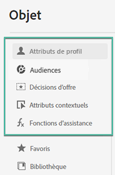

# À propos de l’éditeur d’expression {#build-personalization-expressions}

>[!CONTEXTUALHELP]
>id="ajo_perso_editor"
>title="À propos de l’éditeur d’expression"
>abstract="L’éditeur d’expression vous permet de sélectionner, d’organiser, de personnaliser et de valider toutes les données afin de personnaliser votre contenu."

Il est lʼélément central de la personnalisation dans [!DNL Journey Optimizer]. Il est disponible dans tous les contextes où vous devez définir une personnalisation (par exemple, dans les emails, les notifications push et les offres).

Dans l&#39;interface de l&#39;éditeur d&#39;expression, vous sélectionnez, organisez, personnalisez et validez toutes les données afin de personnaliser votre contenu.

La partie gauche de l&#39;écran affiche un sélecteur de domaine qui vous permet de sélectionner la source en vue de la personnalisation.

Les sources disponibles sont les suivantes :

* **[!UICONTROL Attributs de profil]** : répertorie toutes les références associées au schéma de profil décrit dans la [documentation du modèle de données Adobe Experience Platform (XDM)](https://experienceleague.adobe.com/docs/experience-platform/xdm/home.html?lang=fr){target=&quot;_blank&quot;}.
* **[!UICONTROL Appartenance au segment]** : répertorie tous les segments créés dans le service Adobe Experience Platform Segmentation. Vous trouverez [ici](https://experienceleague.adobe.com/docs/experience-platform/segmentation/home.html?lang=fr){target=&quot;_blank&quot;} plus d’informations sur la segmentation.
* **[!UICONTROL Décisions d’offre]** : répertorie toutes les offres associées à un emplacement spécifique. Sélectionnez l’emplacement, puis insérez les offres dans votre contenu. Pour obtenir une documentation complète sur la gestion des offres, consultez [cette section](../design/deliver-personalized-offers.md).
* **[!UICONTROL Attributs contextuels]** : lorsqu’une activité d’action de canal (e-mail, push, SMS) est utilisée dans un parcours, les champs de parcours contextuels sont disponibles via ce menu. En savoir plus dans [cette section](personalization-use-case.md).
* **[!UICONTROL Fonctions helper]** : répertorie toutes les fonctions helper disponibles pour effectuer des opérations sur les données, comme des calculs, une mise en forme ou des conversions de données, des conditions, et les manipuler dans le contexte de la personnalisation. En savoir plus dans [cette section](functions/functions.md).

Cliquez sur le bouton + pour ajouter un attribut dans lʼéditeur.

>[!NOTE]
>
>Le menu Ellipse en regard de l’icône « + » vous permet d’obtenir plus de détails sur chaque variable et d’ajouter les attributs les plus fréquemment utilisés à vos [favoris](personalization-favorites.md).

Dans lʼexemple suivant, lʼéditeur dʼexpression vous permet de sélectionner les profils qui ont leur anniversaire aujourdʼhui, puis de terminer la personnalisation en insérant une offre spécifique correspondant à ce jour.

Une fois votre expression de personnalisation prête, vous devez la faire valider par l’éditeur d’expression. En savoir plus dans [cette section](personalization-validation.md).
