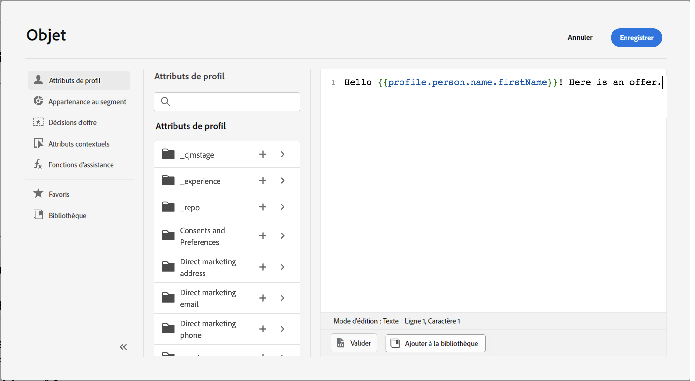
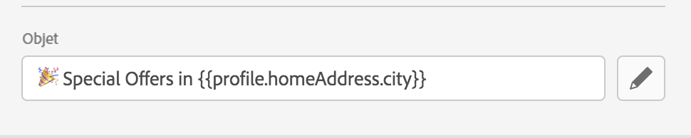
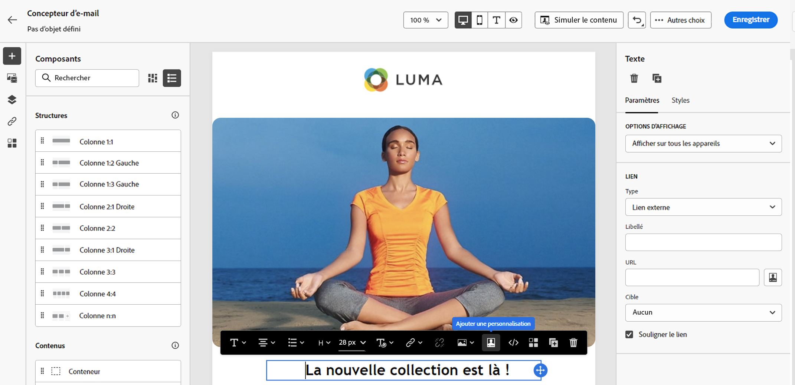
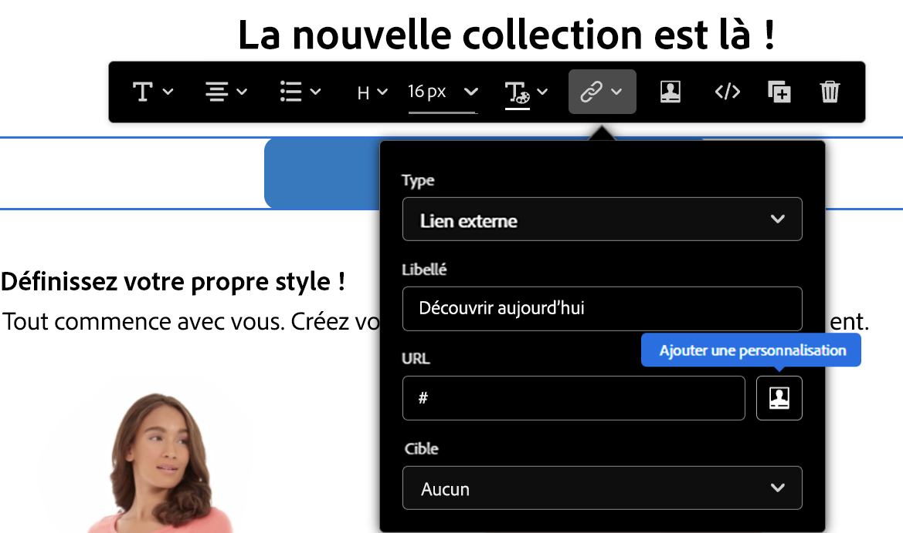
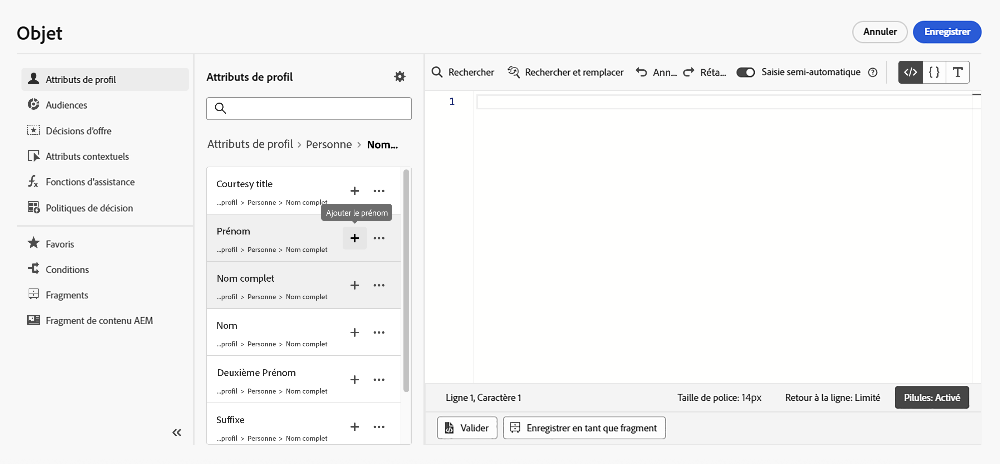
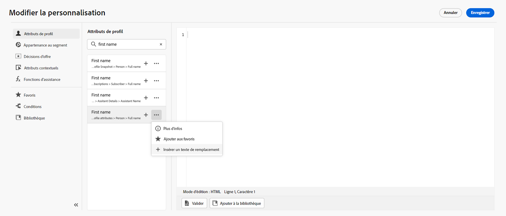
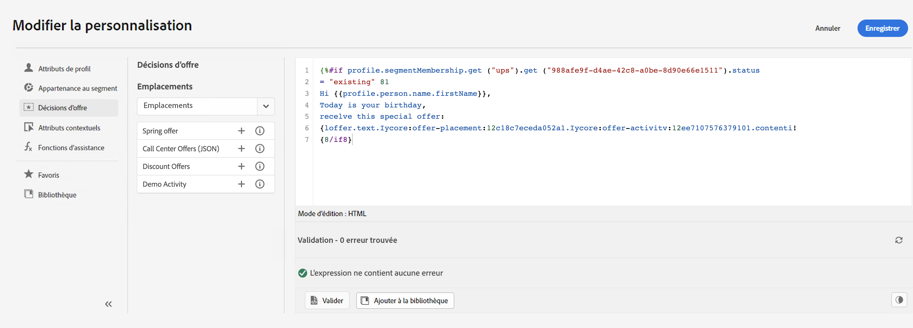
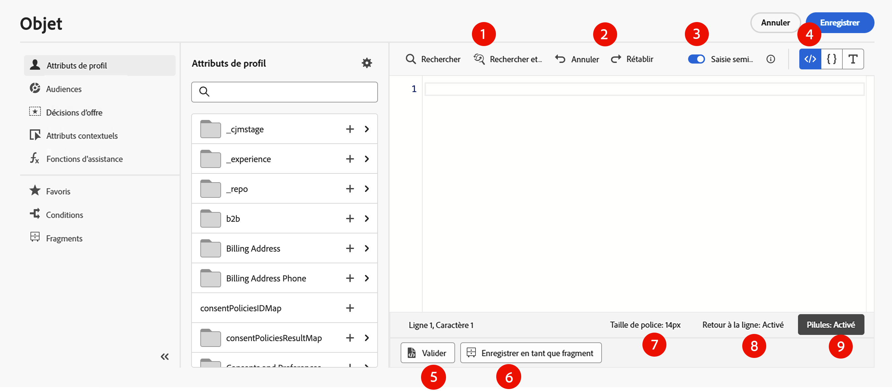
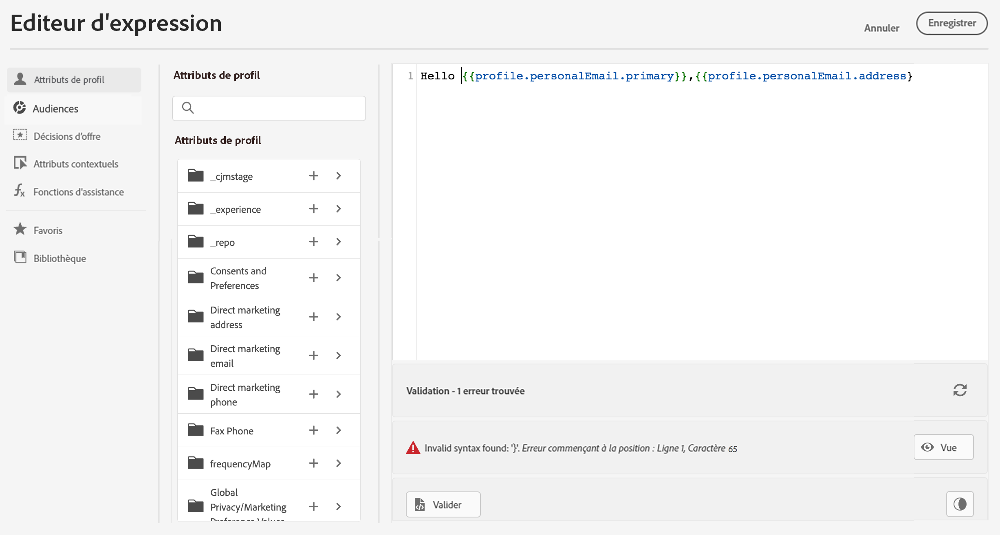

# Ajouter une personnalisation {#build-personalization-expressions}

>[!CONTEXTUALHELP]
>id="ajo_perso_editor"
>title="À propos de l’éditeur de personnalisation"
>abstract="L’éditeur de personnalisation vous permet de sélectionner, d’organiser, de personnaliser et de valider toutes les données afin de personnaliser votre contenu."

L’éditeur de personnalisation est l’élément central de la personnalisation dans [!DNL Journey Optimizer]. Il est disponible dans tous les contextes où vous devez définir une personnalisation (par exemple, dans les e-mails, les notifications push et les offres).

Dans l’interface de l’éditeur de personnalisation, vous pouvez sélectionner, organiser, personnaliser et valider toutes les données afin de personnaliser votre contenu.



## Où puis-je ajouter de la personnalisation ? {#where}

Vous pouvez ajouter de la personnalisation dans **[!DNL Journey Optimizer]** dans chaque champ à l’aide de l’icône . Développez les sections ci-dessous pour plus d’informations.

+++Messages

Dans les messages, une personnalisation peut être ajoutée à différents emplacements de vos messages, par exemple dans le champ **[!UICONTROL Objet]**.



Il peut également être ajouté à d’autres sections de votre contenu. Par exemple, pour les [notifications push](../push/push-gs.md), une personnalisation peut être ajoutée dans les champs **Titre**, **Corps**, **Son personnalisé**, **Badges** et **Données personnalisées**.

+++

+++Designer d’e-mail

Lors de la modification du contenu d’un e-mail dans la Designer d’e-mail[&#128279;](../email/get-started-email-design.md), vous pouvez personnaliser la plupart des éléments de texte à l’aide de l’icône dans la barre d’outils contextuelle.



+++

+++URL

Journey Optimizer vous permet également de personnaliser les **URL** dans vos messages. Les URL personnalisées orientent les destinataires vers des pages spécifiques d’un site web ou vers un microsite personnalisé, en fonction des attributs du profil. [&#x200B; En savoir plus &#x200B;](../email/url-personalization.md)

{width="50%"}

>[!NOTE]
>
>La personnalisation des URL est disponible pour les types de liens suivants : **Lien externe**, **Lien de désinscription** et **Opt-out**.

+++

+++Configuration des e-mails

Lors de la création d’une configuration de canal e-mail, vous pouvez définir des valeurs personnalisées pour les sous-domaines, les en-têtes et les paramètres de tracking des URL. [&#x200B; En savoir plus &#x200B;](../email/surface-personalization.md)

+++

+++Offres

Vous pouvez ajouter une personnalisation lors de l’utilisation de contenu de type texte dans les représentations de vos **offres**. [Découvrez comment créer des offres personnalisées](../offers/offer-library/creating-personalized-offers.md)

+++

## Sources Personalization {#sources}

Le volet de navigation vous permet de sélectionner la source pour la personnalisation. Les sources disponibles sont les suivantes :

* **[!UICONTROL Attributs de profil]** : répertorie toutes les références associées au schéma de profil décrit dans la documentation du modèle de données Adobe Experience Platform (XDM) [&#128279;](https://experienceleague.adobe.com/docs/experience-platform/xdm/home.html){target="_blank"}.
* **[!UICONTROL Attributs de cible]** : ce dossier est spécifique aux campagnes orchestrées. Il contient des attributs calculés directement dans la zone de travail de campagne. [Découvrez comment ajouter de la personnalisation dans des campagnes orchestrées](../orchestrated/activities/channels.md#add-personalization)
* **[!UICONTROL Audiences]** : répertorie toutes les audiences créées dans le service Adobe Experience Platform Segmentation. En savoir plus dans la documentation sur la segmentation de Adobe Experience Platform [&#128279;](https://experienceleague.adobe.com/docs/experience-platform/segmentation/home.html){target="_blank"}.
* **[!UICONTROL Décisions d’offre]** : répertorie toutes les offres associées à un emplacement spécifique. Sélectionnez l’emplacement, puis insérez les offres dans votre contenu. Pour obtenir une documentation complète sur la gestion des offres, consultez [cette section](../offers/get-started/starting-offer-decisioning.md).
* **[!UICONTROL Attributs contextuels]** : lorsqu’une activité d’action de canal (e-mail, push, SMS) est utilisée dans un parcours ou une campagne, les attributs contextuels liés aux événements et aux propriétés peuvent être personnalisés. Vous trouverez un exemple de personnalisation utilisant des attributs contextuels dans [cette section](personalization-use-case.md). De plus, les réponses d’action personnalisée peuvent être utilisées pour la personnalisation. [Découvrez comment utiliser des réponses d’action personnalisées dans des canaux natifs](../action/action-response.md#response-in-channels).

>[!NOTE]
>
>Si vous ciblez une audience avec des attributs d’enrichissement générés à l’aide d’un workflow de composition, vous pouvez tirer parti de ces attributs d’enrichissement pour personnaliser votre message. [Découvrez comment utiliser les attributs d’enrichissement des audiences](../audience/about-audiences.md#enrichment)

## Ajouter une personnalisation {#add}

>[!CONTEXTUALHELP]
>id="ajo_perso_editor_autocomplete"
>title="Saisie automatique"
>abstract="Activer cette option permet au système de suggérer et de remplir automatiquement le code au fur et à mesure que vous le tapez. Cette fonctionnalité est disponible uniquement pour les formats HTML et Texte et prend en charge les attributs de profil et de contexte. Si cette option est désactivée, l’éditeur fournit la saisie semi-automatique du code HTML natif à la place."

C’est dans l’espace de travail central que vous créez votre syntaxe de personnalisation. Pour utiliser un attribut afin de personnaliser votre message, localisez-le dans le volet de navigation de gauche, puis cliquez sur le bouton `+` pour l’ajouter à l’expression.



Le menu représentant des points de suspension en regard de l’icône `+` vous permet d’obtenir plus de détails sur chaque attribut et d’ajouter les attributs les plus fréquemment utilisés à vos favoris. Les attributs ajoutés aux favoris sont accessibles à partir du menu **[!UICONTROL Favoris]** dans le volet de navigation.

>[!NOTE]
>
>Par défaut, le volet Attributs affiche uniquement les attributs renseignés. Pour afficher tous les attributs, sélectionnez le bouton  situé au-dessus du champ de recherche et désactivez l’option **[!UICONTROL Afficher uniquement les attributs renseignés]**.

De plus, vous pouvez définir un texte de remplacement par défaut qui s’affichera si un attribut de profil de type chaîne est vide. Pour ce faire, cliquez sur le bouton représentant des points de suspension en regard de l’attribut et sélectionnez **[!UICONTROL Insérer avec un texte de remplacement]**. Rédigez le texte à afficher par défaut si la valeur de l’attribut est vide pour un profil, puis cliquez sur **[!UICONTROL Ajouter]**.



Dans l’exemple suivant, l’éditeur de personnalisation vous permet de sélectionner les profils dont l’anniversaire est aujourd’hui, puis de terminer la personnalisation en insérant une offre spécifique correspondant à cette journée.



## Options d’édition d’expressions {#options}

L’espace de travail central fournit divers outils pour vous aider à rédiger votre expression de personnalisation.



Les options disponibles sont les suivantes :

1. **[!UICONTROL Rechercher]** / **[!UICONTROL Rechercher et remplacer]** : effectuez une recherche dans votre expression et remplacez automatiquement les parties de code.
1. **[!UICONTROL Annuler]** / **[!UICONTROL Rétablir]** : annulez / rétablissez la dernière opération.
1. **[!UICONTROL Saisie automatique]** : suggère et complète automatiquement le code au fur et à mesure que vous le tapez. Cette fonctionnalité est disponible uniquement pour les formats HTML et Texte et prend en charge les attributs de profil et de contexte. Si cette option est désactivée, l’éditeur fournit la saisie semi-automatique du code HTML natif à la place.

   {width="70%" align="center" zoomable="yes"}

1. **&#x200B;**&#x200B;/ **[!UICONTROL JSON]** / **[!UICONTROL Text]** : identifiez le format de votre code. Cela permet au système d’adapter la fonction de validation et de saisie automatique en fonction de la langue sélectionnée.
1. **[!UICONTROL Valider]** : vérifiez la syntaxe de votre expression. En savoir plus dans [cette section](../personalization/personalization-build-expressions.md).
1. **[!UICONTROL Enregistrer en tant que fragment]** : enregistrez votre expression en tant que fragment d’expression. En savoir plus dans [cette section](../content-management/save-fragments.md#save-as-expression-fragment)
1. **[!UICONTROL Taille de police]** : ajuste la taille de la police du contenu dans l’éditeur pour une meilleure lisibilité.
1. **[!UICONTROL Retour à la ligne Word]** : active ou désactive le retour à la ligne, ce qui permet aux expressions longues d’être affichées sur une seule ligne ou renvoyées à la ligne dans l’éditeur. Les options incluent :
   * **Désactivé** (par défaut) - Aucun habillage des mots. Les lignes longues s’étendent au-delà de la vue de l’éditeur et nécessitent un défilement horizontal.
   * **Activé** : recouvre les lignes à la largeur de l’éditeur.
   * **Colonne renvoyée à la ligne au format Word** - Renvoie les lignes à la ligne lorsqu’une ligne atteint 80 caractères.
   * **Limité** - Entoure les lignes à la largeur de l’éditeur ou à 80 caractères, selon la plus petite des deux valeurs.
1. **[!UICONTROL Pilules]** : affichez les attributs sous la forme de « pilules » compactes afin d’améliorer la lisibilité en masquant les chemins d’accès aux attributs longs. Cliquez sur un attribut pour afficher son chemin d’accès complet.

   >[!NOTE]
   >
   >Cette option est disponible uniquement pour les attributs de profil, les attributs contextuels et les médias dynamiques.

Dans le volet de navigation, des fonctionnalités supplémentaires sont disponibles pour vous aider à créer votre expression de personnalisation.


* **[!UICONTROL Fonctions d’assistance]** - Les fonctions d’assistance vous permettent d’effectuer des opérations sur les données, comme des calculs, une mise en forme ou des conversions des données, des conditions, et de les manipuler dans le contexte de la personnalisation. [En savoir plus sur les fonctions d’assistance disponibles](functions/functions.md)

* **[!UICONTROL Favoris]** - Les attributs que vous avez ajoutés aux favoris s’affichent dans cette liste. Vous pouvez ainsi accéder rapidement aux éléments les plus fréquemment utilisés. Pour ajouter un attribut à vos favoris, cliquez sur le menu représentant des points de suspension et choisissez **[!UICONTROL Ajouter aux favoris]**.

* **[!UICONTROL Conditions]** - Utilisez les règles conditionnelles créées dans la bibliothèque pour ajouter du contenu dynamique à vos messages. Vous pouvez ainsi créer plusieurs variantes de votre message en fonction de conditions. [Découvrez comment créer du contenu dynamique](../personalization/get-started-dynamic-content.md)

* **[!UICONTROL Fragments]** - Tirez parti des fragments d’expression qui ont été créés ou enregistrés dans le sandbox actuel. Un fragment est un composant réutilisable pouvant être référencé dans les campagnes et parcours [!DNL Journey Optimizer]. Cette fonctionnalité permet de précréer plusieurs blocs de contenu personnalisés qui peuvent être utilisés par les utilisateurs et utilisatrices marketing pour assembler rapidement le contenu dans un processus de conception amélioré. [Découvrez comment utiliser les fragments d’expression pour la personnalisation](../personalization/use-expression-fragments.md)

>[!TIP]
>
>Vous recherchez des expressions prêtes à l’emploi ? La page **[Recettes](personalization-recipes.md)** fournit des modèles de copier-coller pour les cas d’utilisation les plus courants : formatage des dates, compte à rebours, basculements conditionnels, affichage temporel uniquement, etc.

Une fois votre expression de personnalisation prête, vous devez la faire valider par l’éditeur de personnalisation. En savoir plus dans [cette section](../personalization/personalization-build-expressions.md).

## Mécanismes de validation {#validation-mechanisms}

La validation de votre expression est automatiquement effectuée lorsque vous cliquez sur le bouton **Ajouter** pour fermer la fenêtre de l&#39;éditeur. Vous pouvez également utiliser le bouton **Valider** pour vérifier la syntaxe de votre personnalisation.



Développez la section ci-dessous pour afficher les erreurs courantes qui peuvent se produire lors de la validation de la personnalisation.

+++Erreurs courantes

* **Chemin « XYZ » introuvable**

Lorsque vous essayez de référencer un champ qui n’est pas défini dans le schéma.

Dans ce cas **firstName1** n&#39;est pas défini comme attribut dans le schéma du profil :

```
{{profile.person.name.firstName1}}
```

* **Incompatibilité de type pour la variable « XYZ ». Tableau attendu. Chaîne trouvée.**

En cas d’itération sur une chaîne plutôt que sur un tableau.

Dans ce cas **product** n’est pas un tableau :

```
{{each profile.person.name.firstName as |product|}}
 {{product.productName}}
{{/each}}
```

* **Syntaxe de handlebars non valide.`'[XYZ}}'`** trouvé

Lorsque la syntaxe des barres de contrôle est non valide.

Les expressions des barres de contrôle sont entourées de **{{expression}}**

```
   {{[profile.person.name.firstName}}
```

* **Définition de segment non valide**

```
No segment definition found for 988afe9f0-d4ae-42c8-a0be-8d90e66e151
```

+++

Pour les offres, des erreurs spécifiques peuvent se produire. Développez la section ci-dessous pour plus de détails :

+++ Erreurs spécifiques liées aux offres

Les erreurs liées à l’intégration des offres dans un e-mail ou une notification push présentent le modèle suivant :

```
Offer.<offerType>.[PlacementID].[ActivityID].<offer-attribute>
```

La validation est effectuée lors de la validation du contenu de personnalisation dans l’éditeur de personnalisation.

<table> 
 <thead> 
  <tr> 
   <th> Titre de l’erreur <br /> </th> 
   <th> <br /> de validation/résolution </th> 
  </tr> 
 </thead> 
 <tbody> 
  <tr> 
   <td>Ressource avec ID placementID et type OfferPlacement introuvable <br/>
Ressource avec ID activityID et type OfferActivity introuvable<br/></td> 
   <td>Vérifier si ActivityID et/ou PlacementID sont disponibles</td> 
  </tr> 
   <tr> 
   <td>Impossible de valider la ressource.</td> 
   <td>Le componentType dans l'emplacement doit correspondre à l'offre offerType.</td> 
  </tr> 
   <tr> 
   <td>L’URL publique n’est pas présente dans l’offerId.</td> 
   <td>Les offres d’image (toutes les offres personnalisées et de secours associées à la paire décision-emplacement) doivent avoir une URL publique renseignée (l’URL deliveryURL ne doit pas être vide).</td> 
  </tr> 
  <tr> 
   <td>La décision contient des attributs autres que de profil.</td> 
   <td>L’utilisation du modèle d’offre ne doit contenir que les attributs de profil.</td> 
  </tr> 
  <tr> 
   <td>Une erreur s’est produite lors de la récupération de l’utilisation de la décision.</td> 
   <td>Cette erreur peut se produire lorsque l’API tente de récupérer le modèle d’offre.</td> 
  </tr>
  <tr> 
   <td>Attribut d’offre offer-attribute non valide.</td> 
   <td>Vérifiez si l’attribut offer-attribute référencé dans le drp d’offre est valide. Voici les attributs valides : <br/>
Image : deliveryURL, linkURL<br/>
Texte : contenu<br/>
HTML : contenu<br/></td> 
  </tr> 
 </tbody> 
</table>

+++
