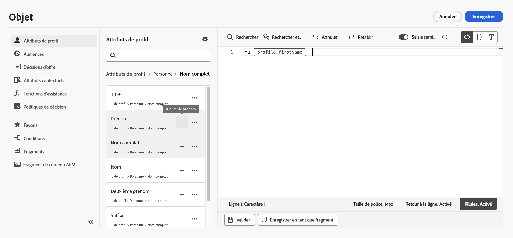
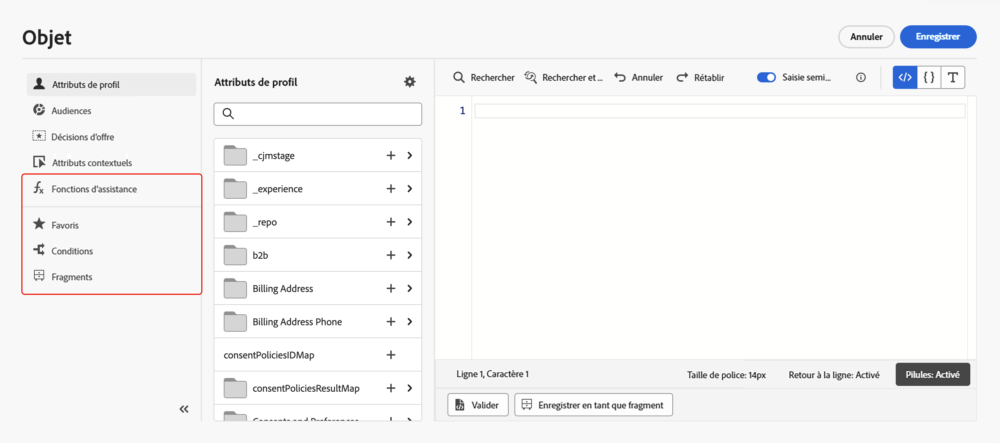

# Ajouter une personnalisation {#build-personalization-expressions}

>[!CONTEXTUALHELP]
>id="ajo_perso_editor"
>title="À propos de l’éditeur de personnalisation"
>abstract="L’éditeur de personnalisation vous permet de sélectionner, organiser, personnaliser et valider toutes les données afin de personnaliser votre contenu."

L’éditeur de personnalisation constitue lʼélément central de la personnalisation dans [!DNL Journey Optimizer]. Il est disponible dans tous les contextes où vous devez définir une personnalisation (par exemple, dans les emails, les notifications push et les offres).

Dans l’interface de l’éditeur de personnalisation, vous pouvez sélectionner, organiser, personnaliser et valider toutes les données afin de personnaliser votre contenu.


## Où puis-je ajouter une personnalisation ? {#where}

Dans **[!DNL Journey Optimizer]**, vous pouvez ajouter une personnalisation dans chaque champ à l’aide de l’icône . Pour plus d’informations, développez les sections ci-dessous.

+++Messages

Dans les messages, vous pouvez ajouter une personnalisation dans différentes parties de vos messages, par exemple dans le champ **[!UICONTROL Objet]**.


Vous pouvez également l’ajouter à d’autres sections de votre contenu. Par exemple, pour les [notifications push](../push/push-gs.md), vous pouvez ajouter une personnalisation dans les champs **Titre**, **Corps**, **Son personnalisé**, **Badges** et **Données personnalisées**.

+++

+++Concepteur d’e-mail

Lorsque vous modifiez le contenu d’un e-mail dans le [Concepteur d’e-mail](../email/get-started-email-design.md), vous pouvez ajouter une personnalisation dans les blocs de texte et dans les URL à l’aide de l’icône de la barre d’outils contextuelle.


+++

+++Offres

Vous pouvez ajouter une personnalisation lors de l’utilisation de contenu de type texte dans les **représentations de vos offres**. [Découvrir comment créer des offres personnalisées](../offers/offer-library/creating-personalized-offers.md)

+++

+++URL

Journey Optimizer vous permet également de personnaliser les **URL** dans votre message.  Les URL personnalisées orientent les destinataires vers des pages spécifiques dʼun site web ou vers un microsite personnalisé, en fonction des attributs du profil. La personnalisation des URL est disponible pour les types de liens suivants : **Lien externe**, **Lien de désabonnement** et **Opt-out**.

Exemples d’adresses URL personnalisées :

* `https://www.adobe.com/users/{{profile.person.name.lastName}}`
* `https://www.adobe.com/users?uid={{profile.person.name.firstName}}`
* `https://www.adobe.com/usera?uid={{context.journey.technicalProperties.journeyUID}}`
* `https://www.adobe.com/users?uid={{profile.person.crmid}}&token={{context.token}}`

{width="50%"}

>[!NOTE]
>
>Lorsque vous modifiez une URL personnalisée dans l’éditeur de personnalisation, les fonctions d’assistance et l’appartenance aux audiences sont désactivées pour des raisons de sécurité.
>
>Les espaces ne sont pas pris en charge dans les jetons de personnalisation utilisés dans les URL.

En disponibilité limitée pour un ensemble de clientes et clients, Journey Optimizer prend également en charge la personnalisation complète/de base des URL. Par exemple :

```
<a href="{{profile.social.link}}" />
<a href="{{profile.social.baseUrl}}/profile" />
<a href="https://{{profile.social.baseUrl}}/profile" />
```

>[!WARNING]
>
>La liste des domaines acceptés doit être fournie à Adobe au préalable.

+++

+++Configuration du canal e-mail

Lors de la création d’une configuration de canal e-mail, vous pouvez définir des valeurs personnalisées pour les sous-domaines, les en-têtes et les paramètres de tracking des URL. [En savoir plus](../email/surface-personalization.md)

+++

## Sources de personnalisation {#sources}

Le volet de navigation vous permet de sélectionner la source pour la personnalisation. Les sources disponibles sont les suivantes :

* **[!UICONTROL Attributs de profil]** : répertorie toutes les références associées au schéma de profil décrit dans la [documentation du modèle de données Adobe Experience Platform (XDM)](https://experienceleague.adobe.com/fr/docs/experience-platform/xdm/home){target="_blank"}.
* **[!UICONTROL Attributs cibles]** : ce dossier est spécifique aux campagnes orchestrées. Il contient des attributs calculés directement dans la zone de travail de la campagne. [Découvrez comment ajouter une personnalisation dans les campagnes orchestrées.](../orchestrated/activities/channels.md#add-personalization)
* **[!UICONTROL Audiences]** : répertorie toutes les audiences créées dans le service de segmentation d’Adobe Experience Platform. Vous trouverez [ici](https://experienceleague.adobe.com/docs/experience-platform/segmentation/home.html?lang=fr){target="_blank"} plus d’informations sur la segmentation.
* **[!UICONTROL Décisions d’offre]** : répertorie toutes les offres associées à un emplacement spécifique. Sélectionnez l’emplacement, puis insérez les offres dans votre contenu. Pour obtenir une documentation complète sur la gestion des offres, consultez [cette section](../offers/get-started/starting-offer-decisioning.md).
* **[!UICONTROL Attributs contextuels]** : lorsqu’une activité d’action de canal (e-mail, notification push, SMS) est utilisée dans un parcours ou une campagne, des attributs contextuels liés aux événements et aux propriétés sont disponibles pour la personnalisation. Un exemple de personnalisation utilisant les attributs contextuels est présenté dans [cette section](personalization-use-case.md). De plus, les réponses d’action personnalisée peuvent être utilisées pour la personnalisation. [Découvrez comment utiliser des réponses d’action personnalisée dans des canaux natifs](../action/action-response.md#response-in-channels).

>[!NOTE]
>
>Si vous ciblez une audience avec des attributs d’enrichissement générés à l’aide d’un workflow de composition, vous pouvez utiliser ces attributs pour personnaliser votre message. [Découvrir comment utiliser les attributs d’enrichissement des audiences](../audience/about-audiences.md#enrichment)

## Ajouter une personnalisation {#add}

>[!CONTEXTUALHELP]
>id="ajo_perso_editor_autocomplete"
>title="Saisie semi-automatique"
>abstract="Activer cette option permet au système de suggérer et de remplir automatiquement le code au fur et à mesure que vous le tapez. Cette fonctionnalité est disponible uniquement pour les formats HTML et Texte et prend en charge les attributs de profil et de contexte. Si vous désactivez cette option, l’éditeur fournit une saisie automatique du code HTML natif à la place."

C’est dans l’espace de travail central que vous créez votre syntaxe de personnalisation. Pour utiliser un attribut afin de personnaliser votre message, localisez-le dans le volet de navigation de gauche, puis cliquez sur le bouton `+` pour l’ajouter à l’expression.



Le menu à trois points en regard de l’icône `+` vous permet d’obtenir plus de détails sur chaque attribut et d’ajouter ceux que vous utilisez le plus souvent à vos favoris. Vous pouvez accéder aux attributs ajoutés aux favoris à partir du menu **[!UICONTROL Favoris]** dans le volet de navigation.

>[!NOTE]
>
>Par défaut, le volet des attributs affiche uniquement les attributs renseignés. Pour afficher tous les attributs, sélectionnez le bouton  situé au-dessus du champ de recherche et désactivez l’option **[!UICONTROL Afficher uniquement les attributs renseignés]**.

De plus, vous pouvez définir un texte de remplacement par défaut qui s’affichera si un attribut de profil de type chaîne est vide. Pour ce faire, cliquez sur le bouton des points de suspension en regard de l’attribut et sélectionnez **[!UICONTROL Insérer avec un texte de remplacement]**. Rédigez le texte à afficher par défaut si la valeur de l’attribut est vide pour un profil, puis cliquez sur **[!UICONTROL Ajouter]**.


Dans l’exemple suivant, l’éditeur de personnalisation vous permet de sélectionner les profils dont l’anniversaire est aujourd’hui, puis de terminer la personnalisation en insérant une offre spécifique correspondant à cette journée.


## Options de modification d’expressions {#options}

L’espace de travail central fournit divers outils pour vous aider à écrire votre expression de personnalisation.


Les options disponibles sont les suivantes :

1. **[!UICONTROL Rechercher]**/**[!UICONTROL Rechercher et remplacer]** : effectuez une recherche dans votre expression et remplacez automatiquement des parties de code.
1. **[!UICONTROL Annuler]** / **[!UICONTROL Rétablir]** : annulez ou rétablissez la dernière opération.
1. **[!UICONTROL Saisie automatique]** : suggère et remplit automatiquement le code au fur et à mesure que vous le tapez. Cette fonctionnalité est disponible uniquement pour les formats HTML et Texte et prend en charge les attributs de profil et de contexte. Si vous désactivez cette option, l’éditeur fournit une saisie automatique du code HTML natif à la place.

   {width="70%" align="center" zoomable="yes"}

1. **[!UICONTROL HTML]** / **[!UICONTROL JSON]** / **[!UICONTROL Texte]** : identifiez le format de votre code. Cela permet au système d’adapter la fonctionnalité de validation et de saisie automatique à la langue sélectionnée.
1. **[!UICONTROL Valider]** : vérifiez la syntaxe de votre expression. En savoir plus dans [cette section](../personalization/personalization-build-expressions.md).
1. **[!UICONTROL Enregistrer en tant que fragment]** : enregistrez votre expression en tant que fragment d’expression. En savoir plus dans [cette section](../content-management/save-fragments.md#save-as-expression-fragment)
1. **[!UICONTROL Taille de police]** : ajuste la taille de la police du contenu dans l’éditeur pour une meilleure lisibilité.
1. **[!UICONTROL Retour à la ligne]** : active ou désactive le retour à la ligne, ce qui permet aux expressions longues d’être affichées sur une seule ligne ou renvoyées à la ligne dans l’éditeur. Les options incluent :
   * **Désactivé** (par défaut) : aucun retour à la ligne. Les lignes longues s’étendent au-delà de la vue de l’éditeur et nécessitent un défilement horizontal.
   * **Activé** : adapte le retour à la ligne à la largeur de l’éditeur.
   * **Retour à la ligne en colonne** : renvoie à la ligne lorsqu’une ligne atteint 80 caractères.
   * **Limité** : le retour à ligne s’adapte à la largeur de l’éditeur ou a lieu quand la ligne atteint 80 caractères, selon la valeur la plus petite.
1. **[!UICONTROL Pastilles]** : affichez les attributs sous la forme de « pastilles » compactes afin d’améliorer la lisibilité en masquant les chemins d’accès aux attributs longs. Cliquez sur un attribut pour afficher son chemin d’accès complet.

   >[!NOTE]
   >
   >Cette option est disponible uniquement pour les attributs de profil, les attributs contextuels et les médias dynamiques.

Dans le volet de navigation, des fonctionnalités supplémentaires sont disponibles pour vous permettre de créer votre expression de personnalisation.



* **[!UICONTROL Fonctions d’assistance]** : les fonctions d’assistance vous permettent d’effectuer des opérations sur les données, comme des calculs, une mise en forme ou des conversions de données, des conditions, et de les manipuler dans le contexte de la personnalisation. [En savoir plus sur les fonctions d’assistance disponibles](functions/functions.md)

* **[!UICONTROL Favoris]** : les attributs que vous avez ajoutés aux favoris s’affichent dans cette liste. Cela vous permet d’accéder rapidement aux éléments que vous utilisez le plus souvent. Pour ajouter un attribut à vos favoris, cliquez sur le menu à trois points et sélectionnez **[!UICONTROL Ajouter aux favoris]**.

* **[!UICONTROL Conditions]** : utilisez les règles conditionnelles créées dans la bibliothèque pour ajouter du contenu dynamique à vos messages. Vous pouvez ainsi créer plusieurs variantes de votre message en fonction de conditions. [Découvrir comment créer du contenu dynamique](../personalization/get-started-dynamic-content.md)

* **[!UICONTROL Fragments]** :utilisez les fragments d’expression qui ont été créés ou enregistrés dans le sandbox actif. Un fragment est un composant réutilisable pouvant être référencé dans des campagnes et des parcours [!DNL Journey Optimizer]. Cette fonctionnalité permet de construire à l’avance plusieurs blocs de contenu personnalisés qui peuvent être utilisés par les utilisateurs et les utilisatrices marketing pour assembler rapidement des contenus dans le cadre d’un processus de conception amélioré. [Découvrir comment utiliser les fragments d’expression pour la personnalisation](../personalization/use-expression-fragments.md)

Une fois votre expression de personnalisation prête, vous devez la faire valider par l’éditeur de personnalisation. En savoir plus dans [cette section](../personalization/personalization-build-expressions.md).

## Mécanismes de validation {#validation-mechanisms}

La validation de l’expression s’effectue automatiquement lorsque vous cliquez sur le bouton **Ajouter** pour fermer la fenêtre de l’éditeur. Vous pouvez également utiliser le bouton **Valider** pour vérifier la syntaxe de votre personnalisation.


Développez la section ci-dessous pour afficher les erreurs courantes qui peuvent se produire lors de la validation de la personnalisation.

+++Erreurs courantes

* **Chemin « XYZ » introuvable**

En cas de référencement d’un champ qui n’est pas défini dans le schéma.

Dans ce cas, **firstName1** n’est pas défini comme attribut dans le schéma du profil :

```
{{profile.person.name.firstName1}}
```

* **Incompatibilité de type pour la variable « XYZ ».: Tableau attendu. Chaîne trouvée.**

En cas de tentative d’itération sur une chaîne plutôt que sur un tableau.

Dans ce cas, **product** n’est pas un tableau :

```
{{each profile.person.name.firstName as |product|}}
 {{product.productName}}
{{/each}}
```

* **Syntaxe des barres de contrôle non valide.`'[XYZ}}'`** trouvé

En cas d’utilisation d’une syntaxe de barres de contrôle non valide.

Les expressions des barres de contrôle sont entourées de **{{expression}}**

```
   {{[profile.person.name.firstName}}
```

* **Définition de segment non valide**

```
No segment definition found for 988afe9f0-d4ae-42c8-a0be-8d90e66e151
```

+++

Pour les offres, des erreurs spécifiques peuvent se produire. Pour plus d’informations, développez la section ci-dessous :

+++ Erreurs spécifiques liées aux offres

Les erreurs liées à l’intégration des offres dans un email ou une notification push présentent le modèle suivant :

```
Offer.<offerType>.[PlacementID].[ActivityID].<offer-attribute>
```

La validation est effectuée lors de la validation du contenu de personnalisation dans l’éditeur de personnalisation.

<table> 
 <thead> 
  <tr> 
   <th> Titre de l’erreur<br /> </th> 
   <th> Validation/Résolution <br /> </th> 
  </tr> 
 </thead> 
 <tbody> 
  <tr> 
   <td>Ressource avec ID placementID et type OfferPlacement introuvable <br/>
Ressource avec ID activityID et type OfferActivity introuvable<br/></td> 
   <td>Vérifiez que ActivityID et/ou PlacementID sont disponibles</td> 
  </tr> 
   <tr> 
   <td>Impossible de valider la ressource.</td> 
   <td>Le componentType dans l’emplacement doit correspondre à l’offre offerType.</td> 
  </tr> 
   <tr> 
   <td>L’URL publique n’est pas présente dans l’offre offerId.</td> 
   <td>Les offres d’image (toutes les offres personnalisées et de secours associées à la paire décision-emplacement) doivent avoir une URL publique renseignée (l’URL deliveryURL ne doit pas être vide).</td> 
  </tr> 
  <tr> 
   <td>La décision contient des attributs qui ne sont pas des attributs de profil.</td> 
   <td>L’utilisation du modèle d’offre ne doit contenir que les attributs de profil.</td> 
  </tr> 
  <tr> 
   <td>Une erreur s’est produite lors de la récupération de l’utilisation de la décision.</td> 
   <td>Cette erreur peut se produire lorsque l’API tente de récupérer le modèle d’offre.</td> 
  </tr>
  <tr> 
   <td>L’attribut d’offre offer-attribute n’est pas valide.</td> 
   <td>Vérifiez que l’attribut offer-attribute référencé dans le drp d’offre est valide. Les attributs valides sont les suivants : <br/>
Image : deliveryURL, linkURL<br/>
Texte : content<br/>
HTML : content<br/></td> 
  </tr> 
 </tbody> 
</table>

+++
