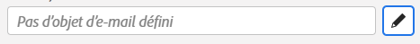
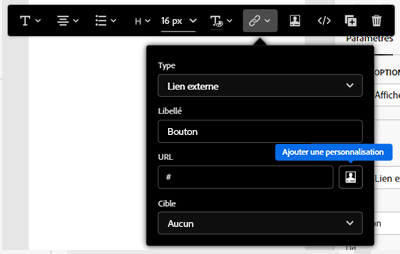
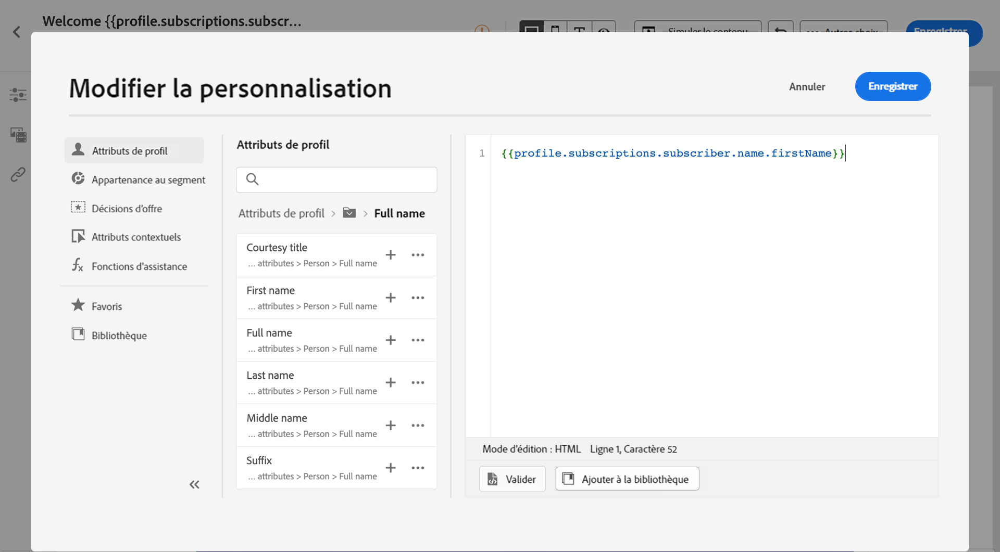
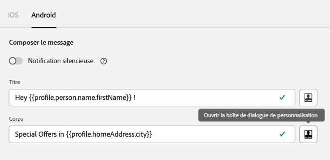

# Contextes de personnalisation{#personalization-areas}

Le contenu et l’affichage des messages diffusés par [!DNL Journey Optimizer] peuvent être personnalisés de plusieurs façons différentes. Dans tous les champs qui comportent l’icône de l’éditeur, vous pouvez ouvrir l’éditeur de personnalisation et définir la personnalisation.

## Personnaliser vos e-mails {#personalize-emails}

Lorsque vous créez un e-mail, vous pouvez ajouter une personnalisation dans le champ **[!UICONTROL Ligne d’objet]** du message.

Dans le concepteur d’e-mail, vous pouvez personnaliser le contenu :

* Dans le **message** : cliquez à l’intérieur d’un bloc de texte, puis cliquez sur le bouton **Ajouter une personnalisation** dans la barre d’outils contextuelle. Pour plus d’informations sur l’interface du concepteur d’e-mail, reportez-vous à [cette section](../email/get-started-email-design.md).

  

* Pour un **lien** : sélectionnez du texte ou une image à l&#39;intérieur d&#39;un bloc de texte, puis cliquez sur l&#39;icône **Insérer un lien** de la barre d&#39;outils contextuelle. Dans la fenêtre, vous pouvez ajouter un bloc de personnalisation en cliquant sur l&#39;icône **Ajouter une personnalisation**.

  

Dans les deux cas, vous accédez à l’éditeur de personnalisation.

## Personnalisation de vos notifications push {#personalize-push}

Vous pouvez également personnaliser vos **notifications push** dans les champs suivants :

* **Titre**
* **Corps**
* **Son personnalisé**
* **Badges**
* **Données personnalisées**

Pour en savoir plus sur la configuration des notifications push, consultez [cette section](../push/push-gs.md).

## Personnalisation de vos offres {#personalize-offers}

Vous pouvez également accéder à l’éditeur de personnalisation lors de l’ajout de contenu de type texte aux représentations de vos offres.

Pour en savoir plus sur la gestion du contenu avec la gestion des décisions, consultez [cette section](../offers/offer-library/creating-personalized-offers.md#custom-text).

## Créer des URL personnalisées{#personalize-urls}

Les URL personnalisées orientent les destinataires vers des pages spécifiques dʼun site web ou vers un microsite personnalisé, en fonction des attributs du profil. Dans Adobe Journey Optimizer, vous pouvez ajouter une personnalisation aux URL dans le contenu de votre message. La personnalisation de lʼURL peut être appliquée au texte et aux images, ainsi quʼutiliser les données de profil ou les données contextuelles.

Découvrez comment insérer une URL personnalisée dans [cette section](personalization-syntax.md#perso-urls).

