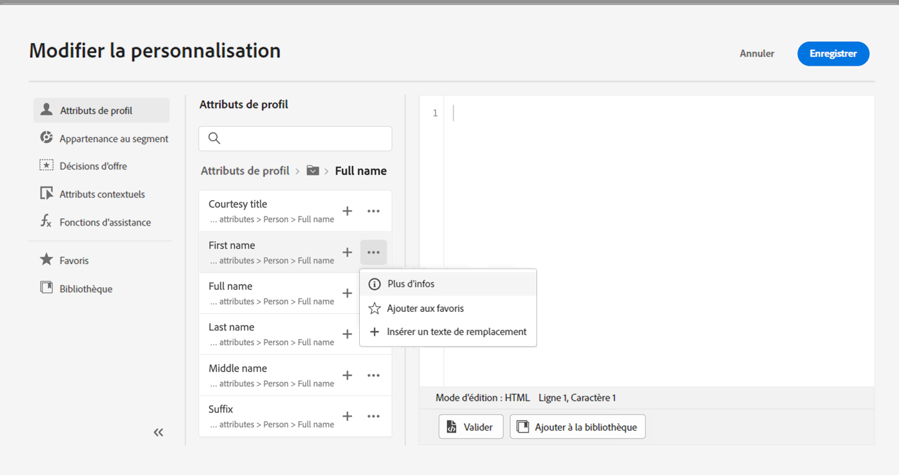
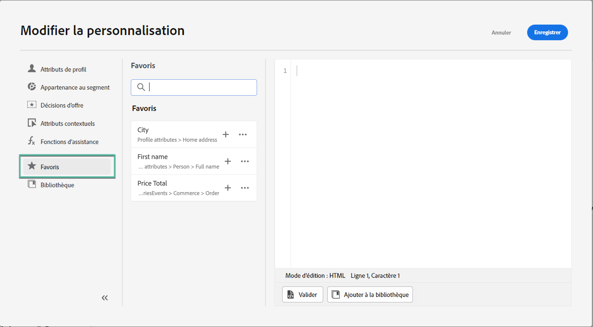
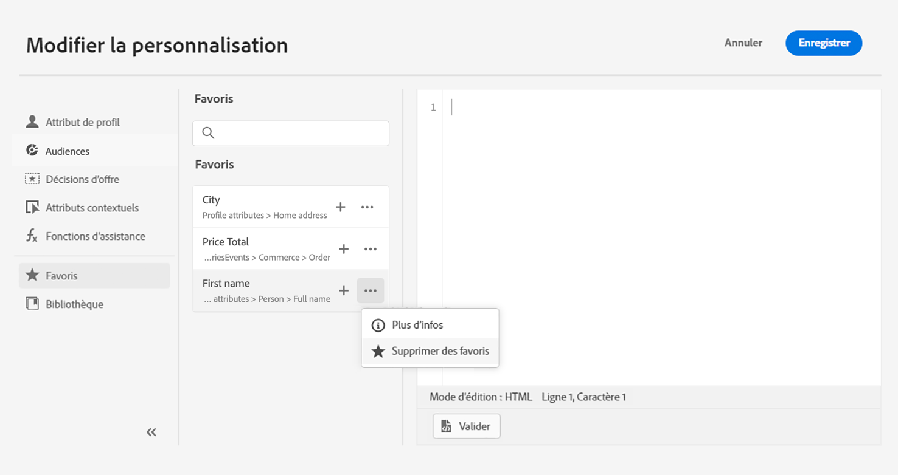

# Ajouter des attributs aux favoris {#fav}

L’ajout de différents attributs à votre menu de favoris vous permet dʼaccéder rapidement aux éléments que vous utilisez le plus fréquemment. Pour ajouter un attribut à vos favoris, cliquez sur le menu à trois points et sélectionnez **[!UICONTROL Ajouter aux favoris]**.

<!--

-->

Pour accéder aux éléments mis en favoris, utilisez le menu des **[!UICONTROL Favoris]** dans le volet de gauche.

Dans cette liste, vous pouvez rapidement ajouter lʼobjet de personnalisation à votre expression actuelle.

<!--

-->

Si vous ne souhaitez plus voir un élément dans votre liste de favoris, vous pouvez le supprimer de vos favoris.

<!--

-->
