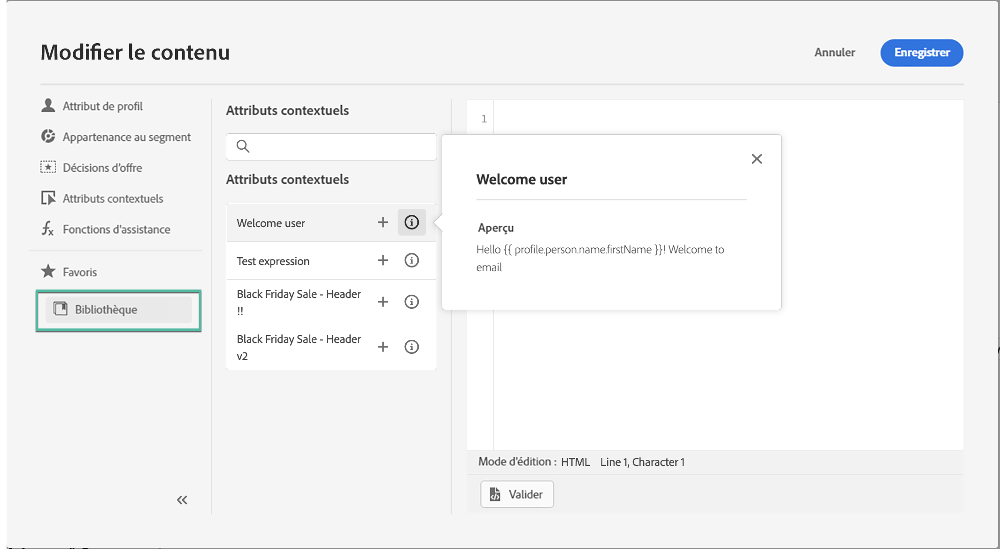
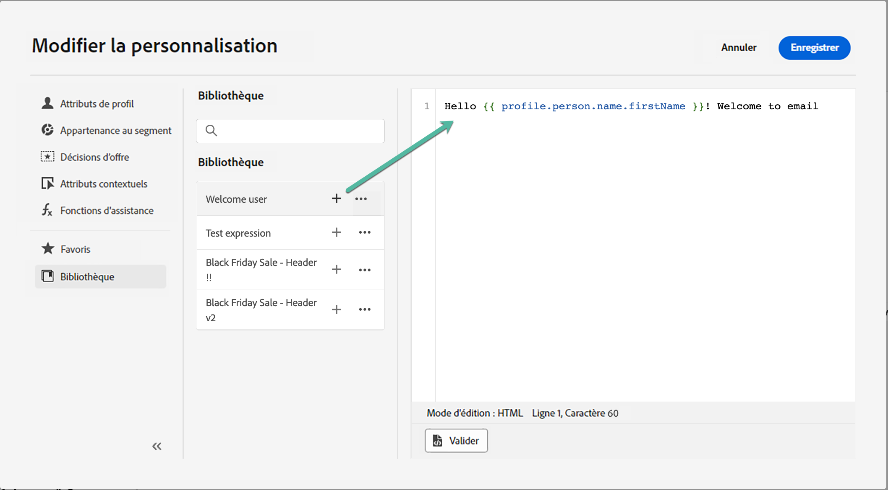
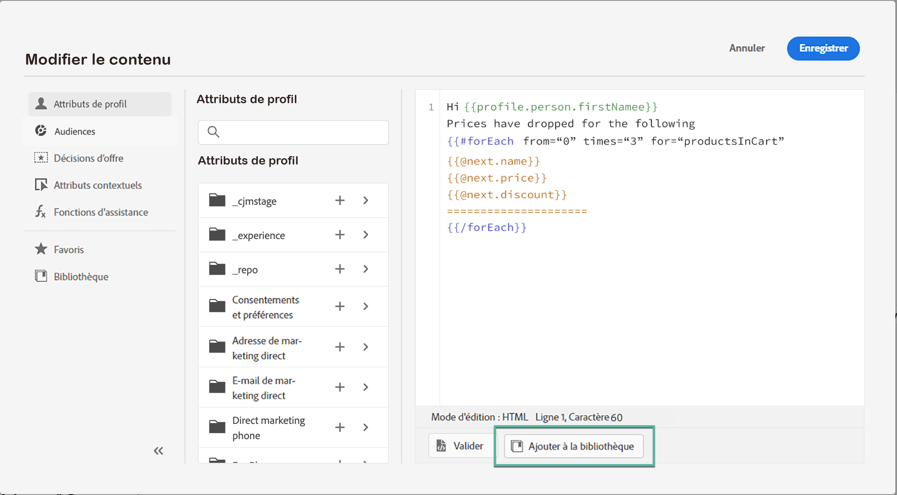
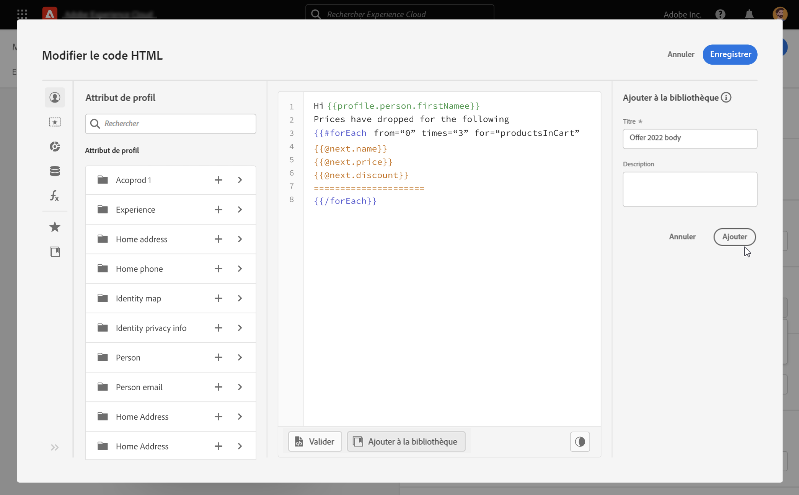

# Utilisation d’expressions enregistrées {#expression-library}

>[!CONTEXTUALHELP]
>id="ajo_perso_library"
>title="À propos de la bibliothèque d’expressions"
>abstract="[!DNL Journey Optimizer] fournit une bibliothèque dans laquelle vous pouvez accéder aux expressions de personnalisation enregistrées configurées par les utilisateurs administrateurs. "

[!DNL Journey Optimizer] fournit une bibliothèque dans laquelle vous pouvez accéder aux expressions de personnalisation enregistrées précédemment et qui ont été ajoutées par les utilisateurs administrateurs.

➡️ [Découvrez comment utiliser des expressions enregistrées dans cette vidéo](#video-preview)

Pour accéder aux expressions enregistrées, cliquez sur le bouton **[!UICONTROL Bibliothèque]** dans le volet de gauche. La liste affiche toutes les expressions qui ont été enregistrées par les utilisateurs administrateurs (voir [Enregistrement des expressions dans la bibliothèque](#save-expressions)).

    >[!REMARQUE]
    >
    >Vous pouvez utiliser le bouton d’informations pour obtenir plus d’informations sur le contenu d’une expression enregistrée. Si vous disposez des autorisations appropriées pour gérer les éléments de bibliothèque, le bouton d’informations s’affiche dans le menu de ellipse.
    
    

Cliquez sur le signe + pour insérer l’expression dans l’éditeur. Vous pouvez ensuite personnaliser et valider votre contenu de personnalisation comme vous le faites habituellement. [En savoir plus](../personalization/personalization-build-expressions.md)

    

## Enregistrement d’une expression dans la bibliothèque {#save-expressions}

[!DNL Journey Optimizer] permet aux utilisateurs administrateurs d’enregistrer des expressions de personnalisation dans la bibliothèque. Ces expressions seront ensuite disponibles pour tous les utilisateurs afin de créer des contenus de personnalisation.

Pour enregistrer une expression dans la bibliothèque, procédez comme suit :

1. Dans l’interface de l’éditeur, créez l’expression, puis cliquez sur **[!UICONTROL Ajouter à la bibliothèque]**.

   >[!NOTE]
   >
   >Si le bouton n’est pas visible, vérifiez dans le Admin Console que vous disposez des autorisations requises (voir [Niveaux d’autorisation](../administration/high-low-permissions.md)).

   

1. Dans le volet de droite, saisissez un titre et une description pour l’expression afin d’aider les utilisateurs à la trouver plus facilement, puis cliquez sur **[!UICONTROL Ajouter]**.

   

1. L’expression est ajoutée à la bibliothèque. Les utilisateurs pourront désormais l’utiliser pour créer leur contenu de personnalisation.

>[!NOTE]
>
>* Vous enregistrez jusqu’à 40 expressions dans la bibliothèque.
>
>* Les expressions ne doivent pas dépasser 200 Ko.
>
>* Les expressions enregistrées sont triées par date de création : l’expression ajoutée récemment s’affiche en premier dans la liste.

Pour modifier une expression existante, ajoutez-la à l’éditeur, puis modifiez-la selon vos besoins. Cliquez sur **[!UICONTROL Ajouter à la bibliothèque]** pour valider la syntaxe et enregistrer l’expression.

Pour supprimer une expression, cliquez sur le bouton représentant des ellipses, puis cliquez sur **[!UICONTROL Supprimer]**.

## Vidéo pratique{#video}

Découvrez comment utiliser des éléments de bibliothèque de personnalisation enregistrés dans un message et comment créer et gérer des éléments de bibliothèque de personnalisation.

>[!VIDEO](https://video.tv.adobe.com/v/340941?quality=12)

