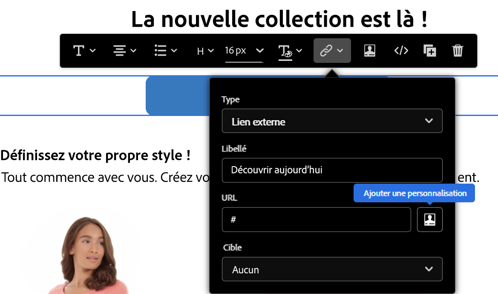

# Syntaxe de personnalisation {#personalization-syntax}

La personnalisation dans [!DNL Journey Optimizer] est basée sur la syntaxe de modèle appelée Handlebars.
Pour une description complète de la syntaxe Handlebars, consultez la [documentation HandlebarsJS](https://handlebarsjs.com/).

Cette syntaxe utilise un modèle et un objet d&#39;entrée pour générer du code HTML ou d&#39;autres formats de texte. Les modèles Handlebars ressemblent à du texte normal avec des expressions Handlebars incorporées.

Exemple d&#39;expression simple :

`{{profile.person.name}}`

où :

* `profile` est un espace de noms.
* `person.name` est un jeton composé par des attributs. La structure des attributs est définie dans un schéma XDM Adobe Experience Platform. [En savoir plus](https://experienceleague.adobe.com/docs/experience-platform/xdm/home.html?lang=fr){target="_blank"}.

## Règles générales de syntaxe {#general-rules}

Les identificateurs peuvent être n&#39;importe quel caractère unicode, à l&#39;exception des caractères suivants :

```
Whitespace ! " # % & ' ( ) * + , . / ; < = > @ [ \ ] ^ ` { | } ~
```

La syntaxe est sensible à la casse.

Les mots **true**, **false**, **null** et **undefined** ne sont autorisés que dans la première partie d&#39;une expression de chemin.

Dans Handlebars, les valeurs renvoyées par {{expression}} se caractérisent par un **échappement HTML.** Si l&#39;expression contient `&`, la sortie avec échappement HTML renvoyée est générée sous la forme `&amp;`. Si vous ne souhaitez pas que Handlebars réalisent l&#39;échappement d&#39;une valeur, utilisez le « triple stash ».

En ce qui concerne les arguments de fonctions littérales, l’analyseur de langage de création de modèles ne prend pas en charge la barre oblique inversée sans échappement (`\`). Ce caractère doit avoir fait l’objet d’une séquence d’échappement avec une barre oblique inversée supplémentaire (`\`). Exemple :

``

## Profile

Cet espace de noms vous permet de référencer tous les attributs définis dans le schéma de profil décrit dans la [documentation du modèle de données Adobe Experience Platform (XDM)](https://experienceleague.adobe.com/docs/experience-platform/xdm/home.html?lang=fr){target="_blank"}.

Les attributs doivent être définis dans le schéma avant d&#39;être référencés dans un bloc de personnalisation [!DNL Journey Optimizer].

>[!NOTE]
>
>Découvrez comment exploiter les attributs de profil dans des conditions dans [cette section](functions/helpers.md#if-function).

**Exemples de références :**

`{{profile.person.name.fullName}}`

`{{profile.person.name.firstName}}`

`{{profile.person.gender}}`

`{{profile.personalEmail.address}}`

`{{profile.mobilePhone.number}}`

`{{profile.homeAddress.city}}`

`{{profile.faxPhone.number}}`

## Audiences{#perso-segments}

Découvrez comment exploiter les attributs de profil dans des conditions dans [cette section](functions/helpers.md#if-function).

>[!NOTE]
>Pour en savoir plus sur le service de segmentation, consultez [cette documentation](https://experienceleague.adobe.com/docs/experience-platform/segmentation/home.html?lang=fr){target="_blank"}.

## Offres {#offers-syntax}

Cet espace de noms vous permet de référencer les décisions d&#39;offre existantes.
Pour référencer une offre, vous devez déclarer un chemin avec les différentes informations qui définissent une offre.

Ce chemin possède la structure suivante :

`offers.Type.[Placement Id].[Activity Id].Attribute`

où :

* `offers` identifie l&#39;expression de chemin appartenant à l&#39;espace de noms de l&#39;offre.
* `Type` détermine le type de représentation de l&#39;offre. Les valeurs possibles sont les suivantes : `image`, `html` et `text`.
* `Placement Id` et `Activity Id` sont des identifiants d&#39;emplacement et d&#39;activité.
* `Attributes` sont des attributs spécifiques à l&#39;offre qui dépendent du type d&#39;offre. Exemple : `deliveryUrl` pour les images

Pour plus d&#39;informations sur l&#39;API Decisions et sur la représentation des offres, consultez [cette page](../offers/api-reference/offer-delivery-api/decisioning-api.md).

Toutes les références sont validées par rapport au schéma d&#39;offre avec un mécanisme de validation décrit dans [cette page](personalization-validation.md)

**Exemples de références :**

* Emplacement où l&#39;image est hébergée :

  `offers.image.[offers:xcore:offer-placement:126f767d74b0da80].[xcore:offer-activity:125e2c6889798fd9].deliveryUrl`

* URL de la cible lorsque vous cliquez sur l&#39;image :

  `offers.image.[offers:xcore:offer-placement:126f767d74b0da80].[xcore:offer-activity:125e2c6889798fd9].linkUrl`

* Contenu textuel de l&#39;offre provenant du moteur de décision :

  `offers.text.[offers:xcore:offer-placement:126f767d74b0da80].[xcore:offer-activity:125e2c6889798fd9].content`

* Contenu HTML de l&#39;offre provenant du moteur de décision :

  `offers.html.[offers:xcore:offer-placement:126f767d74b0da80].[xcore:offer-activity:125e2c6889798fd9].content`


## Assistants{#helpers-all}

Un assistant Handlebars est un identifiant simple qui peut être suivi de paramètres.
Chaque paramètre est une expression Handlebars. Ces assistants sont accessibles depuis n&#39;importe quel contexte dans un modèle.

Ces assistants de bloc sont identifiés par un # précédant le nom de l&#39;assistant et nécessitent une fermeture /, du même nom.
Les blocs sont des expressions qui ont une ouverture de bloc ({{# }}) et une fermeture ({{/}}).


>[!NOTE]
>
>Les fonctions d&#39;assistance sont présentées dans [cette section](functions/helpers.md).
>

## Types littéraux {#literal-types}

[!DNL Adobe Journey Optimizer] prend en charge les types littéraux suivants :

| Littéral | Définition |
| ------- | ---------- |
| Chaîne | Un type de données composé de caractères entourés par des guillemets doubles. <br>Exemples : `"prospect"`, `"jobs"`, `"articles"` |
| Booléen | Un type de données qui est soit vrai soit faux. |
| Entier | Un type de données représentant un nombre entier. Ce nombre peut être positif, négatif ou nul. <br>Exemples : `-201`, `0`, `412` |
| Tableau | Un type de données composé d’un groupe d’autres valeurs littérales. Elle utilise des crochets pour regrouper et des virgules pour délimiter les différentes valeurs. <br> **Remarque :** vous ne pouvez pas accéder directement aux propriétés des éléments d&#39;un tableau. <br> Exemples : `[1, 4, 7]`, `["US", "FR"]` |

>[!CAUTION]
>
>L&#39;utilisation de la variable **xEvent** n&#39;est pas disponible dans les expressions de personnalisation. Toute référence à xEvent entraîne des échecs de validation.

## Personnalisation des URL{#perso-urls}

Les URL personnalisées orientent les destinataires vers des pages spécifiques dʼun site web ou vers un microsite personnalisé, en fonction des attributs du profil. Dans Adobe Journey Optimizer, vous pouvez ajouter une personnalisation aux URL dans le contenu de votre message. La personnalisation de lʼURL peut être appliquée au texte et aux images, ainsi qu’utiliser les données de profil ou les données contextuelles.

Journey Optimizer vous permet de personnaliser une ou plusieurs URL de votre message en leur ajoutant des champs de personnalisation. Pour personnaliser une URL, procédez comme suit :

1. Créez un lien dans le contenu de votre message. [En savoir plus](../email/message-tracking.md#insert-links)
1. Sélectionnez les attributs à partir de l’icône de personnalisation. L’icône de personnalisation nʼest disponible que pour les types de liens suivants : **Lien externe**, **Lien de désabonnement** et **Opt-out**.

   

>[!NOTE]
>
>Dans l’éditeur de personnalisation, lorsque vous modifiez une URL personnalisée, les fonctions dʼassistance et l’appartenance aux audiences sont désactivées pour des raisons de sécurité.
>

**Exemples d’adresses URL personnalisées**

* `https://www.adobe.com/users/{{profile.person.name.lastName}}`
* `https://www.adobe.com/users?uid={{profile.person.name.firstName}}`
* `https://www.adobe.com/usera?uid={{context.journey.technicalProperties.journeyUID}}`
* `https://www.adobe.com/users?uid={{profile.person.crmid}}&token={{context.token}}`

>[!CAUTION]
>
>Les espaces ne sont pas pris en charge dans les jetons de personnalisation utilisés dans les URL.
