# Cas pratique de personnalisation : email d&#39;abandon de panier {#personalization-use-case-helper-functions}

Dans cet exemple, vous allez personnaliser le corps d&#39;un email. Ce message cible les clients qui ont laissé des articles dans leur panier mais n’ont pas effectué leur achat.

Vous utiliserez ces types de fonctions d’assistance :

* Fonction de chaîne `upperCase` permettant d&#39;insérer le prénom du client en majuscules. [En savoir plus](functions/string.md#upper).
* L’assistant `each` pour répertorier les éléments qui se trouvent dans le panier. [En savoir plus](functions/helpers.md#each).
* L’ `if` assistant, pour insérer une note spécifique au produit si le produit associé se trouve dans le panier. [En savoir plus](functions/helpers.md#if-function).

<!-- **Context**: personalization based on contextual data from the journey -->

Avant de commencer, vérifiez que vous savez comment configurer ces éléments :
* Un message électronique. [En savoir plus](../create-message.md)
* Corps d’un email. [En savoir plus](../create-email-content.md).
* Un événement unitaire. [En savoir plus](../event/about-events.md).
* Parcours commençant par un événement. [En savoir plus](../building-journeys/using-the-journey-designer.md).

Procédez de la façon suivante :
1. [Créez un message électronique](#configure-email).
2. [Insérez le prénom du client en majuscules](#uppercase-function).
3. [Créez l’événement initial et le parcours](#create-context).
4. [Ajoutez le contenu du panier à l&#39;email](#each-helper).
5. [Insérez une note](#if-helper) spécifique au produit.
6. [Tester et publier le parcours](#test-and-publish).

## Étape 1 : Créer l&#39;email{#configure-email}

1. Créez ou modifiez un email, puis cliquez sur **[!UICONTROL Concepteur d&#39;email]**.
   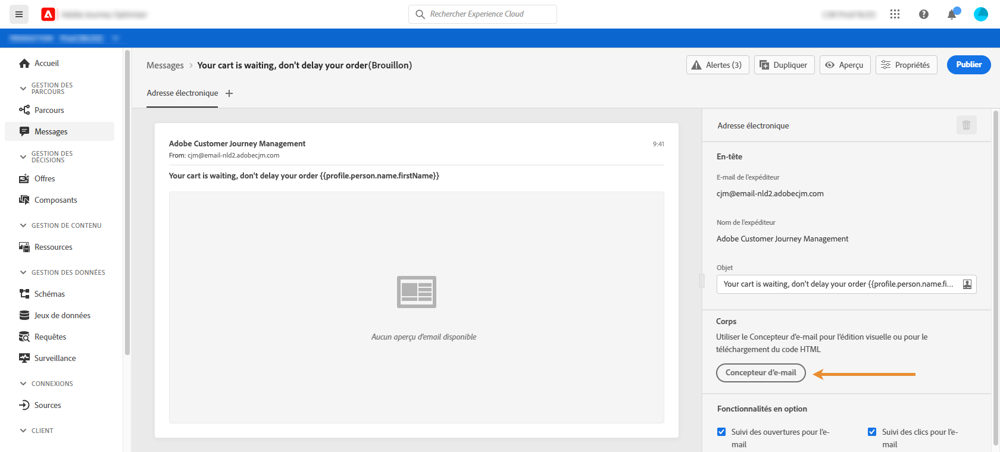

2. Dans la palette gauche de la page d&#39;accueil du Concepteur d&#39;email, placez trois composants de structure sur le corps du message.

3. Faites glisser et déposez un composant de contenu HTML sur chaque nouveau composant de structure.

   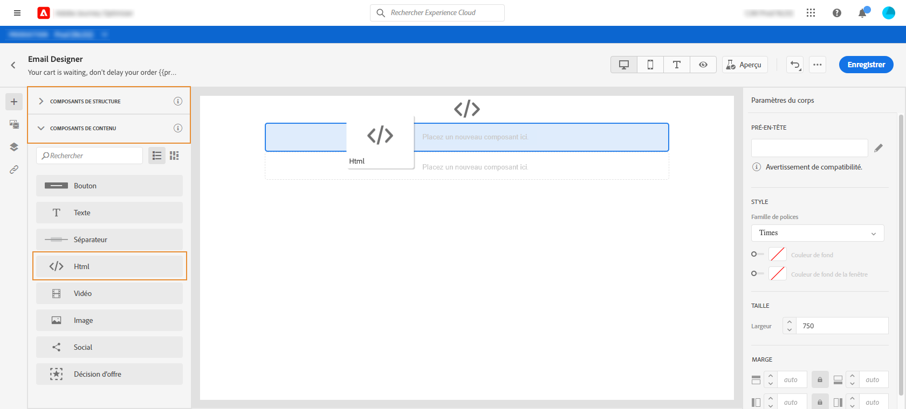

## Étape 2 : Insérez le prénom du client en majuscules {#uppercase-function}

1. Sur la page d’accueil du Concepteur d’email, cliquez sur le composant HTML dans lequel vous souhaitez ajouter le prénom du client.
2. Dans la barre d’outils contextuelle, cliquez sur **[!UICONTROL Afficher le code source]**.

   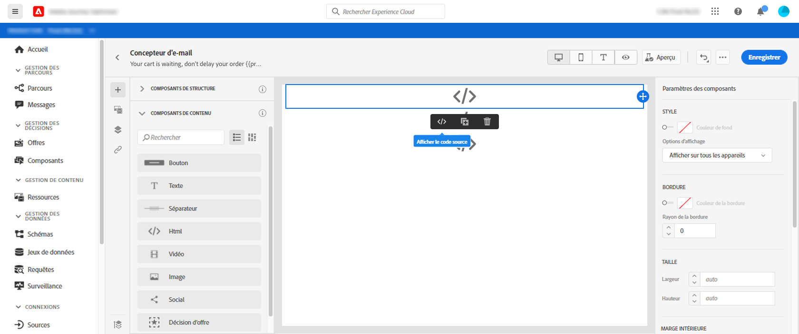

3. Dans la fenêtre **[!UICONTROL Modifier HTML]** , ajoutez la fonction de chaîne `upperCase` :
   1. Dans la liste, sélectionnez **[!UICONTROL Fonctions d’assistance]**.
   2. Utilisez le champ de recherche pour rechercher &quot;majuscules&quot;.
   3. Dans les résultats de la recherche, ajoutez la fonction `upperCase` . Pour ce faire, cliquez sur le signe plus (+) en regard de `: string`.

      L’éditeur d’expression affiche cette expression :

      ```handlebars
      
      ```

      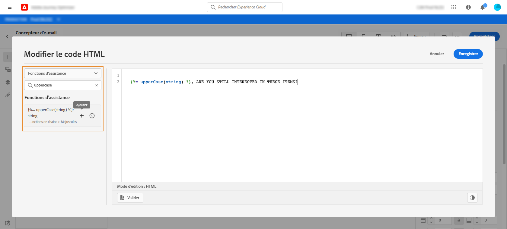

4. Supprimez l’espace réservé &quot;string&quot; de l’expression.
5. Ajoutez le jeton de prénom :
   1. Dans la liste, sélectionnez **[!UICONTROL Profil]**.
   2. Sélectionnez **[!UICONTROL Profil]** > **[!UICONTROL Personne]** > **[!UICONTROL Nom complet]**.
   3. Ajoutez le jeton **[!UICONTROL Prénom]** à l’expression.

      L’éditeur d’expression affiche cette expression :

      ```handlebars
      
      ```

      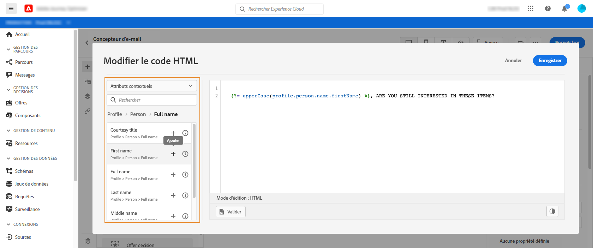

      En savoir plus sur le [type de données du nom de personne](https://experienceleague.adobe.com/docs/experience-platform/xdm/data-types/person-name.html).

6. Cliquez sur **[!UICONTROL Valider]**, puis sur **[!UICONTROL Enregistrer]**.

   
7. Enregistrez le message.

## Étape 3 : Créer l’événement initial et le parcours associé {#create-context}

Le contenu du panier est une information contextuelle issue du parcours. Par conséquent, vous devez ajouter un événement initial et l’email à un parcours avant de pouvoir ajouter des informations spécifiques au panier à l’email.

1. Créez un événement dont le schéma inclut le tableau `productListItems` .
2. Définissez tous les champs de ce tableau comme champs de charge utile pour cet événement.

   En savoir plus sur le [type de données de l’élément de liste de produits](https://experienceleague.adobe.com/docs/experience-platform/xdm/data-types/product-list-item.html).

3. Créez un parcours commençant par cet événement.
4. Ajoutez le message au parcours.
5. Terminez le parcours par une activité de fin.

   Comme vous n’avez pas encore publié le message, vous ne pouvez ni tester ni publier le parcours.

   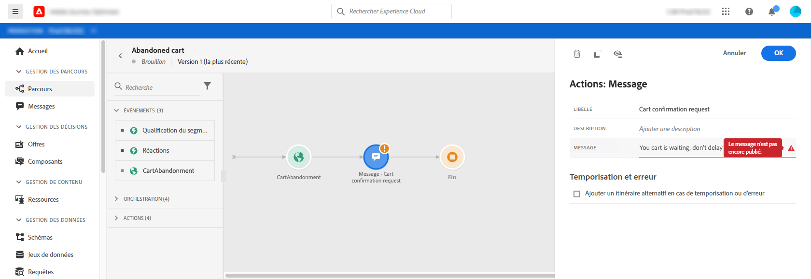

6. Cliquez sur **[!UICONTROL OK]**.

   Un message vous informe que le contexte du parcours a été transmis au message.

   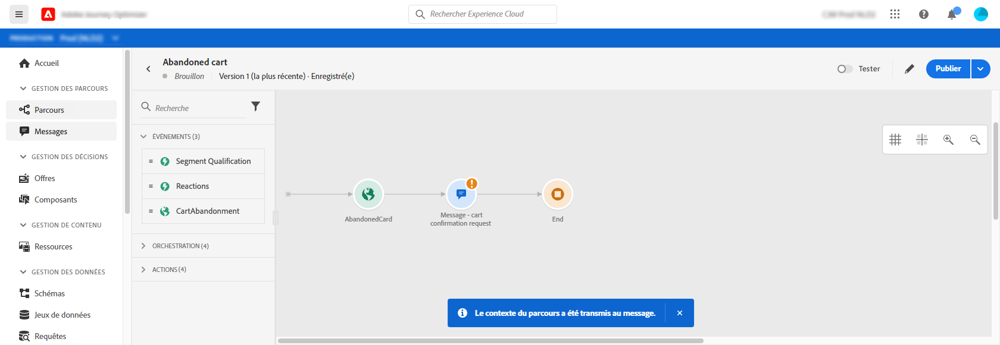

## Étape 4 : Insérer la liste des éléments du panier {#each-helper}

1. rouvrez le message.

   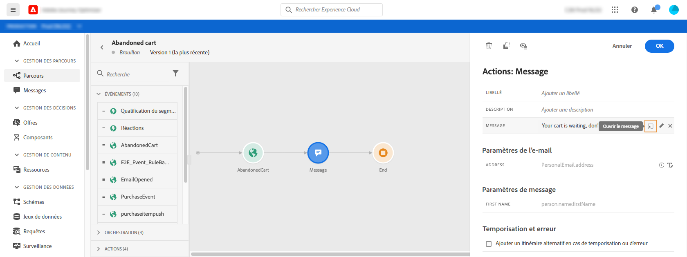

2. Sur la page d&#39;accueil du Concepteur d&#39;email, cliquez sur le composant HTML dans lequel vous souhaitez répertorier le contenu du panier.
3. Dans la barre d’outils contextuelle, cliquez sur **[!UICONTROL Afficher le code source]**.

   

4. Dans la fenêtre **[!UICONTROL Modifier HTML]** , ajoutez l’assistant `each` :
   1. Dans la liste, sélectionnez **[!UICONTROL Fonctions d’assistance]**.
   2. Utilisez le champ de recherche pour rechercher &quot;chacun&quot;.
   3. Dans les résultats de la recherche, ajoutez l’assistant `each` .

      L’éditeur d’expression affiche cette expression :

      ```handlebars
      {{#each someArray as |variable|}} {{/each}}
      ```

      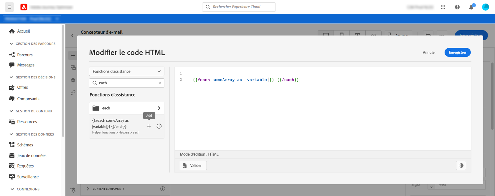

5. Ajoutez le tableau `productListItems` à l’expression :

   1. Supprimez l’espace réservé &quot;someArray&quot; de l’expression.
   2. Dans la liste, sélectionnez **[!UICONTROL Contexte]**.

      L’option **[!UICONTROL Contexte]** n’est disponible qu’une fois le contexte du parcours transmis au message.

   3. Sélectionnez **[!UICONTROL Journey Orchestration]** > **[!UICONTROL Événements]** > ***[!UICONTROL nom_événement]***, puis développez le noeud **[!UICONTROL productListItems]**.

      Dans cet exemple, *event_name* représente le nom de votre événement.

   4. Ajoutez le jeton **[!UICONTROL Product]** à l’expression.

      L’éditeur d’expression affiche cette expression :

      ```handlebars
      {{#each context.journey.events.event_ID.productListItems.product as |variable|}} {{/each}}
      ```
      Dans cet exemple, *event_ID* représente l’identifiant de votre événement.

      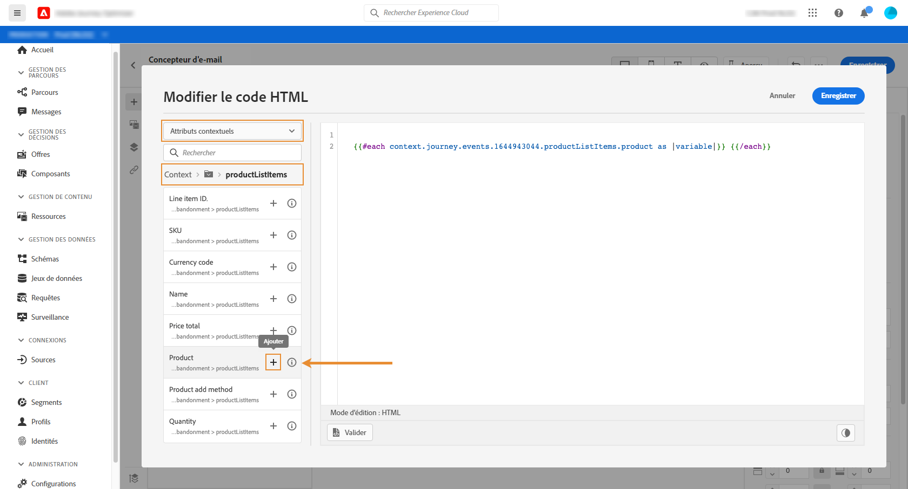

   5. Modifiez l’expression :
      1. Supprimez la chaîne &quot;.product&quot;.
      2. Remplacez l’espace réservé &quot;variable&quot; par &quot;product&quot;.

      Cet exemple illustre l’expression modifiée :

      ```handlebars
      {{#each context.journey.events.event_ID.productListItems as |product|}}
      ```
6. Collez ce code entre la balise `{{#each}}` d’ouverture et la balise `{/each}}` de fermeture :

   ```html
   <table>
      <tbody>
         <tr>
            <td><b>#name</b></td>
            <td><b>#quantity</b></td>
            <td><b>$#priceTotal</b></td>
         </tr>
      </tbody>
   </table>
   ```

7. Ajoutez les jetons de personnalisation pour le nom de l’article, la quantité et le prix :

   1. Supprimez l’espace réservé &quot;#name&quot; du tableau HTML.
   2. Dans les résultats de recherche précédents, ajoutez le jeton **[!UICONTROL Nom]** à l’expression.

   Répétez deux fois ces étapes :
   * Remplacez l’espace réservé &quot;#quantity&quot; par le jeton **[!UICONTROL Quantity]** .
   * Remplacez l’espace réservé &quot;#priceTotal&quot; par le jeton **[!UICONTROL Prix total]** .

   Cet exemple illustre l’expression modifiée :

   ```handlebars
   {{#each context.journey.events.event_ID.productListItems as |product|}}
      <table>
         <tbody>
            <tr>
               <td><b>{{context.journey.events.event_ID.productListItems.name}}</b></td>
               <td><b>{{context.journey.events.event_ID.productListItems.quantity}}</b></td>
               <td><b>${{context.journey.events.event_ID.productListItems.priceTotal}}</b></td>
            </tr>
         </tbody>
      </table>
   {{/each}}
   ```
8. Cliquez sur **[!UICONTROL Valider]**, puis sur **[!UICONTROL Enregistrer]**.
   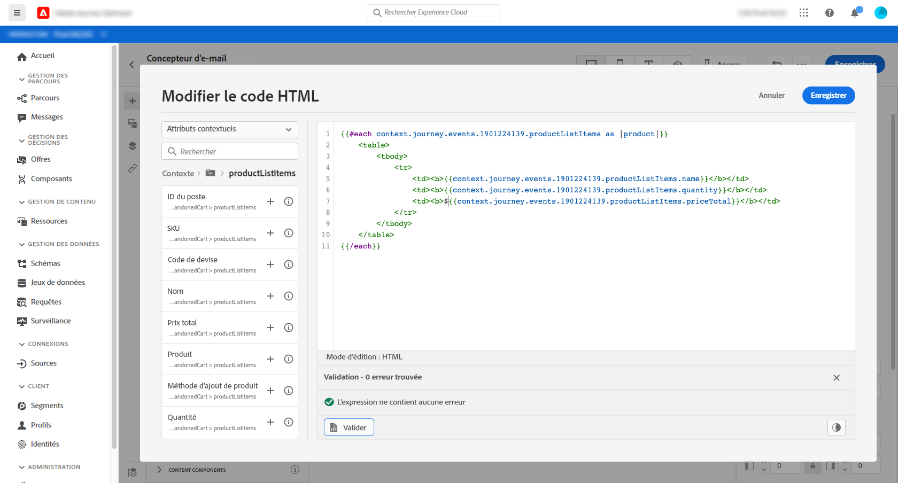

## Étape 5 : Insertion d’une note spécifique au produit {#if-helper}

1. Sur la page d&#39;accueil du Concepteur d&#39;email, cliquez sur le composant HTML dans lequel vous souhaitez insérer la note.
2. Dans la barre d’outils contextuelle, cliquez sur **[!UICONTROL Afficher le code source]**.

   

3. Dans la fenêtre **[!UICONTROL Modifier HTML]** , ajoutez l’assistant `if` :
   1. Dans la liste, sélectionnez **[!UICONTROL Fonctions d’assistance]**.
   2. Utilisez le champ de recherche pour rechercher &quot;if&quot;.
   3. Dans les résultats de la recherche, ajoutez l’assistant `if` .

      L’éditeur d’expression affiche cette expression :

      ```handlebars
       render_1
          render_2
          default_render
      
      ```
      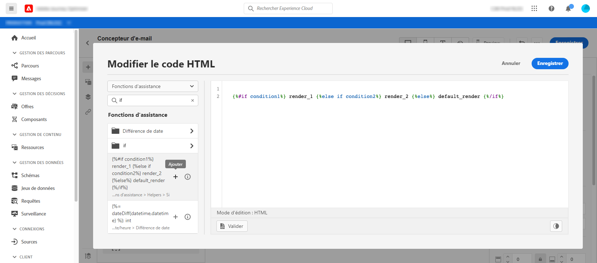

4. Supprimez cette condition de l’expression :

   ```handlebars
    render_2
   ```

   Cet exemple illustre l’expression modifiée :

   ```handlebars
    render_1
       default_render
   
   ```

5. Ajoutez le jeton de nom de produit à la condition :
   1. Supprimez l’espace réservé &quot;condition1&quot; de l’expression.
   2. Dans la liste, sélectionnez **[!UICONTROL Contexte]**.
   3. Sélectionnez **[!UICONTROL Journey Orchestration]** > **[!UICONTROL Événements]** > ***[!UICONTROL nom_événement]***, puis développez le noeud **[!UICONTROL productListItems]**.

      Dans cet exemple, *event_name* représente le nom de votre événement.

   4. Ajoutez le jeton **[!UICONTROL Nom]** à l’expression.

      L’éditeur d’expression affiche cette expression :

      ```handlebars
      
         render_1
          default_render
      
      ```
      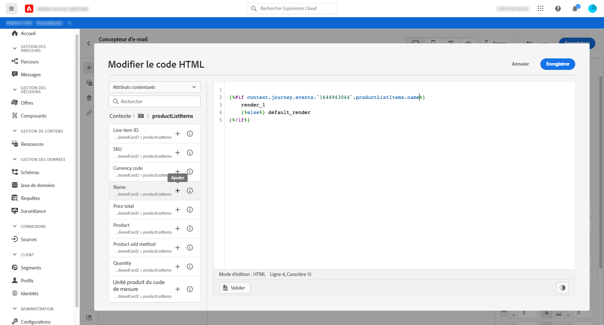

6. Modifiez l’expression :
   1. Dans l&#39;éditeur d&#39;expression, indiquez le nom du produit après le jeton `name`.

      Utilisez cette syntaxe, où *product_name* représente le nom de votre produit :

      ```javascript
      = "product_name"
      ```

      Dans cet exemple, le nom du produit est &quot;Juno Jacket&quot; :

      ```handlebars
      
         render_1
          default_render
      
      ```

   2. Remplacez l’espace réservé &quot;render_1&quot; par le texte de la note.

      Exemple :

      ```handlebars
      
         Due to longer than usual lead times on the Juno Jacket, please expect item to ship two weeks after purchase.
          default_render
      
      ```
   3. Supprimez l’espace réservé &quot;default_render&quot; de l’expression.
7. Cliquez sur **[!UICONTROL Valider]**, puis sur **[!UICONTROL Enregistrer]**.

   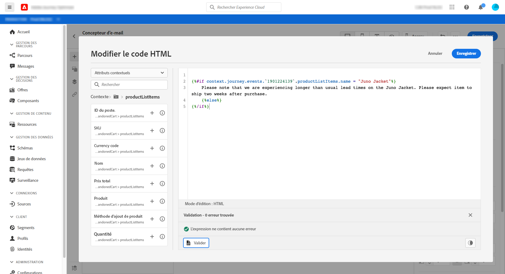

8. Enregistrez et publiez le message.

## Étape 6 : Test et publication du parcours {#test-and-publish}

1. Ouvrez le parcours. Si le parcours est déjà ouvert, actualisez la page.
2. Activez le bouton d’activation/désactivation **[!UICONTROL Test]**, puis cliquez sur **[!UICONTROL Déclencher un événement]**.

   Vous ne pouvez activer le mode test qu’après avoir publié le message.

   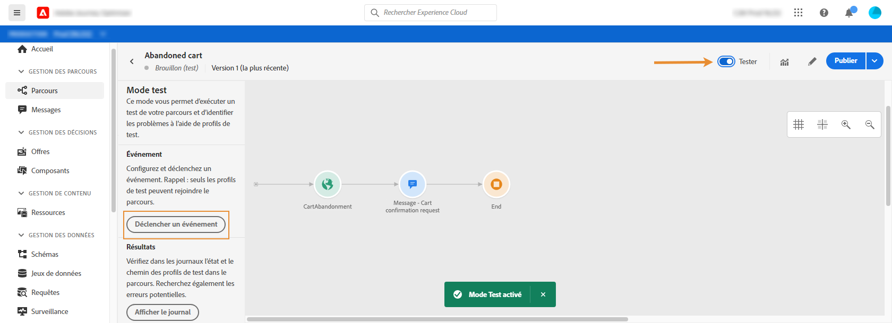

3. Dans la fenêtre **[!UICONTROL Configuration de l&#39;événement]** , saisissez les valeurs d&#39;entrée, puis cliquez sur **[!UICONTROL Envoyer]**.

   Le mode test fonctionne uniquement avec les profils de test.

   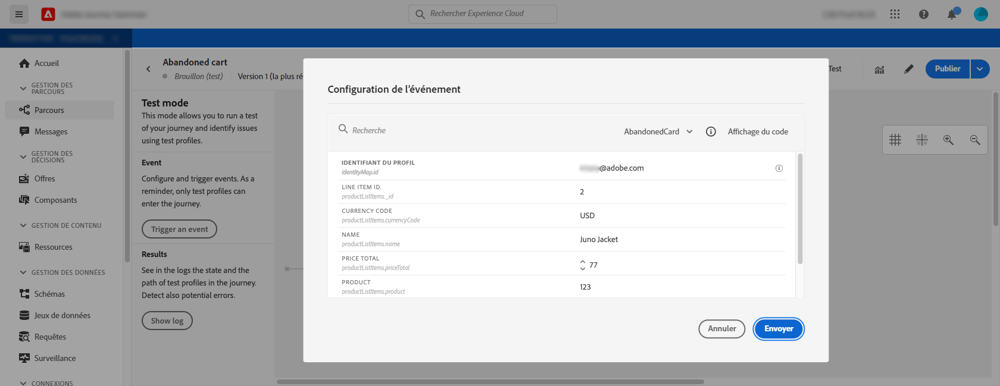

   L’email est envoyé à l’adresse du profil de test.

   Dans cet exemple, l’e-mail contient la note relative à Juno Jacket, car ce produit se trouve dans le panier :

   

4. Vérifiez qu’il n’y a pas d’erreur, puis publiez le parcours.


## Rubriques connexes

### Fonctions Handlebars

[Assistants](functions/helpers.md)

[Fonctions de chaîne](functions/string.md)

### Cas d’utilisation

[Personnalisation avec les informations de profil, le contexte et l’offre](personalization-use-case.md)

[Personnalisation avec offre basée sur la décision](../offers/offers-e2e.md)

## Tutoriel vidéo{#helper-functions-video}

>[!VIDEO](https://video.tv.adobe.com/v/334244?quality=12)