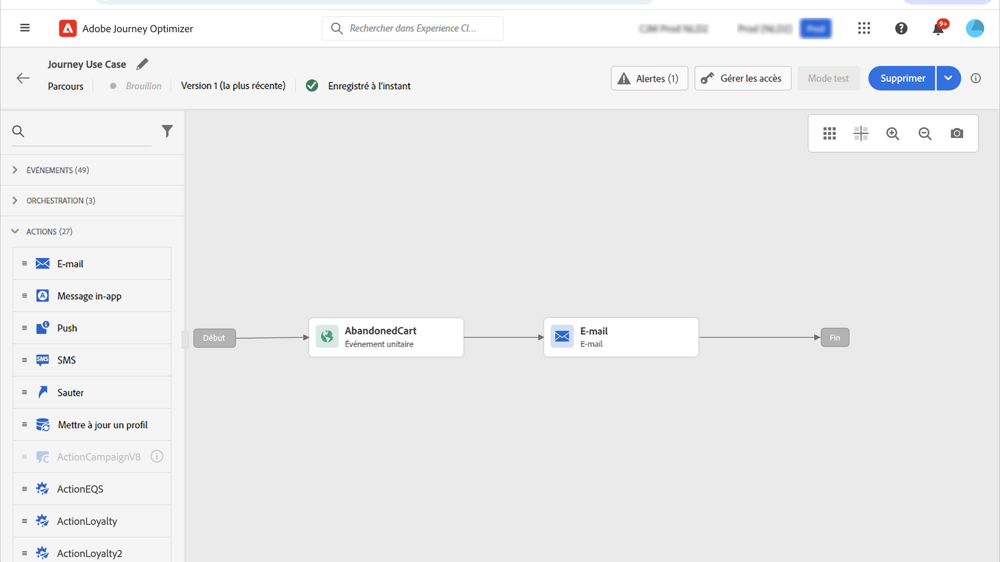
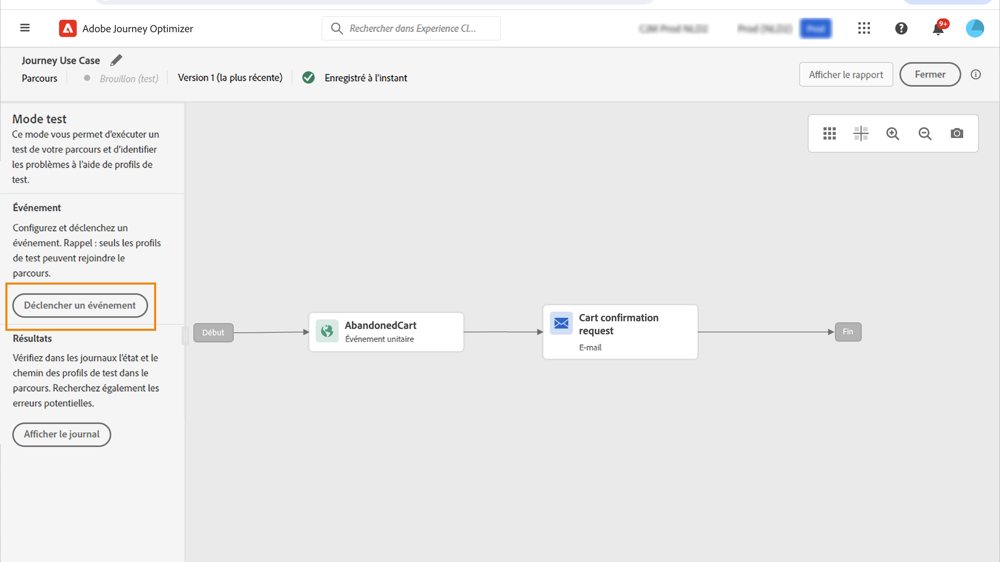

# Cas pratique de personnalisation : email d&#39;abandon de panier {#personalization-use-case-helper-functions}

Dans cet exemple, vous allez personnaliser le corps d&#39;un email. Ce message cible les clients qui ont laissé des articles dans leur panier mais n’ont pas effectué leur achat.

Vous utiliserez ces types de fonctions d’assistance :

* Le `upperCase` fonction de chaîne, pour insérer le prénom du client dans les majuscules. [En savoir plus](functions/string.md#upper).
* Le `each` aide, pour répertorier les éléments qui se trouvent dans le panier. [En savoir plus](functions/helpers.md#each).
* Le `if` aide, pour insérer une note spécifique au produit si le produit associé se trouve dans le panier. [En savoir plus](functions/helpers.md#if-function).

<!-- **Context**: personalization based on contextual data from the journey -->

➡️ [Découvrez comment utiliser les fonctions d’assistance dans cette vidéo](#video)

Avant de commencer, vérifiez que vous savez comment configurer ces éléments :

* Un événement unitaire. [En savoir plus](../event/about-events.md).
* Parcours commençant par un événement. [En savoir plus](../building-journeys/using-the-journey-designer.md).
* Un message électronique dans votre parcours. [En savoir plus](../email/create-email.md)
* Corps d’un email. [En savoir plus](../email/content-from-scratch.md).

Procédez comme suit :

1. [Création de l’événement initial et du parcours](#create-context).
1. [Création d’un message électronique](#configure-email).
1. [Insérez le prénom du client en majuscules](#uppercase-function).
1. [Ajouter le contenu du panier à l&#39;email](#each-helper).
1. [Insertion d’une note spécifique au produit](#if-helper).
1. [Test et publication du parcours](#test-and-publish).

## Étape 1 : Créer l’événement initial et le parcours associé {#create-context}

Le contenu du panier est une information contextuelle issue du parcours. Par conséquent, vous devez ajouter un événement initial et le courrier électronique à un parcours avant de pouvoir ajouter des informations spécifiques au panier à l’email.

1. Créez un événement dont le schéma inclut la variable `productListItems` tableau.
1. Définissez tous les champs de ce tableau comme champs de charge utile pour cet événement.

   En savoir plus sur le type de données d’élément de liste de produits [Documentation d’Adobe Experience Platform](https://experienceleague.adobe.com/docs/experience-platform/xdm/data-types/product-list-item.html){target=&quot;_blank&quot;}.

1. Créez un parcours commençant par cet événement.
1. Ajoutez un **Email** de l’activité au parcours.

   

## Étape 2 : Créer l&#39;email{#configure-email}

1. Dans le **Email** activité, cliquez sur **[!UICONTROL Edit content]**, puis cliquez sur **[!UICONTROL Email Designer]**.

   

1. Dans la palette gauche de la page d&#39;accueil du Concepteur d&#39;email, placez trois composants de structure sur le corps du message.

1. Faites glisser et déposez un composant de contenu HTML sur chaque nouveau composant de structure.

   

## Étape 3 : Insérez le prénom du client en majuscules {#uppercase-function}

1. Sur la page d’accueil du Concepteur d’email, cliquez sur le composant HTML dans lequel vous souhaitez ajouter le prénom du client.
1. Dans la barre d’outils contextuelle, cliquez sur **[!UICONTROL Show the source code]**.

   

1. Dans le **[!UICONTROL Edit HTML]** , ajoutez la fenêtre `upperCase` fonction de chaîne :
   1. Dans le menu de gauche, sélectionnez **[!UICONTROL Helper functions]**.
   1. Utilisez le champ de recherche pour trouver &quot;majuscules&quot;.
   1. Dans les résultats de la recherche, ajoutez le `upperCase` fonction . Pour ce faire, cliquez sur le signe plus (+) en regard de `: string`.

      L’éditeur d’expression affiche cette expression :

      ```handlebars
      
      ```

      

1. Supprimez l’espace réservé &quot;string&quot; de l’expression.
1. Ajoutez le jeton de prénom :
   1. Dans le menu de gauche, sélectionnez **[!UICONTROL Profile attributes]**.
   1. Sélectionner **[!UICONTROL Person]** > **[!UICONTROL Full name]**.
   1. Ajoutez la variable **[!UICONTROL First name]** jeton vers l’expression.

      L’éditeur d’expression affiche cette expression :

      ```handlebars
      
      ```

      

      En savoir plus sur le type de données du nom de la personne dans [Documentation d’Adobe Experience Platform](https://experienceleague.adobe.com/docs/experience-platform/xdm/data-types/person-name.html){target=&quot;_blank&quot;}.

1. Cliquez sur **[!UICONTROL Validate]**, puis cliquez sur **[!UICONTROL Save]**.

   

1. Enregistrez le message.

## Étape 4 : Insérer la liste des éléments du panier {#each-helper}

1. rouvrez le contenu du message.

1. Sur la page d&#39;accueil du Concepteur d&#39;email, cliquez sur le composant HTML dans lequel vous souhaitez répertorier le contenu du panier.
1. Dans la barre d’outils contextuelle, cliquez sur **[!UICONTROL Show the source code]**.

   

1. Dans le **[!UICONTROL Edit HTML]** , ajoutez la fenêtre `each` helper :
   1. Dans le menu de gauche, sélectionnez **[!UICONTROL Helper functions]**.
   1. Utilisez le champ de recherche pour rechercher &quot;chacun&quot;.
   1. Dans les résultats de la recherche, ajoutez le `each` assistance.

      L’éditeur d’expression affiche cette expression :

      ```handlebars
      {{#each someArray as |variable|}} {{/each}}
      ```

      

1. Ajoutez la variable `productListItems` du tableau à l’expression :

   1. Supprimez l’espace réservé &quot;someArray&quot; de l’expression.
   1. Dans le menu de gauche, sélectionnez **[!UICONTROL Contextual attributes]**.

      **[!UICONTROL Contextual attributes]** sont disponibles uniquement une fois que le contexte du parcours a été transmis au message.

   1. Sélectionner **[!UICONTROL Journey Optimizer]** > **[!UICONTROL Events]** > ***[!UICONTROL event_name]***, puis développez la variable **[!UICONTROL productListItems]** noeud .

      Dans cet exemple, *event_name* représente le nom de votre événement.

   1. Ajoutez la variable **[!UICONTROL Product]** jeton vers l’expression.

      L’éditeur d’expression affiche cette expression :

      ```handlebars
      {{#each context.journey.events.event_ID.productListItems.product as |variable|}} {{/each}}
      ```
      Dans cet exemple, *event_ID* représente l’identifiant de votre événement.

      

   1. Modifiez l’expression :
      1. Supprimez la chaîne &quot;.product&quot;.
      1. Remplacez l’espace réservé &quot;variable&quot; par &quot;product&quot;.

      Cet exemple illustre l’expression modifiée :

      ```handlebars
      {{#each context.journey.events.event_ID.productListItems as |product|}}
      ```


1. Collez ce code entre l’ouverture `{{#each}}` et la balise `{/each}}` tag :

   ```html
   <table>
      <tbody>
         <tr>
            <td><b>#name</b></td>
            <td><b>#quantity</b></td>
            <td><b>$#priceTotal</b></td>
         </tr>
      </tbody>
   </table>
   ```

1. Ajoutez les jetons de personnalisation pour le nom de l’article, la quantité et le prix :

   1. Supprimez l’espace réservé &quot;#name&quot; du tableau HTML.
   1. Dans les résultats de recherche précédents, ajoutez le **[!UICONTROL Name]** jeton vers l’expression.

   Répétez deux fois ces étapes :

   * Remplacez l’espace réservé &quot;#quantity&quot; par le **[!UICONTROL Quantity]** jeton.
   * Remplacez l’espace réservé &quot;#priceTotal&quot; par le **[!UICONTROL Total price]** jeton.

   Cet exemple illustre l’expression modifiée :

   ```handlebars
   {{#each context.journey.events.event_ID.productListItems as |product|}}
      <table>
         <tbody>
            <tr>
               <td><b>{{context.journey.events.event_ID.productListItems.name}}</b></td>
               <td><b>{{context.journey.events.event_ID.productListItems.quantity}}</b></td>
               <td><b>${{context.journey.events.event_ID.productListItems.priceTotal}}</b></td>
            </tr>
         </tbody>
      </table>
   {{/each}}
   ```

1. Cliquez sur **[!UICONTROL Validate]**, puis cliquez sur **[!UICONTROL Save]**.

   

## Étape 5 : Insertion d’une note spécifique au produit {#if-helper}

1. Sur la page d&#39;accueil du Concepteur d&#39;email, cliquez sur le composant HTML dans lequel vous souhaitez insérer la note.
1. Dans la barre d’outils contextuelle, cliquez sur **[!UICONTROL Show the source code]**.

   

1. Dans le **[!UICONTROL Edit HTML]** , ajoutez la fenêtre `if` helper :
   1. Dans le menu de gauche, sélectionnez **[!UICONTROL Helper functions]**.
   1. Utilisez le champ de recherche pour rechercher &quot;if&quot;.
   1. Dans les résultats de la recherche, ajoutez le `if` assistance.

      L’éditeur d’expression affiche cette expression :

      ```handlebars
       render_1
          render_2
          default_render
      
      ```

      

1. Supprimez cette condition de l’expression :

   ```handlebars
    render_2
   ```

   Cet exemple illustre l’expression modifiée :

   ```handlebars
    render_1
       default_render
   
   ```

1. Ajoutez le jeton de nom de produit à la condition :
   1. Supprimez l’espace réservé &quot;condition1&quot; de l’expression.
   1. Dans le menu de gauche, sélectionnez **[!UICONTROL Contextual attributes]**.
   1. Sélectionner **[!UICONTROL Journey Orchestration]** > **[!UICONTROL Events]** > ***[!UICONTROL event_name]***, puis développez la variable **[!UICONTROL productListItems]** noeud .

      Dans cet exemple, *event_name* représente le nom de votre événement.

   1. Ajoutez la variable **[!UICONTROL Name]** jeton vers l’expression.

      L’éditeur d’expression affiche cette expression :

      ```handlebars
      
         render_1
          default_render
      
      ```

      

1. Modifiez l’expression :
   1. Dans l’éditeur d’expression, indiquez le nom du produit après le champ `name` jeton.

      Utilisez cette syntaxe, où *product_name* représente le nom de votre produit :

      ```javascript
      = "product_name"
      ```

      Dans cet exemple, le nom du produit est &quot;Juno Jacket&quot; :

      ```handlebars
      
         render_1
          default_render
      
      ```

   1. Remplacez l’espace réservé &quot;render_1&quot; par le texte de la note.

      Exemple :

      ```handlebars
      
         Due to longer than usual lead times on the Juno Jacket, please expect item to ship two weeks after purchase.
          default_render
      
      ```

   1. Supprimez l’espace réservé &quot;default_render&quot; de l’expression.
1. Cliquez sur **[!UICONTROL Validate]**, puis cliquez sur **[!UICONTROL Save]**.

   

1. Enregistrez le message.

## Étape 6 : Test et publication du parcours {#test-and-publish}

1. Activez l’option **[!UICONTROL Test]** bascule, puis cliquez sur **[!UICONTROL Trigger an event]**.

   

1. Dans le **[!UICONTROL Event configuration]** , saisissez les valeurs d’entrée, puis cliquez sur **[!UICONTROL Send]**.

   Le mode test fonctionne uniquement avec les profils de test.

   

   L’email est envoyé à l’adresse du profil de test.

   Dans cet exemple, l’e-mail contient la note relative à Juno Jacket, car ce produit se trouve dans le panier :

   

1. Vérifiez qu’il n’y a aucune erreur, puis publiez le parcours.


## Rubriques connexes {#related-topics}

### Fonctions Handlebars {#handlebars}

* [Helpers](functions/helpers.md)

* [Fonctions de chaîne](functions/string.md)

### Cas d’utilisation {#use-case}

* [Personnalisation avec les informations de profil, le contexte et l’offre](personalization-use-case.md)

* [Personnalisation avec offre basée sur la décision](../offers/offers-e2e.md)

## Vidéo pratique{#video}

Découvrez comment utiliser les fonctions d’assistance.

>[!VIDEO](https://video.tv.adobe.com/v/334244?quality=12)
