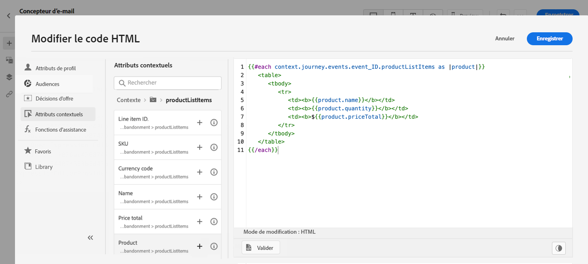

# Cas d’utilisation de la personnalisation : e-mail d’abandon de panier {#personalization-use-case-helper-functions}

Dans cet exemple, vous allez personnaliser le corps d’un e-mail. Ce message cible les clients qui ont laissé des articles dans leur panier mais n’ont pas effectué leur achat.

Vous utiliserez ces types de fonctions helper :

* La fonction de chaîne `upperCase` permettant d&#39;insérer le prénom du client en majuscules. [En savoir plus](functions/string.md#upper).
* La fonction helper `each` permettant de répertorier les articles qui se trouvent dans le panier. [En savoir plus](functions/helpers.md#each).
* La fonction helper `if` permettant d’insérer une note spécifique au produit si le produit associé se trouve dans le panier. [En savoir plus](functions/helpers.md#if-function).
<!-- **Context**: personalization based on contextual data from the journey -->

➡️ [Découvrez comment utiliser les fonctions d’assistance dans cette vidéo](#video).

Avant de commencer, vérifiez que vous savez comment configurer ces éléments :

* Un événement unitaire. [En savoir plus](../event/about-events.md).
* Un parcours commençant par un événement. [En savoir plus](../building-journeys/using-the-journey-designer.md).
* Un e-mail dans votre parcours. [En savoir plus](../email/create-email.md)
* Le corps d’un email. [En savoir plus](../email/content-from-scratch.md).

Procédez comme suit :

1. [Créer l’événement initial et le parcours](#create-context).
1. [Créer un message e-mail](#configure-email).
1. [Insérer le prénom du client en majuscules](#uppercase-function).
1. [Ajouter le contenu du panier à l’e-mail](#each-helper).
1. [Insérer une note spécifique au produit.](#if-helper)
1. [Tester et publier le parcours](#test-and-publish).

## Étape 1 : créer l’événement initial et le parcours associé {#create-context}

Le contenu du panier est une information contextuelle provenant du parcours. Par conséquent, vous devez ajouter un événement initial et l’e-mail à un parcours avant de pouvoir ajouter des informations spécifiques au panier à l’e-mail.

1. Créez un événement dont le schéma inclut le tableau `productListItems`.
1. Définissez tous les champs de ce tableau comme champs de payload pour cet événement.

   En savoir plus sur le type de données d’élément de liste de produit dans la [documentation d’Adobe Experience Platform](https://experienceleague.adobe.com/docs/experience-platform/xdm/data-types/product-list-item.html?lang=fr){target="_blank"}.

1. Créez un parcours commençant par cet événement.
1. Ajoutez une activité **E-mail** au parcours.

   

## Étape 2 : créer l’e-mail{#configure-email}

1. Dans l’activité **E-mail**, cliquez sur **[!UICONTROL Modifier le contenu]**, puis cliquez sur **[!UICONTROL concepteur d’e-mail]**.

   

1. Dans la palette gauche de la page d&#39;accueil du concepteur d’e-mail, effectuez un glisser-déposer de trois composants de structure dans le corps du message.

1. Effectuez un glisser-déposer d’un composant de contenu HTML dans chaque nouveau composant de structure.

   

## Étape 3 : insérer le prénom du client en majuscules {#uppercase-function}

1. Sur la page d’accueil du concepteur d’e-mail, cliquez sur le composant HTML dans lequel vous souhaitez ajouter le prénom du client.
1. Dans la barre d’outils contextuelle, cliquez sur **[!UICONTROL Afficher le code source]**.

   

1. Dans la fenêtre **[!UICONTROL Modifier le code HTML]**, ajoutez la fonction de chaîne `upperCase` :
   1. Dans le menu de gauche, sélectionnez **[!UICONTROL Fonctions d’assistance]**.
   1. Utilisez le champ de recherche pour trouver « upper case ».
   1. À partir des résultats de la recherche, ajoutez la fonction `upperCase`. Pour ce faire, cliquez sur le signe plus (+) en regard de `: string`.

      L’éditeur d’expression affiche cette expression :

      ```handlebars
      
      ```

      

1. Supprimez l’espace réservé « string » de l’expression.
1. Ajoutez le jeton de prénom :
   1. Dans le menu de gauche, sélectionnez **[!UICONTROL Attributs de profil]**.
   1. Sélectionnez **[!UICONTROL Personne]** > **[!UICONTROL Nom complet]**.
   1. Ajoutez le jeton **[!UICONTROL Prénom]** à l’expression.

      L’éditeur d’expression affiche cette expression :

      ```handlebars
      
      ```

      

      En savoir plus sur le type de données de nom de personne dans la [documentation d’Adobe Experience Platform](https://experienceleague.adobe.com/docs/experience-platform/xdm/data-types/person-name.html?lang=fr){target="_blank"}.

1. Cliquez sur **[!UICONTROL Valider]**, puis sur **[!UICONTROL Enregistrer]**.

   

1. Enregistrez le message.

## Étape 4 : insérer la liste des articles du panier {#each-helper}

1. Rouvrez le contenu du message.

1. Sur la page d&#39;accueil du concepteur d’e-mail, cliquez sur le composant HTML dans lequel vous souhaitez répertorier le contenu du panier.
1. Dans la barre d’outils contextuelle, cliquez sur **[!UICONTROL Afficher le code source]**.

   

1. Dans la fenêtre **[!UICONTROL Modifier le code HTML]**, ajoutez la fonction helper `each` :
   1. Dans le menu de gauche, sélectionnez **[!UICONTROL Fonctions d’assistance]**.
   1. Utilisez le champ de recherche pour trouver « each ».
   1. À partir des résultats de la recherche, ajoutez la fonction helper `each`.

      L’éditeur d’expression affiche cette expression :

      ```handlebars
      {{#each someArray as |variable|}} {{/each}}
      ```

      

1. Ajoutez le tableau `productListItems` à l’expression :

   1. Supprimez l’espace réservé « someArray » de l’expression.
   1. Dans le menu de gauche, sélectionnez **[!UICONTROL Attributs contextuels]**.

      Les **[!UICONTROL attributs contextuels]** ne sont disponibles qu’une fois que le contexte du parcours a été transmis au message.

   1. Sélectionnez **[!UICONTROL Journey Optimizer]** > **[!UICONTROL Événements]** > ***[!UICONTROL event_name]***, puis développez le nœud **[!UICONTROL productListItems]**.

      Dans cet exemple, *event_name* représente le nom de votre événement.

   1. Ajoutez le jeton **[!UICONTROL Produit]** à l’expression.

      L’éditeur d’expression affiche cette expression :

      ```handlebars
      {{#each context.journey.events.event_ID.productListItems.product as |variable|}} {{/each}}
      ```

      Dans cet exemple, *event_ID* représente l’identifiant de votre événement.

      

   1. Modifiez l’expression :
      1. Supprimez la chaîne « .product ».
      1. Remplacez l’espace réservé « variable » par « product ».

      Cet exemple illustre l’expression modifiée :

      ```handlebars
      {{#each context.journey.events.event_ID.productListItems as |product|}}
      ```

1. Collez ce code entre la balise `{{#each}}` d’ouverture et la balise `{/each}}` de fermeture :

   ```html
   <table>
      <tbody>
         <tr>
            <td><b>#name</b></td>
            <td><b>#quantity</b></td>
            <td><b>$#priceTotal</b></td>
         </tr>
      </tbody>
   </table>
   ```

1. Ajoutez les jetons de personnalisation pour le nom de l’article, la quantité et le prix :

   1. Supprimez l’espace réservé « #name » du tableau HTML.
   1. À partir des résultats de recherche précédents, ajoutez le jeton **[!UICONTROL Nom]** à l’expression.

   Répétez deux fois ces étapes :

   * Remplacez l’espace réservé « #quantity » par le jeton **[!UICONTROL Quantité]**.
   * Remplacez l’espace réservé « #priceTotal » par le jeton **[!UICONTROL Prix total]**.

   Cet exemple illustre l’expression modifiée :

   ```handlebars
   {{#each context.journey.events.event_ID.productListItems as |product|}}
      <table>
         <tbody>
            <tr>
            <td><b>{{product.name}}</b></td>
            <td><b>{{product.quantity}}</b></td>
            <td><b>${{product.priceTotal}}</b></td>
            </tr>
         </tbody>
      </table>
   {{/each}}
   ```

1. Cliquez sur **[!UICONTROL Valider]**, puis sur **[!UICONTROL Enregistrer]**.

   

## Étape 5 : insérer une note spécifique au produit {#if-helper}

1. Sur la page d&#39;accueil du concepteur d’e-mail, cliquez sur le composant HTML dans lequel vous souhaitez insérer la note.
1. Dans la barre d’outils contextuelle, cliquez sur **[!UICONTROL Afficher le code source]**.

   

1. Dans la fenêtre **[!UICONTROL Modifier le code HTML]**, ajoutez la fonction helper `if` :
   1. Dans le menu de gauche, sélectionnez **[!UICONTROL Fonctions d’assistance]**.
   1. Utilisez le champ de recherche pour trouver « if ».
   1. À partir des résultats de la recherche, ajoutez la fonction helper `if`.

      L’éditeur d’expression affiche cette expression :

      ```handlebars
       render_1
          render_2
          default_render
      
      ```

      

1. Supprimez cette condition de l’expression :

   ```handlebars
    render_2
   ```

   Cet exemple illustre l’expression modifiée :

   ```handlebars
    render_1
       default_render
   
   ```

1. Ajoutez le jeton de nom de produit à la condition :
   1. Supprimez l’espace réservé « condition1 » de l’expression.
   1. Dans le menu de gauche, sélectionnez **[!UICONTROL Attributs contextuels]**.
   1. Sélectionnez **[!UICONTROL Journey Orchestration]** > **[!UICONTROL Événements]** > ***[!UICONTROL event_name]***, puis développez le nœud **[!UICONTROL productListItems]**.

      Dans cet exemple, *event_name* représente le nom de votre événement.

   1. Ajoutez le jeton **[!UICONTROL Nom]** à l’expression.

      L’éditeur d’expression affiche cette expression :

      ```handlebars
      
         render_1
          default_render
      
      ```

      

1. Modifiez l’expression :
   1. Dans l&#39;éditeur d&#39;expression, indiquez le nom du produit après le jeton `name`.

      Utilisez cette syntaxe, où *product_name* représente le nom de votre produit :

      ```javascript
      = "product_name"
      ```

      Dans cet exemple, le nom du produit est « Juno Jacket » :

      ```handlebars
      
         render_1
          default_render
      
      ```

   1. Remplacez l’espace réservé « render_1 » par le texte de la note.

      Exemple :

      ```handlebars
      
         Due to longer than usual lead times on the Juno Jacket, please expect item to ship two weeks after purchase.
          default_render
      
      ```

   1. Supprimez l’espace réservé « default_render » de l’expression.
1. Cliquez sur **[!UICONTROL Valider]**, puis sur **[!UICONTROL Enregistrer]**.

   

1. Enregistrez le message.

## Étape 6 : tester et publier le parcours {#test-and-publish}

1. Activez le bouton d’activation/désactivation **[!UICONTROL Test]**, puis cliquez sur **[!UICONTROL Déclencher un événement]**.

   

1. Dans la fenêtre **[!UICONTROL Configuration de l&#39;événement]**, saisissez les valeurs d&#39;entrée, puis cliquez sur **[!UICONTROL Envoyer]**.

   Le mode test fonctionne uniquement avec les profils de test.

   

   L’e-mail est envoyé à l’adresse du profil de test.

   Dans cet exemple, l’e-mail contient la note relative à Juno Jacket, car ce produit se trouve dans le panier :

   

1. Vérifiez qu&#39;il n&#39;y a pas d&#39;erreur et publiez le parcours.


## Rubriques connexes {#related-topics}

### Fonctions Handlebars {#handlebars}

* [Assistants](functions/helpers.md)

* [Fonctions de chaîne](functions/string.md)

### Cas d&#39;utilisation {#use-case}

* [Personnalisation avec les informations de profil, le contexte et l’offre](personalization-use-case.md)

* [Personnalisation avec offre basée sur la décision](../offers/offers-e2e.md)

## Vidéo pratique{#video}

Découvrez comment utiliser les fonctions d’assistance.

>[!VIDEO](https://video.tv.adobe.com/v/3416644?captions=fre_fr&quality=12)
