# Cas d’utilisation de la personnalisation : notification du statut de la commande {#personalization-use-case}

>[!BEGINSHADEBOX]

**Sur cette page :** suivez un cas d’utilisation de statut de commande qui combine des données de profil, de décision d’offre et de parcours contextuel pour personnaliser une notification push dans Adobe Journey Optimizer.

>[!ENDSHADEBOX]

Dans ce cas d&#39;utilisation, vous verrez comment utiliser plusieurs types de personnalisations dans un seul message de notification push. Trois types de personnalisations seront utilisés :

* **Profil** : personnalisation des messages en fonction d&#39;un champ de profil
* **Décision d’offre** : personnalisation basée sur des variables de gestion des décisions
* **Contexte** : personnalisation basée sur les données contextuelles du parcours

L&#39;objectif de cet exemple est de pousser (push) un événement vers [!DNL Journey Optimizer] chaque fois qu&#39;une commande client est mise à jour. Une notification push est ensuite envoyée au client avec des informations sur la commande et une offre personnalisée.

Pour ce cas d&#39;utilisation, les conditions préalables suivantes doivent être remplies

* Configurer un événement de commande incluant le numéro de commande, le statut et le nom de l&#39;article. Reportez-vous à cette [section](../event/about-events.md).
* Créer une décision, voir à ce sujet cette [section](../offers/offer-activities/create-offer-activities.md).

➡️ [Découvrir un cas d’utilisation similaire en vidéo](#video)

## Étape 1 - Créer le parcours {#create-journey}

1. Cliquez sur le menu **[!UICONTROL Parcours]** et créez un parcours.

   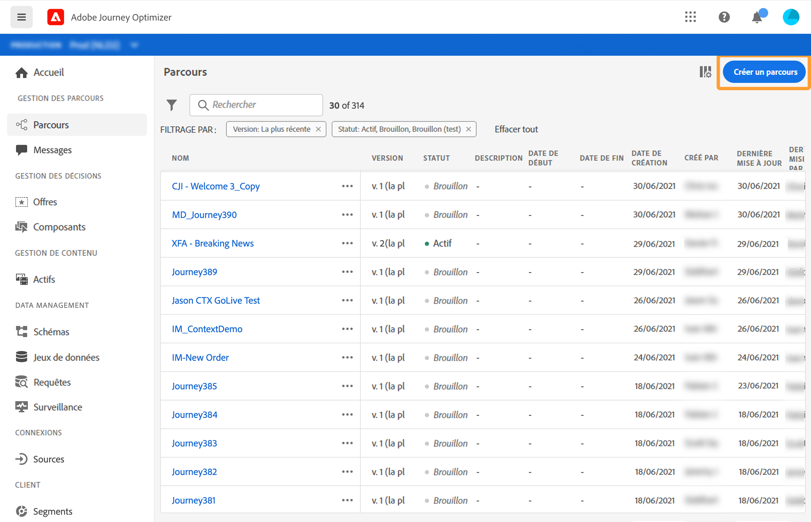

1. Ajoutez votre événement d’entrée et une activité d’action **Push**.

   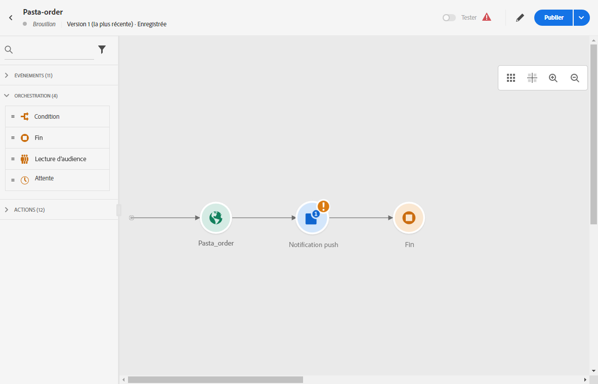

1. Configurez et concevez votre message de notification push. Reportez-vous à cette [section](../push/create-push.md).

## Étape 2 - Ajouter une personnalisation au profil {#add-perso}

1. Dans l’activité **Push**, cliquez sur **Modifier le contenu**.

1. Cliquez sur le champ **Titre**.

   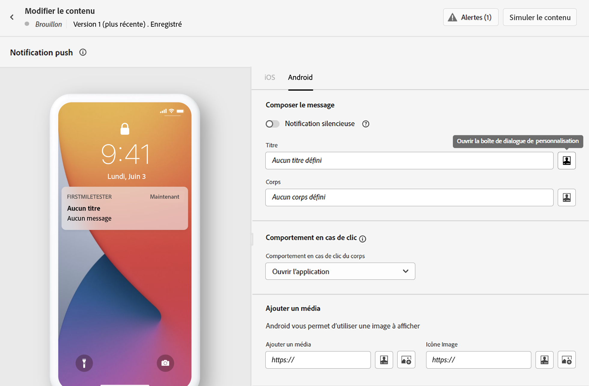

1. Saisissez l’objet et ajoutez la personnalisation de profil. Utilisez la barre de recherche pour rechercher le champ de prénom du profil. Dans le texte de l&#39;objet, placez le curseur à l&#39;endroit où vous souhaitez insérer le champ de personnalisation, puis cliquez sur l&#39;icône **+**. Cliquez sur **Enregistrer**.

   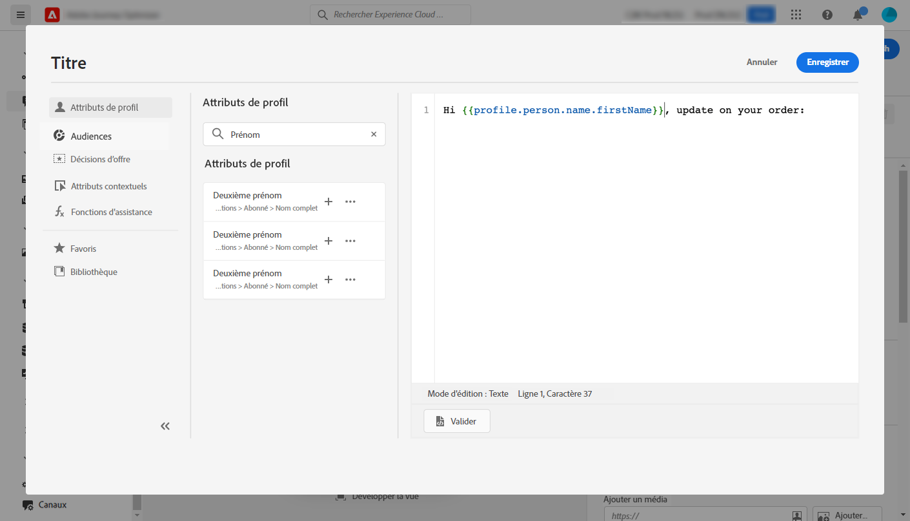

## Étape 3 - Ajouter une personnalisation aux données contextuelles {#add-perso-contextual-data}

1. Dans l’activité **Push**, cliquez sur **Modifier le contenu** et cliquez sur le champ **Titre**.

   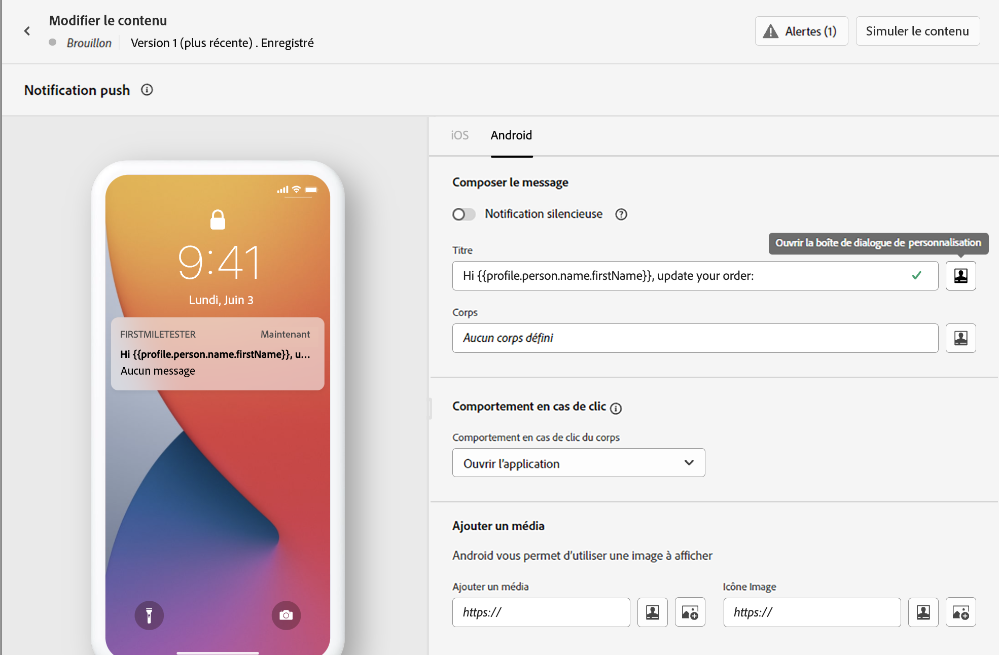

1. Sélectionnez le menu **Attributs contextuels**. Les attributs contextuels ne sont disponibles que si un parcours a transmis des données contextuelles au message. Cliquez sur **Journey Orchestration**. Les informations contextuelles suivantes s&#39;affichent :

   * **Événements** : cette catégorie regroupe tous les champs du ou des événements placés avant l&#39;activité d’action de canal dans le parcours.
   * **Propriétés du parcours** : champs techniques liés au parcours pour un profil donné ; par exemple, identifiant du parcours ou erreurs spécifiques rencontrées. Pour en savoir plus, consultez la [documentation de Journey Orchestration](../building-journeys/expression/journey-properties.md).

   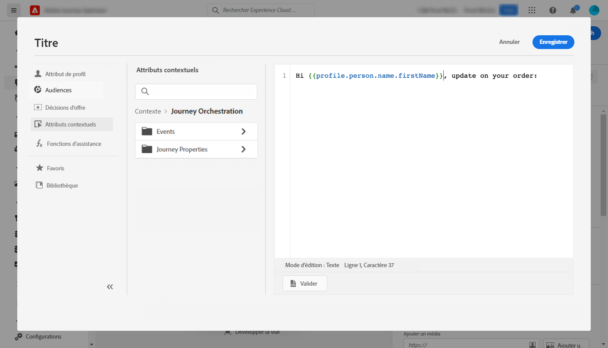

1. Développez l&#39;élément **Événements** et recherchez le champ du numéro de commande associé à votre événement. Vous pouvez également utiliser la zone de recherche. Cliquez sur l&#39;icône **+** pour insérer le champ de personnalisation dans le texte de l&#39;objet. Cliquez sur **Enregistrer**.

   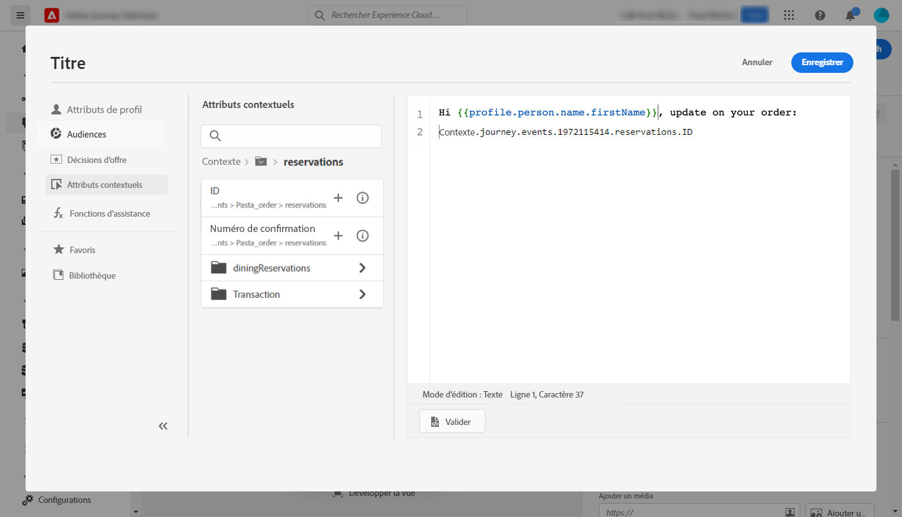

1. Cliquez maintenant sur le champ **Corps**.

   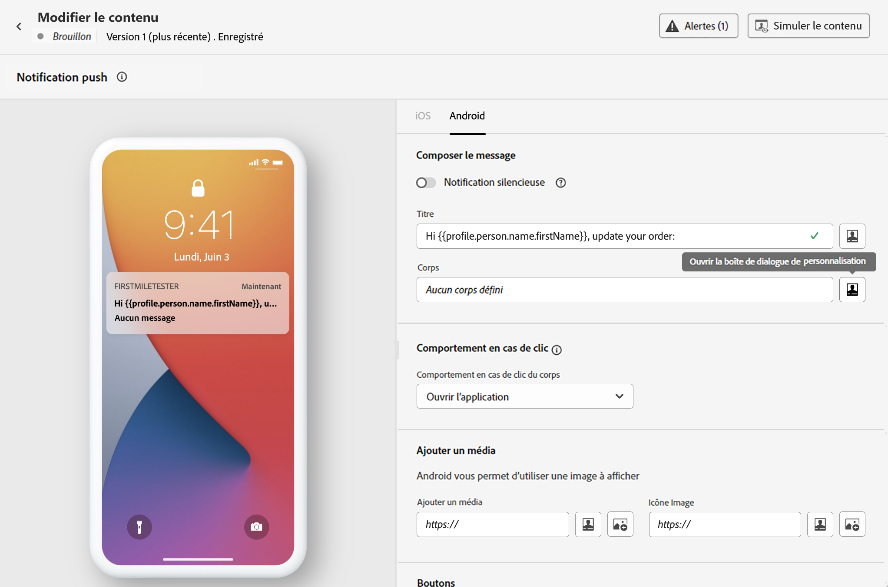

1. Tapez le message et, à partir du menu **[!UICONTROL Attributs contextuels]**, insérez le nom de l’élément de commande et la progression de la commande.

   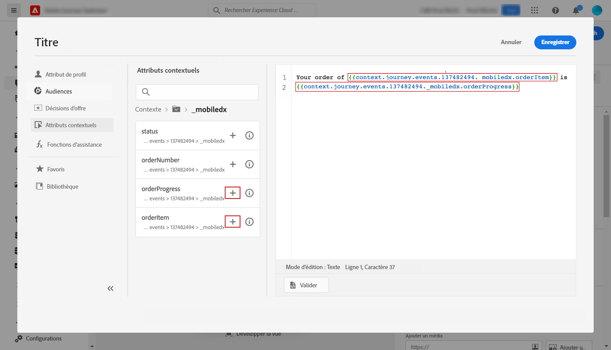

1. Dans le menu de gauche, sélectionnez **Décisions d’offre** pour insérer une variable de prise de décision. Sélectionnez l&#39;emplacement et cliquez sur l&#39;icône **+** en regard de la décision pour l’ajouter au corps.

   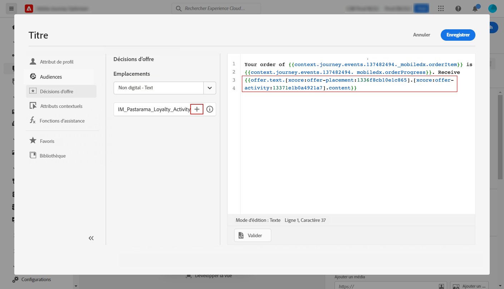

1. Cliquez sur Valider pour vous assurer qu’il n&#39;y a aucune erreur, puis sur **Enregistrer**.

   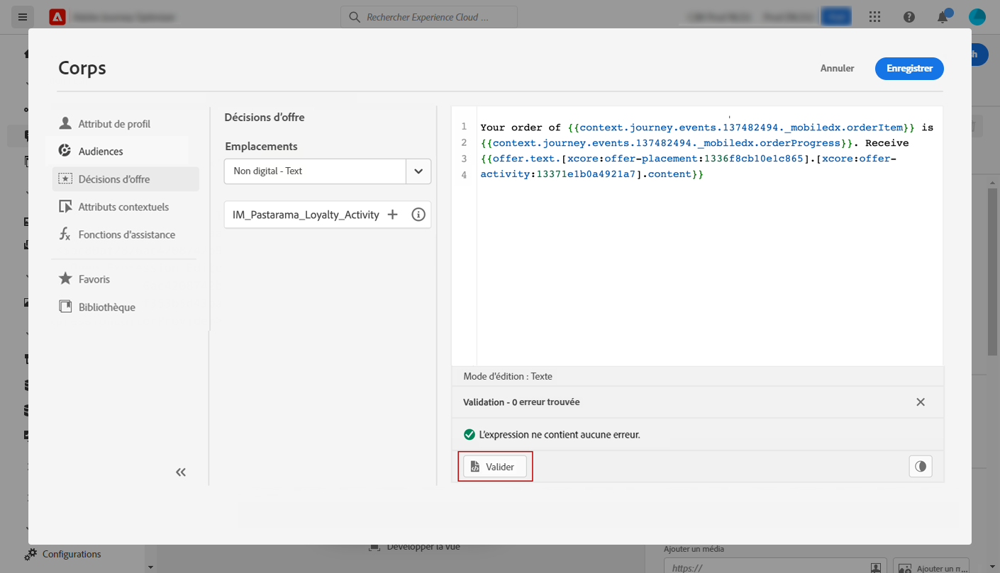

## Étape 4 - Tester et publier le parcours {#test-publish}

1. Cliquez sur le bouton **Test**, puis sur **Déclencher un événement**.

   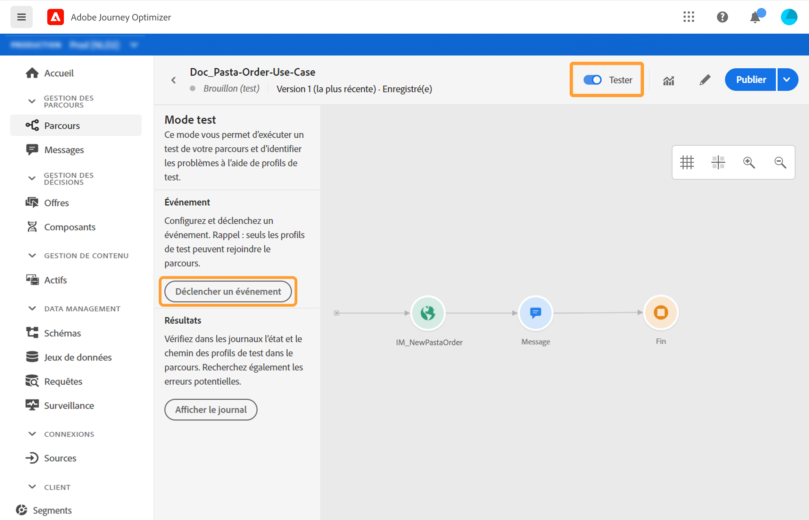

1. Entrez les différentes valeurs à transmettre dans le test. Le mode test ne fonctionne qu&#39;avec les profils de test. L&#39;identifiant du profil doit correspondre à un profil de test. Cliquez sur **Envoyer**.

   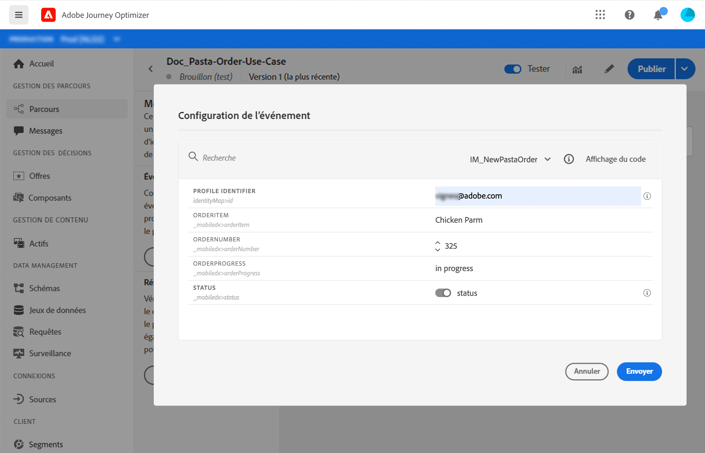

   La notification push est envoyée et affichée sur le téléphone portable du profil de test.

   

1. Vérifiez qu&#39;il n&#39;y a pas d&#39;erreur et publiez le parcours.

## Vidéo pratique {#video}

La vidéo ci-dessous présente un cas d’utilisation similaire en exploitant les données contextuelles d’un parcours pour personnaliser un e-mail.

>[!VIDEO](https://video.tv.adobe.com/v/3428528?captions=fre_fr&quality=12)

## Référence rapide {#quick-reference}

Cette section contient des connaissances structurées destinées à soutenir l’interprétation, la récupération et la réponse aux questions liées à ce sujet.

Pour une compréhension totale, ces informations doivent être combinées avec la documentation de cette page. Aucune des sources n’est conçue pour être autonome. La page décrit la fonctionnalité, tandis que cette section fournit un contexte supplémentaire qui permet de clarifier la terminologie, l’intention, l’applicabilité et les contraintes.

>[!BEGINTABS]

>[!TAB Vue d’ensemble]

**TL;DR**

Cette page présente un cas d’utilisation de notification push de statut de commande associant trois types de personnalisations : un champ de profil, une décision d’offre et des données de parcours contextuelles, en un seul message.

**Intentions**

* Création d’un parcours avec un événement de commande et une activité d’action Push
* Ajoutez la personnalisation basée sur les profils (prénom du client) au titre push
* Ajoutez une personnalisation des données contextuelles (numéro de commande, nom de l’élément, progression de la commande) à partir de l’événement de parcours
* Ajouter la personnalisation de la décision d’offre au corps push
* Tester le parcours en mode test et le publier

>[!TAB Glossaire]

* **Personnalisation des profils** : Personalization en fonction d’un champ de profil tel que le prénom, accessible via des attributs de `profile.*`. *(spécifique au produit)*
* **Décision d’offre** : Personalization basé sur des variables de gestion des décisions, insérées à partir du menu Décisions d’offre dans l’éditeur de personnalisation. *(spécifique au produit)*
* **Personnalisation contextuelle** : Personalization basée sur les données du parcours - champs d’événement (par exemple, numéro de commande, nom de l’élément, progression de la commande) et propriétés du parcours (par exemple, identifiant du parcours, erreurs). Disponible uniquement lorsqu’un parcours a transmis des données contextuelles au message. *(spécifique au produit)*
* **Propriétés du Parcours** : champs techniques liés au parcours pour un profil donné, tels que l’ID du parcours ou les erreurs rencontrées, accessibles sous Attributs contextuels > Journey Orchestration. *(spécifique au produit)*

>[!TAB  Terminologie ]

* **Nom canonique :** personnalisation contextuelle — variantes : personnalisation basée sur le contexte, personnalisation contextuelle de parcours
* **Synonymes :** « Journey Orchestration » (libellé de l’interface utilisateur sous le menu Attributs contextuels) = source de données de parcours contextuel
* **Ne pas confondre :** Personnalisation du profil (valeurs de champ de profil statiques, toujours disponibles) ≠ Personnalisation contextuelle (données d&#39;événement et de propriétés de parcours, uniquement disponibles une fois que le contexte de parcours a été transmis au message) ≠ Personnalisation de la décision d&#39;offre (variables de gestion des décisions)

>[!TAB Mécanismes de sécurisation et limitations]

* Les attributs contextuels ne sont disponibles dans l’éditeur de personnalisation que si un parcours a transmis des données contextuelles au message.
* Le mode test ne fonctionne qu’avec les profils de test ; l’identifiant de profil saisi dans la configuration d’événement doit correspondre à un profil de test existant.

>[!TAB FAQ]

**Q : Quels trois types de personnalisation sont combinés dans ce cas d’utilisation ?**

La personnalisation de profil (prénom du client ou de la cliente provenant de l’adresse `profile.*`), la personnalisation des données contextuelles (numéro de commande, nom de l’élément et progression de la commande à partir de l’événement de parcours) et la personnalisation des décisions d’offre (une offre de gestion des décisions insérée dans le corps).

**Q : D’où viennent les attributs contextuels dans l’éditeur de personnalisation ?**

Les attributs contextuels proviennent d’événements placés avant l’activité d’action de canal dans le parcours, ainsi que des propriétés techniques du parcours. Ils apparaissent dans l’éditeur de personnalisation sous Attributs contextuels > Journey Orchestration > Événements (champs d’événement) ou Propriétés du Parcours (métadonnées du parcours).

**Q : Quelles sont les conditions préalables pour ce cas d’utilisation ?**

Un événement de commande doit être configuré avec les champs de numéro de commande, de statut et de nom d&#39;article, et une décision doit exister dans la gestion des décisions.

**Q : Comment tester la notification push dans ce cas d’utilisation ?**

Cliquez sur le bouton Test dans le parcours, puis sur « Déclencher un événement » et saisissez les valeurs d’événement dans la fenêtre Configuration de l’événement . Le mode test ne fonctionne qu’avec les profils de test. L’identifiant du profil doit correspondre à un profil de test existant.

>[!ENDTABS]

<!-- ai-section-version: 1 | source-hash: ae5284c7 -->
