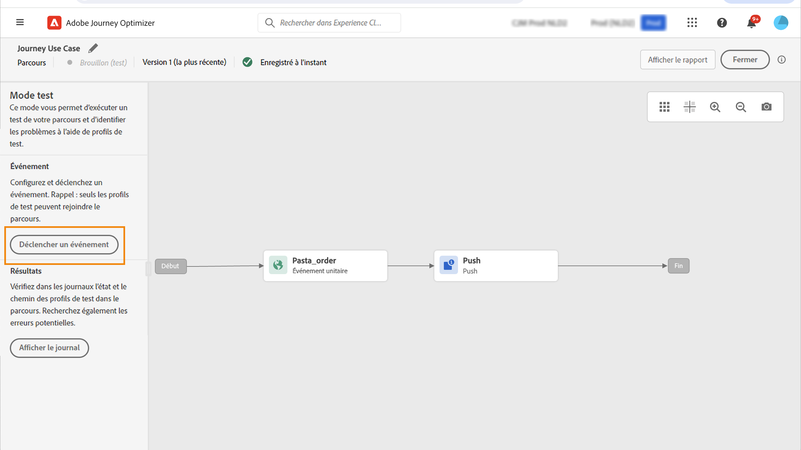
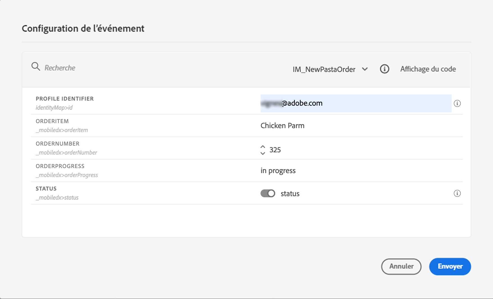

# Cas d’utilisation de la personnalisation : notification du statut de la commande {#personalization-use-case}

Dans ce cas d&#39;utilisation, vous verrez comment utiliser plusieurs types de personnalisations dans un seul message de notification push. Trois types de personnalisations seront utilisés :

* **Profil** : personnalisation des messages en fonction d&#39;un champ de profil
* **Décision d&#39;offre** : personnalisation basée sur des variables de prise de décision d&#39;offre
* **Contexte** : personnalisation basée sur les données contextuelles du parcours

L&#39;objectif de cet exemple est de pousser (push) un événement vers [!DNL Journey Optimizer] chaque fois qu&#39;une commande client est mise à jour. Une notification push est ensuite envoyée au client avec des informations sur la commande et une offre personnalisée.

Pour ce cas d&#39;utilisation, les conditions préalables suivantes doivent être remplies 

* Créer et concevoir un message de notification push sans le publier. Reportez-vous à cette [section](../messages/get-started-content.md).
* Configurer un événement de commande incluant le numéro de commande, le statut et le nom de l&#39;article. Reportez-vous à cette [section](../event/about-events.md).
* Créer une décision (auparavant « activité d&#39;offre ») ; consultez cette [section](../offers/offer-activities/create-offer-activities.md).

## Étape 1 - Ajouter une personnalisation au profil {#add-perso}

1. Cliquez sur le menu **[!UICONTROL Message]**, puis sélectionnez votre message.

   

1. Cliquez sur le champ **Titre**.

   

1. Saisissez l&#39;objet et ajoutez la personnalisation de profil. Utilisez la barre de recherche pour rechercher le champ de prénom du profil. Dans le texte de l&#39;objet, placez le curseur à l&#39;endroit où vous souhaitez insérer le champ de personnalisation, puis cliquez sur l&#39;icône **+**. Cliquez sur **Enregistrer**.

   

   >[!NOTE]
   >
   >Laissez le message à l&#39;état de brouillon. Ne le publiez pas encore.

## Étape 2 - Créer le parcours {#create-journey}

1. Cliquez sur le menu **[!UICONTROL Parcours]** et créez un parcours.

   

1. Ajoutez votre événement d&#39;entrée, un **Message** et une activité **Fin**.

   

1. Dans l&#39;activité **Message**, sélectionnez le message précédemment créé. Cliquez sur **OK**.

   

   Un message s&#39;affiche pour vous informer que les données de l&#39;événement d&#39;entrée et les propriétés du parcours ont été transmises au message.

   

   >[!NOTE]
   >
   >Le message s&#39;affiche avec une icône d&#39;avertissement. En effet, le message n&#39;est pas encore publié.

## Étape 3 - Ajouter une personnalisation aux données contextuelles {#add-perso-contextual-data}

1. Dans l&#39;activité **Message**, cliquez sur l&#39;icône **Ouvrir le message**. Le message s&#39;ouvre dans un nouvel onglet.

   

1. Cliquez sur le champ **Titre**.

   

1. Sélectionnez le menu **Attributs contextuels**. Les attributs contextuels ne sont disponibles que si un parcours a transmis des données contextuelles au message. Cliquez sur **Journey Orchestration**. Les informations contextuelles suivantes s&#39;affichent :

   * **Événements** : cette catégorie regroupe tous les champs du ou des événements placés avant l&#39;activité **Message** dans le parcours.
   * **Propriétés du parcours** : champs techniques liés au parcours pour un profil donné ; par exemple, identifiant du parcours ou erreurs spécifiques rencontrées. Pour en savoir plus, consultez la [documentation de Journey Orchestration](../building-journeys/expression/journey-properties.md). 

   

1. Développez l&#39;élément **Événements** et recherchez le champ du numéro de commande associé à votre événement. Vous pouvez également utiliser la zone de recherche. Cliquez sur l&#39;icône **+** pour insérer le champ de personnalisation dans le texte de l&#39;objet. Cliquez sur **Enregistrer**.

   

1. Cliquez maintenant sur le champ **Corps**.

   

1. Tapez le message et, à partir du menu **[!UICONTROL Attributs contextuels]**, insérez le nom de l’élément de commande et la progression de la commande.

   

1. Dans le menu de gauche, sélectionnez **Décisions d’offre** pour insérer une variable Offer Decisioning. Sélectionnez l&#39;emplacement et cliquez sur l&#39;icône **+** en regard de la décision (auparavant « activité d&#39;offre ») pour l&#39;ajouter au corps.

   

1. Cliquez sur Valider pour vous assurer qu&#39;il n&#39;y a aucune erreur, puis sur **Enregistrer**.

   

1. Publiez à présent le message.

   

## Étape 4 - Tester et publier le parcours {#test-publish}

1. Ouvrez de nouveau le parcours. Si le parcours est déjà ouvert, veillez à actualiser la page. Maintenant que le message est publié, vous pouvez constater qu&#39;il n&#39;y a aucune erreur dans le parcours. Cliquez sur le bouton **Test**, puis sur **Déclencher un événement**.

   

1. Entrez les différentes valeurs à transmettre dans le test. Le mode test ne fonctionne qu&#39;avec les profils de test. L&#39;identifiant du profil doit correspondre à un profil de test. Cliquez sur **Envoyer**.

   

   La notification push est envoyée et affichée sur le téléphone portable du profil de test.

   

1. Vérifiez qu&#39;il n&#39;y a pas d&#39;erreur et publiez le parcours.
