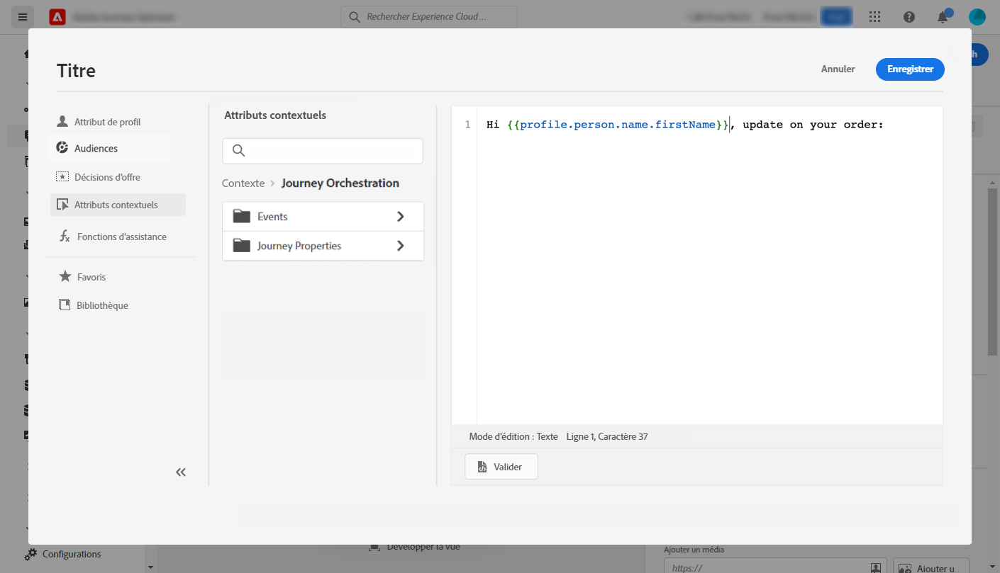

# Cas pratique de personnalisation : notification d&#39;état de commande {#personalization-use-case}

Dans ce cas pratique, vous verrez comment utiliser plusieurs types de personnalisation dans un seul message de notification push. Trois types de personnalisation seront utilisés :

* **Profil**: personnalisation des messages à partir d&#39;un champ de profil
* **Décision sur l’offre**: personnalisation basée sur les variables de gestion de décision
* **Contexte**: personnalisation basée sur les données contextuelles du parcours

L’objectif de cet exemple est de pousser un événement vers [!DNL Journey Optimizer] chaque fois qu’une commande client est mise à jour. Une notification push est alors envoyée au client avec des informations sur la commande et une offre personnalisée.

Pour ce cas pratique, les prérequis suivants sont nécessaires :

* configurez un événement de commande, y compris le numéro de commande, l’état et le nom de l’élément. Consultez cette section [section](../event/about-events.md).
* créer une décision, voir à ce sujet [section](../offers/offer-activities/create-offer-activities.md).

## Étape 1 - Création du parcours {#create-journey}

1. Cliquez sur le bouton **[!UICONTROL Journeys]** et créez un parcours.

   

1. Ajoutez votre événement d’entrée et une **Push** activité d’action.

   

1. Configurez et concevez votre message de notification push. Consultez cette section [section](../push/create-push.md).

## Etape 2 - Ajouter la personnalisation sur le profil {#add-perso}

1. Dans le **Push** activité, cliquez sur **Modifier le contenu**.

1. Cliquez sur le bouton **Titre** champ .

   

1. Saisissez l’objet et ajoutez une personnalisation de profil. Utilisez la barre de recherche pour trouver le champ du prénom du profil. Dans le texte de l’objet, placez le curseur à l’endroit où vous souhaitez insérer le champ de personnalisation, puis cliquez sur le bouton **+** icône . Cliquez sur **Enregistrer**.

   

## Etape 3 - Ajouter une personnalisation sur les données contextuelles {#add-perso-contextual-data}

1. Dans le **Push** activité, cliquez sur **Modifier le contenu** et cliquez sur le bouton **Titre** champ .

   

1. Sélectionnez la **Attributs contextuels** . Les attributs contextuels ne sont disponibles que si un parcours a transmis des données contextuelles au message. Cliquez sur **Journey Orchestration**. Les informations contextuelles suivantes s’affichent :

   * **Événements**: cette catégorie regroupe tous les champs du ou des événements placés avant l’activité d’action de canal dans le parcours.
   * **Propriétés du parcours**: les champs techniques liés au parcours pour un profil donné, par exemple l’identifiant du parcours ou les erreurs spécifiques rencontrées. En savoir plus dans [Documentation de Journey Orchestration](../building-journeys/expression/journey-properties.md).

   

1. Développez l’objet **Événements** et recherchez le champ du numéro de commande associé à votre événement. Vous pouvez également utiliser la zone de recherche. Cliquez sur le bouton **+** pour insérer le champ de personnalisation dans le texte de l’objet. Cliquez sur **Enregistrer**.

   

1. Cliquez maintenant sur le bouton **Corps** champ .

   

1. Saisissez le message et insérez, à partir du **[!UICONTROL Contextual attributes]** , le nom de l’élément de commande et la progression de la commande.

   

1. Dans le menu de gauche, sélectionnez **Offrir des décisions** pour insérer une variable de prise de décision. Sélectionnez l’emplacement et cliquez sur le bouton **+** en regard de la décision de l’ajouter au corps.

   

1. Cliquez sur valider pour vous assurer qu’il n’y a aucune erreur, puis cliquez sur **Enregistrer**.

   

## Étape 4 - Test et publication du parcours {#test-publish}

1. Cliquez sur le bouton **Test** , puis cliquez sur **Déclenchement d’un événement**.

   

1. Saisissez les différentes valeurs à transmettre au test. Le mode test fonctionne uniquement avec les profils de test. L’identifiant de profil doit correspondre à un profil de test. Cliquez sur **Envoyer**.

   

   La notification push est envoyée et affichée sur le téléphone mobile du profil de test.

   

1. Vérifiez qu’il n’y a aucune erreur et publiez le parcours.
