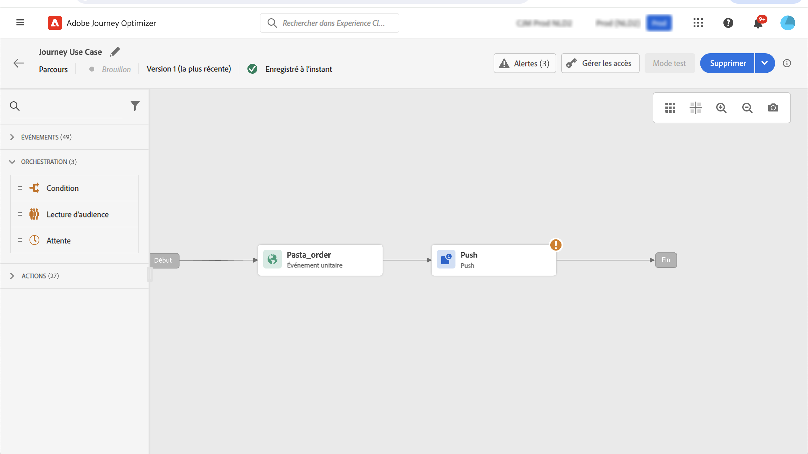

# Cas d’utilisation de la personnalisation {#personalization-use-case}

Dans ce cas d’utilisation, vous verrez comment utiliser plusieurs types de personnalisation dans un seul message de notification Push. Trois types de personnalisation seront utilisés :

* Profil : personnalisation des messages en fonction d’un champ de profil
* Décision d&#39;Offre : personnalisation basée sur les variables de prise de décision des offres
* Contexte : personnalisation basée sur les données contextuelles du parcours

L’objectif de cet exemple est de pousser un événement vers Journey Optimizer chaque fois qu’une commande client est mise à jour. Une notification Push est ensuite envoyée au client avec des informations sur la commande et une offre personnalisée.

Pour ce cas d’utilisation, les conditions préalables suivantes sont nécessaires :

* créez et concevez un message de notification Push sans le publier. Reportez-vous à cette [section](../create-message.md).
* configurez un événement de commande incluant le numéro de commande, l&#39;état et le nom de l&#39;article. Reportez-vous à cette [section](../event/about-events.md).
* créez une décision (précédemment appelée &quot;activité offre&quot;), consultez cette [section](../offers/offer-activities/create-offer-activities.md).

## Étape 1 - Personnalisation des Ajoutes sur le profil

1. Cliquez sur le menu **[!UICONTROL Message]**, puis sélectionnez votre message.

   

1. Cliquez sur le champ **Titre**.

   

1. Saisissez l’objet et ajoutez la personnalisation de profil. Utilisez la barre de recherche pour rechercher le champ de prénom du profil. Dans le texte de l’objet, placez le curseur à l’endroit où vous souhaitez insérer le champ de personnalisation, puis cliquez sur l’icône **+**. Cliquez sur **Enregistrer**.

   

   >[!NOTE]
   >
   >Laissez le message en version préliminaire. Ne le publiez pas encore.

## Étape 2 - Création du parcours

1. Cliquez sur le menu **[!UICONTROL Parcours]** et créez un parcours.

   

1. Ajoutez votre événement d&#39;entrée, un **Message** et une activité **Fin**.

   

1. Dans l&#39;activité **Message**, sélectionnez le message précédemment créé. Cliquez sur **OK**.

   

   Un message s’affiche pour vous informer que les données du événement d’entrée et les propriétés du parcours ont été transmises au message.

   

   >[!NOTE]
   >
   >Le message s’affiche avec une icône d’avertissement. En effet, le message n’est pas encore publié.

## Etape 3 - Ajouter la personnalisation des données contextuelles

1. Dans l&#39;activité **Message**, cliquez sur l&#39;icône **Ouvrir le message**. Le message s’ouvre dans un nouvel onglet.

   

1. Cliquez sur le champ **Titre**.

   

1. Sélectionnez la catégorie **Contexte**. Cet élément n’est disponible que si un parcours a transmis des données contextuelles au message. Cliquez sur **Journey Orchestration**. Les informations contextuelles suivantes s’affichent :

   * **Événements** : cette catégorie regroupe tous les champs du ou des événements placés avant l&#39;activité de  **** messagerie dans le parcours.
   * **Propriétés** du parcours : les champs techniques liés au parcours pour un profil donné, par exemple l&#39;identifiant du parcours ou les erreurs spécifiques rencontrées. Consultez la [documentation du Journey Orchestration](https://experienceleague.adobe.com/docs/journeys/using/building-advanced-conditions-journeys/syntax/journey-properties.html#building-advanced-conditions-journeys).

   

1. Développez l’élément **Événements** et recherchez le champ du numéro de commande associé à votre événement. Vous pouvez également utiliser la zone de recherche. Cliquez sur l’icône **+** pour insérer le champ de personnalisation dans le texte d’objet. Cliquez sur **Enregistrer**.

   

1. Cliquez maintenant sur le champ **Corps**.

   

1. Tapez le message et insérez, à partir de la catégorie **Contexte**, le nom de l&#39;article de commande et la progression de la commande.

   

1. Dans la liste déroulante, sélectionnez **décision d’Offre** pour insérer une variable d’offer decisioning. Sélectionnez l’emplacement et cliquez sur l’icône **+** en regard de la décision (précédemment appelée &quot;activité d’offre&quot;) pour l’ajouter au corps.

   

1. Cliquez sur Valider pour vous assurer qu’il n’y a aucune erreur, puis sur **Enregistrer**.

   

1. Maintenant, publiez le message.

   

## Étape 4 - Test et publication du parcours

1. Ouvrez de nouveau le parcours. Si le parcours est déjà ouvert, veillez à actualiser la page. Maintenant que le message est publié, vous pouvez voir qu&#39;il n&#39;y a aucune erreur dans le parcours. Cliquez sur le bouton **Test**, puis sur **Déclencher un événement**.

   

1. Entrez les différentes valeurs à transmettre dans le test. Le mode test fonctionne uniquement avec les profils de test. L&#39;identifiant de profil doit correspondre à un profil de test. Cliquez sur **Envoyer**.

   

   La notification Push est envoyée et affichée sur le téléphone mobile du profil de test.

   

1. Vérifiez qu’il n’y a pas d’erreur et publiez le parcours.

