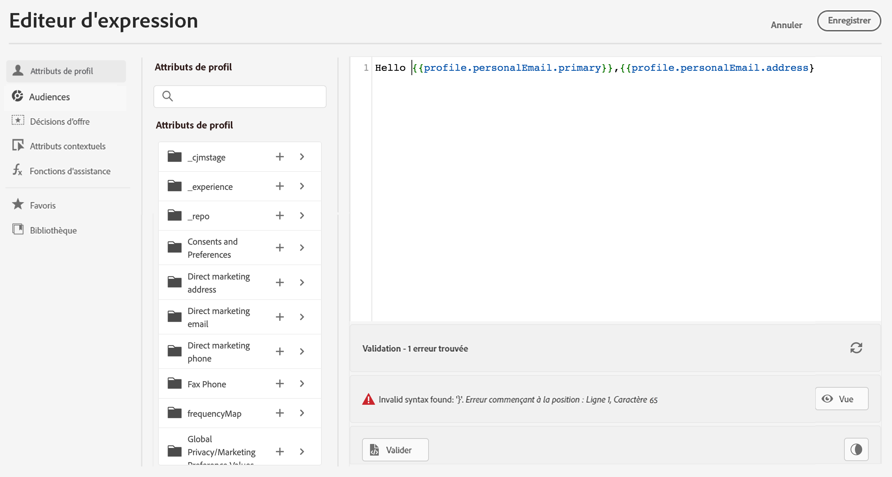

# Validation de la personnalisation {#personalization-validation}

## Mécanismes de validation {#validation-mechanisms}

Sur l’écran de l’**éditeur de personnalisation**, utilisez le bouton **Valider** pour vérifier la syntaxe de votre personnalisation.

>[!NOTE]
> La validation est automatiquement effectuée lorsque vous cliquez sur le bouton **Ajouter** pour fermer la fenêtre de l&#39;éditeur.
>



>[!IMPORTANT]
> Si la syntaxe de personnalisation n’est pas valide, vous ne pouvez pas fermer la fenêtre de l’éditeur de personnalisation.
>

## Erreurs courantes {#common-errors}

* **Chemin « XYZ » introuvable**

En cas de référencement d’un champ qui n’est pas défini dans le schéma.

Dans ce cas, **firstName1** n’est pas défini comme attribut dans le schéma du profil :

```
{{profile.person.name.firstName1}}
```

* **Incompatibilité de type pour la variable « XYZ ».: Tableau attendu. Chaîne trouvée.**

En cas d’itération sur une chaîne plutôt que sur un tableau :

Dans ce cas, **product** n’est pas un tableau :

```
{{each profile.person.name.firstName as |product|}}
 {{product.productName}}
{{/each}}
```

* **Syntaxe des barres de contrôle non valide.`‘[XYZ}}’`** trouvé

En cas d’utilisation d’une syntaxe de barres de contrôle non valide.

Les expressions des barres de contrôle sont entourées de **{{expression}}**

```
   {{[profile.person.name.firstName}}
```

* **Définition de segment non valide**

```
No segment definition found for 988afe9f0-d4ae-42c8-a0be-8d90e66e151
```

## Erreurs spécifiques liées aux offres {#specific-errors}

Les erreurs liées à l’intégration des offres dans un email ou une notification push présentent le modèle suivant :

```
Offer.<offerType>.[PlacementID].[ActivityID].<offer-attribute>
```

La validation est effectuée lors de la validation du contenu de personnalisation dans l’éditeur de personnalisation.

<table> 
 <thead> 
  <tr> 
   <th> Titre de l’erreur<br /> </th> 
   <th> Validation/Résolution <br /> </th> 
  </tr> 
 </thead> 
 <tbody> 
  <tr> 
   <td>Ressource avec ID placementID et type OfferPlacement introuvable <br/>
Ressource avec ID activityID et type OfferActivity introuvable<br/></td> 
   <td>Vérifiez que ActivityID et/ou PlacementID sont disponibles</td> 
  </tr> 
   <tr> 
   <td>Impossible de valider la ressource.</td> 
   <td>Le componentType dans l’emplacement doit correspondre à l’offre offerType.</td> 
  </tr> 
   <tr> 
   <td>L’URL publique n’est pas présente dans l’offre offerId.</td> 
   <td>Les offres d’image (toutes les offres personnalisées et de secours associées à la paire décision-emplacement) doivent avoir une URL publique renseignée (l’URL deliveryURL ne doit pas être vide).</td> 
  </tr> 
  <tr> 
   <td>La décision contient des attributs qui ne sont pas des attributs de profil.</td> 
   <td>L’utilisation du modèle d’offre ne doit contenir que les attributs de profil.</td> 
  </tr> 
  <tr> 
   <td>Une erreur s’est produite lors de la récupération de l’utilisation de la décision.</td> 
   <td>Cette erreur peut se produire lorsque l’API tente de récupérer le modèle d’offre.</td> 
  </tr>
  <tr> 
   <td>L’attribut d’offre offer-attribute n’est pas valide.</td> 
   <td>Vérifiez que l’attribut offer-attribute référencé dans le drp d’offre est valide. Les attributs valides sont les suivants : <br/>
Image : deliveryURL, linkURL<br/>
Texte : content<br/>
HTML : content<br/></td> 
  </tr> 
 </tbody> 
</table>
